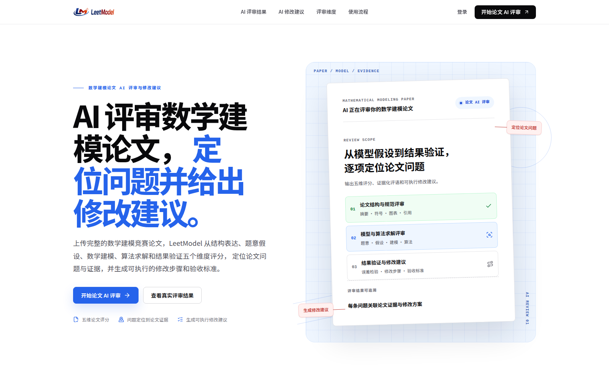
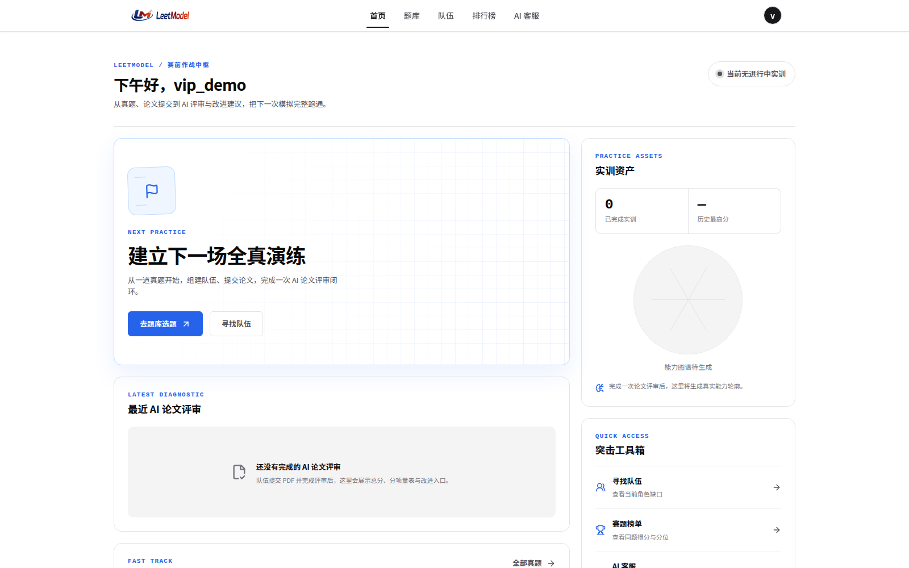
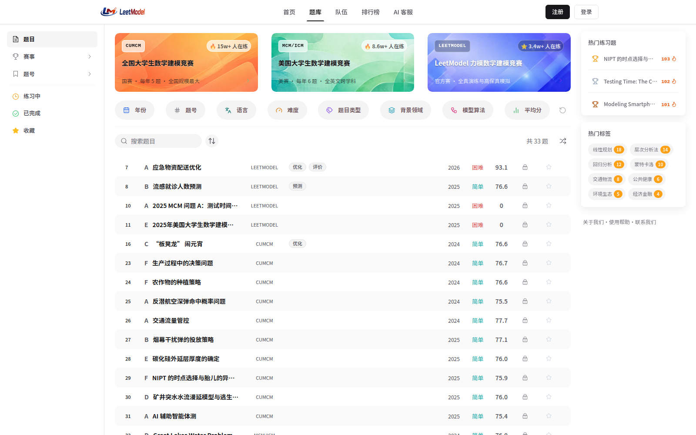
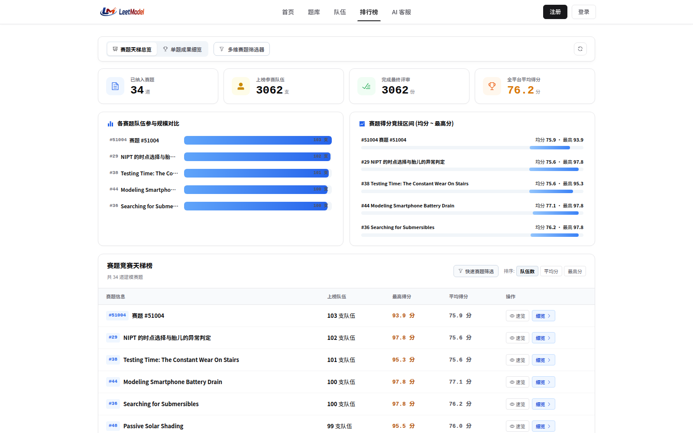
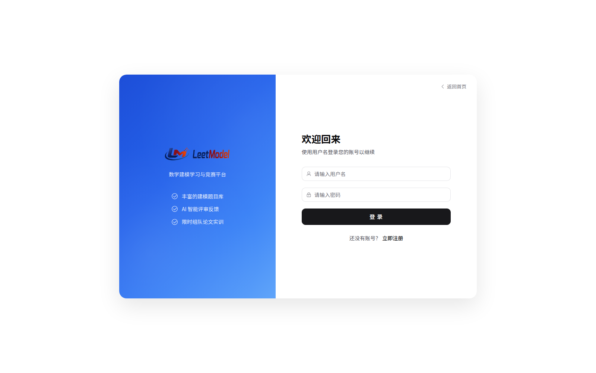
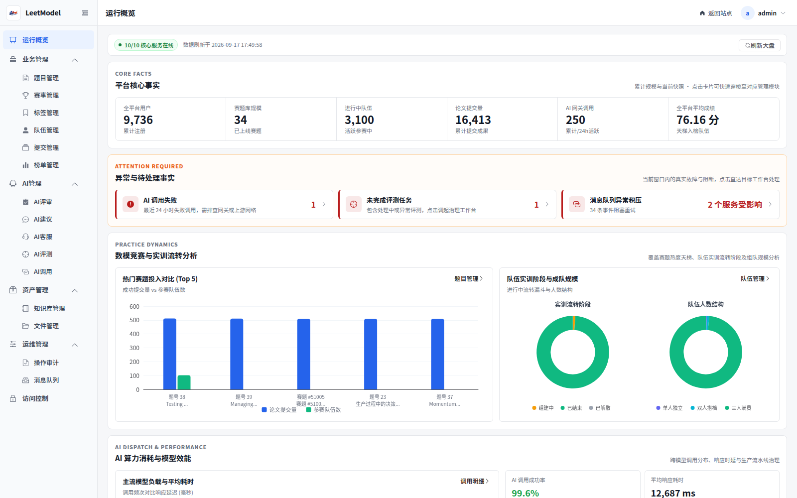

<p align="center">
  
</p>

<h1 align="center">LeetModel</h1>

<p align="center">
  面向数学建模学习者的在线实训与 AI 论文评审平台
</p>

<p align="center">
  
  
  
  
</p>

## 项目简介

LeetModel 中文名为力模，是一个围绕数学建模竞赛实训构建的前后端分离平台。系统覆盖题库浏览、组队与职责分配、论文 PDF 提交、AI 自动评审、问题证据定位、改进建议和最终排行。

项目采用 Spring Cloud 微服务架构，重点实践服务数据所有权、可靠异步消息、三级缓存、AI 调用治理、操作审计和可观测性。当前版本已完成既定功能范围的封版开发，但产品与工程细节仍在持续打磨，适合作为完整业务闭环与工程治理能力的学习和展示项目。

> **重要说明**
>
> 当前项目仍处于持续打磨和作品展示阶段，尚未达到生产上线标准。页面细节、权限边界、并发容量、密钥管理、部署发布、备份恢复、监控告警和合规策略仍需要继续完善，暂不能直接上线或暴露到公网。


## 核心功能

| 模块 | 能力 |
|:---:|:---:|
| 题库 | 赛事、年份、题号、语言、难度、背景领域、题型和模型算法组合筛选 |
| 组队 | 创建队伍、职责覆盖、招募申请、成员审核、开赛、结束练习和解散留存 |
| 论文提交 | PDF 上传、断点续传、草稿版本、最终版锁定和提交记录 |
| AI 评审 | V4 专业证据化评审、五维评分、结构化问题、原文证据和报告展示 |
| AI 建议 | 基于论文与评审事实生成问题覆盖、修改步骤和验收标准 |
| 排行榜 | 赛题天梯、分数分布、最高分与均分、队伍排名和个人定位 |
| AI 客服 | 平台问答、受控题目检索、工具调用、会话历史和生产工作流治理 |
| 管理端 | 用户权限、题库、队伍、提交、评审、建议、排行、文件、知识库、AI、审计和可靠消息运维 |
| 系统治理 | Nacos、Sentinel、RocketMQ、SkyWalking、Prometheus、Grafana 和 Alertmanager |


## 界面预览

以下截图来自本地真实运行的前后端联调环境。

<table>
  <tr>
    <td width="50%" align="center">
      
      <br />
      <strong>官网首页</strong>
    </td>
    <td width="50%" align="center">
      
      <br />
      <strong>赛前作战中枢</strong>
    </td>
  </tr>
  <tr>
    <td width="50%" align="center">
      
      <br />
      <strong>公开题库</strong>
    </td>
    <td width="50%" align="center">
      
      <br />
      <strong>排行榜工作台</strong>
    </td>
  </tr>
  <tr>
    <td width="50%" align="center">
      
      <br />
      <strong>账号登录</strong>
    </td>
    <td width="50%" align="center">
      
      <br />
      <strong>管理端总览</strong>
    </td>
  </tr>
</table>


## 系统架构

<p align="center">
  
</p>

<p align="center"><strong>LeetModel 系统架构全景图</strong></p>

系统采用 API Gateway 统一接入，业务服务按领域数据所有者拆分。AI 调用统一经过 `ai-gateway-service` 和 new-api，跨服务异步事件通过 RocketMQ 可靠传递，审计事件进入独立归档服务。


## AI 网关与模型供应商管理

LeetModel 对模型供应商采用两层网关管理。业务服务只表达 AI 业务语义，不直接连接模型供应商；`ai-gateway-service` 负责 LeetModel 内部的模型执行配置、能力校验、任务调度、调用审计和成本统计；new-api 负责供应商渠道、API Key、模型名映射、渠道权重、健康检查、渠道级重试和额度管理。

固定调用链为：

```text
AI 业务服务 → common-ai → ai-gateway-service → new-api → 模型供应商渠道
```

> **配置责任说明**
>
> 本仓库不提供可直接使用的大模型或 AI 供应商配置。模型供应商账号、接口地址、API Key、模型名映射、渠道配置和 LeetModel 专用 Relay Token 均需要使用者自行申请、配置和维护。仓库不会附带个人供应商账号、密钥、渠道数据或 Token。

因此新增、替换或扩展供应商时，优先在 new-api 中完成统一配置。供应商 API Key 只保存在 new-api，业务服务、`common-ai` 和 `ai-gateway-service` 均不保存供应商密钥，也不通过代码直连供应商。


### 供应商接入步骤

1. 启动 new-api 并完成管理员初始化：

```bash
docker compose -f compose.yaml up -d --wait new-api
curl --fail http://localhost:3000/api/status
```

项目内置的 new-api 是未初始化的空实例，不会提供现成渠道或模型额度。首次启动后需要由部署者自行创建管理员并补充全部供应商配置。

2. 访问 `http://localhost:3000`，在渠道管理中配置供应商类型、接口地址、API Key 和可调用模型。供应商凭据不得写入仓库。

3. 确认渠道模型名可以真实调用。该模型名是 `ai-gateway-service` 与 new-api 的对接边界，也是后续模型执行配置中必须锁定的物理模型标识。

4. 为 LeetModel 创建专用 Relay Token，并通过环境变量注入 `ai-gateway-service`：

```bash
export NEW_API_RELAY_TOKEN=<your-relay-token>
```

5. 在 `ai-gateway-service` 的模型执行配置中将逻辑步骤绑定到 new-api 模型名。业务服务只引用不可变的 `modelExecutionConfigVersion`，不感知供应商品牌、渠道 ID、账号或供应商密钥。

new-api 数据保存在 Docker 卷 `new-api-data` 中。首次初始化、渠道配置和 Token 管理由管理员在控制台完成，完整接口与边界见 [new-api 第三方网关集成](docs/project/02-架构设计/new-api第三方网关集成.md)。


### 供应商变更原则

- 只更换同一模型名背后的供应商账号或渠道时，在 new-api 中调整渠道即可，LeetModel 侧模型执行配置不变。
- 模型名、模态、上下文、结构化输出或工具调用能力发生变化时，必须新增不可变的 `modelExecutionConfigVersion`，不能原位修改旧配置。
- LeetModel 不复制 new-api 的渠道调度、渠道重试和额度账本，也不在请求失败后静默回退到供应商直连。
- new-api 拥有渠道消耗和额度事实；LeetModel 只保存业务调用审计、可取得的用量和费用快照。


## 技术栈

| 层次 | 技术 |
|:---:|:---:|
| 后端 | Java 17、Spring Boot 3.3.5、Spring Cloud Alibaba、OpenFeign、Sa-Token |
| 数据访问 | MyBatis-Plus、MySQL 8、Flyway |
| 中间件 | Nacos、Redis、MinIO、RocketMQ 5.5、Elasticsearch 8.14 |
| AI | new-api、LangChain4j、OpenAI Compatible Chat、Embedding、RAG |
| 前端 | Vue 3、Vite、Pinia、Vue Router、Element Plus、ECharts、KaTeX |
| 测试 | JUnit 5、Mockito、Spring Boot Test、Maven Surefire |
| 可观测性 | SkyWalking、Prometheus、Grafana、Alertmanager |
| 交付 | Maven Multi-Module、Docker Compose、Shell 验收脚本 |


## 项目结构

```text
LeetModel/
├── LeetModel-backend/           Spring Cloud 微服务后端
├── LeetModel-frontend/          Vue 3 前端
├── LeetModel-mock/              Mock 数据生成项目与服务
├── compose.yaml                 后端基础设施 Compose 入口
├── compose.observability.yaml   可选观察性栈 Compose 入口
├── docker/                      Compose 挂载配置与规则
├── scripts/                     启动、基础设施、测试、验证和演练脚本
├── data/                        AI 评审固定测试数据及导入脚本
├── docs/                        架构、设计、规范、排障和运行手册
├── rag_kb/                      RAG 知识源
├── .runtime/                    本地运行日志、PID 和验收产物
├── legacy/                      历史归档，默认不参与运行
├── AGENTS.md                    Agent 项目入口
├── TODO.md                      当前任务与暂缓事项
├── CHANGELOG.md                 版本变更记录
└── README.md                    本项目入口
```

两个 Compose 文件保持独立管理：`compose.yaml` 启动后端运行必需的基础设施，`compose.observability.yaml` 按需启动资源占用更高的观察性栈。`scripts/` 只管理仓库级平台流程，不承载业务 Mock 生成或 RAG 知识源生产。`LeetModel-mock/` 是独立的 Mock 数据生成项目，`data/scripts/` 负责导入固定 AI 评审测试数据，`rag_kb/scripts/` 负责知识源采集和整理。`.runtime/`、`target/`、`dist/`、日志和缓存均由 Git 忽略。


### 后端服务

| 服务 | 职责 |
|:---:|:---:|
| `gateway-service` | API 路由、认证鉴权、跨域和文档聚合 |
| `user-service` | 用户、登录和个人权限 |
| `team-service` | 队伍、成员、招募和练习生命周期 |
| `problem-service` | 赛事、题目、标签、附件和公开题库 |
| `file-service` | 文件元数据、资产分组、临时访问和清理 |
| `submission-service` | 论文上传、版本、最终提交和评审派发 |
| `ai-gateway-service` | 模型路由、任务调度、new-api 适配、计量和审计 |
| `ai-review-service` | AI 论文评审工作流与结构化结果 |
| `ai-suggestion-service` | 论文问题覆盖、建议生成和建议报告 |
| `ai-assistant-service` | AI 客服、工具调用、会话和生产工作流 |
| `knowledge-retrieval-service` | 知识索引、混合检索、目录选文和检索快照 |
| `ranking-service` | 最终提交排行、题目天梯和队伍定位 |
| `ai-evaluation-service` | AI 评审固定样本评价和质量指标 |
| `admin-service` | 管理端聚合、治理操作和只读展示 |
| `audit-service` | 操作审计消费、不可变归档和受信查询 |


## 快速开始

### 环境要求

- JDK 17
- Maven 3.9+
- Node.js 20+
- npm 10+
- Docker Engine 与 Docker Compose

### 1. 启动 new-api

```bash
docker compose -f compose.yaml up -d --wait new-api
```

访问 `http://localhost:3000` 完成 new-api 初始化并配置模型渠道和 Relay Token。具体步骤见 [AI 网关与模型供应商管理](#ai-网关与模型供应商管理)。将 Token 放入当前终端环境，不要写入仓库：

```bash
export NEW_API_RELAY_TOKEN=<your-relay-token>
```

### 2. 启动后端

```bash
./scripts/dev/start-mvp.sh
```

脚本会自动启动基础设施，执行 RocketMQ 资源初始化，构建并启动 15 个业务服务。网关地址为：

```text
http://localhost:8080
```

已完成构建时可使用：

```bash
./scripts/dev/start-mvp.sh --skip-build
```

### 3. 启动前端

```bash
./scripts/dev/start-frontend.sh
```

默认访问地址：

```text
http://localhost:5173
```

演示管理员账号：

```text
用户名：admin
密码：123456
```

### 4. 停止服务

```bash
./scripts/dev/stop-mvp.sh
docker compose -f compose.yaml down
```

`docker compose down` 默认保留命名卷。除非明确需要清空本地数据，否则不要使用 `docker compose down -v`。

完整的 Nacos、Elasticsearch、RocketMQ、可观测性栈和运行时验收说明见 [本地开发与运行手册](docs/runbooks/local-development.md)。


## 验证

后端全量测试需要本地 MySQL、Redis、Nacos 和 RocketMQ 已启动；先执行快速开始中的基础设施和后端启动步骤即可。

```bash
# 后端全量测试
./scripts/test/backend.sh

# 最终静态门禁
./scripts/verify/verify-final-gate.sh

# 前端生产构建
./scripts/test/frontend.sh
```

当前封版基线已执行 955 项后端测试，其中 929 项通过、26 项外部门禁按设计跳过、零失败；22 个 Maven Reactor 项目均可构建，15 个业务服务能够按统一脚本启动。


## 项目状态

- 当前稳定版本：`v2.1.1`
- 版本历史：[CHANGELOG.md](CHANGELOG.md)
- 当前状态：持续打磨，暂不具备上线条件
- 开发状态：已完成最终封版，不再新增业务功能
- 平台范围：PC Web
- 运行定位：本地实训、作品展示和面试讲解，不是直接面向公网的生产部署
- 生产使用前必须补充密钥管理、集群部署、容量规划、备份恢复和合规策略


## 文档导航

| 文档 | 内容 |
|:---:|:---:|
| [文档中心](docs/README.md) | 项目文档分类与导航 |
| [需求分析](docs/project/01-需求分析/README.md) | 系统需求、用例和论文评审问题域 |
| [架构设计](docs/project/02-架构设计/README.md) | 微服务、缓存、消息、文件、AI 和可观测性架构 |
| [微服务设计](docs/project/03-微服务设计/README.md) | 各服务职责、数据所有权和功能设计 |
| [前端设计](docs/project/04-前端设计/README.md) | 产品定位、信息架构、设计系统和页面规范 |
| [本地开发与运行](docs/runbooks/local-development.md) | 基础设施、启动、停止、观测和完整验收 |
| [可观测 Runbook](docs/runbooks/observability/README.md) | 告警调查、故障恢复和演练矩阵 |
| [开发规范](docs/standards/README.md) | 开发流程、Git、数据库、接口和代码规范 |
| [AI 评审数据](data/README.md) | 题面与论文数据的对应关系和限制 |
| [RAG 知识源](rag_kb/CONTEXT.md) | 知识内容结构和维护入口 |


## License

当前仓库未附带开源许可证，默认保留全部权利。未经作者许可，不应将代码、数据和文档用于商业分发或再发布。
