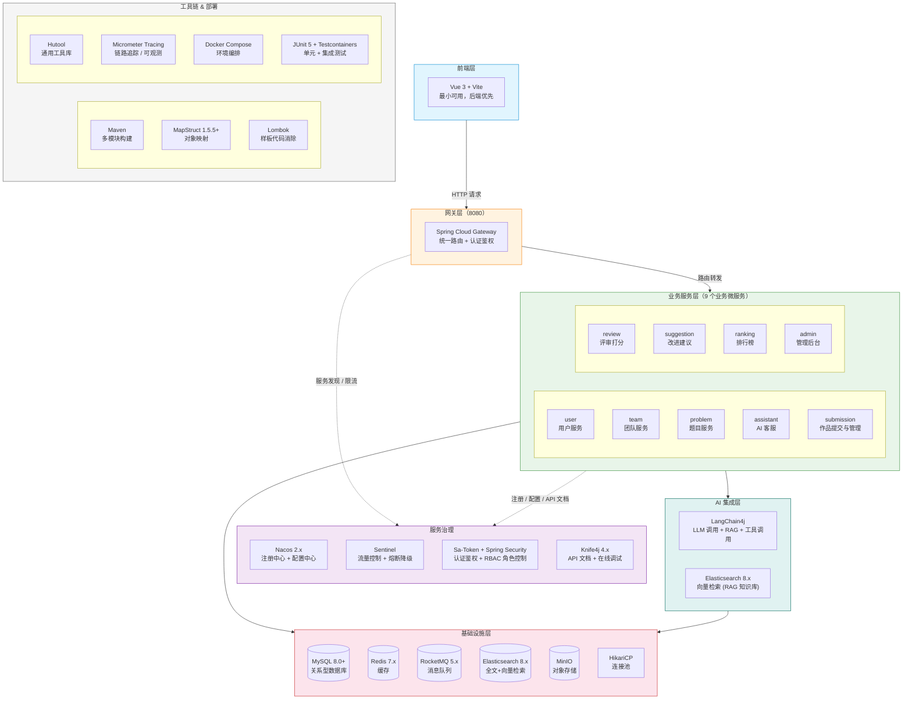

# 技术栈选型

> 创建日期：2026-07-25
> 输入文档：[01-requirements.md](./01-requirements.md)、[04-microservice-architecture.md](./04-microservice-architecture.md)
> 选型原则：服务于面试展示（Java 后端实习）+ 微服务架构落地 + 版本兼容性优先

---

## 一、选型总览



---

## 二、基础框架层

### 2.1 Java & Spring 生态

| 组件 | 选型 | 版本 | 选型理由 |
|------|------|------|---------|
| **JDK** | Java 17 LTS | 17.0.x | 企业主流 LTS，Spring Boot 3.x 基线要求，面试高频（Record、Sealed Class、Pattern Matching、Text Block） |
| **Spring Boot** | Spring Boot | 3.3.x | 3.x 要求 Java 17+，2.7.x 已停止维护 |
| **Spring Cloud** | 微服务框架规范 | 2023.0.x | 提供 Gateway、LoadBalancer 等微服务基础设施抽象 |
| **Spring Cloud Alibaba** | 阿里中间件集成 | 2023.0.1.x | 实现 Spring Cloud 规范，集成 Nacos（注册/配置中心） |

> **两者的关系**：Spring Cloud 是 **框架规范**（定义服务发现、路由、负载均衡等抽象接口），Spring Cloud Alibaba 是 **组件实现**（用 Nacos 实现服务发现，用 Sentinel 实现熔断降级）。两者不是二选一，是互补依赖——Alibaba 依赖 Cloud 作为基座，Cloud 网关（Spring Cloud Gateway）也来自 Cloud 而非 Alibaba。

**面试可讲点**：

- 为什么选 Java 17 而不是 8 或 21？—— 17 是企业主流 LTS 版本，既能展示对新特性的掌握，又不会因 21 过于前沿导致面试官无法深入提问
- Spring Boot 3.x 相比 2.x 的核心变化：Jakarta EE 迁移（`javax.*` → `jakarta.*`）、原生镜像支持、Observability（Micrometer Tracing 替代 Sleuth）

### 2.2 构建工具 & 项目结构

| 组件 | 选型 | 选型理由 |
|------|------|---------|
| **构建工具** | Maven | 国内 Java 岗位 90%+ 用 Maven，多模块项目通过父 POM 统一依赖版本管理，面试展示标准的工程化能力 |
| **项目结构** | Maven 多模块 | 1 个父 POM + 3 个公共 jar 模块 + 1 个网关 + 9 个业务微服务模块 |

---

## 三、数据存储层

### 3.1 关系型数据库

| 组件 | 选型 | 版本 | 选型理由 |
|------|------|------|---------|
| **数据库** | MySQL | 8.0+ | 国内 Java 岗位事实标准，面试必考索引、锁机制、事务隔离级别、SQL 优化 |
| **ORM** | MyBatis-Plus | 3.5.7+ | 零 SQL 写 CRUD + 复杂查询手写 SQL 灵活可控，比 JPA 更贴合国内实际开发习惯 |
| **连接池** | HikariCP | 随 Spring Boot | Spring Boot 3.x 默认，Java 生态最快连接池，无需额外配置 |

**依赖坐标**：

```xml
<!-- MyBatis-Plus 3.5.7+，注意必须用 spring-boot3-starter 变体 -->
<dependency>
    <groupId>com.baomidou</groupId>
    <artifactId>mybatis-plus-spring-boot3-starter</artifactId>
    <version>3.5.7</version>
</dependency>
<!-- 分页插件依赖 -->
<dependency>
    <groupId>com.baomidou</groupId>
    <artifactId>mybatis-plus-jsqlparser</artifactId>
    <version>3.5.7</version>
</dependency>
```

> ⚠️ **版本冲突点**：MyBatis-Plus 3.5.5 以下不兼容 Spring Boot 3.x，artifact 必须带 `-spring-boot3-starter` 后缀。

### 3.2 缓存

| 组件 | 选型 | 版本 | 选型理由 |
|------|------|------|---------|
| **缓存中间件** | Redis | 7.x | Java 生态唯一选择，用于 Token 黑名单、验证码、热点数据缓存、排行榜缓存 |
| **客户端** | Lettuce | 随 Spring Boot | Spring Boot 3.x 默认，基于 Netty 实现响应式/非阻塞，连接池天然优于 Jedis |

**面试可讲点**：Lettuce 基于 Netty 事件驱动模型（NIO）vs Jedis 的 BIO 同步阻塞模型。

### 3.3 对象存储

| 组件 | 选型 | 版本 | 选型理由 |
|------|------|------|---------|
| **文件存储** | MinIO | RELEASE.2024-08-17 | 开源 S3 兼容对象存储，Docker 一键部署，本地开发零成本。代码写标准 S3 SDK，将来迁移阿里云 OSS/腾讯云 COS 零代码改动。版本固定（不用 latest），保证环境可复现 |

**面试可讲点**：为什么用对象存储而不是存数据库 BLOB？—— 文件与元数据分离、CDN 加速、避免数据库膨胀

---

## 四、消息中间件

| 组件 | 选型 | 版本 | 选型理由 |
|------|------|------|---------|
| **消息队列** | Apache RocketMQ | 5.x | 阿里开源，Java 生态原生，事务消息、延迟消息开箱即用。本项目的评审异步回调、排名更新一致性、操作日志采集均依赖 MQ |

**本项目 MQ 消息链路**：

| 生产者 | 消息类型 | 消费者 | 说明 |
|--------|---------|--------|------|
| submission | 评审任务 | review | 作品提交后触发 AI 评审 |
| review | 排名更新事件 | ranking | 评分完成后更新排行榜 |
| suggestion (API) | 建议任务 | suggestion (worker) | VIP 用户请求改进建议，异步处理 AI 调用 |
| review / suggestion | 业务事件 | admin | 操作日志采集 |

**面试可讲点**：为什么 RocketMQ 而不是 RabbitMQ/Kafka？—— 事务消息保证分布式事务一致性、延迟消息实现评审超时重试，RocketMQ 在这两块的成熟度最高

---

## 五、服务治理

### 5.1 注册中心 & 配置中心

| 组件 | 选型 | 版本 | 选型理由 |
|------|------|------|---------|
| **注册中心** | Nacos | 2.x | 注册中心 + 配置中心一体，支持 AP/CP 模式切换 |
| **配置中心** | Nacos | 2.x | 配置热更新、多环境配置隔离（dev/test/prod） |

**面试可讲点**：Nacos CAP 理论实践——默认 AP 保证可用性，可通过配置切换为 CP 保证一致性

### 5.2 API 网关

| 组件 | 选型 | 版本 | 选型理由 |
|------|------|------|---------|
| **网关** | Spring Cloud Gateway | 随 Spring Cloud | 基于 WebFlux 响应式，性能优于 Zuul（已停更） |

### 5.3 认证鉴权

| 组件 | 选型 | 版本 | 选型理由 |
|------|------|------|---------|
| **认证框架** | Sa-Token + Spring Security 6 | sa-token 1.37+ | Sa-Token 轻量权限框架，注解式鉴权（`@SaCheckRole("VIP")`），天然支撑 VIP/普通用户/管理员三级 RBAC |
| **令牌** | JWT + Redis 黑名单 | - | JWT 无状态签发 + Redis 黑名单实现主动失效（踢人下线、强制登出） |

**JWT 无状态性与黑名单的设计权衡**：

JWT 的设计理念是"无状态"——服务端不存 Session，靠签名自包含验证。但纯无状态 JWT 存在一个致命缺陷：**无法主动失效**。签发的 Token 在过期前始终有效，无法实现"踢人下线"或"强制登出"。

本项目通过 Redis 维护 Token 黑名单来补上这块能力：Token 校验时先查 Redis 黑名单，命中则拒绝。代价是每次请求多一次 Redis 查询，换来主动 Token 管理的灵活性。

**依赖坐标**：

```xml
<dependency>
    <groupId>cn.dev33</groupId>
    <artifactId>sa-token-spring-boot3-starter</artifactId>
    <version>1.38.0</version>
</dependency>
<!-- Sa-Token 整合 JWT -->
<dependency>
    <groupId>cn.dev33</groupId>
    <artifactId>sa-token-jwt</artifactId>
    <version>1.38.0</version>
</dependency>
```

**面试可讲点**：
- 为什么选 Sa-Token 而不是手写 Security 配置？—— 开发效率与可维护性的权衡，Sa-Token 的 `@SaCheckRole` 注解 + 自动 Token 续期 + 踢人下线比手写更可靠
- JWT 无状态 vs 黑名单矛盾吗？—— 不矛盾，这是"无状态签发 + 有状态增强"的混合模式：签发时保持无状态优势（不查库），校验时通过黑名单补齐主动失效能力。面试官如果问"JWT 怎么实现踢人下线"，这就是标准答案

### 5.4 流量控制 & 熔断降级

| 组件 | 选型 | 版本 | 选型理由 |
|------|------|------|---------|
| **流量控制** | Sentinel | 1.8.x | Spring Cloud Alibaba 生态原生集成，滑动窗口限流 + 熔断降级 + 控制台实时监控 |

**依赖坐标**：

```xml
<dependency>
    <groupId>com.alibaba.cloud</groupId>
    <artifactId>spring-cloud-starter-alibaba-sentinel</artifactId>
</dependency>
```

**本项目 Sentinel 使用场景**：

| 场景 | Sentinel 规则 | 说明 |
|------|--------------|------|
| Gateway 网关层 | QPS 限流 | 按路由维度限制每秒请求数，保护下游服务 |
| review 评审服务 | 线程数限流 + 熔断降级 | AI 调用耗时高，限制并发线程数，超时/异常比例过高时熔断 |
| suggestion 建议服务 | 慢调用比例熔断 | VIP 功能，AI 响应慢时返回降级提示而非一直等待 |

**面试可讲点**：Sentinel vs Hystrix（已停更）—— Sentinel 的滑动窗口精度高于固定窗口，支持流量整形（Warm Up、排队等待），控制台实时修改规则无需重启，比 Hystrix 更适合国内微服务场景。

---

## 六、AI 集成层

### 6.1 LLM 框架

| 组件 | 选型 | 版本 | 选型理由 |
|------|------|------|---------|
| **LLM 框架** | LangChain4j | 0.34+ | Java 版 LangChain，功能完整（对话链、RAG、工具调用、Embedding），社区活跃度高于 Spring AI |

**本项目 AI 使用场景**：

| 服务 | 场景 | LangChain4j 能力 |
|------|------|-----------------|
| assistant | 多轮对话选题推荐 | ChatMemory（会话记忆）+ @Tool（查题目库） |
| review | 多维度评审打分 | 结构化输出（Schema）+ Prompt 模板 |
| suggestion | 论文改进建议 | RAG（检索评审标准知识库） |

**面试可讲点**：AI Agent 设计模式——LangChain4j 的 Tool Calling 机制让 LLM 能主动查询题目库/用户历史，而不是被动回答问题

### 6.2 检索引擎

| 组件 | 选型 | 版本 | 选型理由 |
|------|------|------|---------|
| **搜索引擎** | Elasticsearch | 8.x | 全文检索 + 向量检索一体，一个引擎同时支撑题目搜索和 RAG 知识库检索 |

**本项目 ES 使用场景**：

| 模块 | 场景 | ES 能力 |
|------|------|---------|
| problem 服务 | 题目全文搜索（关键词、标题、描述） | 倒排索引 + 分词 |
| problem 服务 | 按分类/标签筛选 | 过滤查询 |
| common-ai 模块 | RAG 知识库向量检索（评审标准、评分细则） | dense_vector + KNN |

**面试可讲点**：ES 倒排索引原理、TF-IDF/BM25 相关性打分、dense_vector 的 KNN 搜索 vs 传统全文搜索的区别

---

## 七、接口文档 & 开发调试

| 组件 | 选型 | 版本 | 选型理由 |
|------|------|------|---------|
| **API 文档** | Knife4j | 4.5.0 | 基于 SpringDoc OpenAPI 2.x 增强，现代 UI + 在线调试，后端独立开发时一键接口测试 |
| **外部调试** | Apifox | - | 作为辅助工具，与 Knife4j 互补 |

**依赖坐标**：

```xml
<!-- Knife4j 4.x → SpringDoc OpenAPI 2.x → Swagger 3 -->
<dependency>
    <groupId>com.github.xiaoymin</groupId>
    <artifactId>knife4j-openapi3-jakarta-spring-boot-starter</artifactId>
    <version>4.5.0</version>
</dependency>
```

> ⚠️ **版本冲突点**：Spring Boot 3.x 使用 Jakarta EE（`jakarta.*`），Knife4j artifact 必须带 `jakarta` 后缀，否则运行时报 500 错误。

---

## 八、工具库

| 组件 | 版本 | 选型理由 |
|------|------|---------|
| **Lombok** | 1.18.x | Spring Boot 标配，编译期生成 getter/setter/Builder/日志，避免样板代码 |
| **MapStruct** | 1.5.5+ | 编译期生成对象映射代码，零反射，比 BeanUtils 快 10-20 倍，字段名对不上编译即报错 |
| **Hutool** | 5.8.x | Java 通用工具库，字符串/日期/JSON/文件/加密一把梭，国内项目事实标准 |

**依赖坐标**：

```xml
<dependency>
    <groupId>org.mapstruct</groupId>
    <artifactId>mapstruct</artifactId>
    <version>1.5.5.Final</version>
</dependency>
```

> ⚠️ **版本冲突点**：MapStruct 1.5.x 以下在 Java 17 Record 类型上编译失败，必须 1.5.5+。

**面试可讲点**：

- Lombok：JSR 269 编译期注解处理原理——不是反射，是在 `javac` 编译阶段通过 `annotationProcessor` 生成 AST 节点
- MapStruct vs BeanUtils：编译期生成 vs 运行时反射，性能差一个量级，而且字段映射错误在编译阶段就能发现

---

## 九、可观测性

Spring Boot 3.x 内置 Micrometer 作为 metrics 门面，通过 Micrometer Tracing 替代了 2.x 时代的 Spring Cloud Sleuth，实现分布式链路追踪。微服务架构下，跨服务调用排查问题必须依赖 traceId 串联日志。

| 组件 | 选型 | 版本 | 选型理由 |
|------|------|------|---------|
| **Metrics** | Micrometer | 随 Spring Boot 3.x | Spring Boot 3.x Actuator 默认 metrics 门面 |
| **链路追踪** | Micrometer Tracing | 随 Spring Boot 3.x | 自动注入 traceId/spanId 到日志（MDC），替代已停更的 Sleuth |
| **日志框架** | SLF4j + Logback | 随 Spring Boot | Lombok `@Slf4j` + Logback 配置，通过 `logging.pattern.level` 在每条日志中输出 traceId |

**日志输出示例**（带 traceId）：

```
2026-07-25 10:30:15.123 [submission,abc123def456,user123] INFO  c.l.s.controller.SubmissionController - 作品提交成功
                        ^^^^^^^^ ^^^^^^^^^^^^^^
                        服务名    traceId
```

**面试可讲点**：微服务下怎么排查跨服务调用问题？—— Micrometer Tracing 在网关层生成 traceId，通过 HTTP Header（`X-B3-TraceId`）在 Feign/RestTemplate 调用链中自动传递，每个服务的日志都带上 traceId，ELK/Kibana 搜索一个 traceId 就能还原完整调用链。这是 Spring Boot 3.x 升级的核心卖点之一（Sleuth → Micrometer Tracing）。

---

## 十、测试框架

| 组件 | 选型理由 |
|------|---------|
| **JUnit 5** | Spring Boot 3.x 默认测试框架 |
| **Mockito** | Mock 外部服务调用，单元测试核心 |
| **Testcontainers** | Docker 启动真实 MySQL/Redis/RocketMQ 做集成测试，测试环境 = 生产环境 |
| **Spring Boot Test** | 切片测试（`@WebMvcTest`、`@DataJpaTest`），按层隔离测试 |

**面试可讲点**：Testcontainers 替代 H2 做集成测试——H2 是 Java 内存数据库，SQL 方言与 MySQL 不同导致"测试全过、上线炸"，Testcontainers 启动真实 Docker 中间件彻底解决这个问题。这是初级和高级开发者在测试实践上的分水岭。

---

## 十一、容器化 & 部署

| 组件 | 用途 |
|------|------|
| **Docker Compose** | 本地开发环境编排，一键启动 MySQL + Redis + RocketMQ + Nacos + ES + MinIO |
| **Dockerfile**（每服务一个） | 多阶段构建：Stage 1 Maven 编译 → Stage 2 JDK 17 slim 镜像运行 |
| **K8s（预留）** | 面试提一句"后续可迁移到 K8s 做服务编排"，实际不做 |

---

## 十二、版本兼容性总表

| 框架 | 版本 | 兼容要点 |
|------|------|---------|
| JDK | 17 LTS | Spring Boot 3.x 硬性要求 Java 17+ |
| Spring Boot | 3.3.x | Jakarta EE 迁移（`javax.*` → `jakarta.*`） |
| Spring Cloud | 2023.0.x | 对应 Spring Boot 3.3.x |
| Spring Cloud Alibaba | 2023.0.1.x | 对应 Spring Cloud 2023.0.x，Nacos 2.x，Sentinel 1.8.x |
| MyBatis-Plus | 3.5.7+ | 必须用 `-spring-boot3-starter` artifact 变体 |
| MyBatis-Plus JSqlParser | 3.5.7+ | 分页插件依赖，不可遗漏 |
| Sa-Token | 1.38.0+ | 必须用 `-spring-boot3-starter` 变体 |
| Micrometer Tracing | 随 Boot 3.x | Spring Boot 3.x 内置，替代 Sleuth |
| Knife4j | 4.5.0 | artifact 必须带 `jakarta` 后缀 |
| MapStruct | 1.5.5+ | 1.5.x 以下不支持 Java 17 Record |
| LangChain4j | 0.34+ | 与 Spring Boot 3.x 无版本冲突 |
| Elasticsearch | 8.x | 与 `spring-boot-starter-data-elasticsearch` 集成 |
| RocketMQ | 5.x | RocketMQ Spring Boot Starter 已适配 Boot 3.x |

---

## 十三、决策记录

| # | 决策 | 备选方案 | 选择理由 |
|----|------|---------|---------|
| 1 | Java 17 + Spring Boot 3.3.x | Java 21 / Java 8 + Boot 2.7 | 企业主流 LTS + Boot 3.x 新特性 + 面试高频 |
| 2 | MyBatis-Plus 3.5.7 | JPA / 纯 MyBatis | 开发效率 + 复杂查询灵活可控 |
| 3 | RocketMQ 5.x | RabbitMQ / Kafka | 事务消息 + 延迟消息成熟度最高 |
| 4 | MinIO | 本地文件系统 / 阿里云 OSS | S3 兼容 + Docker 零成本 + 后续可迁移 |
| 5 | Nacos 2.x | Consul / Eureka | 注册+配置一体 + 国内事实标准 |
| 6 | Sentinel 1.8.x | Hystrix / Resilience4j | Alibaba 生态原生集成 + 控制台实时监控 + Hystrix 已停更 |
| 7 | Sa-Token + Spring Security 6 | 纯 Security / Shiro | 轻量注解式鉴权 + 天然支持 RBAC |
| 8 | LangChain4j | Spring AI / 直接 HTTP 调用 | 功能完整 + 社区活跃 + AI Agent 设计模式 |
| 9 | Elasticsearch 8.x | 仅 MySQL 检索 / Milvus | 全文+向量一体，一个引擎两个场景 |
| 10 | Knife4j 4.5.0 + Apifox | 仅 Apifox 手动维护 | 代码与文档同步 + 在线调试 |
| 11 | Maven 多模块 | Gradle | 国内主流 + 父 POM 统一版本管理 |
| 12 | MapStruct 1.5.5+ | BeanUtils / 手写 | 编译期生成 + 类型安全 + 性能优 |
| 13 | Testcontainers | H2 内存库 | 真实环境集成测试，避免 SQL 方言差异 |
| 15 | Micrometer Tracing | 手动 MDC / SkyWalking | Spring Boot 3.x 内置，零配置 traceId 注入，替代已停更的 Sleuth |
| 16 | Docker Compose | K8s / 裸跑 | 本地开发环境一键编排，15天周期合理选择 |
