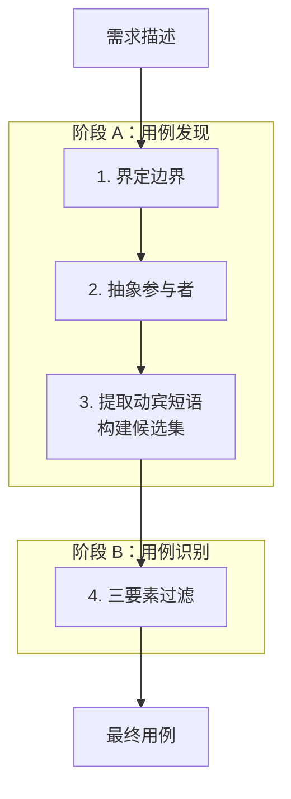
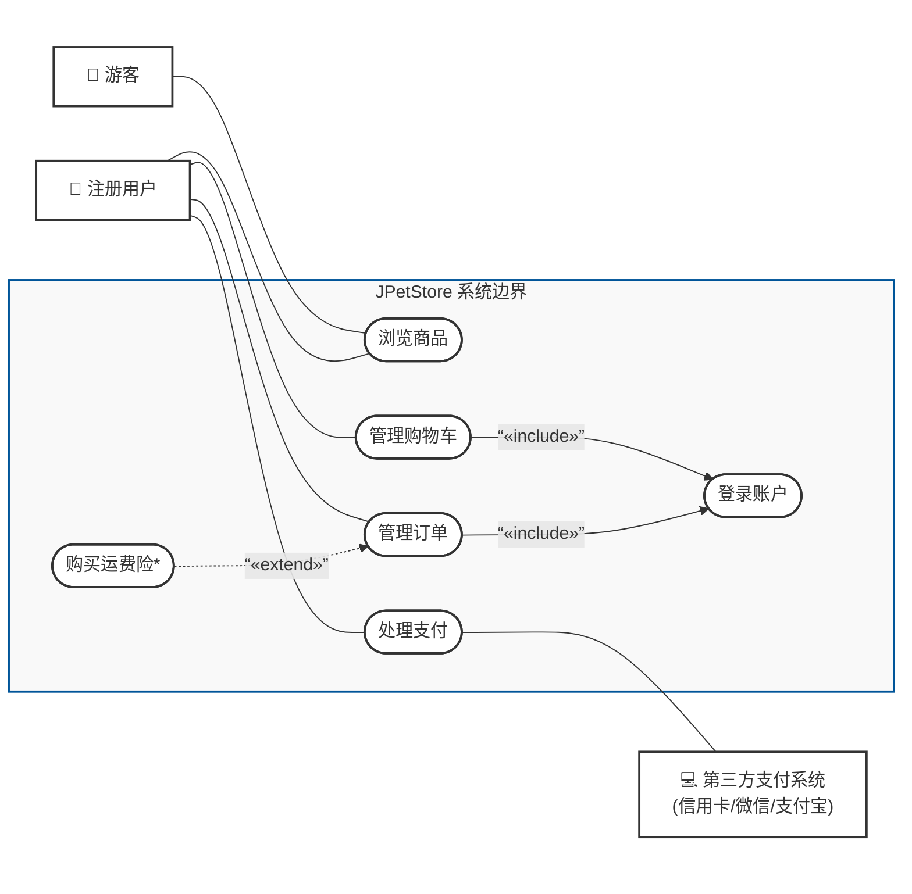
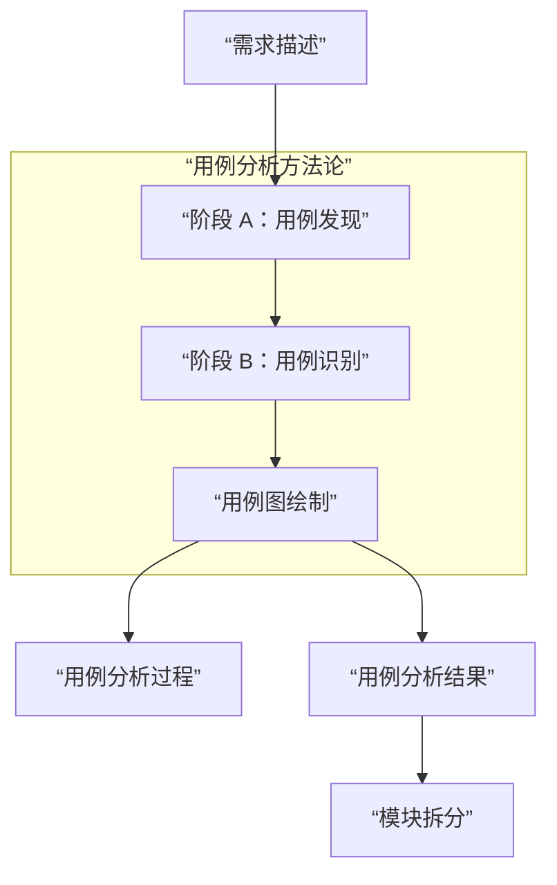

## 用例分析的方法

> 从需求描述中提取用例，回答"谁来用、怎么用、有哪些场景"。

用例分析是项目全流程的第二步。它以需求分析阶段的输出为输入，将用户视角的功能描述转化为结构化的用例模型，为后续的模块拆分提供依据。

---

### 用例的定义

概念：**主要参与者**，为了达成其具体的业务目标，通过与系统交互所执行的一系列完整的活动序列。该序列涵盖了从业务开始、发展到结束期间的所有活动，并获得有业务价值的、稳定持久的结果，同时包含了成功和失败的情形。

核心判定三要素：

1. **完整动作序列**：用例绝对不是业务流程里的某一个细步（如"输入密码"），而是一套包含始末的完整交互。
2. **具体的业务目标与价值**：必须能为参与者产生可观察、有业务价值的结果。
3. **覆盖成功与失败场景**：既要描述正常流程，也要包含异常/失败的分支处理。

### 识别用例的完整方法论

识别用例分为两个阶段，两个阶段串联执行。
- **阶段 A：用例发现**，即找候选
- **阶段 B：用例识别**，即做筛选

#### 阶段 A：用例发现

这个阶段的任务是**宁可找多，不可漏掉**，尽可能找全潜在候选。主要使用以下两种方法：

##### 1. 参与者目标法

适用于人或角色触发的交互。

- **第一步：确定系统边界**
  明确项目的建设范围，限定哪些功能在待开发系统内部，排除外部独立的第三方系统。例如在电商系统中，系统的"处理订单支付"功能在边界内，而"微信支付平台/支付宝平台"属于边界外的外部系统。
- **第二步：抽象直接参与者**
  从需求文本中寻找具体的"人"，忽略间接使用者。例如委托小明买狗的小宝是间接用户，应当忽略；小明是直接用户，应当保留。并将具体的人**抽象为角色**。例如小明在不同阶段分别抽象为"游客"和"注册用户"。
- **第三步：提取"动宾短语"构造候选集**
  梳理用户视角的需求描述，扫描其中的**动宾短语**，填入候选表。此阶段产出的全部是候选用例，将在阶段 B 中通过三要素进行筛选。

| 主要参与者 | 用例 |
| --- | --- |
| 非注册用户 | 浏览商品 |
| 注册用户 | 浏览商品 |
| 注册用户 | 输入用户名密码 |
| 注册用户 | 登录账户 |
| 注册用户 | 管理购物车 |
| 注册用户 | 处理支付 |

##### 2. 事件分析法

适用于外部系统触发或协作。对于非人类直接操作、而是由外部系统触发的交互，采用**事件分析法**。寻找外部事件的**源点**或**终点**，构建候选表：

| 外部事件 | 源点/终点参与者 | 候选业务目标 |
| --- | --- | --- |
| 外部系统被请求完成订单支付 | 微信支付系统 / 支付宝系统 | 处理支付 |

---

#### 阶段 B：用例识别

精准筛选与重构。拿到候选集后，需要用用例的**三要素**（完整序列、业务目标、成功/失败场景）对每一个候选进行精准过滤。

我们可以借用经典的 **"ATM 提款"** 案例来进行三要素审查。在进入具体审查前，先介绍一个实用的粒度校验工具。

##### 老板测试

老板测试，英文称为 The Boss Test。其核心目的是用来检验一个用例的"粒度"是否合适，即判断它究竟是一个真正的用户目标级别用例，英文称为 User-Goal Level，还是仅仅属于更底层的子功能或步骤。

它的场景假设非常接地气：

假设你下班时，老板问你："你今天一整天都在干嘛？"

场景 A：你回答"我今天在系统里登录了"，或者说"我点了一下取消按钮"。
老板反应：老板不仅不会高兴，还会觉得你在摸鱼或者脑子进水了。
结论：失败。"登录"只是一步操作或子功能，不满足老板测试。

场景 B：你回答"我今天在系统里处理了客户退货"，或者说"我成功生成并提交了季度的财务报表"。
老板反应：老板满意地点头，觉得你今天完成了有实际价值的工作。
结论：通过。"处理退货"创造了明确的商业价值，是一个真正的用例。

它解决什么问题？
在拆分需求时，新手最容易犯的错误就是"用例过细"，即 CRUD 爆炸——把"点击登录"、"输入验证码"、"点击保存"、"下拉选择选项"都当成单独的用例。
老板测试能帮你迅速剔除这些细碎的操作，确保每一个提炼出的用例都能为用户或业务带来可衡量的成果与价值。

下面用三要素结合老板测试，对 ATM 案例的候选逐一审查。

#### 审查 1：输入密码

这是一个候选用例。

* **完整动作序列？** ❌ 不是，它只是某套完整流程中的一个局部步骤。
* **具体业务目标？** ❌ 否。你去 ATM 机不是为了"输入密码"，而是为了"取钱"。
* **结果**：**拒绝**。划掉，不能作为独立用例。

#### 审查 2：取款 / 转账

这是一个候选用例。

* **完整动作序列？** ✓ 是，从插卡认证到吐钞退卡，包含了完整的始末。
* **具体业务目标？** ✓ 是，获得了"拿到现金"这一明确业务价值。
* **覆盖成功与失败？** ✓ 是，包含密码错误、余额不足、退卡等场景。
* **结果**：**通过**。确认作为独立一级用例。

#### 审查 3：登录账户 —— 违例条款

这是一个候选用例。

* **审查分析**：如果你回家告诉家人"我今天花了半天去银行登录了账户"，这通常是不合理的，它无法通过"老板测试"。`登录账户` 本身只是 `取款` 或 `转账` 的一个前置子步骤。
* **违例许可：子用例重用**：
  资料中提到 Craig Larman 的关键补充 —— **当一个子功能级别的候选用例，被多个其他一级用例所重复共享使用时，为了避免内容冗余，允许将其单独提取为一个用例**，并通过包含或扩展关系连接。
* **结果**：`登录账户` 属于**违例条款**，作为独立用例保留，被其他用例包含。

---

### 实战总结

在处理你手中的需求描述文本时，可以按照以下步骤落卡：

1. **提取直接参与者**：明确谁在使用系统。
   从需求描述中找出所有与系统直接交互的人员角色（如：买家、系统管理员）以及外部系统（如：推送服务）。排除间接参与者。

2. **拉出候选用例清单**：动宾短语抽取。
   逐句扫描需求描述，提取出所有的动宾短语（如：提交订单、填写收货地址、查询商品），统统列入候选表。

3. **运行三要素 + 违例审查**：确定最终用例。
   逐一审查候选项：

   1. 剔除"界面操作级细步"（如"点击确认"、"输入密码"）。
   2. 保留"具有明确业务价值的完整全过程"（如"管理订单"）。
   3. 对被多个用例重复调用的前置动作（如"登录"），按违例条款单独提炼为公共用例。

---

### 最终产出对照

以 PetStore 案例为例，经过三要素审查后，最终保留与剔除的用例如下。

**保留的用例：**

| 主要参与者 | 用例 |
| --- | --- |
| 非注册用户 | 浏览商品 |
| 注册用户 | 登录账户 |
| 注册用户 | 管理购物车 |
| 注册用户 | 处理支付 |

**被剔除的候选：**

`输入用户名和密码` 被剔除，判定依据：仅为步骤，无独立业务价值。

`登录账户` 的保留属于违例条款，判定依据：被多处调用的公共子流程，允许提取为独立用例。

### 用例图的绘制

用例分析完成后，需要用用例图将分析结果可视化。本章介绍用例图的概念定义、核心构成要素、关系规范，以及如何使用 Mermaid 绘制标准 UML 用例图。

#### 概述

用例图通过刻画系统边界、参与者、用例以及它们之间的关系，来高层级地展现系统的功能结构。它回答两个核心问题：谁来用，以及干嘛用。

用例图有三个核心价值：

- **划定系统职责边界**：清晰区分哪些功能在系统内部实现，哪些外部系统或角色在系统外部进行交互。
- **提供高内聚低耦合的功能视图**：用例之间在业务上相对独立，用例图不表达流程上的先后顺序，用例内部才包含具体的执行步骤。
- **作为沟通媒介**：向开发团队和业务方直观展示系统功能特性，为后续撰写用例规约文本打下基础。

#### 核心构成要素

用例图由四个核心要素组成：

| 元素 | UML 图示 | 定义与规范 |
| --- | --- | --- |
| **系统边界** | 矩形方框 | 展现系统的上下文环境。框内为系统本身提供的功能，所有用例必须在框内；框外为与系统交互的外部角色。方框顶部标注系统名称。 |
| **参与者** | 火柴人形状 | 与系统直接交互的角色，可以是人或外部系统。主要参与者主动触发用例，绘制在系统左侧；协助参与者为用例提供服务，绘制在系统右侧。 |
| **用例** | 椭圆形状 | 表达一个完整的业务目标，是高内聚的功能单元。用例间在业务层面相互独立，不存在流程上的先后顺序。 |
| **关系** | 各种线段与箭头 | 刻画元素之间的联系，包括关联、泛化、包含、扩展四种类型，详见下文关系规范表。 |

#### 关系类型与绘制规范

用例图包含四种关系：

| 关系 | 符号 | 箭头方向 | 业务含义 |
| --- | --- | --- | --- |
| **关联** | 实线 | 无箭头 | 表达参与者与用例之间的直接交互。 |
| **泛化** | 实线 + 空心三角 | 子角色 → 父角色 | 表达角色的继承关系。例如注册用户继承自系统用户。 |
| **包含** | 虚线箭头 + `«include»` | 主用例 → 子用例 | 主用例在执行过程中必定会调用子用例，属于必需步骤。例如管理购物车包含登录账户。 |
| **扩展** | 虚线箭头 + `«extend»` | 扩展用例 → 基本用例 | 仅在特定条件或异常下才触发的附加功能，属于可选步骤。例如购买运费险扩展了管理订单。 |

#### Mermaid 代码实现

推荐使用 `flowchart LR` 结合 `subgraph` 来绘制用例图，这种写法能够还原标准 UML 用例图的物理布局：左侧为主要参与者、中间为系统边界框与椭圆用例、右侧为协助参与者。

以下为 JPetStore 用例图的完整 Mermaid 代码：

#### 布局技巧

使用 Mermaid 绘制标准用例图的要点：

1. **确定从左到右主方向**：使用 `flowchart LR`，确保主要参与者在左，协助参与者在右。
2. **构建系统边界**：使用 `subgraph` 容器包装所有用例，生成标准 UML 的系统方框。
3. **形状拟合**：用例使用 `([“用例名称”])` 圆角矩形，参与者使用 `[“👤 角色名”]` 加样式类。
4. **严格遵循线段规范**：关联用无箭头实线 `---`；包含用实线箭头 `-- “«include»” -->`；扩展用虚线箭头 `-. “«extend»” .->`。

### 项目实践：输出物规范

以上方法论在实际项目中，最终需要落地为两份文档。整个用例分析环节的输入与输出如下：

#### 输出物一：用例分析过程

**定位**：记录分析的完整思考链路，保留所有决策上下文。这份文档面向团队协作和后续维护——当有人问”为什么登录是独立用例”或”为什么某个功能被剔除”时，能在这里找到答案。

**包含内容**：

| 章节 | 说明 |
| --- | --- |
| 参与者识别 | 从需求文本中提取的原始角色，以及抽象为参与者类型的推导过程 |
| 候选清单 | 阶段 A 提取的全部动宾短语，包含参与者目标法和事件分析法的产出 |
| 三要素审查 | 对每个候选逐一审查：是否为完整动作序列、是否具有业务目标、是否覆盖成功与失败场景 |
| 判定汇总 | 每个候选的最终判定：保留、剔除或违例保留，以及判定依据 |
| 用例图设计决策 | 用例间包含和扩展关系选择的具体理由 |

**关键原则**：过程文档不删减、不精简。被剔除的候选、判定为违例的例外情况，都完整保留。

#### 输出物二：用例分析结果

**定位**：去除所有分析过程和决策理由，只保留最终结论。这份文档直接作为后续开发环节的输入——模块拆分、接口设计、数据库设计都将基于它进行。

**包含内容**：

| 章节 | 说明 |
| --- | --- |
| 主要参与者 | 参与者类型与职责描述，列表呈现 |
| 次要参与者 | 外部系统或服务类参与者，列表呈现 |
| 用例清单 | 编号、用例名称、一句话简述，表格呈现 |
| 用例图 | 标准 UML 用例图，建议使用 Mermaid 绘制 |

**关键原则**：结果文档不包含”为什么”。不写判定依据、不写剔除记录、不写设计权衡。阅读者不需要知道哪些候选被否决了，只需要知道最终有哪些用例。

#### 两份文档的关系

| 维度 | 用例分析过程 | 用例分析结果 |
| --- | --- | --- |
| 回答什么问题 | 为什么是这个用例，那个为什么不是 | 系统有哪些用例，谁来用 |
| 读者 | 团队成员、后续维护者、新加入的开发者 | 开发者、架构师 |
| 是否包含决策理由 | 是 | 否 |
| 是否包含被剔除内容 | 是 | 否 |
| 后续流程引用 | 存档备查 | 作为模块拆分的直接输入 |

一份需求描述输入，产出两份用例文档。过程文档保留分析全貌，结果文档提供无噪音的功能视图。从结果文档出发，便可以进入下一环节：模块拆分。