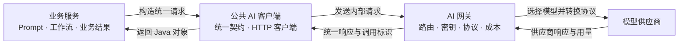

## AI 调用的契约与治理分层

AI 系统接入多个业务场景和模型供应商时，可以将业务语义、公共调用契约和运行时模型治理分成三层：业务服务自己使用 AI，公共模块统一调用契约，AI 网关统一调度外部模型。

这种设计不是为了增加模块数量，而是把变化原因不同的代码隔离开。业务需求变化不应迫使模型网关理解业务，供应商变化也不应迫使所有业务服务修改调用代码。

### 三层职责

#### 业务能力层

业务服务知道为什么调用 AI，并拥有调用产生的业务结果。

它负责：

- 组织业务输入和上下文。
- 定义 Prompt、工作流和输出契约。
- 决定何时调用 AI，以及失败后业务任务如何恢复。
- 校验模型输出是否满足业务语义。
- 保存业务任务、状态和结果。

论文评审、改善建议和对话助手即使都调用大模型，其 Prompt、状态和结果含义也不同，因此应由各自业务服务维护。

#### 公共契约层

公共 AI 模块是被业务服务依赖的客户端 Jar，不是独立运行的微服务。它统一业务服务访问 AI 网关的方式。

它负责：

- 定义供应商无关的请求、响应、内容块、用量、错误和追踪契约。
- 提供 AI 网关客户端和统一异常转换。
- 提供测试替身，使业务测试不产生真实模型调用和费用。

它不负责业务 Prompt、工作流、供应商 SDK、密钥、模型路由、成本统计和质量评价。公共模块应保持足够薄，防止所有业务逻辑逐渐汇集成难以维护的大杂烩。

#### 模型治理层

AI 网关是独立部署的运行服务，也是外部模型供应商的唯一出口。

它负责：

- 接入供应商并适配不同 API 协议。
- 维护模型能力、固定模型绑定和同模型账号资源池。
- 读取密钥并保护敏感配置。
- 执行能力校验、超时、供应商级重试、熔断和主备切换。
- 记录每次调用和供应商尝试的状态、Token、耗时、价格与成本。

AI 网关不解释业务结果。它可以判断一个模型是否支持图像或 JSON，但不能判断论文评分是否合理、改善建议是否可执行。

### 完整调用链

公共客户端的代码运行在业务服务进程中。业务服务到 AI 网关之间发生一次内部网络调用，AI 网关到模型供应商之间发生一次或多次外部调用。公共客户端不是第二个网关，也不会产生额外的独立服务跳转。

### 为什么同时需要公共模块和 AI 网关

如果只有公共模块而没有 AI 网关，密钥、供应商适配、路由、重试和成本治理仍会分散在每个业务服务中，无法形成统一运行时控制。

如果只有 AI 网关而没有公共模块，每个业务服务都要重复维护请求响应类型、HTTP 调用、错误转换和测试替身。网关契约变化时，调用方还可能产生不同的字段和错误语义。

因此两者分别解决不同问题：

| 组件 | 解决的问题 |
|------|------------|
| 公共 AI 模块 | 编译期契约统一和客户端代码复用 |
| AI 网关 | 运行时模型调度和供应商治理集中化 |

公共模块不是绝对不可替代。可以让每个业务服务手写客户端，也可以通过 OpenAPI 生成客户端，但客户端侧契约和调用代码不会消失。存在多个 AI 业务调用方时，保留一个轻量公共模块通常更清晰。

### 重试职责示例

重试不能笼统地放在某一层，应根据失败语义归属：

| 场景 | 负责方 |
|------|--------|
| 用户重试失败的论文评审任务 | 论文评审业务服务 |
| 判断一次业务任务是否允许重新执行 | 对应业务服务 |
| 单个供应商账号限流后尝试同一模型的其他账号 | AI 网关 |
| 供应商连接超时、熔断和主备切换 | AI 网关 |
| 将 AI 网关网络错误转换成统一客户端异常 | 公共 AI 模块 |

公共客户端不应默认重发模型请求。请求虽然在客户端超时，供应商仍可能已经执行并产生费用；客户端和网关同时重试还可能放大调用次数。

### 边界判断方法

设计新能力时可以连续询问：

1. 这项规则是否需要理解具体业务结果。需要则归业务服务。
2. 这项能力是否只是所有调用方共用的请求、响应或客户端代码。是则归公共模块。
3. 这项能力是否需要掌握实际供应商、模型、密钥、价格或调用状态。是则归 AI 网关。
4. 更换供应商后业务规则是否仍然存在。仍然存在的部分不应被放入供应商适配层。

### 常见越界

- 把 Prompt 放进公共模块，导致公共模块依赖具体业务。
- 把论文处理或对话记忆放进 AI 网关，使网关逐渐成为业务中心。
- 让业务服务指定供应商密钥或供应商特有参数，破坏统一调度。
- 在公共客户端和 AI 网关同时重试，造成重复调用和费用放大。
- 让 AI 网关校验业务评分和建议质量，混淆协议成功与业务正确。

### 设计价值

这一结构体现了三种解耦：

- 业务解耦：各业务服务独立维护 Prompt、工作流和结果。
- 契约解耦：业务服务只依赖统一客户端，不依赖具体供应商协议。
- 治理解耦：供应商、账号、密钥、固定模型执行和成本变化集中在 AI 网关。

它适用于存在多个 AI 业务调用方、多个供应商，或者需要统一成本与稳定性治理的系统。对于只有一个调用方、一次简单模型请求的小项目，应权衡模块维护成本，不为了形式机械拆层。

### 本地限流不是供应商容量保证

AI 网关只能统计经过当前项目的调用。如果同一账号、组织或配额主体还被其他项目、脚本、控制台或其他 API Key 使用，这部分消耗对本项目不可见。即使本地并发计数低于供应商公布的上限，供应商仍可能因为账号总并发、RPM、TPM 或费用额度已经被其他调用占用而拒绝请求。

因此账号和 API Key 最好由单个项目独占。无法独占时，本地限流只能作为保守的准入控制，不能宣称保证不触发供应商限流；系统应预留容量余量，以供应商真实响应为准，并在出现限流后退避和收缩账号可用容量。
