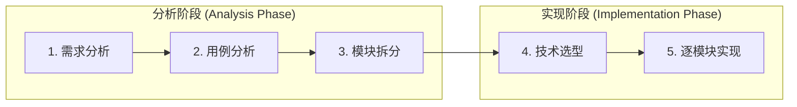

# 学生独立开发者的项目方法论

> 一个大学生从零开始独立完成项目的经验总结 —— 如何少走弯路，把项目真正做出来。

---

## 1. 背景：学生做项目的真实困境

独立做项目和在公司做项目完全不同。学生没有 deadline，没有老板催，没有同事 review，所有事情全靠自己。这些"自由"反而是最大的陷阱。

### 1.1 缺乏时间压力

没有明确的开发周期，没有上线压力，全凭自驱力。今天不做可以明天做，明天不做还可以后天做。项目像一个永远可以往后推的事情，缺乏紧迫感会让进度无限拖延。

### 1.2 完美主义陷阱

脑子里有无数个 idea，这个功能可以这么设计，那个细节可以那样打磨。把大量时间花在反复分析和推敲上，不断重构，推翻重做，总觉得"还不够好"。这本质上是**自嗨式的完美主义** —— "局部最优解"。

### 1.3 能力与期望的差距

知道自己想要什么效果，但做出来总觉得不满意，达不到预期。这往往是因为：没有遇到过类似的问题，缺少"最佳实践"的积累，不知道一个功能的标准解法是什么。于是反复琢磨、反复调整，投入了大量时间但收效甚微。

### 1.4 想得太多，做得太少

项目的大部分时间停留在分析与设计阶段，进展始终停留在"美好的想象"里。分析只是手段，交付才是目的。想得多而做得少，最终项目原地踏步。

---

## 2. 心态与原则

针对上面的困境，以下是几条核心原则。每一条都来自于踩过的坑。

### 2.1 每次工作都有明确输出

绝不返工，不空转。每次坐下来写代码，都应该产出一个具体的东西：可以是一份设计文档，可以是一个跑通的小功能，可以是一个技术点的学习笔记。**项目必须被持续推进。**

### 2.2 允许不完美，先跑起来

接受当前版本不好用，接受代码写得不够优雅。功能可以根据实际的业务场景逐步调整，前期能跑通就是胜利。**代码"能跑就行"不是敷衍，而是策略。**

### 2.3 裁掉非核心，守住主线

专注于目标，砍掉所有非必要、非核心的内容。不是每个 idea 都值得做 —— 在有限的时间精力下，**做减法比做加法更难，也更重要。**

### 2.4 禁止大而细，拥抱迭代

不要抱有一次设计就完美的幻想。从粗糙简单开始，逐渐完善。前期开发的功能在前期能适应，到了后期可能会暴露新的问题，需要重新设计调整。**这是正常的，不是失败。迭代本身就是开发的正确姿势。**

### 2.5 避免推翻重来

不要有"项目草稿"的感觉。一般情况下不要推翻已有的代码，除非确实到了不改没法继续的地步。**写完的代码就是资产，不是草稿。** 当项目真正遇到困难时，自然会去解决，而不是提前解决，所有的设计模式、架构原则都是为了应对解决困难而生的，而不是天然就该如此。发现问题，然后才解决问题。

---

## 3. 项目开发全流程

将项目的完整过程拆分为五个阶段。**前三个阶段（1~3）是纯分析阶段，完全不考虑怎么实现** —— 不用想用什么技术栈、什么框架、数据库怎么建。分析的目的是搞清楚"做什么"，实现的选型结合具体场景在第四阶段确定。这样做是为了防止"经验主义"过早限制功能设计。

目录文档索引：

| 文件 | 定位 | 说明 |
|------|------|------|
| `README.md` | 方法论总纲 | 当前文件：背景、原则、全流程概览 |
| `需求分析方法论.md` | 需求分析方法论 | 如何做需求分析：上下文 → 描述 → 边界 |
| `用例分析方法论.md` | 用例分析方法论 | 如何识别用例：参与者 → 候选 → 三要素过滤 |
| `模块拆分方法论.md` | 模块拆分方法论 | 如何拆分模块：原则 → 步骤 → 分层 → 输出物 |
