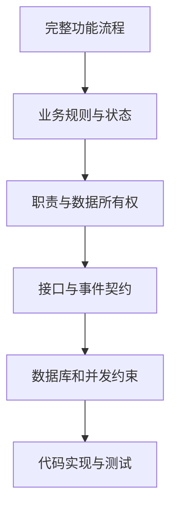

# 系统分析实践反思

## 一、问题的由来

学习系统分析时，我接触到了一套完整而严谨的流程：识别参与者、提取候选用例、逐个判断是否满足用例条件、编写高层文本用例和详细文本用例，再继续设计领域模型、数据库、接口、类和服务边界。

我曾在 LeetModel 项目中认真按照这套流程实践。用例分析过程记录了参与者识别、候选能力、合并与保留、排除原因和最终用例清单。系统需求、微服务架构与后端 Maven 模块设计也按照不同抽象层次分别维护。整套过程有明确依据，结论可以追溯，形式上非常完整。

但在真正推进开发时，我发现严格照搬课堂流程并不适合个人项目。问题不是理论错误，而是它的目标、成本和真实开发环境与课堂作业不同。

课堂方法强调过程完整、分析可审查和模型规范。个人开发更关心能否尽快理解功能、发现遗漏、明确边界并指导实现。当分析过程本身消耗大量精力，却没有继续降低实现风险时，它就开始成为负担。

## 二、用例识别无法覆盖全部有价值的功能

### 核心用例容易识别

LeetModel 的选题、组队、提交、评审和排行都具有清晰的参与者目标和完整过程，很容易被识别为用例。例如组队可以描述为用户找到队伍、申请加入、队长审核、成员分配职责，最后形成可以参加练习的团队。

这类功能通常具备以下特征：

- 用户目标明确
- 有连续的操作过程
- 会产生重要业务结果
- 会改变核心业务状态
- 与其他核心功能存在明显关系

传统用例识别方法对这类功能非常有效。

### 体验型功能容易被漏掉

修改密码、注销账户、更新账号信息和上传头像则不同。它们往往没有复杂的业务过程，不是其他核心功能的必要前置条件，也很难独立支撑完整的业务目标。在候选用例审查中，它们很容易因为目标过小、过程过短或业务价值不够独立而被合并或排除。

但真正开发用户模块时，这些功能会自然出现。用户登录后需要维护自己的资料，头像需要上传和回显，密码需要修改，账户可能需要注销。它们不一定是系统的核心用例，却是一个可使用系统的重要组成部分。

这里暴露出一个关键问题：

> 用例模型擅长描述核心业务目标，但不适合承担完整功能清单的职责。

如果把用例清单当作全部需求，系统会遗漏大量支撑性功能和体验型功能。如果为了容纳这些功能而把每个小操作都提升为用例，用例模型又会变得碎片化，失去表达核心业务目标的价值。

### 更合适的分类

功能分析不应该只有用例这一种入口，可以将功能分为三类：

| 类型 | 识别方式 | LeetModel 示例 |
|------|----------|----------------|
| 核心业务功能 | 从参与者目标和业务结果识别 | 组建队伍、提交论文、AI 评审 |
| 支撑功能 | 从核心流程所需能力识别 | 文件存储、权限校验、评审任务调度 |
| 体验与管理功能 | 从用户使用路径和对象生命周期识别 | 修改密码、更新资料、上传头像、注销账户 |

用例图可以继续保留核心业务功能，但需求清单还需要通过页面走查、对象生命周期检查、CRUD 完整性检查和异常场景检查补充。

## 三、过程过于详细会削弱分析的价值

### 过程文档不等于最终设计

早期用例分析先罗列大量候选能力，再对每一项逐个判断是否满足参与者目标、完整动作序列和独立业务价值。这个过程能证明结论有理有据，但多数判断只在分析当时有用。

当结论已经形成后，开发真正需要反复查看的是：

- 用户要完成什么事情
- 功能从哪里开始，到哪里结束
- 正常流程如何执行
- 状态如何变化
- 失败时如何处理
- 哪个模块负责哪一部分

候选项为什么被合并、每个条件如何逐项判断，通常不会直接指导代码实现。大量保留这种过程，会提高文档维护成本，也会掩盖真正重要的结论。

### 高层用例与详细用例容易重复

先写高层文本用例，再扩展为详细文本用例，在大型团队中有利于评审和交接。但个人项目的设计者、开发者和维护者通常是同一个人。如果两层文档只是把相同内容用不同粒度重复一遍，价值有限。

以组队功能为例，真正有效的起点不是先写两套用例文本，而是先讲清楚完整流程：

流程明确后，很多设计问题会自然暴露出来：

- 公共队伍需要什么筛选条件
- 队伍是否需要招募状态
- 入队申请需要哪些状态
- 队伍满员时如何处理并发审核
- 队长和普通成员分别能做什么
- 列表和详情需要哪些用户公开信息
- 前端需要组队广场、详情、我的队伍和管理界面

这比先判断申请加入是否构成独立用例，更接近实现时真正需要解决的问题。

## 四、设计扩张会拖慢从零到一

### 想得越多，系统越难开始

系统设计很容易进入一种循环：分析一个功能时发现新的边界问题，解决边界问题时又想到更多功能，新增功能继续引出数据、权限、异常和扩展需求。设计看起来越来越完整，但可以运行的系统始终没有出现。

LeetModel 的功能天然容易向外扩张。组队可以继续增加邀请、申请、招募、筛选、队长转让、消息提醒和队伍推荐。论文评审可以继续增加多版本工作流、优先队列、成本治理、质量评测、RAG 和模型实验。每一个想法都有价值，也都能找到合理的实现理由。如果要求从一开始就把它们全部设计清楚，项目会长期停留在准备阶段。

从零到一确实需要设计，但个人开发者无法使用大型团队的方式承担这种成本。设计、开发、测试、审查和维护都由同一个人完成。每增加一份方案或一个功能，不只是多写一些内容，还会增加后续理解、比较、修改和保持一致的负担。

### AI 同时放大产出和审查成本

AI 可以快速补充需求、列举异常、生成多个方案和扩展设计。这让想法产生得更快，却容易造成一种错觉：既然生成内容很快，就应该把系统设计得更完整。

真正稀缺的不是生成速度，而是人的判断力。AI 生成的每项需求和设计仍然需要人确认是否符合目标、是否值得实现、是否与已有内容冲突。内容越多，人工审查越累，AI 反复读取和修改文档的 Token 成本也越高。需求变化时，大量详细设计还需要同步调整。

因此，AI 时代更需要控制设计范围。AI 应该帮助压缩从想法到可验证结果的距离，而不是帮助项目更快地堆积尚未验证的设计。

### 从零到一只设计最小闭环

第一阶段的目标不是得到功能最完整的系统，而是得到一个能够真实运行、能够验证核心价值、能够继续迭代的系统。

最小闭环不是只写几个孤立接口，也不是忽略关键异常。它仍然需要完整流程，只是主动限制流程覆盖的功能范围。例如第一版组队可以支持浏览、申请、审核和加入，但暂时不做智能推荐、消息通知和队长转让。第一版 AI 评审可以使用固定 Prompt 跑通提交到结果回显，不同时引入 RAG、复杂实验平台和全部模型治理能力。

### 控制设计范围的方法

#### 先定义首版终点

在开始设计前，用一句话说明第一版做到什么就算跑通。所有不能直接帮助到达这个终点的内容，都不进入首版详细设计。

#### 区分必须解决与以后可以优化

首版必须处理会阻断主流程、破坏数据正确性或造成严重安全问题的事项。体验优化、低概率扩展和尚未出现的复用需求可以进入待办，等主流程运行后再判断。

#### 给设计设置时间边界

设计不能以没有新问题为结束条件，因为继续思考总能发现新问题。更实际的结束条件是主流程已经闭环、核心状态明确、职责边界清楚、关键风险有处理方案，此时就应该进入实现。

#### 优先做容易验证和容易修改的决定

不可逆或修改成本高的内容需要多设计，例如数据所有权、核心表关系和跨服务一致性。页面布局、普通字段和局部实现方式容易调整，可以先选择简单方案，通过代码和反馈继续改进。

#### 把新想法放入候选池

设计过程中出现的新想法不需要立刻展开。先记录它解决的问题、当前不做的原因和重新评估条件，避免它打断当前闭环。只有它影响首版正确运行时，才提升为当前设计内容。

### 足够设计，而不是完整设计

个人项目更需要的是足够设计。它应当做到：

- 核心业务流程能够从开始走到结果
- 关键状态和数据归属没有冲突
- 会破坏正确性的异常得到处理
- 模块边界足以支持当前实现
- 未来扩展没有被明显堵死

达到这些条件后就应进入开发。剩余问题通过实现、测试和真实使用暴露，比继续在文档中预测所有可能性更有效。

### 架构清晰优先于预测性能

在从 0 到 1 的系统分析阶段，微服务拆分应当先回答职责是否独立、数据归谁所有、业务规则由谁解释。这些决定一旦混乱，后续修正的成本通常高于局部性能优化。

响应时间、跨服务调用开销、高并发和吞吐量当然需要考虑，但不应在系统还没有真实运行数据时成为过度设计的理由。如果某个性能问题尚未阻断核心流程，就应当先使用简单方案完成功能。

等核心链路真正运行后，再使用监控、压力测试和调用记录找到真实瓶颈。届时再决定是否需要缓存、异步化、批处理、消息队列或调整服务边界。这种方式既不忽略性能，也不让未经验证的性能担忧阻碍开发进度。

## 五、完整流程比形式化步骤更重要

系统设计最容易出现的问题，不是缺少图表或模板，而是没有先讲清楚功能究竟如何运行。只从单个接口、单张表或单个服务开始设计，很容易得到局部正确但整体无法闭环的方案。

LeetModel 早期的组队能力就是一个例子。后端已经实现创建队伍、查询我的队伍、修改资料、直接添加成员、设置角色和解散队伍。单独看这些接口都有意义，但把它们放回用户流程后，会发现用户无法浏览公共队伍，无法按空位和职责寻找队伍，也没有申请与审核过程。前端虽然画出了组队广场和申请按钮，却只使用模拟数据，也没有队伍管理界面。

局部接口已经存在，不代表组队功能已经完成。判断功能是否完整，必须从用户目标出发走完整条链路。

### 轻量化的功能描述模板

一个功能在进入数据和接口设计前，至少应该说清楚以下内容：

1. 功能目标：用户最终要得到什么结果
2. 参与者：谁发起，谁处理，哪些外部能力参与
3. 触发条件：什么情况下流程开始
4. 前置条件：开始前必须具备哪些事实
5. 主流程：按照时间顺序描述每一步操作
6. 状态变化：过程中哪些业务对象发生变化
7. 异常分支：哪些情况会失败、重试、取消或终止
8. 最终结果：成功和失败分别留下什么数据与状态

可以先用自然语言写清楚，再使用流程图、时序图或状态图表达关键关系。图是为了降低理解成本，不是为了满足形式要求。

## 六、从流程自然推导设计

流程明确以后，设计不需要从固定模板机械展开，而应该围绕实现风险逐层推导。

### 业务规则与生命周期

先找出不能被破坏的规则和状态变化。例如队伍最多三人、队长不能退出、已解散队伍不能继续招募、待处理申请在队伍解散后必须关闭。生命周期决定哪些操作在什么状态下允许执行。

### 职责与数据所有权

再判断每项事实由谁拥有。团队服务拥有队伍、成员和入队申请，用户服务拥有昵称和头像。团队服务可以通过用户服务获取公开摘要，但不复制用户资料，也不直接读取用户数据库。

微服务架构设计真正有价值的部分，不只是列出服务名称，而是明确一次业务流程穿过哪些边界、每个服务掌握什么事实、失败时由谁负责处理。

### 接口与数据设计

接口来自流程中的交互，数据表来自需要长期保存的业务事实。公共队伍查询、提交申请和审核申请之所以需要独立接口，是因为它们对应流程中的不同动作。队伍、成员和申请之所以需要不同的数据结构，是因为它们拥有不同生命周期。

设计顺序应该是流程推动接口和数据，而不是先有一套 CRUD，再尝试解释它能支持什么功能。

### 并发和异常

当流程涉及多人操作或异步任务时，需要额外关注竞态条件。两个入队申请可能同时被通过，若只在应用层先查询人数再插入成员，就可能突破人数上限。因此审核通过需要锁定队伍并在同一事务中重新校验容量。

论文评审链路也是类似问题。提交成功、任务入队、AI 处理、结果回写和排行更新组成完整异步流程。设计不仅要描述成功路径，还要说明重复消息、处理失败、超时、重试和卡死任务如何恢复。

这些内容直接影响实现正确性，价值高于重复编写多层文本用例。

## 七、代码层设计不需要重复写进文档

### 设计颗粒度的终点

项目设计文档应当停留在能够纠正实现方向、说明功能语义、补充代码难以表达的背景和为后续实现提供参考的粒度。

功能目标、输入输出、大致流程、服务边界、数据归属和关键取舍需要写入文档。具体表字段和索引应当落到 Flyway SQL，接口契约应当落到 Controller、DTO 和 VO，执行步骤和异常分支应当落到代码与测试。

设计文档不是实现的另一份副本。它应当帮助开发者理解为什么这样实现，而不是试图在实现前写出代码将要如何完成每一步。

进入代码实现阶段后，文档应该继续关注代码本身无法稳定表达的内容：

- 模块为什么这样划分
- 数据归谁所有
- 关键业务流程和生命周期是什么
- 哪些规则绝对不能被破坏
- 为什么选择某个方案而没有选择另一个方案
- 跨服务调用如何协作和失败恢复

类名、方法名、参数、普通校验逻辑和实现步骤不需要在设计文档中逐项复制。它们变化频繁，代码、类型、测试和必要注释才是最可靠的事实来源。

如果文档已经写到每个类如何调用、每个方法如何分支、每个字段如何赋值，开发时往往仍需要重新阅读代码确认。这样的文档容易和实现产生双份维护成本。

设计模式也不应该为了文档完整而提前指定。先明确真实变化点和职责边界，再在代码中选择合适的模式。模型供应商存在多种实现时可以使用策略和适配器；普通 CRUD 没有变化点时，不需要强行套用模式。

## 八、适合个人项目的轻量流程

结合 LeetModel 的实践，我更倾向于使用以下流程：

### 第一步：写清项目目标与范围

说明系统解决什么问题、核心链路是什么、第一版做到什么就算跑通、当前阶段做什么和不做什么。范围用于约束后续设计，防止需求不断扩张。

### 第二步：建立分层功能清单

分别检查核心业务功能、支撑功能、体验功能和管理功能。核心功能通过参与者目标识别，其他功能通过页面、数据对象生命周期、权限和异常场景补充。

### 第三步：描述完整功能流程

用一段自然语言和一张必要的流程图说明端到端过程。流程不完整时，不进入数据库和 API 设计。

### 第四步：提取规则、状态与边界

明确业务约束、对象生命周期、权限、数据所有权、服务职责和失败处理。此时再决定是否需要状态图或时序图。

### 第五步：设计契约与持久化

根据流程设计外部接口、内部调用、消息事件、表结构、索引和并发约束。只设计当前流程真正需要的内容。

### 第六步：直接进入实现与测试

通过代码表达类和方法设计，通过测试固定业务规则、状态变化和异常分支。实现过程中发现流程缺口时，先修正功能流程和关键设计，再修改代码。

### 第七步：只沉淀有长期价值的结论

保留最终需求、完整流程、边界、生命周期、关键取舍和排障经验。候选判断、重复草稿和已经失去价值的中间过程可以删除或归档。

## 九、课堂方法仍然有价值

这次反思并不是否定系统分析课程。课堂方法提供了参与者、用例、边界、关系和可追溯性等重要概念，也训练了对需求进行结构化思考的能力。

真正需要调整的是使用方式：

- 把用例用于提炼核心业务目标，不要求它覆盖所有功能
- 把形式化检查当作发现问题的工具，不当作每次必须完整执行的仪式
- 根据项目规模和协作人数决定文档深度
- 保留能够指导实现和长期维护的结论，压缩一次性的推理过程
- 先保证功能流程完整，再追求模型和图表规范
- 先完成最小可运行闭环，再根据反馈扩展功能和设计深度

理论提供分析视角，实践决定采用多少步骤。对于个人项目，好的系统分析不是文档最多、过程最完整，而是用尽可能少的必要信息，让需求不遗漏、流程能闭环、边界不混乱、实现不偏离。

## 十、最终认识

经过 LeetModel 的需求分析、用例建模、微服务拆分和模块实现，我对系统分析的认识发生了变化：

> 系统分析的目标不是生产一套完整的分析文档，而是建立一套足以指导正确实现的共同理解。

用例、流程图、时序图、状态图、类图和设计模式都只是工具。是否使用某个工具，应该取决于它能否帮助发现遗漏、解释流程、明确边界或降低实现风险。

对于独立开发者，更实用的方法是先限制第一版范围，描述最小闭环的完整业务流程，再提炼规则、状态和职责边界，随后设计数据与接口，最后让代码、测试和注释承担实现层文档的职责。这套方法没有课堂流程那么完整，却更容易真正执行下去，也更符合项目持续迭代的现实。
