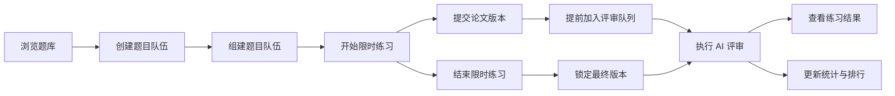

## 用例分析结论

> 创建日期：2026-07-25
> 最后更新：2026-08-23

本文档是基于当前系统需求得出的用例结论，作为后续模块边界、接口与数据设计的输入。

---

### 参与者

| 参与者 | 说明 |
|----------|------|
| 普通用户 | 注册登录、浏览题目、组建队伍、限时练习、提交论文、查看评审与统计 |
| 队长 | 继承普通用户能力，负责招募、成员职责分配和开始练习 |
| 管理员 | 访问管理端，管理基础数据和系统运行数据 |
| AI 系统 | 支持 AI 客服并执行版本化评审工作流 |
| 支付能力 | 完成充值并为用户增加评审特权次数 |
| 定时触发器 | 在队伍练习截止时触发结束处理 |

### 用例清单

| 编号 | 用例名称 | 简述 |
|------|----------|------|
| UC-01 | 注册账号 | 用户注册账号以获得系统访问身份 |
| UC-02 | 登录系统 | 用户登录并获得认证凭证 |
| UC-03 | 浏览题库 | 筛选题目、查看详情或随机获取题目 |
| UC-04 | 创建题目队伍 | 用户在具体题目下创建队伍并成为固定队长 |
| UC-05 | 组建题目队伍 | 队长发布招募、处理成员关系并分配职责 |
| UC-06 | 开始限时练习 | 队长在三类职责全部覆盖后启动题目倒计时 |
| UC-07 | 提交论文版本 | 队伍在练习时限内多次提交 PDF 论文并保留版本 |
| UC-08 | 结束限时练习 | 截止时关闭提交通道并锁定最后成功提交版本 |
| UC-09 | 兑换评审特权 | 用户通过充值获得可消耗的评审特权次数 |
| UC-10 | 提前加入评审队列 | 用户消耗特权次数，将已提交作品立即加入评审队列 |
| UC-11 | 执行 AI 评审 | 系统根据任务绑定的评审工作流版本异步执行评审 |
| UC-12 | 查看练习结果 | 队伍成员查看提交历史、评审状态和共享的评审结果 |
| UC-13 | 查看统计与排行 | 用户查看个人练习统计和题目排行结果 |
| UC-14 | AI 客服对话 | 用户获取题目推荐并询问数学建模问题 |
| UC-15 | 管理系统 | 管理员维护基础数据并查看系统运行数据 |

### 核心触发关系

### 关键需求约束

- 队伍必须绑定题目，绑定后不能更换。
- 队长不能变更，队伍最多三人。
- 开始练习前，三类职责必须全部有人承担。
- 队伍在题目规定时限内可以多次提交，历史版本全部保留。
- 评审结果对本次练习队伍成员共享。
- AI 评审按完整工作流版本演进，不将评审版本等同于 Prompt 版本。
- 加入评审队列不代表立即开始或完成评审。
- 历史队伍、提交版本与评审结果必须保留。
