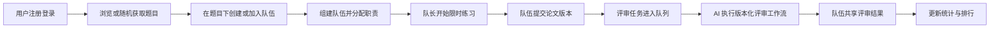

## 系统需求

> 创建日期：2026-07-23
> 最后更新：2026-08-23

---

### 项目定位

LeetModel 是面向数学建模学习者的在线实训平台，核心链路为题目浏览、限时组队练习、论文提交、AI 评审与排行。

平台收录公开数学建模赛事的题目，也允许 LeetModel 发布自有题目。赛事只是题目的强制归属与题库分类，平台不模拟真实比赛的报名、赛程和参赛流程。所有已公开题目都用于练习。

当前只考虑国赛、美赛和 LeetModel 三类题目来源，不收录校内等小范围赛事。

本阶段只定义需求要实现什么，不确定设计模式、存储结构或具体工作流编排方案。

### 业务主流程

### 功能需求

#### 注册与登录

用户注册账号并登录系统。系统区分普通用户与管理员，管理员账号由系统预设，普通用户不能自行注册为管理员。

#### 赛事与题库

每个题目必须归属一个赛事。赛事用于组织不同年份的题库，不承载用户报名、赛程状态或参赛管理。赛事不设即将开始、进行中和已结束等状态，系统不建设赛事专栏。

#### 题目浏览

用户可以浏览题目列表、查看题目详情、组合筛选题目与随机获取一道题目。

题目的分类和筛选维度包括年份、所属赛事、题面语言、难度、背景领域、题目类型、涉及的模型与算法、历史评审分数区间。

题面语言表示中文或英文。题目不维护编程语言，也不限制队伍使用的编程语言。

每个题目拥有独立的允许完成时长。该时长与题目绑定，不从所属赛事继承。

题目需要展示参与队伍数、提交数、平均分、最高分、收藏数、推荐数、创建时间和更新时间。系统不提供讨论功能，因此不维护讨论数。

#### 题目队伍

队伍必须在具体题目下创建，并永久绑定该题目。队伍创建后不能更换题目，只能提交所绑定题目的论文。

用户可以多次练习同一题目，也可以在不同练习中重新创建队伍。但在同一题目下，用户同一时间只能存在一个尚未结束的队伍关系。历史参与记录必须保留。

队伍最多三人。创建者默认为队长，队长不能变更，并拥有队伍最高管理权限。

#### 队伍组建

队伍创建后先进入组建阶段。队长可以发布招募，每次招募明确需要的人数和职责。一次招募可以选择多个职责。

队伍职责包括建模手、编程手和论文手。每个成员可以承担多个职责。成员刚加入队伍时可以不分配职责，职责由队长管理。

#### 限时练习

队长可以在组建阶段决定开始完成题目，不要求队伍满员。开始前必须完成职责分配，建模手、编程手和论文手三类职责都必须至少有一名成员承担。同一成员可以覆盖多个职责，因此队长一人也可以开始练习。

队长开始练习后，系统按题目规定时长开始倒计时。倒计时结束后关闭提交通道，并以截止前最后一个成功提交的版本作为本次练习的最终版本。

#### 论文提交

队伍在练习时限内可以多次提交同一题目的 PDF 论文。每次成功提交都形成独立且可追溯的版本，历史版本不被新版本覆盖。

每次题目练习需要维护对应的提交记录、提交版本和评审结果。评审结果向本次练习队伍的成员共享。

#### AI 评审

AI 评审通过异步任务执行。评审任务进入队列只表示已等待处理，不表示立即开始或立即完成。系统可以向用户展示预计完成时间。

AI 评审功能按评审工作流版本演进。一个评审版本代表一套完整的评审能力，可以包含多个评审步骤、分支、汇总与失败处理。评审版本不等同于 Prompt 版本。

评审任务必须明确关联实际使用的评审工作流版本。新版本上线后，历史评审结果仍然需要保留并能够识别其对应的评审版本。评审结果以可扩展的 JSON 内容保存，不同评审版本可以产生不同的结果结构。

#### 评审特权

用户可以充值获得一定数量的评审特权次数。用户消耗一次特权后，可以将当前已提交作品立即加入评审队列。

立即加入队列不承诺立即完成评审，实际完成时间取决于服务端当前负载。

#### 统计与排行

系统不建设打卡或绿墙。用户侧展示完成题目数、历史最高分、平均分和参与练习次数等统计。

每个题目维护独立排行结果。排行展示队伍、评审分数和必要的评审版本信息。具体取分规则在排行榜设计中确定。

#### AI 客服

用户可以与 AI 客服进行多轮对话，获取题目推荐，并询问数学建模相关问题。该功能保持可扩展，当前不深入定义复杂工作流。

#### 管理后台

管理员账号可以进入管理端，管理题目、赛事基础数据与必要的系统运行数据。普通用户不能访问管理端。

### 范围外功能

- 真实赛事报名、赛程和参赛管理
- 赛事状态和赛事专栏
- 校内等小范围赛事题库
- 题目编程语言限制
- 打卡、绿墙和高频活跃激励
- 社区、讨论、帖子与笔记
- 在线协作编辑论文
- AI 自动生成完整论文
- 除 PDF 外的其他论文提交格式
- 复杂的 AI 客服扩展能力
