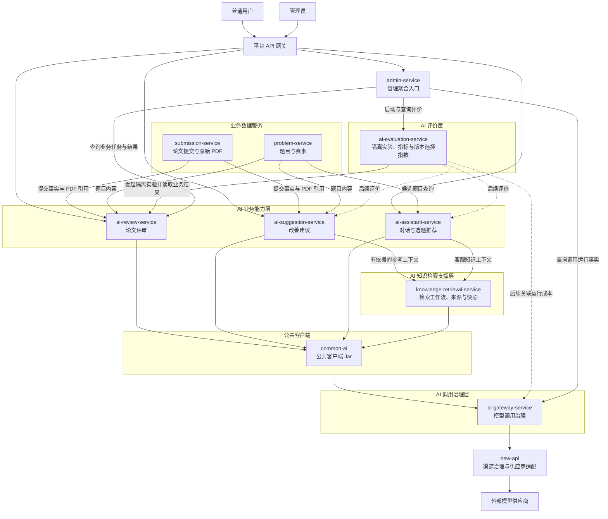

## AI 系统分层

> 设计状态：已确认系统采用分层方式梳理；各服务的详细职责边界仍需由开发者逐个讨论和确认。

LeetModel 的 AI 系统不按照模型供应商或页面数量拆分，而是按照业务事实、业务评价和模型调用治理三类不同职责分层。分层先回答每类服务为什么存在，具体服务内部的工作流、调度、数据模型和接口在对应服务设计中继续细化。

### AI 业务能力层

AI 业务能力层直接产生用户能够理解和使用的业务结果。

| 服务 | 核心业务事实 | 初始职责定位 |
|------|--------------|--------------|
| `ai-review-service` | 某次论文提交按照指定评审版本产生的任务与评审结果 | 论文评审工作流、业务输出校验、结果和任务生命周期 |
| `ai-suggestion-service` | 针对某次论文提交产生的改善建议任务与结果 | 论文改善建议工作流、建议定位、结果和任务生命周期 |
| `ai-assistant-service` | 用户与 AI 助手之间的会话、消息和推荐解释 | 多轮对话、意图理解、工具调用和选题推荐 |

这一层拥有业务 Prompt、业务工作流、业务输出契约和业务结果。它不直接适配模型供应商，也不拥有其他领域服务的主数据。

### AI 知识检索支撑层

`knowledge-retrieval-service` 已在 S12 建立独立运行模块，为论文建议及后续新工作流提供版本化、可追溯的参考上下文。它拥有检索工作流、受控知识清单、来源适用性校验和检索运行快照契约，但不生成最终客服回答、评分或修改建议。

当前向量 RAG V1 的索引构建与历史客服执行仍实现在 ai-assistant-service 内；独立服务已实现兼容的向量查询、受控目录选文和混合查询。后续客服迁移必须发布新工作流，不改变历史版本算法语义。

### AI 评价层

`ai-evaluation-service` 负责评价 AI 业务能力及其版本，而不代替业务服务生成用户结果。当前实现范围只有论文评审重复运行稳定性；目标平台还管理具备标准答案或人工标注证据的质量指标、资源指标的评价引用、归一化口径、权重方案和版本选择指数。

它组织固定样本、隔离实验、重复运行和确定性统计，使用评分方差、标准差和波动范围评价输出稳定性。没有标准答案或人工标注时，它不调用另一个 AI 对日志或结果作自由判断来冒充质量真值。被评价服务仍负责执行自己的业务工作流并解释原始结果；评价结果不能覆盖原始业务结果。加权结果只称为特定评价目标下的“版本选择指数”，不能解释为准确率或客观质量。

### AI 调用治理层

`ai-gateway-service` 是所有业务服务访问外部 AI 基础设施的唯一内部出口。目标链路由它统一调用 new-api，再由 new-api 访问模型供应商。

它负责内部契约、业务调用上下文、逻辑模型绑定、能力校验、业务优先级调度、统一错误、Token 与费用快照以及单次业务调用追踪。new-api 负责供应商协议、供应商密钥、渠道模型映射、渠道选择、渠道级重试、额度、扣费和渠道健康。`ai-gateway-service` 不复制这些渠道治理能力，也不理解论文评审、改善建议、助手问答或稳定性实验的完整业务流程。

### 公共客户端与管理入口

项目确认保留 `common-ai`。它是公共客户端 Jar，不是微服务，向业务服务提供供应商无关的 AI 调用契约、AI 网关客户端、异常转换和测试支持，不拥有业务数据、Prompt、路由或密钥。

`common-ai` 在业务服务进程内执行，负责把 Java 方法调用转换为对 AI 网关的统一 HTTP 请求；ai-gateway-service 独立运行，负责处理该请求并访问 new-api。因此调用链是“业务服务 → common-ai 客户端 → ai-gateway-service → new-api → 模型供应商”，各层职责不同。

`admin-service` 是管理端入口和跨服务聚合层，不属于 AI 能力执行层。它可以发起管理操作并聚合展示业务结果、稳定性统计和资源指标，但不直接访问各服务数据库，也不代替数据所有者执行领域规则。

跨层版本引用统一遵守 [AI版本标识.md](AI版本标识.md)。REST API、业务工作流、Prompt、模型执行配置和 RAG 索引各有独立所有者与不可变范围，不能用 `/v1`、`/v2` 或一个含糊的 `version` 字段互相代替。

### 交互流程示意

实线表示已经明确需要的目标协作方向，不等于相应服务已实现；虚线表示尚未进入实现的成本关联或其他 AI 功能稳定性实验方向。该图只表达服务交互和数据方向，不代表已经确定使用同步调用、消息队列或其他具体调度技术。

### 边界判断原则

后续逐个梳理服务时，使用以下问题判断职责归属：

1. 哪个服务能够解释这条数据的业务含义。
2. 哪个服务负责驱动这条数据的状态变化。
3. 更换模型供应商后，这项规则是否仍然存在。
4. 当前服务是否正在复制其他服务的业务事实或业务规则。

前两个问题用于确定业务和数据所有者；第三个问题用于区分业务能力与模型调用治理；第四个问题用于发现跨服务越界。

### 当前实现边界

- ai-gateway-service 和 ai-review-service 已有后端运行模块，后端模块名、artifactId 和 Spring 服务名均已统一为 `ai-review-service`。
- ai-evaluation-service、ai-assistant-service 和 ai-suggestion-service 已建立 MVP Maven 运行模块和各自数据库。当前稳定性评价只覆盖 AI 评审版本；现有评价实现仍需从极差和综合得分口径调整为方差与标准差口径。建议与客服不规划 AI 二次评价。
- knowledge-retrieval-service 已有 Maven 模块、内部检索接口和三个版本化执行分支；当前不建自有数据库，建议任务保存检索标识与引用快照。客服 RAG V1 仍在 ai-assistant-service 内运行，索引构建生命周期也尚未迁移。
- common-ai 已实现为公共 Maven Jar，不是独立运行服务；项目已确认保留该模块，用于统一 AI 网关契约和客户端调用。
- new-api 已作为独立 Docker 基础设施部署并承载默认 Chat 链路；`ai-gateway-service` 只保留 NewApiAdapter，旧供应商官方接口直连已删除。
- 当前代码未实现旧设计声称的本地并发保护。LeetModel 业务优先级、公平调度和背压由后续 S5 系列任务负责；供应商渠道限流和健康由 new-api 负责。
- 本文只确认分层框架。各服务 README 中的职责边界是后续逐个梳理的起点，不代表全部细节已经确认。
