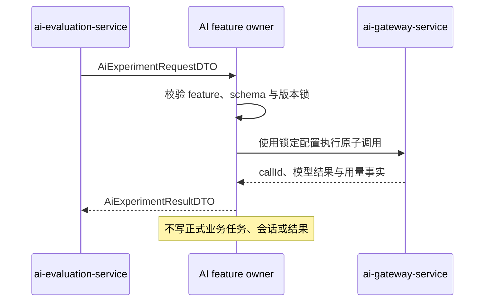

# AI 隔离实验契约

## 目标与边界

评价平台通过统一契约请求 AI 业务 owner 重复执行一个样本。owner 仍拥有工作流、输入校验和输出语义；评价平台不复制业务编排。隔离实验只能产生实验结果和 AI 调用审计，不得创建或覆盖正式评审任务、客服会话/消息、论文改善建议或其他用户业务事实。

## 请求

`AiExperimentRequestDTO` 包含：

| 字段 | 规则 |
|---|---|
| `experimentRunId` | 评价平台生成的全局稳定运行槽位标识；owner 用它保证重复投递幂等 |
| `featureCode` | 必须与接收请求的 owner 功能一致 |
| `sample` | `sampleType + schemaVersion + payloadJson`；owner 按版本化 schema 解析 |
| `workflowVersion` | 创建运行时锁定且必须处于可执行状态 |
| `modelExecutionConfigVersion` | 必填；同一运行槽位所有尝试保持一致 |
| `ragIndexVersion` | 仅使用 RAG 的版本必填；无 RAG 显式为空 |
| `priority` | 评价平台当前只声明 `P3`；AI 网关仍按可信来源重算有效优先级 |

首批样本类型：

- REVIEW 使用 `SUBMISSION_REFERENCE / REVIEW_SUBMISSION_V1`，Payload 只引用 `submissionId`，不复制 PDF。
- ASSISTANT 使用 `QUESTION / ASSISTANT_QUESTION_V1`，Payload 保存问题文本和后续可选标签/标准要点，不引用正式会话。

请求不得包含本地绝对路径、供应商密钥、正式任务标识或让 owner 覆盖正式数据的开关。

## 结果

`AiExperimentResultDTO` 回显运行、功能和三类适用版本锁，并统一返回：

- `status`：`SUCCEEDED` 或 `FAILED`；失败不得伪造空成功。
- `failureType`：成功为空；失败按 `DEPENDENCY`、`CONFIGURATION`、`OUTPUT`、`TIMEOUT`、`UNKNOWN` 分类。
- `outputSchema + outputJson`：owner 的版本化业务输出。
- `metricSchema + metricsJson`：本次运行可直接观察的原始指标；不在 owner 内合成评价结论。
- `modelName`、`aiCallId`、`durationMs`：运行追踪摘要。
- `errorMessage`：脱敏、定长、面向运维的错误说明。

评价平台以 `experimentRunId` 标识逻辑槽位，以自身 attempt 记录传输或环境重试。相同槽位重试不得改变样本、工作流、模型执行配置或 RAG 索引；配置需要变化时必须创建新的运行槽位。

## 兼容迁移

现有 `ReviewExperimentRequestDTO/ReviewExperimentResultDTO` 是 REVIEW 专用兼容接口。S6-05 使用通用 DTO 包装同一瞬态评审工作流并保留旧接口；旧接口的终点是所有调用方迁移到通用入口后删除，不作为第二套长期契约。ASSISTANT 由 S6-06 直接实现通用入口。
