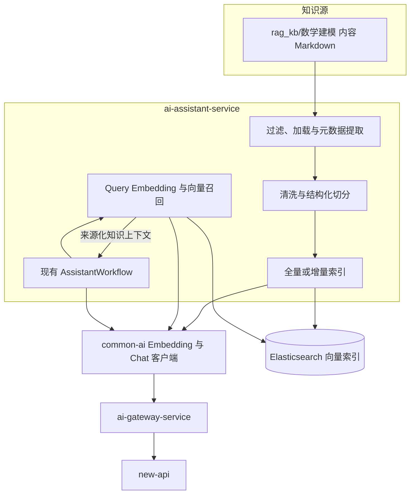
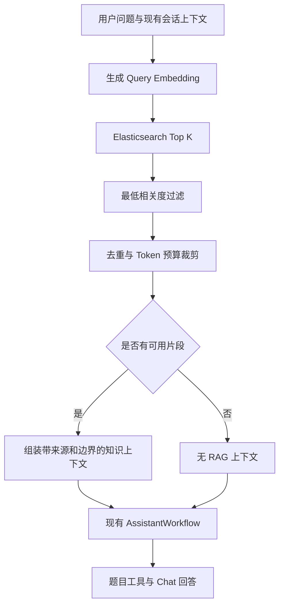

# RAG 知识库

> 实现状态：S4 已完成 RAG V1 的受控知识加载、统一 Embedding、Elasticsearch 索引、基础向量检索、客服接入、版本审计和安全降级。AI 目录导航仍定义为 RAG V2，仅保留设计。

## 设计目标

第一版 RAG 为 `ai-assistant-service` 的客服回答提供数学建模知识上下文。它使用 LangChain4j 组织文档加载、切分、Embedding 和召回，使用 Elasticsearch 保存正式向量索引，并通过统一 AI 调用链获取 Embedding。

RAG 不替代助手的会话、历史上下文、题目工具和回答工作流。检索命中只作为受边界约束的参考上下文；检索失败时继续现有无 RAG 回答，Chat 失败仍返回现有失败回复。


## 版本定义

| 名称 | 定义 | 当前状态 |
|------|------|----------|
| RAG V1 | Query Embedding 加 Elasticsearch Top K 向量召回、阈值过滤和 Token 预算裁剪 | 已实现 |
| RAG V2 | AI 读取目录与元数据，自主选择受控文档，可与向量召回组合 | 仅保留设计，S9 评估 |

V1 和 V2 表示检索工作流，不是 REST API 版本、Prompt 版本或索引版本。具体索引使用独立的 `ragIndexVersion` 标识。


## 服务归属

RAG V1 归 `ai-assistant-service`。该服务拥有客服回答流程，能够决定何时检索、怎样注入上下文、何时降级并解释最终回答。`common-ai` 只提供 Chat 与 Embedding 客户端契约；`ai-gateway-service` 只治理单次模型调用；两者都不拥有知识检索业务。

`ai-review-service` 不读取此知识库，也不是第一版 RAG 所有者。论文评审是否使用知识检索必须在出现真实需求后另建任务，不能复用客服 RAG 时越过服务边界。


## 整体架构



正式环境使用 Elasticsearch；自动化单元测试可以使用确定性假 Embedding 和内存 Store。内存 Store 不是生产降级方案。


## 知识源边界

V1 只索引 `rag_kb/数学建模/` 下整理后的内容 Markdown。当前确定性清单为 73 个内容 Markdown；各级 README 只用于人工导航，不进入向量索引。

明确排除：

- `rag_kb/.kb/` 和 `rag_kb/.claude/` 中的行为与维护规范。
- `rag_kb/CONTEXT.md` 和所有层级 README。
- `rag_kb/data/` 中 337 个原始抓取 Markdown。
- `rag_kb/数模评审参考资料/` 中约 88 MiB PDF 原始材料。
- `rag_kb/scripts/`、`.git/`、项目 `docs/`、`data/` 和 `legacy/`。
- 未显式列入的新增顶层目录。

过滤规则必须生成确定性文件清单。新增目录不会因位于 `rag_kb/` 下就自动进入索引，防止原始材料、规范和敏感内容被意外向量化。


## 索引流程

```text
受控 Markdown 清单
→ 提取相对路径、标题、YAML 元数据和内容哈希
→ 清洗 Markdown 结构
→ 按标题与段落优先、长度兜底的中文切分
→ common-ai Embedding
→ Elasticsearch 物理索引
→ 全部成功后原子切换读别名
```

每个片段至少保存相对来源路径、标题、内容版本、Embedding 模型版本、切分策略版本和 `ragIndexVersion`。稳定文档 ID 与片段 ID 保证重复索引幂等；增量索引按内容哈希处理新增、修改和删除。

全量构建失败时不得切换读别名。旧索引继续服务，失败文档和片段数量进入不含正文的日志。正式索引不提供默认破坏性清理命令。


## 问答流程



V1 不做查询改写、多路召回、关键词混合检索、Rerank 或由 AI 自主选择文件。知识片段必须以不可信参考资料的边界注入，不能覆盖系统行为、授权规则或题目工具返回的业务事实。


## 降级边界

| 场景 | 行为 |
|------|------|
| RAG 关闭 | 完全保持现有客服行为 |
| Query Embedding 失败 | 记录错误类型与耗时，继续无 RAG Chat |
| Elasticsearch 超时或不可用 | 记录索引版本和错误，继续无 RAG Chat |
| 无命中或低于阈值 | 正常使用无 RAG Chat，不记系统故障 |
| 单个知识文件解析失败 | 索引任务汇总失败，不静默写入污染片段 |
| Chat 调用失败 | 沿用现有客服失败回复和重试语义 |

日志只记录错误类型、耗时、索引版本、文档数和召回数，不记录用户问题、知识正文、Prompt、回答或向量。


## 版本与追踪

这些字段遵守 [AI版本标识.md](AI版本标识.md)。其中 RAG V1/V2 只表示架构代际，不能写入 `ragIndexVersion` 充当某次索引快照。

- `contentVersion` 表示源文档内容哈希。
- `embeddingModelVersion` 表示生成向量的模型绑定版本。
- `chunkPolicyVersion` 表示清洗与切分规则版本。
- `ragIndexVersion` 唯一标识一套可查询索引快照。

客服 Chat 调用上下文保存实际使用的 `ragIndexVersion`。索引版本变化只影响后续检索，不修改历史消息或历史调用事实。


## 知识维护与运行索引

`rag_kb/.kb/` 保存人工整理、目录导航和笔记维护规则。这些规则仍指导知识内容生产，但不等同于在线 RAG V1 算法。`rag_kb/CONTEXT.md` 是 Agent 进入该目录时的稳定入口，并明确人工维护、V1 索引和 V2 导航之间的区别。

知识内容由 Git 管理，V1 不建设在线上传、发布或回滚页面。索引是可重建的派生数据，不是知识内容的事实源。


## 运行与运维

### 基础设施和配置

本地 Elasticsearch 固定为 `8.14.3`，由根后端编排文件启动：

```bash
cd LeetModel-backend
docker compose up -d elasticsearch
curl -fsS 'http://127.0.0.1:9200/_cluster/health?wait_for_status=yellow'
```

运行参数集中在 `ai-assistant-service/src/main/resources/application.yml`。正式启用至少核对以下环境变量：

| 环境变量 | 默认值 | 说明 |
|----------|--------|------|
| `ASSISTANT_RAG_ENABLED` | `false` | 读别名可用后才改为 `true` |
| `ASSISTANT_RAG_KB_PATH` | `../rag_kb` | 知识库根目录 |
| `ASSISTANT_RAG_INDEX_ALIAS` | `leetmodel-rag-v1-read` | 稳定读别名 |
| `ASSISTANT_RAG_ELASTICSEARCH_URI` | `http://127.0.0.1:9200` | Elasticsearch 地址 |
| `ASSISTANT_RAG_EMBEDDING_MODEL_VERSION` | `qwen3.7-text-embedding@1024` | 不可静默修改的模型版本 |
| `ASSISTANT_RAG_EMBEDDING_DIMENSION` | `1024` | 必须与模型和索引 mapping 一致 |
| `ASSISTANT_RAG_INDEX_COMMAND` | `NONE` | 单次启动任务：`FULL`、`INCREMENTAL` 或 `NONE` |

assistant 不持有 new-api Relay Token；索引和查询都要求 `ai-gateway-service` 已启动并能访问 new-api。共享或生产环境还必须启用 Elasticsearch 认证与网络隔离，不能照搬本地关闭安全插件的配置。

### 从空 Elasticsearch 建立索引

1. 启动 Elasticsearch、new-api 和 `ai-gateway-service`，确认逻辑模型 `RAG_V1` 固定绑定 `qwen3.7-text-embedding`，维度为 1024。
2. 在项目后端目录启动一次 assistant 索引任务：

```bash
cd LeetModel-backend
ASSISTANT_RAG_INDEX_COMMAND=FULL \
ASSISTANT_RAG_ENABLED=false \
mvn -pl ai-assistant-service spring-boot:run
```

3. 等待安全摘要日志出现 `rag-index failures=0`，记录其中的 `version`；停止该索引进程。若失败数非零，读别名不会切换，应先排查原因再重跑。
4. 核对稳定别名已指向新物理索引，然后以 `ASSISTANT_RAG_INDEX_COMMAND=NONE`、`ASSISTANT_RAG_ENABLED=true` 正常启动服务：

```bash
curl -fsS 'http://127.0.0.1:9200/_alias/leetmodel-rag-v1-read'
```

知识内容发生新增、修改或删除时可把命令改为 `INCREMENTAL`。增量任务使用稳定 ID 幂等更新，并处理源文件删除；中断后重跑会收敛到同一版本。Embedding 模型版本、维度或切分策略变化时必须执行 `FULL`，不能在旧索引上增量混用。

### 回滚

知识内容以 Git 版本为事实源。回滚内容后重新执行全量索引是首选路径。需要立即恢复上一套已验证索引时，只原子切换读别名，不删除当前或历史物理索引：

```bash
curl -fsS -X POST 'http://127.0.0.1:9200/_aliases' \
  -H 'Content-Type: application/json' \
  -d '{"actions":[{"remove":{"index":"CURRENT_VERIFIED_INDEX","alias":"leetmodel-rag-v1-read"}},{"add":{"index":"PREVIOUS_VERIFIED_INDEX","alias":"leetmodel-rag-v1-read"}}]}'
```

执行前必须先用 `/_alias/leetmodel-rag-v1-read` 核对当前目标，并把两个占位符替换成明确的、已验证的物理索引名。正式索引没有通配符删除或自动清理命令；容量治理应另建受审核的保留策略。

### 测试与测试索引清理

默认测试使用确定性 Embedding 和内存 Store。独立 Elasticsearch 集成测试显式启用：

```bash
cd LeetModel-backend
RAG_ES_INTEGRATION=true mvn -pl ai-assistant-service test
```

真实端到端冒烟要求本地 AI 网关已安全注入仓库外 Relay Token，再执行：

```bash
RUN_RAG_E2E_SMOKE=true mvn -pl ai-assistant-service \
  -Dtest=RagNewApiEndToEndSmokeTest test
```

冒烟只创建并自动清理前缀为 `leetmodel-rag-s4-15-e2e-` 的独立索引。若进程被强制终止，可先用 `_cat/indices/leetmodel-rag-s4-15-e2e-*` 列出残留项，再逐个核对并按完整索引名删除；不得使用正式别名、宽泛通配符或 Elasticsearch 全库作为清理目标。

### 故障排查

| 现象 | 核对项 | 行为 |
|------|--------|------|
| `rag-index failures` 大于零 | 知识路径、解析、AI 网关、模型绑定、ES 健康 | 不切换别名；修复后幂等重跑 |
| `type=EMBEDDING` | AI 网关可达性、逻辑模型状态、维度 | 在线请求降级为无 RAG Chat |
| `type=ELASTICSEARCH` 或 `type=TIMEOUT` | ES 健康、别名、网络和超时 | 在线请求降级为无 RAG Chat |
| `type=DIMENSION` | 模型版本、1024 维配置和 mapping | 停止混用；全量重建索引 |
| `type=PARSING` | 召回文档字段和上下文组装 | 在线请求降级，并检查索引数据 |
| `assistant-chat status=FAILED` | Chat 网关或题目工具 | 保留现有失败回复与显式重试 |

`rag-retrieval` 日志中的 `status`、`type`、`durationMs`、`ragIndexVersion` 和 `recallCount` 用于区分降级原因；日志不得增加用户问题、知识正文、Prompt、回答、向量或上游异常 message。


## 独立服务触发条件

第一版不拆独立 RAG 微服务。只有出现以下至少一项真实条件，才重新评估：

- 出现第二个真实在线消费者，并且共享检索规则能够稳定抽象。
- 需要独立扩缩容，assistant 的资源模型无法承载索引或查询负载。
- 需要在线知识上传、审核、发布、权限隔离或多租户管理。
- 知识索引生命周期需要独立部署和故障隔离。

即使触发评估，也必须先确认数据所有权和 API 边界，不能仅为了复用提前拆服务。


## RAG V2 边界

V2 继承 `rag_kb/.kb/` 已有的目录、README、文件名和 frontmatter 导航思路。完整方案见 [RAG 目录导航 V2](../03-微服务设计/ai-assistant-service/RAG目录导航V2/README.md)：轻量 manifest 只含目录、文档名、tags、summary、版本和路径白名单；模型最多选择 4 个精确成员，服务端完成路径校验、受限加载和确定性裁剪，再与 V1 向量结果组合。选择失败、目录漂移、越界或超时均保留 V1，不允许模型自由构造路径。

V2 当前已完成设计但不进入实现。只有 V1 固定基线和双人标注真值完整，并且固定配对实验同时满足答案支持、召回、精度、安全、失败率、P95 延迟、Token 与费用门槛后，才允许另立实现任务；费用缺失或人工覆盖不足均不视为通过。在线文件管理、独立 RAG 服务、任意文件访问和自动生产激活继续排除。


## 非目标

- 不为论文评审接入知识库。
- 不建立独立 RAG 服务。
- 不实现在线知识管理。
- 不索引原始抓取数据和 PDF。
- 不实现混合检索、查询改写、Rerank 或自主 Agent 读库。
- 不让业务服务直连 Embedding 供应商或 new-api。
