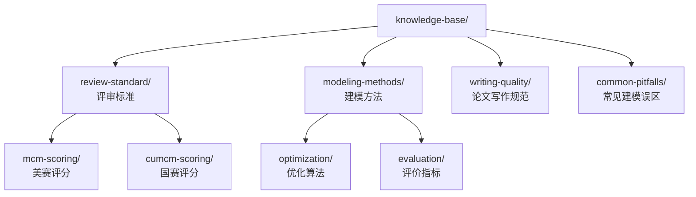
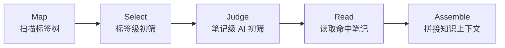

## RAG 知识库

> 创建日期：2026-08-01
> 关联任务：A-07、C-05、C-09、E-03，问题点 4-5

---

### 一、定位与目标

本体系是一套基于原子笔记与标签的自定义 RAG 知识库，核心思路：

- 知识以原子笔记形式存放，一篇笔记聚焦一个知识点
- 文件夹即标签，通过目录结构完成知识分类
- 检索不依赖向量数据库，通过标签结构初筛候选笔记，再由低成本 AI 调用判断相关性，最终拼接出临时的知识上下文供任务消费

体系本身是通用的，理论上可容纳任何领域的知识。本项目的首个落地场景是论文评审的参考资料检索：评审工作流在检索增强步骤中，携带评审任务的场景描述调用本体系，获得评审标准、评分细则、建模方法等参考内容。

> 本项目的 `docs/` 文档体系与 Context Explorer 五阶段管道，就是这套思路在 AI 协作场景下的既有实践。本设计将同一套机制产品化为评审服务可调用的检索能力。


#### 设计原则

- 冷启动友好：知识库内容为空时体系可正常运行，检索返回空上下文并降级，不阻塞主流程
- 零额外基础设施：V1 不引入向量数据库与 Embedding 管道，只依赖文件系统与已有的 LLM 调用能力
- 索引不是权威：一切以目录实际内容为准，任何索引与缓存只做辅助定位

---

### 二、知识库结构设计


#### 2.1 目录即标签

知识库以独立目录形式存放于仓库根目录 `knowledge-base/` 下，随 git 版本控制。每一层文件夹的名字就是一个标签，父子目录构成标签的层级关系，嵌套不超过 3 层。



每个目录维护一份 `README.md`，说明本层标签的含义与收录范围，并给出本层笔记的清单索引。索引仅用于人工浏览与辅助定位，检索管道以目录实时扫描结果为准。

运行时加载：知识库根路径走配置项，不硬编码、不打进 jar 包。V1 部署时以挂载卷或本地路径方式提供给评审相关服务，路径不存在视同空库走降级分支并告警。


#### 2.2 原子笔记格式

一篇笔记一个文件，聚焦一个知识点，正文控制在千字以内。文首固定元数据区，供检索管道低成本读取：

```markdown
## 拟合优度的评价方法

> 次标签：review-standard
> 摘要：R 方与调整 R 方的适用边界，过拟合场景下的误判风险
> 来源：某教材第 x 章
> 权威度：A
> 版本：v1

正文内容……
```

元数据字段说明：

| 字段 | 取值 | 用途 |
|------|------|------|
| 次标签 | 其他相关标签，可空 | 跨域笔记参与其他标签分支的初筛 |
| 摘要 | 一句话 | 初筛阶段的判断依据，必填 |
| 来源 | 出处描述 | 引用可信度追溯 |
| 权威度 | S / A / B | S 官方标准、A 权威教材、B 经验总结，拼接上下文时高权威度优先 |
| 版本 | v1 起递增 | 常规修订递增版本号 |
| 状态 | active / deprecated | deprecated 笔记初筛阶段直接跳过 |

> 主标签不写入元数据区，由笔记的物理路径实时推导，杜绝移动笔记后字段与位置漂移。管道一律以路径为准。


#### 2.3 版本与废弃管理

- 常规修订：直接修改笔记并递增版本号字段，正文历史由 git 追溯
- 语义推翻：不删除旧笔记，将其状态改为 deprecated，另建新笔记。废弃笔记保留探索过程，检索时零成本跳过
- 检索产物中携带笔记版本号，评审结果可追溯当时引用的知识版本

---

### 三、检索管道设计

检索管道分五个阶段，与 Context Explorer 管道同构，前两个阶段完成初筛，后三个阶段完成内容提取与拼接：




#### 3.1 Map：扫描标签树

实时扫描 `knowledge-base/` 目录，得到标签树与每篇笔记的元数据区。只读文件头部元数据，不读正文。deprecated 状态的笔记在此阶段过滤。


#### 3.2 Select：标签级初筛

将任务的场景描述与标签树交给低成本模型，选出相关的标签分支。调用方可以显式传入场景标签直接命中分支，跳过本阶段的 AI 调用。

两级初筛的意义：先按标签收窄范围，再对分支内笔记逐篇判断，避免一次性把全库笔记摘要塞进单次调用。


#### 3.3 Judge：笔记级 AI 初筛

对选中分支下的候选笔记，将任务描述与笔记的标题加摘要成批交给低成本模型打分。契约：

- 输入：任务描述、候选笔记清单，清单项含路径、标题、摘要、权威度
- 输出：JSON 数组，每篇笔记给出 0 到 3 的相关性分与一句话理由
- 模型档位：低成本快速档，温度 0，模型名走配置不硬编码
- 单批笔记数量设上限，超出拆批并行

得分达到阈值的笔记进入下一阶段，按分数与权威度排序。


#### 3.4 Read：读取命中笔记

读取命中笔记的完整正文。原子笔记本身就是天然的语义切分单元，整篇纳入，不做检索时切分。


#### 3.5 Assemble：拼接知识上下文

按排序将笔记正文拼接为临时知识上下文，每段内容携带来源标注，含笔记路径、标题、版本、权威度。拼接受 token 预算约束，超出预算时按相关性分数从低到高截断，并在产物中标记发生过截断。

知识上下文是一次性产物，随任务消费后丢弃，不落库。评审场景下评审结果中仅保留引用的笔记路径与版本清单。

---

### 四、API 契约

检索能力具有评审业务语义，由 ai-review 服务承载。`common-ai` 只提供 AI 网关客户端，不实现 RAG。检索管道需要模型判断时，通过 `common-ai` 调用 AI 网关。

> 接口为自定义抽象，不套用 LangChain4j 的 ContentRetriever 体系，理由见决策记录 9。检索判断通过 AI 网关调用模型，供应商适配由 AI 网关使用 LangChain4j 完成。


#### 4.1 Java 能力接口

```java
public interface KnowledgeRetriever {

    /**
     * Retrieve task-relevant knowledge context from the knowledge base.
     */
    KnowledgeContext retrieve(RetrievalRequest request);
}
```

| 契约对象 | 字段 | 说明 |
|---------|------|------|
| RetrievalRequest | query | 任务场景描述，必填 |
| | sceneTags | 显式场景标签，可空，非空时跳过标签级初筛 |
| | tokenBudget | 知识上下文的 token 预算上限 |
| | minScore | 相关性分阈值，默认 2 |
| KnowledgeContext | fragments | 命中笔记内容列表，含路径、标题、版本、权威度、相关性分 |
| | degradeReason | 降级原因枚举：NONE、EMPTY、JUDGE_FALLBACK、TRUNCATED |
| | totalTokens | 拼接产物的实际 token 量 |

> 降级原因区分「无内容」与「有内容但降质」两类语义：EMPTY 表示空库或无命中，消费方应走无 RAG 分支；JUDGE_FALLBACK 表示 AI 初筛失败降级为规则初筛，内容可用但相关性未经语义判断；TRUNCATED 表示因 token 预算截断，内容可用。后两者不应触发无 RAG 分支。


#### 4.2 内部接口预留

| 方法 | 路径 | 说明 |
|------|------|------|
| POST | /internal/rag/retrieve | 按任务描述检索知识上下文，仅在其他服务出现真实复用需求后开放 |

知识库的增删改不提供接口，V1 通过直接编辑 `knowledge-base/` 目录完成，git 即审计日志。review 是当前知识库所有者，其他服务不能直接读取其挂载目录。

---

### 五、兜底与降级

| 场景 | 兜底策略 | 降级标记 |
|------|---------|---------|
| 知识库为空或无命中 | 返回空上下文，评审流程走无 RAG 分支，对应评审工作流中预留的特性开关 | EMPTY |
| 知识库根路径不存在 | 视同空库返回空上下文，同时日志告警，防止部署环境漏挂目录后静默失效 | EMPTY |
| AI 初筛调用失败 | 降级为规则初筛：按显式场景标签直接选取分支下全部 active 笔记的前 K 篇，仍失败则返回空上下文 | JUDGE_FALLBACK |
| 初筛结果超 token 预算 | 按相关性分数截断，内容仍可用 | TRUNCATED |
| 索引与实际内容不一致 | 检索全程以目录实时扫描为准，README 索引不参与管道 | 无 |
| 笔记元数据缺失 | 摘要缺失的笔记跳过初筛并在日志告警，不让脏数据污染判断 | 无 |

---

### 六、成本与演进路线


#### 6.1 V1 成本估算

以百篇规模估算：单次检索的 AI 初筛输入为标签树加数十篇摘要，约数千到两万 token，走低成本模型档位，单次检索成本在厘级。评审任务本身的 LLM 成本远高于此，初筛开销可忽略。

延迟量级：Select 与 Judge 是两次串行 LLM 调用，单次检索延迟预计在秒级，明显高于向量检索的毫秒级。消费场景是异步评审工作流，整体评审耗时以分钟计，秒级检索延迟不敏感。若未来出现同步低延迟的检索场景，延迟即触发 6.2 的演进条件。

检索质量验证：不引入独立的评估基础设施。评审产物保留引用笔记清单，人工抽查命中相关性，badcase 沉淀到 `docs/troubleshooting/`，作为 V2 演进判断的输入之一。


#### 6.2 V2 演进：ES 混合检索

Elasticsearch 8.x 可以提供全文加向量混合检索。当出现以下任一信号时，将初筛层替换为 ES 混合检索，管道其余阶段不变：

- 笔记规模超过约 500 篇，标签级初筛的分支候选集过大
- 初筛延迟或成本不可接受
- 出现跨标签的模糊语义查询需求，标签结构无法有效收窄

演进时原子笔记即索引文档，元数据区字段直接映射为 ES 字段，摘要与正文做 Embedding。写作时切分的原则不变，无需引入检索时切分。

---

### 七、决策记录

| # | 决策 | 备选方案 | 结论与原因 |
|----|------|---------|-----------|
| 1 | 文件夹即标签 | 数据库标签表、笔记内纯标签字段 | 采纳。文件系统天然表达分类与层级，git 免费提供版本控制，AI 与人都能直接浏览，零基础设施。既有决策「能字段化就不标签化」针对业务表查询效率，知识库是开放式增长的内容域，标签是内容组织手段而非查询字段，不冲突 |
| 2 | 低成本 AI 初筛 | ES 向量检索、纯关键词匹配 | 采纳。百篇规模下语义判断质量高于向量近邻，且省去 ES 部署、Embedding 管道与索引维护。冷启动期语料为空，先上向量库是过度建设。纯关键词无法处理语义相关，只作为降级手段 |
| 3 | ES 向量检索 | 作为 V1 方案 | 不采纳，保留为 V2 演进。触发条件见 6.2。此取舍是典型的性价比决策：V1 用两次低成本 LLM 调用换掉一整套向量检索基础设施 |
| 4 | 原子笔记整篇入上下文 | 检索时文档切分 | 采纳。切分前置到写作时由人完成，原子笔记就是语义完整的切分单元，省去切分策略与调参。A-07 中的切分策略问题由写作规范解决而非检索算法解决 |
| 5 | 单一主标签加次标签字段 | 软链接多处存放、多标签数据库 | 采纳。一篇笔记只有一个物理位置，跨域需求由元数据区次标签覆盖，初筛时次标签参与分支匹配。软链接跨平台不可靠，多标签库引入基础设施 |
| 6 | 修订递增版本号、推翻建新笔记标废弃 | 每版本独立文件罗列 | 采纳。常规修订由 git 追溯即可；语义推翻时保留旧笔记并标记 deprecated，既保留探索过程又不增加检索成本。每版独立文件在常规修订下产生大量冗余 |
| 7 | Rerank 精排 | 引入精排模型 | 不采纳。AI 初筛已输出相关性分数，百篇规模下二次精排收益不可见。E-03 中的 Rerank 随 V2 一并评估 |
| 8 | 知识库管理接口 | 提供增删改 API | 不采纳。V1 直接编辑目录，git 即审计。管理接口在有非开发者维护知识库的需求时再建 |
| 9 | 自定义检索接口 | 实现 LangChain4j 的 ContentRetriever 抽象 | 采纳自定义。本管道是标签初筛加 AI 判断的非向量范式，含降级枚举与权威度排序等自有语义，套用面向向量检索的抽象收益低。模型调用统一经过 AI 网关，V2 切换 ES 时再评估对齐其 RAG 抽象以复用生态组件 |
| 10 | 知识库路径走配置、挂载卷提供 | 打进 jar 资源、内置默认路径 | 采纳配置化。打进 jar 后更新知识需重新打包发布，违背知识库高频增量的特点；路径不存在视同空库降级并告警，防止容器环境漏挂目录后静默失效 |

---

### 八、面试考点

- 没有向量数据库也能做 RAG 吗：RAG 的本质是「检索增强」，检索手段可插拔。标签初筛加 LLM 相关性判断在小规模、强分类的知识域下预期不劣于向量检索，且成本结构更优，规模增长后再演进到混合检索，这是架构演进思维的展示点
- 文档切分策略的另一种答案：主流做法是入库时按固定长度或语义切分，本设计把切分前置到知识生产环节，原子笔记天然是高质量的语义 chunk，避免了机器切分撕裂上下文的经典问题
- 降级设计：检索层任何故障都不阻塞评审主流程，降级原因枚举区分「无内容」与「有内容但降质」，让消费方自主决策，与评审工作流的特性开关衔接
- 成本与延迟意识：初筛用低成本模型档位，两级初筛控制单次调用的输入规模；秒级检索延迟被异步评审场景吸收，能讲清 token 成本、延迟、向量库运维成本三方的量化取舍
