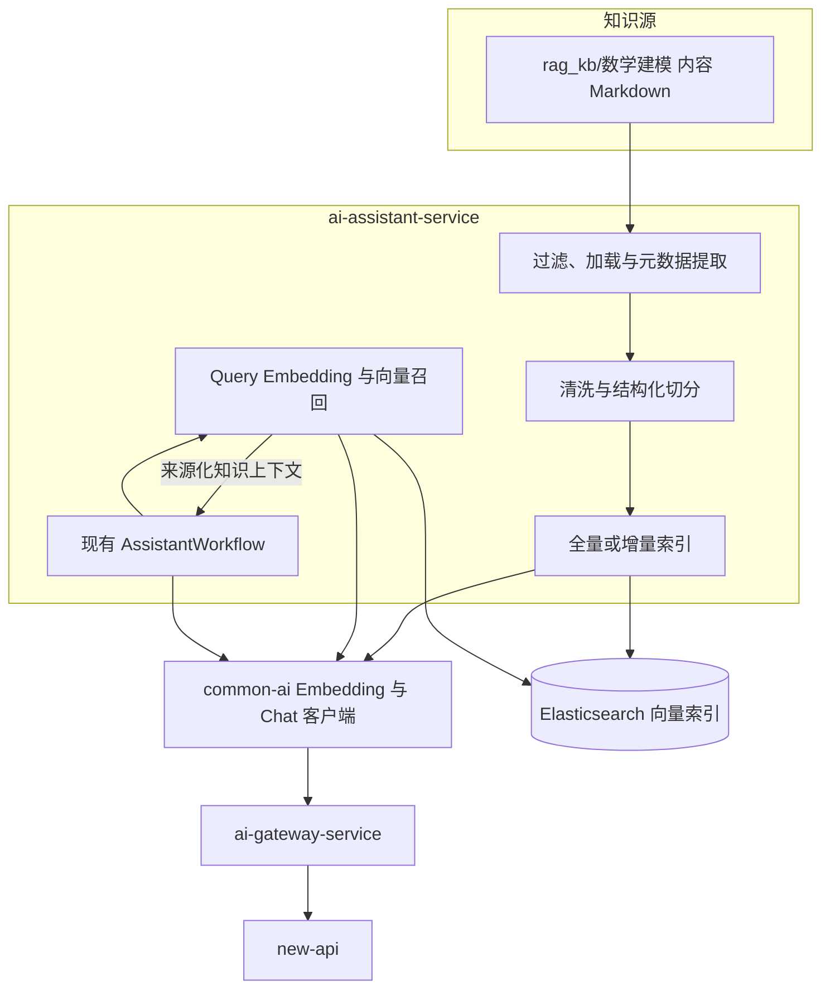
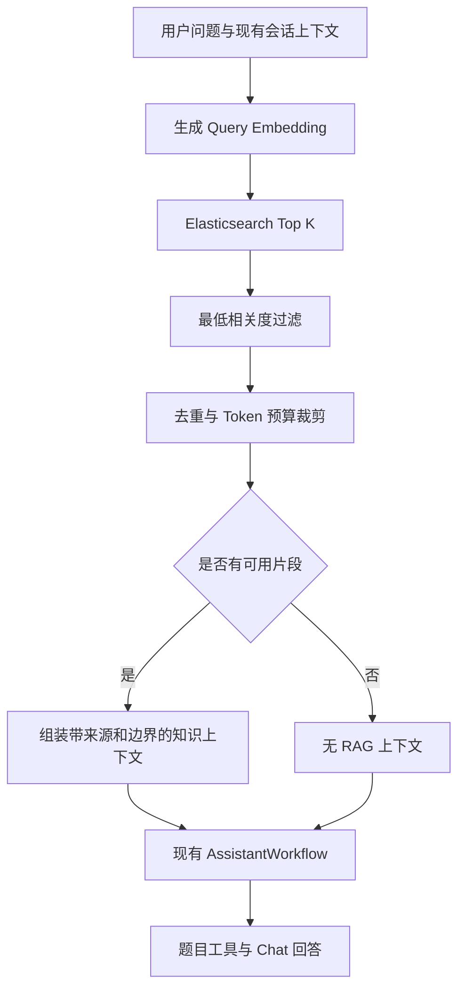

# RAG 知识库

> 设计状态：D-03 已确认正式架构。常规向量检索定义为 RAG V1，AI 目录导航定义为 RAG V2。当前尚未实现运行时检索，后续由 S0、S3 和 S4 依次完成框架核验、Embedding 调用和客服接入。

## 设计目标

第一版 RAG 为 `ai-assistant-service` 的客服回答提供数学建模知识上下文。它使用 LangChain4j 组织文档加载、切分、Embedding 和召回，使用 Elasticsearch 保存正式向量索引，并通过统一 AI 调用链获取 Embedding。

RAG 不替代助手的会话、历史上下文、题目工具和回答工作流。检索命中只作为受边界约束的参考上下文；检索失败时继续现有无 RAG 回答，Chat 失败仍返回现有失败回复。


## 版本定义

| 名称 | 定义 | 当前状态 |
|------|------|----------|
| RAG V1 | Query Embedding 加 Elasticsearch Top K 向量召回、阈值过滤和 Token 预算裁剪 | 正式目标，S4 实现 |
| RAG V2 | AI 读取目录与元数据，自主选择受控文档，可与向量召回组合 | 仅保留设计，S9 评估 |

V1 和 V2 表示检索工作流，不是 REST API 版本、Prompt 版本或索引版本。具体索引使用独立的 `ragIndexVersion` 标识。


## 服务归属

RAG V1 归 `ai-assistant-service`。该服务拥有客服回答流程，能够决定何时检索、怎样注入上下文、何时降级并解释最终回答。`common-ai` 只提供 Chat 与 Embedding 客户端契约；`ai-gateway-service` 只治理单次模型调用；两者都不拥有知识检索业务。

`ai-review-service` 不读取此知识库，也不是第一版 RAG 所有者。论文评审是否使用知识检索必须在出现真实需求后另建任务，不能复用客服 RAG 时越过服务边界。


## 整体架构



正式环境使用 Elasticsearch；自动化单元测试可以使用确定性假 Embedding 和内存 Store。内存 Store 不是生产降级方案。


## 知识源边界

V1 只索引 `rag_kb/数学建模/` 下整理后的内容 Markdown。当前目录实测有 88 个 Markdown，其中 15 个为各级 README；README 只用于人工导航，不进入向量索引。

明确排除：

- `rag_kb/.kb/` 和 `rag_kb/.claude/` 中的行为与维护规范。
- `rag_kb/CONTEXT.md` 和所有层级 README。
- `rag_kb/data/` 中 337 个原始抓取 Markdown。
- `rag_kb/数模评审参考资料/` 中约 88 MiB PDF 原始材料。
- `rag_kb/scripts/`、`.git/`、项目 `docs/`、`data/` 和 `legacy/`。
- 未显式列入的新增顶层目录。

过滤规则必须生成确定性文件清单。新增目录不会因位于 `rag_kb/` 下就自动进入索引，防止原始材料、规范和敏感内容被意外向量化。


## 索引流程

```text
受控 Markdown 清单
→ 提取相对路径、标题、YAML 元数据和内容哈希
→ 清洗 Markdown 结构
→ 按标题与段落优先、长度兜底的中文切分
→ common-ai Embedding
→ Elasticsearch 物理索引
→ 全部成功后原子切换读别名
```

每个片段至少保存相对来源路径、标题、内容版本、Embedding 模型版本、切分策略版本和 `ragIndexVersion`。稳定文档 ID 与片段 ID 保证重复索引幂等；增量索引按内容哈希处理新增、修改和删除。

全量构建失败时不得切换读别名。旧索引继续服务，失败文档和片段数量进入不含正文的日志。正式索引不提供默认破坏性清理命令。


## 问答流程



V1 不做查询改写、多路召回、关键词混合检索、Rerank 或由 AI 自主选择文件。知识片段必须以不可信参考资料的边界注入，不能覆盖系统行为、授权规则或题目工具返回的业务事实。


## 降级边界

| 场景 | 行为 |
|------|------|
| RAG 关闭 | 完全保持现有客服行为 |
| Query Embedding 失败 | 记录错误类型与耗时，继续无 RAG Chat |
| Elasticsearch 超时或不可用 | 记录索引版本和错误，继续无 RAG Chat |
| 无命中或低于阈值 | 正常使用无 RAG Chat，不记系统故障 |
| 单个知识文件解析失败 | 索引任务汇总失败，不静默写入污染片段 |
| Chat 调用失败 | 沿用现有客服失败回复和重试语义 |

日志只记录错误类型、耗时、索引版本、文档数和召回数，不记录用户问题、知识正文、Prompt、回答或向量。


## 版本与追踪

- `contentVersion` 表示源文档内容哈希。
- `embeddingModelVersion` 表示生成向量的模型绑定版本。
- `chunkPolicyVersion` 表示清洗与切分规则版本。
- `ragIndexVersion` 唯一标识一套可查询索引快照。

客服 Chat 调用上下文保存实际使用的 `ragIndexVersion`。索引版本变化只影响后续检索，不修改历史消息或历史调用事实。


## 知识维护与运行索引

`rag_kb/.kb/` 保存人工整理、目录导航和笔记维护规则。这些规则仍指导知识内容生产，但不等同于在线 RAG V1 算法。`rag_kb/CONTEXT.md` 是 Agent 进入该目录时的稳定入口，并明确人工维护、V1 索引和 V2 导航之间的区别。

知识内容由 Git 管理，V1 不建设在线上传、发布或回滚页面。索引是可重建的派生数据，不是知识内容的事实源。


## 独立服务触发条件

第一版不拆独立 RAG 微服务。只有出现以下至少一项真实条件，才重新评估：

- 出现第二个真实在线消费者，并且共享检索规则能够稳定抽象。
- 需要独立扩缩容，assistant 的资源模型无法承载索引或查询负载。
- 需要在线知识上传、审核、发布、权限隔离或多租户管理。
- 知识索引生命周期需要独立部署和故障隔离。

即使触发评估，也必须先确认数据所有权和 API 边界，不能仅为了复用提前拆服务。


## RAG V2 边界

V2 继承 `rag_kb/.kb/` 已有的目录、README、文件名和 frontmatter 导航思路。候选流程是先读取受控目录元数据，再由低成本模型选择有限文档，必要时与 V1 向量召回组合。

V2 当前只保留设计，不进入实现。只有 V1 已形成召回、延迟、Token、费用和人工标注基线，并且固定对比实验证明 AI 导航带来足够增益后，才评估实现。V2 同样不得读取排除目录或绕过内容预算。


## 非目标

- 不为论文评审接入知识库。
- 不建立独立 RAG 服务。
- 不实现在线知识管理。
- 不索引原始抓取数据和 PDF。
- 不实现混合检索、查询改写、Rerank 或自主 Agent 读库。
- 不让业务服务直连 Embedding 供应商或 new-api。
