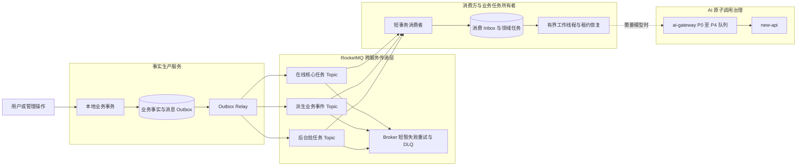
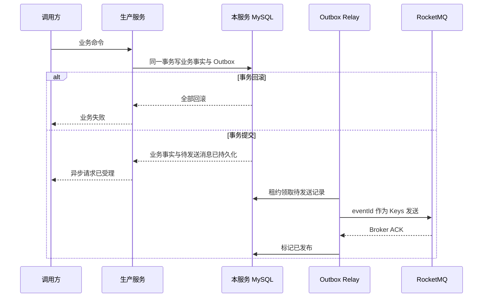
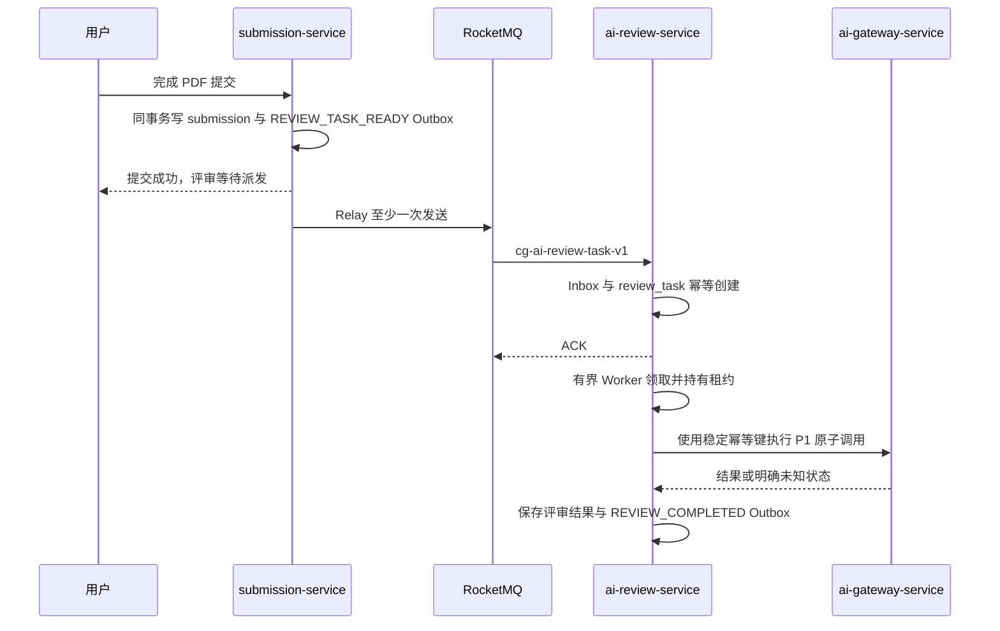

## RocketMQ 消息队列

> 设计状态：MQ0 已完成目标设计；MQ1 已实现基础设施和公共可靠消息能力；MQ2 已实现提交到评审可靠异步链路，后续按 MQ3 至 MQ6 继续迁移。
>
> 已验证基线：Apache RocketMQ Broker Docker 镜像 5.5.0，RocketMQ Spring 2.3.3（历史 Remoting 客户端 5.1.4）。RocketMQ 5.5.1 已发布但没有对应 Docker Hub 镜像标签，因此本地可复现环境固定为 5.5.0；JDK 17、Spring Boot 3、真实发送消费、重复投递、客户端重试、Broker 重启与数据卷恢复已在 MQ1 验证。

### 设计目标与当前边界

本设计为 LeetModel 引入跨服务可靠异步消息，重点解决五类问题：不同任务的隔离、异步削峰、生产与消费可靠性、长任务崩溃恢复、策略配置与运维恢复。

当前代码已经存在三类不能混为一谈的队列能力：

- ai-review-service 与 ai-suggestion-service 使用本服务 MySQL 任务表异步执行完整业务工作流。
- ai-gateway-service 使用 `ai_call_task` 对单次 Chat 和 Embedding 调用执行 P0 至 P4 公平调度、背压、租约和结果未知保护。
- problem-service 与 ranking-service 使用缓存失效 Outbox、Redis Pub/Sub 和版本对账传播缓存失效。

RocketMQ 首期只承担跨服务命令与业务事件的可靠传递，不替代服务内任务表，不接管 AI 网关调度，也不迁移已经稳定运行的缓存失效链路。系统保证的是至少一次传递加业务幂等，不宣称端到端恰好一次。

### 总体设计

各层职责如下：

| 层级 | 事实与作用 | 不承担的职责 |
|------|------------|--------------|
| L0 请求与本地事务 | 校验业务规则，写入业务事实和同库 Outbox | 不等待下游业务完成 |
| L1 RocketMQ | 持久化传递、削峰、消费组扩缩容、短暂失败重投和 DLQ | 不保存任务权威状态，不执行长工作流 |
| L2 业务服务任务队列 | 保存评审、建议、评价、排行重建任务，控制优先级、租约、重试和恢复 | 不管理供应商容量 |
| L3 AI 网关原子队列 | 按可信来源执行 P0 至 P4 公平调度、限流和结果未知保护 | 不编排完整评审或建议工作流 |

一条消息被消费时，消费者只做契约校验、Inbox 去重、领域任务创建或状态推进，并在本地事务提交后返回成功。AI 评审、知识检索、模型生成和排行全量重建不得直接占用 MQ 消费线程。

### 任务分类与消费场景

队列策略使用两个独立维度，不能只用一个优先级数字表达所有差异：

- `serviceClass` 表示跨服务传递类别，决定 Topic、消费组、积压与降级策略。
- `aiPriority` 表示进入 AI 网关后的原子调用等级，只能由 AI 网关根据可信服务身份和 `operationCode` 重算。

| 服务类别 | 代表场景 | 传递特点 | 消费方式 | 失败处理 |
|----------|----------|----------|----------|----------|
| ONLINE_CORE | 新提交触发正式评审、手动生成正式建议 | 用户可见、必须可靠、允许排队、不允许静默丢失 | MQ 快速落领域任务，业务工作线程有界执行 | Outbox 重投、Broker 重试、DLQ、任务租约恢复 |
| DERIVED | 评审完成或最终提交变化后重建排行 | 最终一致、重复可合并、晚到比丢失更可接受 | 按 `problemId` 合并为单题重建任务 | 幂等合并、失败重试、周期对账 |
| BATCH | 固定数据集质量评价、隔离实验、批量索引 | 吞吐优先、可暂停、不能挤占在线业务 | 独立 Topic、消费组和低并发工作池 | 暂停领取、延后执行、人工恢复 |
| OBSERVABILITY | 未来的非权威操作审计投影和统计 | 不参与业务提交，允许消费者独立订阅 | 独立消费组异步投影 | 投影可重建，不阻塞核心链路 |

AI 原子调用优先级继续沿用已实现规则：客服实时 Chat 与查询 Embedding 为 P0，正式评审和建议为 P1，管理员单次模型测试为 P2，质量评价与隔离实验为 P3，批量索引为 P4。RocketMQ 消息中的声明值不具有提权作用。

### Topic 与消费组

#### 首期资源

RocketMQ 5.x 要求不同消息类型使用对应类型 Topic。首期全部使用 NORMAL Topic，不用 Tag 模拟 NORMAL、FIFO、TRANSACTION 或 DELAY 的差异。

部署通过 RocketMQ namespace 隔离 `lm-dev`、`lm-test` 和 `lm-prod`，逻辑资源名不再拼接环境名：

| Topic | Tag | 生产者 | 消费组 | 消费动作 |
|-------|-----|--------|--------|----------|
| `review-task-v1` | `REVIEW_TASK_READY` | submission-service | `cg-ai-review-task-v1` | 幂等创建正式评审任务 |
| `suggestion-task-v1` | `SUGGESTION_TASK_READY` | ai-suggestion-service API | `cg-ai-suggestion-task-v1` | 唤醒已在本地事务创建的建议任务 |
| `evaluation-task-v1` | `EVALUATION_SLOT_READY` | ai-evaluation-service | `cg-ai-evaluation-task-v1` | 唤醒已创建的后台评价运行槽位 |
| `submission-event-v1` | `FINAL_SUBMISSION_CHANGED` | submission-service | `cg-ranking-submission-v1` | 合并单题排行重建请求 |
| `review-event-v1` | `REVIEW_COMPLETED` | ai-review-service | `cg-ranking-review-v1` | 合并单题排行重建请求 |

一个消费组只承载一种稳定消费逻辑。同组全部实例必须使用相同 Topic、Tag、并发模式和重试策略。需要独立获得同一事件的下游使用独立消费组，不共享组名。

首期不建立以下资源：

- 不使用 FIFO Topic。任务状态由数据库条件更新防止乱序，排行事件按题目合并，强制顺序会降低并行度且不能替代业务状态机。
- 不使用 TRANSACTION Topic。项目选择可查询、可重投、与现有缓存 Outbox 经验一致的事务 Outbox。
- 不使用 DELAY Topic 编排业务重试。业务重试属于领域任务状态，由 `next_run_at` 和调度器控制；Broker 重试只处理小概率短暂消费失败。
- 不建立一个全业务 Topic。任务量、重要性、消费速度和重试策略不同的业务必须物理隔离。

### 消息契约

#### 公共信封

所有消息使用 `MessageEnvelopeV1<T>`，公共字段如下：

| 字段 | 规则 |
|------|------|
| `eventId` | 全局唯一 ULID 或 UUID，同时写入 RocketMQ Keys 和消费 Inbox |
| `eventType` | 稳定业务语义，与 Tag 一致 |
| `schemaVersion` | 首版为 `1`，只允许向后兼容地增加可选字段 |
| `sourceService` | 可信生产服务标识 |
| `aggregateType`、`aggregateId` | 业务聚合类型与标识，用于定位和对账 |
| `idempotencyKey` | 一次逻辑动作的稳定键，例如 `review:{submissionId}:{workflowVersion}` |
| `occurredAt` | 业务事实提交时间，使用 UTC 时间语义 |
| `traceId` | 贯穿 HTTP、Outbox、MQ、领域任务和 AI 调用 |
| `payload` | 只保存执行所需标识和不可变版本，不保存大对象 |

RocketMQ Keys 固定为 `eventId`，Tag 固定为 `eventType`。`aggregateId`、`sourceService`、`schemaVersion` 和 `traceId` 可写入消息属性以支持检索，但消费正确性不能依赖控制台检索结果。

消息体不得包含 PDF、Prompt、论文正文、解析产物、知识片段、模型回答、密钥、Token 或预签名 URL。消费者凭 ID 向事实所有者获取当前允许读取的不可变快照。项目级消息体上限为 64 KiB，超过上限视为生产端契约错误，不通过压缩绕过。

#### 关键 Payload

| 事件 | 必要字段 |
|------|----------|
| `REVIEW_TASK_READY` | `submissionId`、`teamId`、`problemId`、`workflowVersion` |
| `SUGGESTION_TASK_READY` | `taskId`、`submissionId`、`workflowVersion` |
| `EVALUATION_SLOT_READY` | `evaluationTaskId`、`slotKey`、`attemptNo`、`featureCode`、`datasetVersion` |
| `FINAL_SUBMISSION_CHANGED` | `teamId`、`problemId`、`submissionId`、`lockedAt` |
| `REVIEW_COMPLETED` | `reviewTaskId`、`submissionId`、`teamId`、`problemId`、`workflowVersion`、`finishedAt` |

消息不复制评审分数和排行输入。ranking-service 收到事件后仍从 submission-service 与 ai-review-service 读取权威快照，避免事件成为第二份业务事实。

### 生产端可靠性

#### 事务 Outbox

每个事实生产服务在自己的数据库维护 `message_outbox`。业务事实与 Outbox 记录必须在同一本地事务提交：

Outbox 至少保存 `event_id`、Topic、Tag、Key、schema、payload、状态、尝试次数、下次发送时间、租约所有者、租约过期时间、Broker messageId、首次与最近错误摘要、创建和发布时间。

Relay 使用短租约和条件更新领取记录。发送失败按 1 秒、5 秒、30 秒、2 分钟、10 分钟退避并加入正负 20% 抖动，之后每 30 分钟继续低频重试且不自动放弃。Broker ACK 已返回但标记数据库前进程崩溃时会重复发送，消费端必须幂等。

消息在写 Outbox 前完成 schema 与大小校验。网络、Broker 和超时错误进入上述重试；Topic 不存在、消息类型错误和序列化不符合契约等稳定配置错误进入 `BLOCKED` 并立即告警，不用无限快速重试消耗资源，也不能删除后伪装成功。

选择 Outbox 而不是 RocketMQ 事务消息的原因如下：

- 项目全部生产者已有本地 MySQL 事务，Outbox 可以直接查询、审计、补发和迁移回退。
- 事务回查只能解决消息提交与本地事务结果一致，不能保证消费端成功，也不能提供端到端恰好一次。
- 长时间处于未知状态的半消息会增加 Broker 回查负担，独立开发项目没有必要同时维护 Outbox 与事务回查两套恢复模型。

Outbox 已发布记录至少保留 30 天，RocketMQ 消息保留期首期目标为 7 天。不能只因已收到 Broker ACK 就立即删除 Outbox。

### 消费端可靠性

#### 短事务消费与 Inbox

消费端在自己的数据库维护 `message_inbox`，唯一约束为 `consumer_group + event_id`。一次消费在同一本地事务内完成以下动作：

1. 校验 Topic、Tag、schema 和必要字段。
2. 插入 Inbox；已存在且成功的消息直接幂等返回成功。
3. 通过领域唯一键创建、唤醒或合并业务任务。
4. 将 Inbox 标记为 `CONSUMED` 并提交事务。
5. 事务提交后才向 Broker 返回消费成功。

消费者不得在该事务内执行模型调用、PDF 解析、跨服务全量查询或排行重建。这样消费超时和进程崩溃只会造成安全重投，不会留下不可判断的外部副作用。

#### 结果分类

| 结果 | Broker 响应 | 本地记录 |
|------|-------------|----------|
| 首次处理成功 | ACK | Inbox `CONSUMED` 与领域任务同事务提交 |
| 重复事件或状态已达到目标 | ACK | 记录 `DUPLICATE` 或 `NOOP` |
| 已过时但合法的事件 | ACK | 记录 `STALE`，不回退领域状态 |
| 数据库短故障、锁冲突等瞬时错误 | FAILURE | 本地事务回滚，由 Broker 重试 |
| schema 不支持、字段损坏或稳定不变量冲突 | FAILURE | 达到最大次数后进入 DLQ 并告警 |

首期消费组最大重试次数设为 5 次，即最多投递 6 次。NORMAL 消息使用递增间隔。RocketMQ Spring 2.3.3 使用历史 Remoting 客户端接口时，重试次数可能由客户端配置而不是 5.x 消费组元数据实际控制；MQ1 必须通过真实失败投递确认生效位置，并保证同组全部实例配置一致。重试用于小概率短故障，不能用来限速、等待 AI 容量或实现业务流程分支。

#### DLQ 与人工重放

每个消费组使用 RocketMQ 对应 DLQ。DLQ 不直接绑定业务消费者自动循环重试，由管理工具按以下流程恢复：

1. 根据 eventId、原消息、Inbox、领域任务和服务日志确定根因。
2. 修复代码、配置或依赖，并验证相同消息可处理。
3. 由管理员填写原因并执行单条或受控批量重放。
4. 重放保留原 `eventId` 和 `idempotencyKey`，追加 `replayId`、原 messageId、操作者与重放时间。
5. 观察 Inbox 结果和领域任务，不以“消息已重新发送”代替业务完成证明。

永久无效消息可以在记录原因后归档，不伪造消费成功。任何 DLQ 新增立即告警，不能把 DLQ 当作普通积压区。

### 领域任务执行与崩溃恢复

#### 标准任务语义

各服务可以保留自己的表名和业务阶段，但必须支持以下公共语义：

| 语义 | 现有或目标状态 | 关键规则 |
|------|----------------|----------|
| 等待 | `WAITING` 或 `QUEUED` | 按 `priority、next_run_at、created_at` 领取 |
| 已租用 | `LEASED` | 写入 owner、租约截止时间，尚未执行外部副作用 |
| 执行中 | `RUNNING` | 定期心跳延长租约，记录当前 stage 与 attempt |
| 成功 | `COMPLETED` | 结果与终态使用本地事务提交 |
| 失败 | `FAILED` | 区分可重试、永久失败和外部结果未知 |
| 取消 | `CANCELLED` | 只对尚未产生不可撤销副作用的任务生效 |

任务至少具有稳定业务幂等键、优先级、`next_run_at`、attempt、最大业务尝试次数、lease owner、lease expiry、heartbeat、失败类型和错误摘要。领取使用数据库条件更新，不使用 JVM 锁替代多实例互斥。

#### 长任务规则

- MQ 消费成功只代表领域任务已经可靠落库，不代表评审、建议或排行已经完成。
- 工作线程只有获得本服务并发许可后才领取任务，不把全部积压一次性推入 AI 网关。
- 初始并发上限为正式评审 2、正式建议 1、质量评价 1、单实例排行重建 1。它们是安全起点，压测后再调整。
- 正式评审与建议进入 AI 网关时仍为 P1，评价实验为 P3。客服 P0 保留许可不被 MQ 后台积压占用。
- 工作线程在进入外部 AI 调用前生成稳定 AI 幂等键。进程重启后必须使用相同键查询或复用 AI 网关任务，不能盲目产生第二次调用。
- AI 网关 attempt 已进入 `DISPATCHING` 或 `ACKNOWLEDGED` 后结果不明时，业务任务进入人工可见的未知或失败状态，不自动重新计费。

ai-review-service 已在 MQ2 补齐运行任务的租约、逐任务 fencing token heartbeat、过期恢复和 AI UNKNOWN 保护；ai-suggestion-service 现有十分钟扫描恢复仍应在 MQ4 迁移为租约和心跳，避免合法长任务被误重置。

#### 业务重试矩阵

| 任务与失败阶段 | 首期策略 | 原因 |
|----------------|----------|------|
| 评审或建议尚未派发 AI 前的数据库、快照读取和短暂依赖错误 | 最多自动重试 3 次，间隔 10 秒、1 分钟、5 分钟 | 尚未产生模型计费，失败可安全重做 |
| 建议等待补建评审完成 | 保持等待态并设置 `next_run_at`，不增加失败次数 | 依赖尚未就绪是流程状态，不是异常 |
| AI 网关明确返回失败 | 首期结束本次业务 attempt，由用户或管理员显式重试 | 新 attempt 可能产生新计费，不能静默循环 |
| AI 网关结果 UNKNOWN | 禁止自动重试，进入人工可见状态 | 上游可能已经执行，自动重做会重复计费 |
| 排行重建依赖短故障 | 1 分钟内有界重试，之后低频持续重试并告警 | 重建无模型计费，旧排行可以继续服务 |
| 评价运行失败 | 沿用评价任务的失败分类和管理员重试规则 | 必须保留固定实验 attempt 和统计口径 |

业务重试次数与 Broker `reconsumeTimes` 分开记录。前者表示领域工作流 attempt，后者只表示把消息可靠落为领域任务时发生了几次短事务失败。

### 各业务链路

#### 提交触发评审

提交接口在 submission 与 Outbox 一起提交后即可成功，不因 Broker 暂时不可用回滚已经完整保存的 PDF。响应和进度接口必须能表达“等待消息派发”，不能把尚未创建 review_task 伪装成评审不存在或提交失败。

迁移后 submission-service 不再在用户请求线程直接调用 `ReviewFeignClient.createVersionedTask`。回退使用读取同一 Outbox 的 `FEIGN_RELAY` 模式，目标接口保持幂等，禁止 MQ 和 Feign 两条主路径同时无条件触发。

MQ2 实施结果：默认 `MQ_PRIMARY` 已启用，submission、上传关联与 Outbox 同事务提交；重复完成可补偿升级前缺失的 Outbox。ai-review-service 使用 Inbox 短事务和领域唯一键创建任务，消费线程不执行 PDF 或 AI。Worker 初始并发 2，采用数据库条件领取、120 秒租约、20 秒逐任务 token heartbeat 与 fencing 写入；依赖错误按 10 秒、1 分钟、5 分钟重试，AI 网关待定复用同一幂等键，结果未知进入 `UNKNOWN` 且不自动重试。`FEIGN_RELAY` 推进同一 Outbox，启动校验拒绝双主配置。

#### 手动建议任务

ai-suggestion-service 在创建建议任务的事务内同时记录 `SUGGESTION_TASK_READY`。消息是可恢复的唤醒信号，`suggestion_task` 才是任务事实。即使消息丢失或 Broker 长时间不可用，低频本地 reconciliation 也会重新发布到期但未完成的任务；不得退回当前每两秒无界扫描全部等待任务的模式。

同一个用户 `clientRequestId` 继续承担业务幂等，eventId 只承担传递幂等。用户手动重试会增加业务 attempt 并生成新的 ready 事件，但不会覆盖历史报告。

#### 排行重建

ranking-service 分别消费 `FINAL_SUBMISSION_CHANGED` 和 `REVIEW_COMPLETED`。两个事件都只把对应 `problemId` 合并进本地 `ranking_rebuild_task`：

- 同一题目只有一个活跃任务，事件到达时推进 `requested_revision`。
- Worker 基于权威服务快照执行现有全量重建，并记录 `completed_revision`。
- 重建期间又有事件到达时，当前批次完成后再执行一次，不为每条消息重复全量计算。
- 重建失败不替换当前排行，保留旧批次并重试任务。
- 每小时对近期最终提交和已完成评审做轻量版本对账，修复消息过期、误归档或运维错误造成的漏触发。

排行事件是触发信号，不携带或直接写入分数。现有排行缓存失效 Outbox 仍在排行重建本地事务中执行，不能由 MQ 事件替代。

#### 后台评价

ai-evaluation-service 使用独立 Topic、消费组和工作池。系统处于降级或在线 P1 积压超过阈值时暂停领取新评价任务，任务继续保存在数据库和 Broker 中。暂停不能通过返回消费失败制造重试风暴。

### 背压与策略配置

#### 配置分层

| 配置层 | 典型配置 | 变更方式 |
|--------|----------|----------|
| Broker 资源 | Topic 类型、队列数、消息保留期、消费组与 ACL | 基础设施清单显式创建，生产禁止自动创建 |
| 传递策略 | Relay 批量、租约、发送超时、退避、消息大小 | 应用配置，按环境覆盖 |
| 消费策略 | 最大重试、消费并发、批量大小、单次超时、暂停开关 | 按实测确认由消费组元数据或兼容客户端生效，同组实例必须一致 |
| 领域任务 | 工作线程并发、租约、心跳、业务重试、deadline | 由任务所有者配置 |
| AI 调度 | P0 至 P4 权重、并发、排队上限和 deadline | 继续归 ai-gateway-service 所有 |

配置必须带默认值、范围校验和启动日志摘要。Topic、Tag、消费组、schema、幂等规则和消息类型是发布契约，不能通过动态配置随意修改。并发、阈值和暂停开关可以动态调整，但同组订阅与重试语义变更必须滚动一致发布。

#### 初始水位

以下值是首期安全阈值，不是容量承诺：

| 指标 | 警告 | 严重 | 自动动作 |
|------|------|------|----------|
| ONLINE_CORE 最老未消费消息 | 2 分钟 | 10 分钟 | 警告时暂停 BATCH，严重时限制新建议任务并保留论文提交 |
| ONLINE_CORE 单 Topic 积压 | 200 | 1000 | 降低批任务并发，严重时触发运维告警 |
| DERIVED 最老未消费消息 | 5 分钟 | 30 分钟 | 启动对账；当前排行继续可读并标注计算时间 |
| Outbox 最老待发布记录 | 30 秒 | 5 分钟 | 告警并检查 Broker、Relay 与数据库租约 |
| 任一消费组 DLQ 新增 | 1 条 | 持续增加 | 立即告警，禁止自动回灌 |
| 领域任务租约过期 | 1 条 | 同类连续出现 | 恢复扫描并告警，检查进程崩溃或任务超时 |

论文提交是核心事实写入，即使 MQ 严重积压也优先接受并明确显示排队。建议是可再次发起的增值任务，严重积压时可以拒绝创建新任务并返回稳定的“系统繁忙”错误。后台评价直接暂停。

### 故障矩阵

| 故障点 | 可观察事实 | 恢复方式 | 重复风险控制 |
|--------|------------|----------|--------------|
| 业务事务回滚 | 无业务事实、无 Outbox | 调用方重试原业务请求 | 原业务幂等键与唯一约束 |
| 事务提交后进程崩溃 | 业务事实和待发送 Outbox 均存在 | 新实例租约领取并发送 | eventId 与消费 Inbox |
| Broker 不可用 | Outbox 持续积压 | Relay 退避重试，业务按场景降级 | 不绕过 Outbox 直接发送 |
| Broker ACK 丢失 | Outbox 可能再次发送 | 接受至少一次重投 | Inbox 与领域唯一键 |
| 消费前或事务中崩溃 | Inbox 与领域任务未提交 | Broker 重新投递 | 本地事务原子性 |
| 消费事务提交后 ACK 前崩溃 | Inbox 与领域任务已提交 | 重投后幂等 ACK | `consumer_group + event_id` 唯一约束 |
| Worker 领取后崩溃 | 领域任务租约和 heartbeat 过期 | 恢复器按 attempt 重新排队或转未知 | 条件领取与稳定 AI 幂等键 |
| AI 请求已发出但结果未知 | AI attempt 为 UNKNOWN | 不自动再次计费，人工核验 | ai-gateway 现有未知结果保护 |
| 排行重建中重复事件 | requested revision 高于 completed revision | 当前完成后最多补跑一次 | problemId 活跃任务唯一约束 |
| 消息超过 Broker 保留期 | Outbox、源业务事实和对账差异仍可查 | 受控重放或对账补建 | 原 eventId 与领域幂等键 |

### 可观测性与管理

必须提供以下低基数指标和管理查询：

- 每个 Topic 与消费组的生产成功、失败、延迟、消费成功、重试、积压和最老消息年龄。
- 各服务 Outbox 待发送数、最老年龄、租约数、发送尝试和永久配置错误数。
- Inbox 消费、重复、过时、失败和 schema 不支持数量。
- 各领域任务按状态、业务优先级、等待时长、运行时长、租约过期和失败类型统计。
- DLQ 数量、首次出现时间、最近增长时间与受控重放结果。
- `traceId → eventId → RocketMQ messageId → inboxId → domainTaskId → aiCallId` 的关联查询。

管理端只通过各所有者服务的只读或受控操作接口查询、暂停、恢复和重放，不直接修改 Broker offset、Outbox、Inbox 或领域任务表。Dashboard 用于观察 Broker，不成为业务事实源。

日志只记录标识、状态、耗时、次数和脱敏错误，不记录消息正文中的业务敏感内容。

### 部署与安全

本地开发使用 Docker Compose 启动一个 NameServer、一个 Broker 和持久化数据卷，Broker 与 Dashboard 只绑定 `127.0.0.1`。常规 `docker compose down` 保留消息数据卷，清空卷必须由用户明确执行。

生产可靠性不能以本地单 Broker 配置外推。进入生产部署前至少需要：

- 多副本 Broker 与经过演练的自动主从切换方案。
- NameServer 或 Proxy 的高可用部署、独立磁盘容量告警和备份恢复流程。
- ACL 2.0 最小权限。生产者只写指定 Topic，消费者只读指定 Topic 与消费组，管理命令使用独立凭据。
- 禁止生产自动创建 Topic 与消费组，资源通过版本化脚本显式创建并校验消息类型。
- Broker、客户端和 Dashboard 固定版本，不使用 `latest` 镜像。

首期开发环境验证应用崩溃、Broker 重启和磁盘持久化；生产多副本部署不属于本阶段代码实现，但未经演练不得对外宣称 Broker 级高可用。

### 迁移、回退与完成标准

#### 迁移顺序

1. 建立 Broker、资源脚本、`common-messaging` 契约、Outbox、Inbox、指标和真实协议测试。
2. 先迁移 submission-service 到 ai-review-service 的评审触发，保留 review_task 作为执行事实。
3. 再发布 `REVIEW_COMPLETED` 与 `FINAL_SUBMISSION_CHANGED`，让 ranking-service 使用可合并重建任务。
4. 再迁移建议唤醒和后台评价，验证在线与批任务隔离。
5. 完成故障注入、DLQ 重放、积压降级和真实端到端验收后，删除请求线程中的旧直接触发代码。

每条链路使用 `LEGACY_FEIGN`、`MQ_PRIMARY` 和 `FEIGN_RELAY` 三态传输开关：

- `LEGACY_FEIGN` 只用于迁移前基线。
- `MQ_PRIMARY` 由 Outbox Relay 发送 RocketMQ，是目标生产模式。
- `FEIGN_RELAY` 仍读取和推进同一 Outbox，但通过幂等 Feign 接口投递，用于 Broker 长故障时受控回退。

任何时刻只能有一个 Relay 模式领取同一 Outbox。禁止在用户请求线程同时发送 MQ 和调用 Feign，避免无法解释的双主链。

#### 验收门槛

- 业务事务回滚不产生可消费消息，提交后崩溃不会丢消息。
- 重复发送、重复消费、乱序和 ACK 丢失不产生重复评审、建议报告或排行批次风暴。
- MQ 消费者不执行长耗时 AI 调用，消费延迟与业务执行耗时可以独立观察。
- review 与 suggestion Worker 崩溃后可通过租约恢复；AI 结果未知时不会自动重复计费。
- Broker 停止期间论文提交可持久化并显示排队，恢复后自动收敛；建议按水位拒绝，评价自动暂停。
- DLQ 可以定位、单条重放和审计，且不会自动无限回灌。
- 正式评审与建议不会被评价和索引任务挤占，AI 网关现有 P0 保留与 P1/P3/P4 策略保持有效。
- 排行同时响应最终提交变化和评审完成，重复事件按题目合并，消息遗漏可由对账修复。
- 全链路可以通过 traceId 和 eventId 关联，消息中不含论文、Prompt、模型回答和密钥。

### 非目标与关键取舍

- 不追求“恰好一次”。跨数据库和 Broker 无法靠一个中间件承诺端到端恰好一次，项目使用至少一次、Inbox、业务唯一键和状态机实现可证明的业务一次效果。
- 不把 RocketMQ 当数据库。任务状态、attempt、结果、失败原因和恢复决策属于业务服务 MySQL。
- 不让 MQ 消费线程等待长任务完成。快速落任务后 ACK 可以稳定控制消费超时与重试边界。
- 不用 Broker 重试实现业务等待和限流。到期时间、依赖未就绪和业务重试由任务表表达。
- 不强行使用事务、延迟和顺序消息展示技术。只有出现普通消息加 Outbox 无法满足的真实语义时才新增对应类型 Topic。
- 不迁移缓存 Redis Pub/Sub。缓存失效已有区域版本、对账和 TTL 兜底，迁移不会增加业务价值。

### 面试说明

本方案的核心不是“项目用了 RocketMQ”，而是区分了消息传递、业务任务和 AI 原子调用三种不同调度问题。生产端用事务 Outbox 解决数据库已提交但消息未发送，消费端用 Inbox 与领域唯一键承受至少一次投递，长任务用数据库租约和稳定 AI 幂等键处理进程崩溃，排行用按题目合并避免事件风暴，在线与批任务用独立 Topic、消费组、工作池和 AI 优先级隔离。RocketMQ 的 Broker 重试只处理短暂消费故障，DLQ 只做人工可审计恢复，不承担业务流程编排。

### 官方依据

- [RocketMQ Domain Model](https://rocketmq.apache.org/docs/domainModel/01main/)
- [RocketMQ Consumer Group](https://rocketmq.apache.org/docs/domainModel/08consumergroup/)
- [RocketMQ Subscription](https://rocketmq.apache.org/docs/domainModel/10subscription/)
- [RocketMQ Consumption Retry](https://rocketmq.apache.org/docs/featureBehavior/10consumerretrypolicy/)
- [RocketMQ Transaction Message](https://rocketmq.apache.org/docs/featureBehavior/04transactionmessage/)
- [RocketMQ Message Filtering](https://rocketmq.apache.org/docs/featureBehavior/07messagefilter/)
- [RocketMQ 5.5.1 Release Notes](https://rocketmq.apache.org/release-notes/2026/08/20/5.5.1/)
