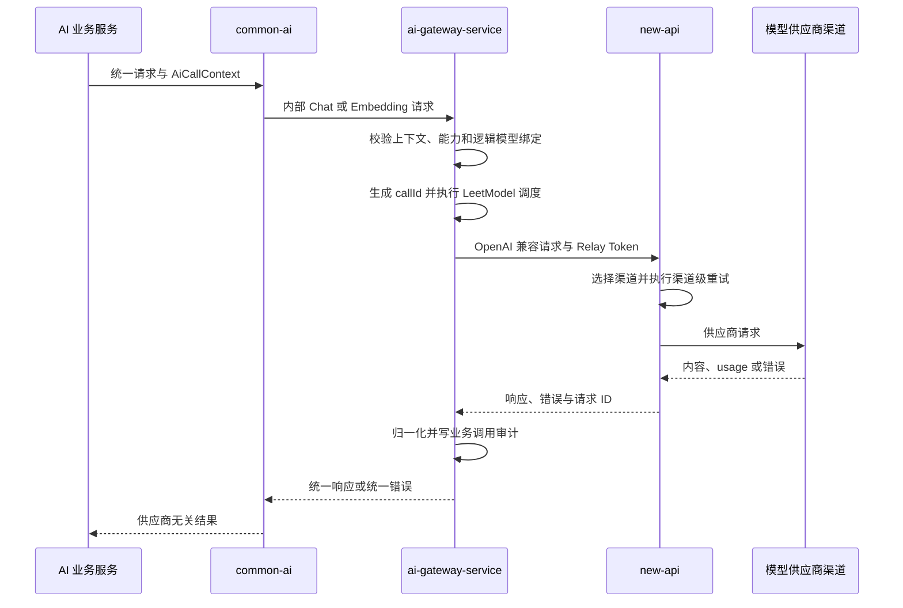

# new-api 第三方网关集成

> 设计状态：D-02 已确认职责边界。S1 已完成 Chat 协议核验、适配、真实冒烟和旧直连删除；当前默认文本与多模态调用链统一经过 new-api。

## 设计目标

LeetModel 只建设与自身业务语义、内部契约、调度和审计有关的模型调用治理，不复制成熟第三方网关的渠道治理。目标调用链固定为：

```text
AI 业务服务 → common-ai → ai-gateway-service → new-api → 模型供应商渠道
```

`common-ai` 是进程内公共客户端，不是独立网关。AI 业务服务不直连 new-api 或模型供应商，也不持有 Relay Token 或供应商密钥。


## 职责总览

| 能力 | `ai-gateway-service` | new-api |
|------|----------------------|---------|
| 内部契约与业务调用上下文 | 拥有并校验 | 不理解 |
| 逻辑模型与能力绑定 | 拥有 | 不拥有业务语义 |
| new-api 模型名映射 | 保存逻辑绑定 | 提供可调用模型名 |
| 供应商、渠道和账号选择 | 不负责 | 负责 |
| 供应商 API Key | 不保存 | 负责 |
| Relay Token | 仅网关读取 | 签发和校验 |
| 供应商协议转换 | 不复制 | 负责 |
| 渠道级重试与故障切换 | 不复制 | 负责 |
| 业务优先级、排队和背压 | 负责 | 不理解业务优先级 |
| 统一业务错误 | 负责归一化 | 提供上游错误事实 |
| 渠道额度和扣费 | 不作为渠道事实源 | 负责 |
| 业务调用审计 | 负责 | 不拥有业务事实 |
| 渠道日志和渠道健康 | 不复制 | 负责 |
| new-api 可达性和绑定校验 | 负责 | 提供状态和模型接口 |

LeetModel 可以保存从 new-api 取得的 Token、费用和错误快照，但不建立第二套渠道账本或渠道调度。


## 请求链



业务服务选择已版本化的模型执行配置，不选择供应商品牌、渠道、账号或端点。`ai-gateway-service` 将逻辑模型绑定到 new-api 模型名；new-api 再选择实际供应商渠道。


## 数据链

LeetModel 保存 `callId`、调用方、功能、操作、业务任务、评价任务、五种版本标识、逻辑模型、new-api 请求 ID、状态、统一错误、排队与执行耗时，以及可取得的 Token 和费用快照。

new-api 保存供应商渠道、账号凭据、渠道模型映射、权重、健康、渠道尝试、额度、quota 和渠道日志。new-api 不成为 LeetModel 业务任务、工作流版本或评价结果的事实源。

LeetModel 不保存 Prompt、回答正文、知识片段、论文内容、Relay Token、供应商密钥或 new-api 渠道配置。每次调用使用 LeetModel `callId` 与 `X-Oneapi-Request-Id` 关联。同步可得的 usage 直接写入；只能从日志取得的费用按请求 ID 幂等补全。缺失值显式标记未知，不写零值。


## 错误链

| 错误来源 | 处理责任 | LeetModel 行为 |
|----------|----------|----------------|
| 内部请求或能力不合法 | `ai-gateway-service` | 调用前拒绝并返回业务错误 |
| Relay Token 无效 | new-api 提供事实，网关归一化 | 记录配置错误，不泄露 Token |
| 模型不存在 | new-api 提供事实，网关归一化 | 返回模型配置不可用并关联 `callId` |
| 额度不足 | new-api 提供事实，网关归一化 | 返回额度错误，不伪装为限流 |
| 渠道限流或不可用 | new-api 负责渠道恢复 | 最终失败时映射稳定错误 |
| new-api 不可达 | `ai-gateway-service` | 返回依赖不可用，不隐式直连供应商 |
| 超时或结果未知 | 两层保留事实 | 标记重复费用风险，不自动再调用 |
| 畸形响应 | `ai-gateway-service` | 返回响应无效，不记录敏感正文 |

业务服务只依赖稳定的 LeetModel 错误语义，不解析 new-api 状态、错误正文或供应商品牌字段。


## 重试边界

new-api 是渠道级重试的唯一所有者。它可以在请求模型名和语义不变的前提下选择同模型渠道并有限重试。

`ai-gateway-service` 不对已经发给 new-api 的 Chat 或 Embedding 请求透明重试，也不失败回退到旧直连。连接建立后的超时无法证明上游未执行，自动重试可能产生重复费用。业务服务可以按自身状态机创建新的业务执行，但必须产生新的可追踪调用并遵守业务幂等规则。


## 限流、调度与健康

- new-api 负责供应商渠道的 RPM、TPM、并发、额度反馈、渠道权重、熔断和恢复。
- `ai-gateway-service` 负责 LeetModel 业务来源之间的优先级、公平调度、排队、deadline、背压和取消。
- LeetModel 根据 new-api 的最终限流反馈降低派发速度，但不复制渠道容量模型。
- LeetModel 只检查 new-api 可达性、Relay Token 可用性和逻辑模型绑定。
- 供应商渠道探测、账号隔离和半开恢复由 new-api 负责。

当前代码没有本地并发保护。旧文档中“已实现单实例信号量”的描述不作为事实；调度与容量保护由 S5 系列任务设计和实现。


## 计量与审计

new-api 拥有渠道消耗和 quota 事实；LeetModel 拥有业务调用审计。费用来源依次为 new-api 可关联的实际扣费、使用实际 usage 与已确认价格快照的估算、未知。实际值和估算值必须区分。

LeetModel 不维护供应商渠道价格、账号余额或渠道账单。管理页面读取 LeetModel 业务调用事实；渠道排障使用 new-api 管理能力，不把临时读取 new-api 日志作为唯一业务事实源。


## 模型映射

业务服务只引用 `modelExecutionConfigVersion` 和逻辑能力绑定。`ai-gateway-service` 保存绑定对应的 new-api 模型名，并校验文本、多模态、Embedding、结构化输出和上下文限制。该字段归属和不可变范围遵守 [AI版本标识.md](AI版本标识.md)；new-api 的 `/v1` 协议路径、渠道 ID 或模型别名都不能充当 LeetModel 业务工作流版本。

new-api 管理该模型名到供应商渠道模型的映射。请求不包含供应商、渠道 ID、账号或供应商密钥。new-api 模型列表只证明名称可调用，不能替代 LeetModel 的业务能力档案。


## 当前实现与回退

当前只保留 `NewApiAdapter` 生产适配器，配置只读取 new-api Base URL 和 Relay Token；业务服务与 AI 网关不读取供应商 API Key，也不携带渠道 ID。

S1 已完成客服文本与论文评审多模态真实冒烟。生产代码不提供供应商直连或同请求双调用；若阶段上线失败，只允许按 Git 发布流程整体回滚 S1 变更并重新验证，不得在运行时静默切回供应商官方接口。


## 本地部署基线

当前镜像为 `calciumion/new-api:v1.0.0-rc.26`，使用 SQLite 数据卷 `new-api-data`，绑定 `127.0.0.1:3000`，健康检查为 `GET /api/status`。

| 用途 | 方法与路径 | 鉴权 |
|------|------------|------|
| 服务状态 | `GET /api/status` | 无 |
| 对话 | `POST /v1/chat/completions` | Relay Token |
| Responses | `POST /v1/responses` | Relay Token |
| 模型 | `GET /v1/models` | Relay Token |
| Token 使用 | `GET /api/usage/token/` | Relay Token |
| Token 日志 | `GET /api/log/token` | Relay Token |

```bash
cd LeetModel-backend
docker compose up -d --wait new-api
curl --fail http://localhost:3000/api/status
```

首次初始化、渠道配置和 Relay Token 创建由管理员在 new-api 控制台完成。真实密钥不写入仓库、日志、测试或文档。停止但保留数据使用 `docker compose stop new-api`；需要保留配置时不得执行会删除数据卷的命令。
