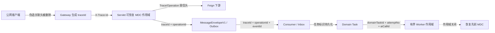

## 关联标识与遥测字段契约

> 实现状态：公共上下文、Gateway/Servlet 信任边界、Feign 传播、RocketMQ 恢复、有界线程池清理、SkyWalking Agent 物理执行关联和异步 attempt Span 已实施。中央操作审计事件留给 AUD-01 及后续任务。

### 目标与总体边界

本契约解决三个问题：标识由谁生成、通过什么介质传播、在哪里成为可恢复事实。核心边界是：

- 公网客户端不能决定任何内部关联标识。Gateway 删除伪造头并重新生成 `traceId`。
- MDC 只是一次物理执行的便捷视图，不是跨进程或跨重启事实。需要跨重启的标识必须进入 HTTP 契约、消息信封或所有者数据库。
- 业务 `traceId` 与 SkyWalking Trace 分工：前者跨异步任务和重启持久化，后者只还原一次有界物理执行。
- 关联标识不是 Prometheus label。日志、Trace 和精确业务查询使用它们，指标仅使用稳定低基数维度。

### 标识所有权

| 标识 | 唯一受信生成者 | 传播介质 | MDC Key | 持久化与恢复边界 |
|------|------------------|----------|---------|------------------|
| `traceId` | 公网请求由 Gateway 生成；受信内部直连缺失或非法时由 Servlet 生成 | `X-Trace-Id`、Feign、消息信封 | `traceId` | Outbox/Inbox、领域任务和 AI 调用事实按各所有者现有字段保存 |
| `swTraceId/swSpanId` | SkyWalking Agent | Agent 自有 SW8 传播，禁止业务 HTTP 头和消息伪造 | `swTraceId` / `swSpanId` | 只在当前物理执行中使用；需要反查时由后续审计事实精确保存 |
| `operationId` | 管理端或领域服务的受信治理命令入口 | `X-Operation-Id`、Feign、消息信封可选字段 | `operationId` | 人工治理命令才生成；后续审计 Outbox 与中央审计持久化 |
| `eventId` | `MessageEnvelopeFactory` | 消息 Key、信封、Outbox 和 Inbox | `eventId` | 生产者 Outbox 与消费者 Inbox 持久化；每条事件唯一，重投不重生成 |
| `domainTaskId` | 领域任务数据所有者 | 明确消息 Payload 或数据库任务记录，不使用泛化 HTTP 头 | `domainTaskId` | 持久化任务主键；Worker 领取后恢复 |
| `attemptNo` | 领域任务租约/重试状态机 | 明确 Payload 或任务表 | `attemptNo` | 每次物理尝试为正整数；租约接管不复用旧 attempt |
| `aiCallId` | `ai-gateway-service` 原子调用入口 | AI 调用响应与明确业务字段 | `aiCallId` | `ai_call_log`、AI 调用任务与领域结果按现有边界保存 |

`CorrelationContext.ensureOperationId()` 只供已完成身份确认的治理命令入口使用，普通读请求不为了字段完整性生成 `operationId`。`MessageEnvelopeV1.operationId` 是向后兼容的可选字段；旧消息解码为 null，新生产者只复制当前受信上下文。

### HTTP 信任边界

Gateway 是唯一公网信任边界。它必须删除 `X-Trace-Id`、`X-Operation-Id`、`X-Sw-Trace-Id`、`X-Sw-Span-Id`、`X-Event-Id`、`X-Domain-Task-Id`、`X-Attempt-No` 和 `X-Ai-Call-Id`，再为请求生成新 `traceId`。伪造值不能出现在转发请求、MDC 或响应头中。

Servlet 服务只在受信内网接受合法 `X-Trace-Id` 和可选 `X-Operation-Id`。标识长度最多 100，字符集限于字母、数字、点、下划线、冒号和连字符。缺失、超长、包含空白或 CR/LF 的 `traceId` 被替换，非法 `operationId` 被丢弃。直接暴露业务服务端口会破坏该信任前提，因此生产网络必须只向 Gateway 与受信服务网格开放。

Feign 在每次调用前先删除契约参数或其他拦截器预置的两个关联头，再从当前公共上下文写入 `traceId` 和可选 `operationId`。当前上下文为空时不传播任何预置值。

SkyWalking 的 SW8 只由 Agent 或官方 Toolkit Carrier 注入，不暴露业务可写的 `X-Sw-*` 传播协议。HTTP 入口读取 Agent 当前 Trace/segment/span，拒绝 `N/A`、`Ignored_Trace`、无活动 Span、超长值和不安全字符；随后把业务 `traceId` 放入 correlation context，由 Agent 固定配置生成 `business.trace_id` Trace tag。结构化日志保存同一业务 `traceId` 和当前 `swTraceId/swSpanId`；未附加 Agent、未采样或 OAP 不可用时，业务 `traceId` 仍独立生成、传播和落盘。

OpenFeign 13 客户端通过公共 SkyWalking `Capability` 创建一次有界 Exit Span。operation name 只取 `MethodMetadata.configKey`，peer 只取主机与端口；不得把动态 URL、查询参数、请求体、原始异常或任何业务标识写入 tag。Agent 9.7 的 Feign 9 插件必须排除，避免与兼容增强重复建 Span。

### 消息与 Worker 恢复

消息生产者用 `MessageEnvelopeFactory` 生成 UUID `eventId`，显式传入业务 `traceId`，并仅从当前受信上下文复制可选 `operationId`。`MessageCorrelationContext` 只能在 `MessageCodec` 完成信封校验后打开，并在 Inbox、本地任务落库与唤醒过程中恢复信封关联字段。

消费线程不长时间执行 AI、PDF、RAG 或排行重建。它只保存 Inbox 和领域任务；Worker 后续从任务表恢复 `traceId/domainTaskId/attemptNo`，AI 调用已确定时再加入 `aiCallId`。不从过期 MDC 或工作线程 ThreadLocal 猜测上一个任务。

`SkyWalkingExecutionSpan` 使用空 Carrier 在每个物理 attempt 建立新的 Entry Trace。Outbox Relay 在发送前从已持久化且通过校验的信封恢复 Trace、Event 与可选 Operation；Inbox 只覆盖去重和本地领域短事务。评审、建议、评价和排行协调器只在条件领取成功后恢复任务关联。AI Gateway 在领取后、上游执行前打开 `AI/ProviderAttempt`，在 fencing 终态持久化后关闭；队列等待和租约间隙不保持 Span。

新领取者必须获得新 Trace 和递增 attempt，不能续接上一任 owner。只有固定分类 tag 可用；任务、事件、attempt 序号和 AI Call 标识保留在 MDC 与数据库事实中用于精确查询。唯一高基数 Trace tag 是 Agent correlation 配置统一生成的 `business.trace_id`，它不进入 Prometheus label。

`CorrelationContext.Scope` 关闭时恢复作用域打开前的全部八个关联字段。`CorrelationTaskDecorator` 在任务提交时捕获快照，在工作线程成功、异常或拒绝路径中都不保留该任务 MDC。Gateway 使用 Micrometer Context Propagation 的 ThreadLocal 桥接恢复 Reactor 切线程上下文；该依赖不包含 Micrometer Tracing 或 Trace Exporter。

### 服务资源与事件编码

| 资源字段 | 来源 | 约束 |
|------------|------|------|
| `service` | `spring.application.name` | 稳定服务名，不使用 Pod/Host 动态后缀 |
| `environment` | 部署环境配置 | `dev/test/staging/prod` 等低基数值 |
| `serviceVersion` | 构建版本或发布 Git 标识 | 一次进程生命周期不变 |
| `instance` | 部署平台实例标识 | 可在日志/Trace 中精确查询，不作业务指标维度 |

资源字段在进程启动时确定，不读取 HTTP Header、Payload 或用户输入。`TelemetryResource` 只接受字母、数字、点、下划线和连字符组成的有界值。

`eventCode` 是程序与运维查询之间的稳定契约，使用最长 80 字符的 `UPPER_SNAKE_CASE`，例如 `OUTBOX_PUBLISH_RETRY` 和 `HTTP_5XX_RESPONSE`。分段只允许大写字母与数字，不允许把任务主键、时间戳、自增数字等纯运行时数字分段拼进编码。中文 `message` 可调整，`eventCode` 只通过兼容发布增加或废弃，不根据运行值动态生成。

告警到事实的跨后端约定使用版本化 `leetmodel.correlation.v1` annotation。它只能携带 `trace_operation`（闭合 operation 目录）、`log_event_code`（闭合事件码）和只读 `fact_query`；`traceId/swTraceId/eventId/domainTaskId/attemptNo/aiCallId` 仅由值查询或受控事实快照传递，绝不成为 Prometheus label、告警 annotation 的动态拼接值或 Grafana 变量标签。联合查询在 Trace 未采样、延迟或 OAP/Reporter 不可用时必须显式显示数据源空洞，再依靠业务 `traceId` 对中央日志和持久化事实进行回退解释。

Prometheus 标签名不得使用用户、队伍、题目、提交、业务主键、任何关联标识、幂等键或审计目标标识。`TelemetryFieldPolicy.requireLowCardinalityLabel` 作为后续 MET-02 公共指标审查的强制门禁。

### 验收契约

公共测试必须持续覆盖：

1. Gateway 收到伪造 Trace、Operation、SkyWalking、Event、Task 和 AI Call 头时全部删除，并生成新 `traceId`。
2. Servlet 对内网头执行长度与字符校验，请求结束后恢复 MDC。
3. Feign 不传播手工预置值，只传播当前受信 Trace 与 Operation。
4. 消息重投恢复原 `eventId/traceId/operationId`，不产生新事件标识。
5. 同一工作线程连续执行任务时，前一任务成功或异常结束后都没有关联 MDC 残留。
6. `traceId/operationId/eventId/domainTaskId/attemptNo/aiCallId` 等高基数字段无法通过指标标签契约校验。
7. 无 Agent 时 Toolkit 桥接为 no-op；有 Agent 时同步链日志共享业务 `traceId/swTraceId`，并且一个 Span 不重复写入 `business.trace_id` tag。
8. 真实 Agent 协议门禁证明正常领取与接管使用不同 Trace ID，每个自定义 Span 在物理执行内结束，UNKNOWN 使用固定错误分类且不含 Payload、凭据、原始异常或业务主键 tag。
9. 联合演练必须对 Outbox 积压与 AI UNKNOWN 分别证明：告警固定维度、Attempt operation、结构化日志关联字段和持久化事实一致；Trace 缺失时结果显式标记空洞且仍可通过业务 `traceId` 回退，不记录任何正文或凭据。
