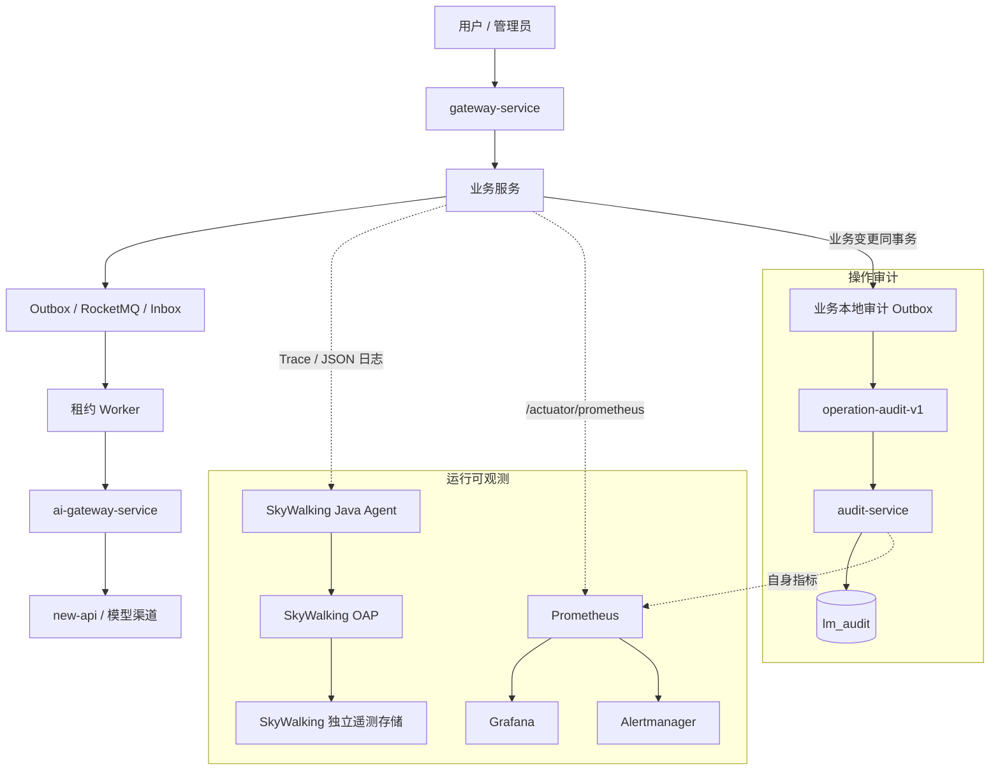

## 可观测性与系统保障

> 设计状态：目标设计已确认，已建立可重复的本地 SkyWalking/BanyanDB/Prometheus/Grafana/Alertmanager 部署与 Agent 兼容基线，详见 [可观测性组件基线](可观测性组件基线.md)。当前仍未完成 13 个服务的正式接入、业务指标、中央日志、主动告警和中央 audit-service。


### 目标与边界

系统保障不以“部署了监控组件”为完成标准，而以真实故障中能否完成“发现影响、定位阶段、关联业务事实、受控恢复、确认恢复结果”判定。目标包括：

- 从用户主链而不是单个进程判断提交、评审、建议、客服和排行是否可用。
- 对 HTTP、Feign、Outbox、RocketMQ、Inbox、领域任务、租约 Worker 和 AI 原子调用分层观测。
- 在进程崩溃、Broker 中断、租约接管、AI 结果未知和人工重放后仍可解释同一业务链路。
- 把指标发现、Trace 定位、日志解释、操作审计和管理恢复连成闭环。

非目标包括金融级 SIEM、全量不采样 Trace、跨地域遥测集群和法规驱动的 WORM 存储。此类能力只在真实合规或容量需求出现后评估。


### 总体架构



SkyWalking 是唯一分布式 Trace 实现，不同时启用 Micrometer Tracing 或 OpenTelemetry Trace Exporter 重复建 Span。Prometheus 是指标和告警规则的权威来源；SkyWalking 的原生告警首期不建第二套通知通道。Grafana 与 SkyWalking UI 只读观察，取消、暂停、重放和回滚继续由 LeetModel 管理端通过有权限、有审计的接口执行。


### 五类事实与权威来源

| 事实 | 回答的问题 | 权威来源 | 保留特征 |
|------|------------|------------|----------|
| 业务与任务事实 | 提交、评审、建议究竟处于什么状态 | 各业务服务 MySQL | 按业务历史长期保留 |
| 操作审计 | 谁为何对什么做了什么，结果如何 | audit-service 不可变归档 | 长于运行日志，按政策归档 |
| 运行日志 | 运行时发生了什么、为什么失败 | SkyWalking 日志存储 | 短中期、可按容量清理 |
| Trace / Span | 一次执行路径在哪个阶段慢或失败 | SkyWalking | 可采样，不作业务凭证 |
| Metrics | 异常的范围、趋势和是否超过 SLO | Prometheus | 低基数、时序聚合 |

任何一类事实不代替另一类。日志不是权威审计，Trace 不是领域任务状态，Prometheus 不保存 `traceId`、用户 ID 或业务主键。


### 关联标识

| 标识 | 定义 | 生命周期 |
|------|------|------------|
| `traceId` | LeetModel 业务关联 ID，现有 `X-Trace-Id` 的稳定语义 | 跨 HTTP、Outbox、MQ、Inbox、领域任务、AI 调用持久化，不受采样影响 |
| `swTraceId` / `swSpanId` | SkyWalking 技术执行链和其中的阶段 | 按一次同步请求或一次异步执行 attempt 建立，可采样 |
| `operationId` | 一次人工或系统治理操作 | 连接请求、业务变更、外部副作用和审计结果 |
| `eventId` | 一条可靠消息或审计事件 | 跨 Outbox、Broker、Inbox 和 DLQ |
| `domainTaskId` / `attemptNo` | 一个长耗时领域任务及其物理尝试 | 跨租约领取、心跳、恢复、fencing 和终态 |
| `aiCallId` | 一次可计量 AI 原子调用 | 连接业务 attempt、调度任务、Token、费用与结果 |

SkyWalking Trace ID 不替换现有业务 `traceId`。后者会写入数据库与消息，用于跨数分钟、进程重启、租约接管和 Trace 采样后的可追踪性；SkyWalking ID 用于还原一次具体执行的拓扑与耗时。


### 长耗时 AI 异步链路

评审、建议和后台评价的总生命周期可能持续数分钟，不建立一个长时间不结束的 Span。链路分为：

1. 用户请求 Trace：接收、校验、业务事实与 Outbox 同事务、返回排队状态。
2. 消息传递 Trace：Relay 发送、Broker 投递、Consumer 写 Inbox 并唤醒领域任务，Consumer 线程不执行 AI。
3. Worker attempt Trace：任务领取、租约心跳、PDF 解析/知识检索、AI 调用、结果校验和 fencing 持久化。每个 attempt 是独立可结束的 Trace，使用 `traceId + domainTaskId + attemptNo` 关联。
4. 派生事件 Trace：结果事实、完成 Outbox、排行重建或其他下游动作。

自动 Agent 覆盖 Gateway、Spring MVC/WebFlux、Feign、JDBC 和 RocketMQ 能够正确识别的阶段。Outbox Relay、消费 ACK 后的本地任务、租约接管、两阶段 AI 调度等自定义边界通过 SkyWalking Toolkit 或经兼容验证的自定义增强建 Span。不把 Prompt、论文、回答、知识片段和消息 Payload 写入 Span tag。


### 指标与看板

指标统一使用 Micrometer 低基数命名，由 Prometheus 抓取。首期看板与 SLI 分为：

| 看板 | 核心内容 |
|------|----------|
| 系统总览 | 服务 UP/Readiness、Gateway RED、JVM、线程池、HikariCP、发布版本 |
| MVP 主链 | 提交接受率、提交到评审完成耗时、建议完成率、排行新鲜度 |
| AI 资源与稳定性 | P0-P4 排队、最老等待、调用成功/失败/UNKNOWN、Token、费用、限流 |
| 异步任务 | 各领域任务状态、最老等待、运行时长、租约过期、attempt 类型 |
| 可靠消息 | Outbox、Inbox、Topic/消费组积压、重试、BLOCKED、DLQ |
| 审计与日志管道 | 审计 Outbox 年龄、中央归档延迟、非法 schema、日志上报失败/丢弃、OAP 自身健康 |

用户 ID、队伍 ID、提交 ID、`traceId`、`operationId`、`eventId` 和 `aiCallId` 不作为 Prometheus label。接口维度使用路由模板而不是带真实 ID 的 URL。


### 健康检查

| 类型 | 用途 | 允许包含的信号 |
|------|------|------------------|
| Liveness | 判断进程是否需要重启 | 进程活性与无法恢复的内部卡死 |
| Readiness | 判断是否接收新流量 | 核心本地数据库、启动迁移与必需配置 |
| Degraded | 表达仍可服务但有能力降级 | 缓存故障、Broker 中断、非核心检索故障、Outbox 积压 |
| Business health | 运维判断业务链是否收敛 | 最老任务、DLQ、UNKNOWN、排行新鲜度 |

一条 `BLOCKED` Outbox、Redis 缓存降级或一次 AI 失败不得直接使 Liveness 失败并引发无意义重启。Actuator 详情、Prometheus 端点、SkyWalking OAP 和 Grafana 不经公网 Gateway 暴露。


### 告警与恢复闭环

告警规则由 Prometheus 计算，Alertmanager 负责分组、抑制、静默与通知。告警优先复用已确认阈值：MQ 积压、Outbox 最老年龄、DLQ 新增、AI P0 等待、`AI_UPSTREAM_RESULT_UNKNOWN` 和审计未完整操作。HTTP 错误率、延迟和业务完成时限在采集真实基线后确定 SLO，不在设计阶段伪造容量承诺。

每条严重告警必须包含影响、当前值、看板、Trace/业务查询入口、Runbook 和恢复条件。处置仍通过现有服务所有者接口进行：

```text
告警 -> Grafana 确认影响 -> SkyWalking 定位执行阶段
     -> traceId 关联业务事实/审计 -> 管理端受控恢复
     -> 指标恢复 -> 复盘并校准规则
```


### 故障语义

- Prometheus/Grafana 不可用不影响业务请求，但应在本地恢复后尽快显示遥测空洞。
- SkyWalking OAP 不可用时业务不停止；本地日志保留且上报队列有界，不能因遥测反压耗尽业务资源。
- Trace 被采样或丢失后，数据库中的 `traceId`、任务、attempt 和 `aiCallId` 仍能解释业务结果。
- audit-service 不可用时业务所有者的审计 Outbox 必须保留并重试；达到严重水位后对权限提升、生产切换、DLQ 重放等高风险新操作 fail-closed。
- 遥测、日志或审计失败不允许被记成空集合、零值或成功；查询页必须显式标记数据空洞和不可用的数据源。


### 安全与数据最小化

指标、Span、日志和审计均不保存密码、验证码、JWT/Cookie、Relay Token、连接密钥、论文正文、Prompt、模型回答、RAG 知识片段、Embedding 向量和 RocketMQ Payload。必要的可验证事实使用数量、长度、版本、状态、脱敏错误码或 SHA-256。日志和审计查询权限分离，读取、导出、保留策略和日志级别修改本身需要记录审计。


### 实施次序与验收

1. 以 [可观测性组件基线](可观测性组件基线.md) 锁定版本、存储隔离和 Agent 兼容边界；Feign 客户端和 RocketMQ 消费端缺口不得被默认为已自动覆盖。
2. 统一 Actuator、Prometheus Registry、liveness/readiness/degraded 语义和服务资源字段。
3. 部署 Prometheus、Grafana、Alertmanager，建立系统总览和 MVP 主链看板。
4. 按 [日志系统](日志系统.md) 统一 JSON 日志，再接入 SkyWalking OAP 日志接收与查询。
5. 按 [操作审计架构](操作审计架构.md) 建立审计契约、专用 Topic、audit-service 和管理查询。
6. 以用户角色变更验证“业务变更+审计 Outbox”同事务，以 Consumer 暂停和 DLQ 重放验证外部副作用两阶段审计。
7. 执行 OAP 中断、Prometheus 中断、审计消费中断、日志队列溢出、租约接管和 AI UNKNOWN 故障演练。

完成验收必须证明：任一核心请求可从指标定位到 Trace，从 Trace 回到业务 `traceId`、任务 attempt、AI Call 和操作审计；采集后端故障不阻断业务；高风险审计长时间无法归档时不继续无限接受新的高风险操作。
