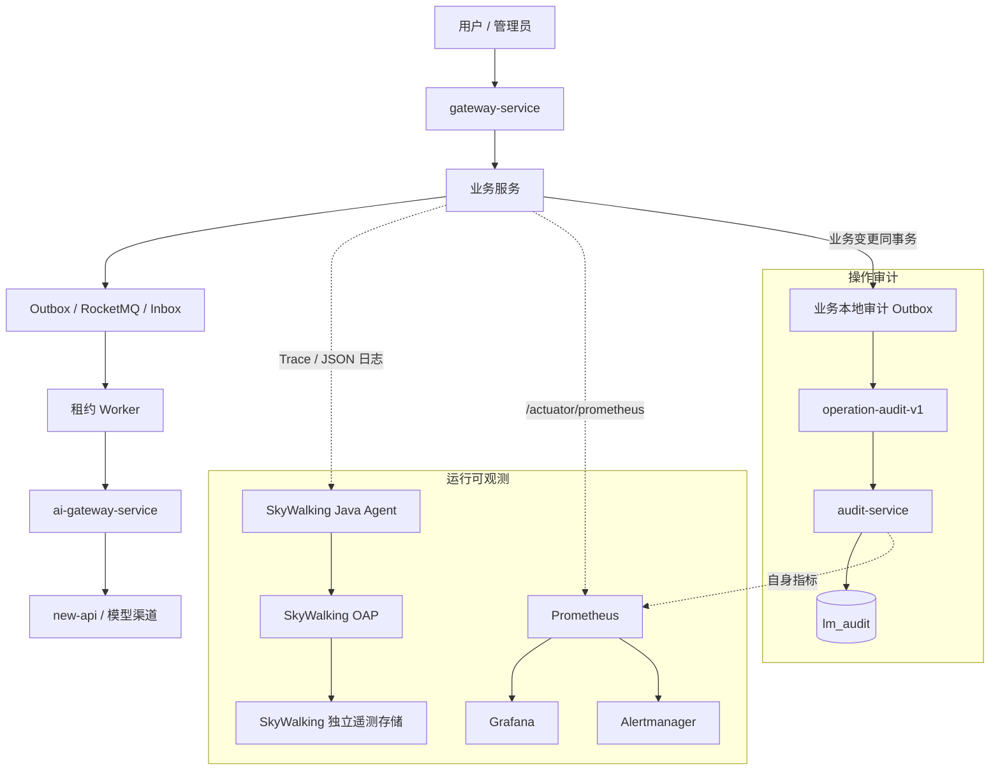

## 可观测性与系统保障

> 设计状态：目标设计已确认，已建立可重复的本地 SkyWalking/BanyanDB/Prometheus/Grafana/Alertmanager 环境，详见 [可观测性组件基线](可观测性组件基线.md)。14 个当前服务已统一接入 Actuator、Prometheus Registry、健康分组、核心业务/异步指标和具备集中安全边界的 `leetmodel.log.v1` JSON 日志，并完成受保护抓取、六类版本化看板、22 条主动告警、SkyWalking 中央日志接收、同步 HTTP/Feign/JDBC Trace、异步物理 attempt Trace 以及告警到业务事实的联合演练；中央 audit-service 已具备受信内部只读查询，主要领域/治理生产者、管理审计页和遥测/审计故障保护已落地。


### 目标与边界

系统保障不以“部署了监控组件”为完成标准，而以真实故障中能否完成“发现影响、定位阶段、关联业务事实、受控恢复、确认恢复结果”判定。目标包括：

- 从用户主链而不是单个进程判断提交、评审、建议、客服和排行是否可用。
- 对 HTTP、Feign、Outbox、RocketMQ、Inbox、领域任务、租约 Worker 和 AI 原子调用分层观测。
- 在进程崩溃、Broker 中断、租约接管、AI 结果未知和人工重放后仍可解释同一业务链路。
- 把指标发现、Trace 定位、日志解释、操作审计和管理恢复连成闭环。

非目标包括金融级 SIEM、全量不采样 Trace、跨地域遥测集群和法规驱动的 WORM 存储。此类能力只在真实合规或容量需求出现后评估。


### 总体架构



SkyWalking 是唯一分布式 Trace 实现，不同时启用 Micrometer Tracing 或 OpenTelemetry Trace Exporter 重复建 Span。Prometheus 是指标和告警规则的权威来源；SkyWalking 的原生告警首期不建第二套通知通道。Grafana 与 SkyWalking UI 只读观察，取消、暂停、重放和回滚继续由 LeetModel 管理端通过有权限、有审计的接口执行。


### 五类事实与权威来源

| 事实 | 回答的问题 | 权威来源 | 保留特征 |
|------|------------|------------|----------|
| 业务与任务事实 | 提交、评审、建议究竟处于什么状态 | 各业务服务 MySQL | 按业务历史长期保留 |
| 操作审计 | 谁为何对什么做了什么，结果如何 | audit-service 不可变归档 | 长于运行日志，按政策归档 |
| 运行日志 | 运行时发生了什么、为什么失败 | SkyWalking 日志存储 | 短中期、可按容量清理 |
| Trace / Span | 一次执行路径在哪个阶段慢或失败 | SkyWalking | 可采样，不作业务凭证 |
| Metrics | 异常的范围、趋势和是否超过 SLO | Prometheus | 低基数、时序聚合 |

任何一类事实不代替另一类。日志不是权威审计，Trace 不是领域任务状态，Prometheus 不保存 `traceId`、用户 ID 或业务主键。


### 关联标识

HTTP、Feign、消息、Worker 的生成者、信任边界、MDC 键和持久化所有者统一见 [关联标识与遥测字段契约](关联标识与遥测字段契约.md)。公网客户端提供的内部关联头一律不可信。

| 标识 | 定义 | 生命周期 |
|------|------|------------|
| `traceId` | LeetModel 业务关联 ID，现有 `X-Trace-Id` 的稳定语义 | 跨 HTTP、Outbox、MQ、Inbox、领域任务、AI 调用持久化，不受采样影响 |
| `swTraceId` / `swSpanId` | SkyWalking 技术执行链和其中的阶段 | 按一次同步请求或一次异步执行 attempt 建立，可采样 |
| `operationId` | 一次人工或系统治理操作 | 连接请求、业务变更、外部副作用和审计结果 |
| `eventId` | 一条可靠消息或审计事件 | 跨 Outbox、Broker、Inbox 和 DLQ |
| `domainTaskId` / `attemptNo` | 一个长耗时领域任务及其物理尝试 | 跨租约领取、心跳、恢复、fencing 和终态 |
| `aiCallId` | 一次可计量 AI 原子调用 | 连接业务 attempt、调度任务、Token、费用与结果 |

SkyWalking Trace ID 不替换现有业务 `traceId`。后者会写入数据库与消息，用于跨数分钟、进程重启、租约接管和 Trace 采样后的可追踪性；SkyWalking ID 用于还原一次具体执行的拓扑与耗时。


### 长耗时 AI 异步链路

评审、建议和后台评价的总生命周期可能持续数分钟，不建立一个长时间不结束的 Span。链路分为：

1. 用户请求 Trace：接收、校验、业务事实与 Outbox 同事务、返回排队状态。
2. 消息传递 Trace：Relay 发送、Broker 投递、Consumer 写 Inbox 并唤醒领域任务，Consumer 线程不执行 AI。
3. Worker attempt Trace：任务领取、租约心跳、PDF 解析/知识检索、AI 调用、结果校验和 fencing 持久化。每个 attempt 是独立可结束的 Trace，使用 `traceId + domainTaskId + attemptNo` 关联。
4. 派生事件 Trace：结果事实、完成 Outbox、排行重建或其他下游动作。

固定的 Agent 9.7.0 自动覆盖 Gateway 4、Spring MVC/WebFlux 6、JDBC 和 RocketMQ 5.3.1 生产端。OpenFeign 4.1.3 / Feign 13.3 不在 Agent 自动插件支持范围内，公共 `Capability` 使用官方 Toolkit 为每次物理 HTTP 尝试创建 Exit Span、注入 SW8，并只记录 Feign 契约方法、HTTP 方法、固定错误分类和不含路径/查询参数的 peer；旧 Feign 9 插件被显式排除。RocketMQ 5.3.1 消费端自动 Entry Span 未观察到，因此不能假设自动覆盖。公共 Toolkit 契约为每次 Outbox 发布、Inbox 短事务、评审/建议/评价/排行租约 attempt、AI provider attempt 和恢复判定创建独立 Entry Trace；空 Carrier 防止 Broker 等待或过期租约延长上一条 Trace。不把 Prompt、论文、回答、知识片段、消息 Payload、请求 URL、原始异常或凭据写入自定义 Span tag。

异步 operation name 只来自封闭目录：`Messaging/OutboxPublishAttempt`、`Messaging/InboxConsumeAttempt`、四个 `Worker/*Attempt`、`AI/ProviderAttempt` 和 `AI/RecoveryAttempt`。Tag 只使用 `attempt.kind`、`ai.call_type`、`ai.priority`、`outcome`、`error.kind`，以及 Agent 统一生成的精确检索 tag `business.trace_id`。`eventId/domainTaskId/attemptNo/aiCallId` 只从持久化事实恢复到结构化日志上下文，不进入 Span tag。接管使用递增 attempt 和新 Trace；AI 排队阶段不创建 Span；`AI_UPSTREAM_RESULT_UNKNOWN` 固定表达为 `outcome=upstream_result_unknown` 与 `error.kind=result_unknown`，不得自动重发。

HTTP 入口将 Agent 当前 `swTraceId/swSpanId` 安全映射到公共关联上下文，并把业务 `traceId` 放入 SkyWalking correlation context；Agent 的 `correlation.auto_tag_keys` 只在当前 Trace 中生成一个 `business.trace_id` 精确检索 tag。结构化日志在活动 Span 存在时读取 Toolkit 上下文，无 Agent、未采样或值非法时保留业务 `traceId` 并令 SkyWalking 字段为空。Trace ID 不通过自定义 HTTP 头传播，不进入 Prometheus 标签。


### 指标与看板

指标统一使用 Micrometer 低基数命名，由 Prometheus 抓取。首期看板与 SLI 分为：

| 看板 | 核心内容 |
|------|----------|
| 系统总览 | 服务 UP/Readiness、Gateway RED、JVM、线程池、HikariCP、发布版本 |
| MVP 主链 | 提交接受率、提交到评审完成耗时、建议完成率、排行新鲜度 |
| AI 资源与稳定性 | P0-P4 排队、最老等待、调用成功/失败/UNKNOWN、Token、费用、限流 |
| 异步任务 | 各领域任务状态、最老等待、运行时长、租约过期、attempt 类型 |
| 可靠消息 | Outbox、Inbox、Topic/消费组积压、重试、BLOCKED、DLQ |
| 遥测与日志管道（当前）/审计管道（后续） | Prometheus、Alertmanager、Grafana、OAP 与 LAL 指标出口健康；Reporter 成功/失败/丢弃/队列/恢复、OAP 接收延迟与非法 schema/JSON；审计落地后补充归档延迟 |

用户 ID、队伍 ID、提交 ID、`traceId`、`operationId`、`eventId` 和 `aiCallId` 不作为 Prometheus label。接口维度使用路由模板而不是带真实 ID 的 URL。

公共指标契约由 `common-core` 在注册表边界强制执行：含 `userId/teamId/submissionId/traceId/swTraceId/swSpanId/operationId/eventId/taskId/domainTaskId/attemptId/attemptNo/aiCallId/callId/messageId` 等标签键的 Meter 会被拒绝。Spring MVC 与 WebFlux 的 `http.server.requests` 均保留路由模板 `uri`，启用 Prometheus 直方图以形成请求率、错误率和延迟分布；未匹配请求只使用框架固定值，不回退到原始 URL。

JVM、线程与 GC 使用 Spring Boot 标准 JVM Binder；所有 Spring `ThreadPoolTaskExecutor` 以 Bean 名绑定 `executor.*`，AI 网关自建 `aiQueueWorkers` 固定线程池显式绑定；业务数据源使用标准 `hikaricp.*`。自定义指标按以下稳定域划分：

| 域 | 核心指标 | 允许标签 |
|----|----------|----------|
| 可靠消息 | `leetmodel.messaging.outbox/inbox/publish/consume/consumer/dlq.*` | 固定 Topic、当前服务消费组、状态、结果、`claim_type`；Broker backlog 与最老未消费年龄分别表达数量和停滞时长 |
| 评审/建议任务 | `leetmodel.review.*`、`leetmodel.suggestion.*` | 固定状态、attempt 结果、`normal/takeover` |
| 排行重建 | `leetmodel.ranking.rebuild.*` | 固定状态、attempt 结果、`normal/takeover` |
| 离线评价 | `leetmodel.evaluation.*` | 固定状态、attempt 结果、`normal/takeover_unknown` |
| AI 调度与计量 | `leetmodel.ai.*` | `P0-P4`、调用类型、固定状态/结果/完整性、Token 类型、货币与费用来源 |

Broker 位点与 DLQ 的数值必须和各自 `metrics.available` 同时查询；数据源不可用时 `available=0`，零值不代表零积压。AI `UNKNOWN` 同时提供恢复事件计数和已持久化存量；费用先记录调用时事实，价格快照异步补全后只追加费用而不重复累计调用与 Token。

本地 Prometheus 通过版本化 file-SD 固定发现 14 个服务，同时抓取自身、SkyWalking OAP、只读 OAP LAL 指标出口、Alertmanager 和 Grafana。业务服务运行在宿主 JVM，Prometheus、Alertmanager、Grafana 与 mtail 因而使用 host network 并显式只监听 `127.0.0.1`；OAP 遥测也只映射到 loopback。Prometheus 从 `/run/secrets/management_token` 文件读取 `X-LeetModel-Management-Token`，仓库不保存 Token；`start-observability.sh` 在忽略目录 `.observability-runtime/` 生成或复用 Token，`start-mvp.sh` 自动向 14 个服务注入同一值。静态目标不经 Gateway，Gateway 配置不得出现 Actuator 下游路由。

Grafana 通过只读 provisioning 加载系统总览、MVP 主链、AI 资源与稳定性、异步任务、可靠消息和遥测管道六类看板。Prometheus 加载四条平台记录规则和 22 条主动告警规则；Alertmanager 按 `critical/warning` 分级路由，并在同一 `alertname + service` 上用 critical 抑制 warning。仓库内生产路由使用本地空接收器，只为带 `drill="true"` 的隔离事件启用 loopback webhook；生产 Pager/IM 目标和凭据必须由部署环境单独提供。HTTP SLO 仍必须等待真实基线。


### 健康检查

| 类型 | 用途 | 允许包含的信号 |
|------|------|------------------|
| Liveness | 判断进程是否需要重启 | 进程活性与无法恢复的内部卡死 |
| Readiness | 判断是否接收新流量 | 核心本地数据库、启动迁移与必需配置 |
| Degraded | 表达仍可服务但有能力降级 | 缓存故障、Broker 中断、非核心检索故障、Outbox 积压 |
| Business health | 运维判断业务链是否收敛 | 最老任务、DLQ、UNKNOWN、排行新鲜度 |

一条 `BLOCKED` Outbox、Redis 缓存降级或一次 AI 失败不得直接使 Liveness 失败并引发无意义重启。Actuator 详情、Prometheus 端点、SkyWalking OAP 和 Grafana 不经公网 Gateway 暴露。

实施契约由 `common-core/leetmodel-observability.yml` 作为单一基线，每个可启动服务在自己的 `application.yml` 显式导入，并在自己的 Maven 模块显式声明 Actuator 与 Prometheus Registry：

| 路径 | 编排/运维语义 | 成员 |
|------|----------------|------|
| `/actuator/health/liveness` | 只判断进程是否应被重启 | `livenessState` |
| `/actuator/health/readiness` | 判断是否接收新流量 | `readinessState` 与存在时的本地 `db` |
| `/actuator/health/degraded` | 表达缓存、消息和 Redis 等可降级能力 | `degradedState`、`businessCache`、`messaging`、`redis` |
| `/actuator/health/business` | 可靠消息与缓存的业务收敛视图 | `degradedState`、`businessCache`、`messaging` |
| `/actuator/prometheus` | Prometheus 文本抓取，含稳定 `service` 资源标签 | 不作为健康探针 |

`degradedState` 保证不使用缓存或消息的服务也始终有可查询的 Degraded 分组。业务 Redis 不可用以及单条 Outbox `BLOCKED` 返回 `DEGRADED`，其 HTTP 状态仍为 200；标准 Redis 指示器可使 Degraded 分组返回 `DOWN/503`，但不会污染 Liveness 或 Readiness。单次 AI 失败是指标与业务事实，不是任何健康分组成员。运行编排必须调用专用 Liveness/Readiness 路径，不使用聚合根 `/actuator/health` 代替。

健康端点不返回组件详情。`info` 与 `prometheus` 只允许本机直连，或携带 `X-LeetModel-Management-Token` 且与运行环境 `MANAGEMENT_TOKEN` 完全匹配的请求；不信任 `X-Forwarded-For`。一旦配置 `MANAGEMENT_TOKEN`，本机请求也必须携带正确 Header，防止同机反向代理把本机信任转为公网绕过。Gateway 的 Sa-Token 白名单只在这一公共管理过滤器之后放行 Prometheus，下游服务的 Actuator 路径不存在任何 Gateway 路由。


### 告警与恢复闭环

告警规则由 Prometheus 计算，Alertmanager 负责分组、抑制、静默与通知。告警优先复用已确认阈值：MQ 积压、Outbox 最老年龄、DLQ 新增、AI P0 等待、`AI_UPSTREAM_RESULT_UNKNOWN` 和审计未完整操作。HTTP 错误率、延迟和业务完成时限在采集真实基线后确定 SLO，不在设计阶段伪造容量承诺。

当前主动规则使用以下首期水位；`for` 是告警判定的持续时间，不改变业务 deadline 或自动恢复语义：

| 信号 | warning | critical |
|------|---------|----------|
| 服务抓取 / 发现 / 遥测空洞 | OAP、Grafana 或 Alertmanager 抓取失败 2 分钟；规则评估失败 | 单服务抓取失败 2 分钟、发现目标少于 13、Prometheus 失去 Alertmanager 1 分钟 |
| Outbox | PENDING/SENDING 最老年龄达到 30 秒并持续 1 分钟 | 最老年龄达到 5 分钟并持续 1 分钟；任一 BLOCKED 立即触发 |
| 在线 MQ | backlog 达到 200 并持续 2 分钟；最老未消费达到 2 分钟并持续 1 分钟；Broker 指标不可用 2 分钟 | backlog 达到 1000 并持续 2 分钟；最老未消费达到 10 分钟并持续 1 分钟 |
| DLQ | 任一存量立即触发 | 10 分钟窗口内仍增长并持续 1 分钟 |
| AI 队列 | P0 最老等待达到 8 秒并持续 30 秒；P1-P4 达各自 deadline 的 80%；总在途达到 400 | P0 达到 10 秒；任一 `AI_UPSTREAM_RESULT_UNKNOWN` 立即触发 |
| 领域租约 | 任一过期租约持续 1 分钟 | 过期租约连续 10 分钟未收敛 |

规则以稳定的 `service/component/severity` 及固定 priority、Topic、消费组为标签，不携带用户、任务、消息、Trace 或 AI Call 标识。Broker 与 DLQ 数值必须和各自 `metrics.available` 联合解释；不可用会单独告警，零值不能掩盖遥测空洞。

每条规则均包含影响、当前值、看板、调查入口、版本化 Runbook 和恢复条件；Runbook 入口为 [可观测告警 Runbook](../../runbooks/observability/README.md)。`verify-alerting-contract.sh` 使用 `promtool/amtool` 校验规则、分级组合、路由和 Runbook anchor，`drill-alerting.sh` 用 `127.0.0.1:19094` 临时接收器验证 firing/resolved、分组、抑制和静默，退出时清空临时 target/rule。处置仍通过现有服务所有者接口进行：

```text
告警 -> Grafana 确认影响 -> SkyWalking 定位执行阶段
     -> traceId 关联业务事实/审计 -> 管理端受控恢复
     -> 指标恢复 -> 复盘并校准规则
```

#### Trace、日志和业务事实联合定位

积压/阻塞和 AI UNKNOWN 告警的 annotations 使用 `leetmodel.correlation.v1`：它只声明闭合的 `trace_operation`、稳定 `log_event_code` 与只读 `fact_query`，而不把 `traceId/eventId/domainTaskId/attemptNo/aiCallId` 写入 Prometheus label。可靠消息延迟使用 `Messaging/OutboxPublishAttempt` 与 `OUTBOX_PUBLISH_RETRY`；AI UNKNOWN 使用 `AI/RecoveryAttempt` 与 `AI_CALL_RESULT_UNKNOWN`。Grafana 的 AI、可靠消息看板仅链接到告警页、SkyWalking UI 和管理端只读事实入口，具体标识始终通过查询输入传入。

`query-observability-correlation.sh` 接受告警快照和 `leetmodel.correlation.fact.v1` 脱敏事实，先验证低基数标签/注解，再只读查询 OAP Trace 与中央日志。输出只保留事件码、固定错误分类和关联字段；禁止输出日志正文、Payload、Prompt、回答、Token、凭据或原始异常。Trace 被采样、延迟或 OAP 不可用时，结果以 `sampled_or_not_found/unavailable` 明示空洞，随后以业务 `traceId -> 中央日志 -> 持久化事实` 的 `fallback_complete` 解释链路，绝不把空结果记成业务成功或零值。

`drill-observability-correlation.sh` 在隔离 loopback target/rule 中真实触发一条 Outbox backlog 和一条 AI UNKNOWN 告警，使用带 Agent 的 H2 事实夹具生成 attempt、结构化日志和脱敏事实，验证 Alertmanager 的 firing/resolved、Trace/日志/事实关联以及采样回退。演练只创建 `.observability-runtime` 临时文件和 `drill="true"` 规则，退出时清空 target/rule；不调用业务管理写接口、不重放消息、不改变 UNKNOWN 状态机。


### 故障语义

- Prometheus/Grafana 不可用不影响业务请求，但应在本地恢复后尽快显示遥测空洞。
- SkyWalking OAP 不可用或变慢时业务不停止；stdout/本地轮转独立保留，Reporter 单线程、队列、超时、尝试次数和退避均有界，失败、低/高优先级丢弃及恢复可由 Prometheus 观察。
- Trace 被采样或丢失后，数据库中的 `traceId`、任务、attempt 和 `aiCallId` 仍能解释业务结果。
- audit-service 不可用时业务所有者的审计 Outbox 必须保留并重试；达到严重水位后对权限提升、生产切换、DLQ 重放等高风险新操作 fail-closed。
- 审计 Outbox 出现 `BLOCKED` 时，治理命令在本地持久化门禁处拒绝继续执行；普通业务不依赖遥测后端可用性，管理查询以 `unavailable` 显式表达空洞。
- 遥测、日志或审计失败不允许被记成空集合、零值或成功；查询页必须显式标记数据空洞和不可用的数据源。


### 安全与数据最小化

指标、Span、日志和审计均不保存密码、验证码、JWT/Cookie、Relay Token、连接密钥、论文正文、Prompt、模型回答、RAG 知识片段、Embedding 向量和 RocketMQ Payload。必要的可验证事实使用数量、长度、版本、状态、脱敏错误码或 SHA-256。日志和审计查询权限分离，读取、导出、保留策略和日志级别修改本身需要记录审计。


### 实施次序与验收

1. 以 [可观测性组件基线](可观测性组件基线.md) 锁定版本、存储隔离和 Agent 兼容边界；Feign 客户端和 RocketMQ 消费端缺口不得被默认为已自动覆盖。
2. 统一 Actuator、Prometheus Registry、liveness/readiness/degraded 语义和服务资源字段。
3. 建立 HTTP/JVM/线程池/HikariCP、可靠消息、领域任务和 AI 的低基数核心指标。
4. 部署 Prometheus、Grafana、Alertmanager，建立六类看板、主动告警和版本化 Runbook。
5. 已按 [日志系统](日志系统.md) 的统一 JSON、集中脱敏和故障限频边界接入有界 SkyWalking Reporter、OAP LAL、BanyanDB 日志接收与四类关联查询。
6. 14 个服务由同一开关附加 Agent；典型同步链已真实验证 Gateway → team-service → Feign → user/problem → MySQL，并可由业务 `traceId`、`swTraceId` 和中央日志双向检索。真实 Agent/RocketMQ 门禁也已证明 Outbox 成功/重试、Inbox consumed/duplicate、正常/接管租约和 AI UNKNOWN 形成独立有界 Trace，且不含业务主键 tag。
7. 按 [操作审计架构](操作审计架构.md) 建立审计契约、专用 Topic、audit-service 和管理查询。
8. 以用户角色变更验证“业务变更+审计 Outbox”同事务，以 Consumer 暂停和 DLQ 重放验证外部副作用两阶段审计。
9. 执行 OAP 中断、Prometheus 中断、审计消费中断、日志队列溢出、租约接管和 AI UNKNOWN 故障演练。

完成验收必须证明：任一核心请求可从指标定位到 Trace，从 Trace 回到业务 `traceId`、任务 attempt、AI Call 和操作审计；采集后端故障不阻断业务；高风险审计长时间无法归档时不继续无限接受新的高风险操作。
