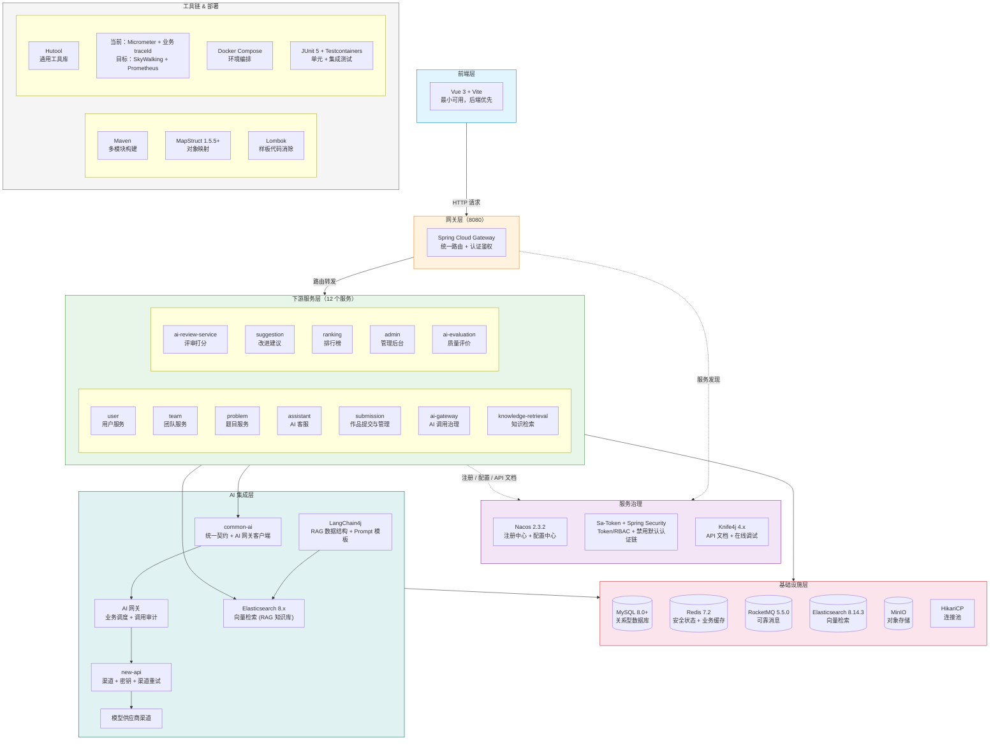

## 技术栈选型

> 创建日期：2026-07-25
> 当前实现核验：2026-09-01
> 选型原则：服务于面试展示（Java 后端实习）+ 微服务架构落地 + 版本兼容性优先

---

### 一、选型总览



---

### 二、基础框架层

#### 2.1 Java & Spring 生态

| 组件 | 选型 | 版本 | 选型理由|
|------|------|------|---------|
| **JDK** | Java 17 LTS | 17.0.x | 企业主流 LTS，Spring Boot 3.x 基线要求，面试高频（Record、Sealed Class、Pattern Matching、Text Block）|
| **Spring Boot** | Spring Boot | 3.3.x | 3.x 要求 Java 17+，2.7.x 已停止维护|
| **Spring Cloud** | 微服务框架规范 | 2023.0.x | 提供 Gateway、LoadBalancer 等微服务基础设施抽象|
| **Spring Cloud Alibaba** | 阿里中间件集成 | 2023.0.1.x | 实现 Spring Cloud 规范，集成 Nacos（注册/配置中心）|

> **两者的关系**：Spring Cloud 提供服务发现、路由和负载均衡等抽象，Spring Cloud Alibaba 在本项目中提供 Nacos 集成。项目当前没有引入 Sentinel 依赖；AI 容量由 AI 网关调度，业务长任务由有界 Worker 和积压保护治理。

**面试可讲点**：

- 为什么选 Java 17 而不是 8 或 21？—— 17 是企业主流 LTS 版本，既能展示对新特性的掌握，又不会因 21 过于前沿导致面试官无法深入提问
- Spring Boot 3.x 相比 2.x 的核心变化：Jakarta EE 迁移（`javax.*` → `jakarta.*`）、原生镜像支持、Observability（Micrometer Tracing 替代 Sleuth）

#### 2.2 构建工具 & 项目结构

| 组件 | 选型 | 选型理由|
|------|------|---------|
| **构建工具** | Maven | 国内 Java 岗位 90%+ 用 Maven，多模块项目通过父 POM 统一依赖版本管理，面试展示标准的工程化能力|
| **项目结构** | Maven 多模块 | 1 个父 POM、6 个公共 Jar 和 14 个可独立启动的服务 |

---

### 三、数据存储层

#### 3.1 关系型数据库

| 组件 | 选型 | 版本 | 选型理由|
|------|------|------|---------|
| **数据库** | MySQL | 8.0+ | 国内 Java 岗位事实标准，面试必考索引、锁机制、事务隔离级别、SQL 优化|
| **ORM** | MyBatis-Plus | 3.5.7+ | 零 SQL 写 CRUD + 复杂查询手写 SQL 灵活可控，比 JPA 更贴合国内实际开发习惯|
| **连接池** | HikariCP | 随 Spring Boot | Spring Boot 3.x 默认，Java 生态最快连接池，无需额外配置|

**依赖坐标**：

```xml
<!-- MyBatis-Plus 3.5.7+，注意必须用 spring-boot3-starter 变体 -->
<dependency>
    <groupId>com.baomidou</groupId>
    <artifactId>mybatis-plus-spring-boot3-starter</artifactId>
    <version>3.5.7</version>
</dependency>
<!-- 分页插件依赖 -->
<dependency>
    <groupId>com.baomidou</groupId>
    <artifactId>mybatis-plus-jsqlparser</artifactId>
    <version>3.5.7</version>
</dependency>
```

> ⚠️ **版本冲突点**：MyBatis-Plus 3.5.5 以下不兼容 Spring Boot 3.x，artifact 必须带 `-spring-boot3-starter` 后缀。

#### 3.2 缓存

| 组件 | 选型 | 版本 | 选型理由|
|------|------|------|---------|
| **缓存中间件** | Redis | 7.x | Java 生态唯一选择，用于 Token 黑名单、验证码、热点数据缓存、排行榜缓存|
| **客户端** | Lettuce | 随 Spring Boot | Spring Boot 3.x 默认，基于 Netty 实现响应式/非阻塞，连接池天然优于 Jedis|

**面试可讲点**：Lettuce 基于 Netty 事件驱动模型（NIO）vs Jedis 的 BIO 同步阻塞模型。

#### 3.3 对象存储

| 组件 | 选型 | 版本 | 选型理由|
|------|------|------|---------|
| **文件存储** | MinIO | Java SDK 8.5.10；Docker 当前使用 `minio/minio:latest` | 开源 S3 兼容对象存储，本地开发成本低。当前容器镜像未固定版本，是可复现性风险；修复前不能把它描述为固定基线 |

**面试可讲点**：为什么用对象存储而不是存数据库 BLOB？—— 文件与元数据分离、CDN 加速、避免数据库膨胀

---

### 四、消息中间件

| 组件 | 选型 | 版本 | 选型理由|
|------|------|------|---------|
| **消息队列** | Apache RocketMQ | Broker Docker 5.5.0，Spring 2.3.3 | 以 NORMAL Topic 承载跨服务任务与业务事件，使用事务 Outbox、消费 Inbox、Broker 重试和 DLQ 保证可恢复传递；完整设计见 [RocketMQ 消息队列](RocketMQ消息队列.md) |

**本项目 MQ 消息链路**：

| 生产者 | 消息类型 | 消费者 | 说明|
|--------|---------|--------|------|
| submission-service | `REVIEW_TASK_READY` | ai-review-service | 提交事务与 Outbox 同时落库，消费方只快速创建评审任务 |
| ai-suggestion-service API | `SUGGESTION_TASK_READY` | ai-suggestion-service worker | 任务事实先落本服务数据库，消息作为可靠唤醒信号 |
| ai-evaluation-service | `EVALUATION_SLOT_READY` | ai-evaluation-service worker | 后台评价运行槽位使用独立 Topic 与低并发工作池 |
| submission-service | `FINAL_SUBMISSION_CHANGED` | ranking-service | 最终提交变化后合并单题重建请求 |
| ai-review-service | `REVIEW_COMPLETED` | ranking-service | 评审完成后合并单题重建请求 |

**面试可讲点**：项目不为了展示功能而强制使用事务、延迟或顺序消息。首期选择普通消息加事务 Outbox，生产端可查询补发，消费端用 Inbox 与领域唯一键承受至少一次投递，长任务继续由数据库租约恢复。Broker 重试只处理短暂消费故障，不承担业务流程编排。

---

### 五、服务治理

#### 5.1 注册中心 & 配置中心

| 组件 | 选型 | 版本 | 选型理由|
|------|------|------|---------|
| **注册中心** | Nacos | 2.3.2 | 注册中心 + 配置中心一体，本地使用单机 Derby 和命名卷 |
| **配置中心** | Nacos | 2.3.2 | 配置加载和多环境隔离 |

**面试可讲点**：Nacos CAP 理论实践——默认 AP 保证可用性，可通过配置切换为 CP 保证一致性

#### 5.2 API 网关

| 组件 | 选型 | 版本 | 选型理由|
|------|------|------|---------|
| **网关** | Spring Cloud Gateway | 随 Spring Cloud | 基于 WebFlux 响应式，性能优于 Zuul（已停更）|

#### 5.3 认证鉴权

| 组件 | 选型 | 版本 | 选型理由|
|------|------|------|---------|
| **认证框架** | Sa-Token + Spring Security 6 | sa-token 1.37+ | Sa-Token 轻量权限框架，注解式鉴权（`@SaCheckRole("VIP")`），天然支撑 VIP/普通用户/管理员三级 RBAC|
| **令牌** | JWT + Redis 黑名单 | - | JWT 无状态签发 + Redis 黑名单实现主动失效（踢人下线、强制登出）|

**JWT 无状态性与黑名单的设计权衡**：

JWT 的设计理念是"无状态"——服务端不存 Session，靠签名自包含验证。但纯无状态 JWT 存在一个致命缺陷：**无法主动失效**。签发的 Token 在过期前始终有效，无法实现"踢人下线"或"强制登出"。

本项目通过 Redis 维护 Token 黑名单来补上这块能力：Token 校验时先查 Redis 黑名单，命中则拒绝。代价是每次请求多一次 Redis 查询，换来主动 Token 管理的灵活性。

**依赖坐标**：

```xml
<dependency>
    <groupId>cn.dev33</groupId>
    <artifactId>sa-token-spring-boot3-starter</artifactId>
    <version>1.38.0</version>
</dependency>
<!-- Sa-Token 整合 JWT -->
<dependency>
    <groupId>cn.dev33</groupId>
    <artifactId>sa-token-jwt</artifactId>
    <version>1.38.0</version>
</dependency>
```

**面试可讲点**：
- 为什么选 Sa-Token 而不是手写 Security 配置？—— 开发效率与可维护性的权衡，Sa-Token 的 `@SaCheckRole` 注解 + 自动 Token 续期 + 踢人下线比手写更可靠
- JWT 无状态 vs 黑名单矛盾吗？—— 不矛盾，这是"无状态签发 + 有状态增强"的混合模式：签发时保持无状态优势（不查库），校验时通过黑名单补齐主动失效能力。面试官如果问"JWT 怎么实现踢人下线"，这就是标准答案

#### 5.4 当前容量与故障治理

项目当前没有引入 Sentinel，也没有通用的网关 QPS 规则或供应商主备切换。已落地的容量治理按职责分层：

- AI 网关使用持久化原子任务、P0 至 P4 优先级、公平调度、deadline、有界队列和派发速率控制。
- ai-review、ai-suggestion、ai-evaluation 与 ranking 使用有界 Worker、租约、积压水位和恢复对账。
- new-api 独占供应商渠道限流、渠道重试、额度和健康治理；LeetModel 不按供应商维度复制一套熔断器。
- Feign 降级与明确业务错误负责依赖失败表达，不伪装成功。

只有通用服务流量出现可测瓶颈时，才重新评估 Sentinel、Resilience4j 或网关原生限流。

---

### 六、AI 集成层

#### 6.1 LLM 框架

| 组件 | 选型 | 版本 | 选型理由|
|------|------|------|---------|
| **LLM 框架** | LangChain4j | 0.34.0 | 已通过切分、摄取、自定义 Embedding 和 Top K 召回实验；固定结论见 [LangChain4j兼容性核验.md](LangChain4j兼容性核验.md) |

**本项目 AI 使用场景**：

| 服务 | 场景 | LangChain4j 能力|
|------|------|-----------------|
| assistant | 多轮对话、受控工具和客服 RAG V1 | 数据库消息历史、自定义 `tool_calls` 编排、Embedding 与 RAG 数据结构 |
| ai-review-service | 多维度评审打分 | 结构化输出（Schema）+ Prompt 模板|
| suggestion | 论文改进建议 | Prompt 模板与结构化输出；不是 RAG V1 首个消费者 |

业务服务通过 `common-ai` 调用 AI 网关，不直接集成模型供应商。工作流或实验配置在任务创建时锁定每个步骤使用的精确模型和参数；AI 网关负责校验固定绑定和 LeetModel 业务调度，new-api 负责同一模型名下的供应商渠道选择，不跨模型动态切换。

**面试可讲点**：AI Agent 设计模式——LangChain4j 的 Tool Calling 机制让 LLM 能主动查询题目库/用户历史，而不是被动回答问题

#### 6.2 检索引擎

| 组件 | 选型 | 版本 | 选型理由|
|------|------|------|---------|
| **搜索引擎** | Elasticsearch | 8.14.3 | 当前用于 RAG 向量索引与 KNN 检索；公开题库筛选仍由 MySQL 提供 |

**本项目 ES 使用场景**：

| 模块 | 场景 | ES 能力|
|------|------|---------|
| ai-assistant-service | 客服 RAG V1 的索引构建、别名切换和向量召回 | dense_vector + KNN |
| knowledge-retrieval-service | 为论文建议执行版本化向量查询 | dense_vector + KNN |

**面试可讲点**：ES 倒排索引原理、TF-IDF/BM25 相关性打分、dense_vector 的 KNN 搜索 vs 传统全文搜索的区别

---

### 七、接口文档 & 开发调试

| 组件 | 选型 | 版本 | 选型理由|
|------|------|------|---------|
| **API 文档** | Knife4j | 4.5.0 | 基于 SpringDoc OpenAPI 2.x 增强，现代 UI + 在线调试，后端独立开发时一键接口测试|
| **外部调试** | Apifox | - | 作为辅助工具，与 Knife4j 互补|

**依赖坐标**：

```xml
<!-- Knife4j 4.x → SpringDoc OpenAPI 2.x → Swagger 3 -->
<dependency>
    <groupId>com.github.xiaoymin</groupId>
    <artifactId>knife4j-openapi3-jakarta-spring-boot-starter</artifactId>
    <version>4.5.0</version>
</dependency>
```

> ⚠️ **版本冲突点**：Spring Boot 3.x 使用 Jakarta EE（`jakarta.*`），Knife4j artifact 必须带 `jakarta` 后缀，否则运行时报 500 错误。

---

### 八、工具库

| 组件 | 版本 | 选型理由|
|------|------|---------|
| **Lombok** | 1.18.x | Spring Boot 标配，编译期生成 getter/setter/Builder/日志，避免样板代码|
| **MapStruct** | 1.5.5+ | 编译期生成对象映射代码，零反射，比 BeanUtils 快 10-20 倍，字段名对不上编译即报错|
| **Hutool** | 5.8.x | Java 通用工具库，字符串/日期/JSON/文件/加密一把梭，国内项目事实标准|

**依赖坐标**：

```xml
<dependency>
    <groupId>org.mapstruct</groupId>
    <artifactId>mapstruct</artifactId>
    <version>1.5.5.Final</version>
</dependency>
```

> ⚠️ **版本冲突点**：MapStruct 1.5.x 以下在 Java 17 Record 类型上编译失败，必须 1.5.5+。

**面试可讲点**：

- Lombok：JSR 269 编译期注解处理原理——不是反射，是在 `javac` 编译阶段通过 `annotationProcessor` 生成 AST 节点
- MapStruct vs BeanUtils：编译期生成 vs 运行时反射，性能差一个量级，而且字段映射错误在编译阶段就能发现

---

### 九、可观测性

当前 14 个服务已统一接入 Micrometer、Prometheus Registry、受保护的 Actuator 抓取、六类 Grafana 看板和 22 条主动告警，但仍没有引入 Micrometer Tracing bridge。跨服务关联依靠项目自定义 `X-Trace-Id`、MDC、Feign 拦截器、消息信封和数据库 `traceId` 字段。

目标方案采用 SkyWalking 与 Prometheus 分工：SkyWalking 是唯一分布式 Trace/APM 和日志关联实现；Micrometer + Prometheus 是指标采集与时序事实来源，Grafana 展示，Alertmanager 负责通知。业务 `traceId` 保留为跨长耗时任务、进程重启和采样边界的持久关联 ID，不被 SkyWalking Trace ID 替换。

| 能力 | 当前基线 | 目标选型 | 边界 |
|------|----------|----------|------|
| Metrics | Micrometer + Prometheus 已覆盖标准运行时与核心业务指标 | Micrometer + Prometheus | 低基数指标和告警权威来源，不保存业务 ID |
| Trace/APM | 自定义 `traceId` 关联，无 Span/拓扑 | Apache SkyWalking Java Agent + OAP + UI | 唯一 Trace 实现；不同时启用 Micrometer Tracing/OTel Trace Exporter 重复建 Span |
| 业务关联 | `X-Trace-Id`、MDC、消息信封和数据库字段 | 保留并与 `swTraceId` 双向关联 | 跨 HTTP、MQ、领域任务、AI attempt 和采样边界持久化 |
| 日志 | SLF4j + Logback，部分服务自定义文本格式 | 统一 Logback JSON + SkyWalking 日志接收/LAL | 解释技术执行，不替代操作审计 |
| 看板与告警 | Grafana 六类看板、22 条主动规则、Alertmanager 路由与 Runbook 已落地 | Grafana + Alertmanager | Prometheus 规则为唯一告警计算与通知入口；生产通知凭据由部署环境提供 |
| 操作审计 | 分散领域记录，不完整 | 业务审计 Outbox + RocketMQ + audit-service | 语义在业务所有者，中央不可变归档和查询 |

**日志输出示例**（带 traceId）：

```
2026-07-25 10:30:15.123 [submission,abc123def456,user123] INFO  c.l.s.controller.SubmissionController - 作品提交成功
                        ^^^^^^^^ ^^^^^^^^^^^^^^
                        服务名    traceId
```

**面试可讲点**：长耗时 AI 任务不建立一个持续数分钟的 Span。HTTP 接收、MQ 投递、Worker 每次 attempt 和 AI 原子调用分别形成有界 Trace，再用持久化业务 `traceId + domainTaskId + attemptNo + aiCallId` 关联。指标先发现影响，SkyWalking 定位执行阶段，结构化日志解释错误，业务事实与操作审计确认结果和责任。

完整的边界、字段、故障语义和实施顺序见 [可观测性与系统保障](可观测性与系统保障.md)、[日志系统](日志系统.md) 与 [操作审计架构](操作审计架构.md)。

---

### 十、测试框架

| 组件 | 选型理由|
|------|---------|
| **JUnit 5** | Spring Boot 3.x 默认测试框架|
| **Mockito** | Mock 外部服务调用，单元测试核心|
| **Testcontainers** | 部分数据库集成测试使用真实 MySQL；Redis、RocketMQ 等外部协议通过显式门禁和本地真实服务验证 |
| **Spring Boot Test** | 切片测试（`@WebMvcTest`、`@DataJpaTest`），按层隔离测试|

**面试可讲点**：Testcontainers 替代 H2 做集成测试——H2 是 Java 内存数据库，SQL 方言与 MySQL 不同导致"测试全过、上线炸"，Testcontainers 启动真实 Docker 中间件彻底解决这个问题。这是初级和高级开发者在测试实践上的分水岭。

---

### 十一、容器化 & 部署

| 组件 | 用途|
|------|------|
| **Docker Compose** | 本地基础设施编排，启动 MySQL、双 Redis、MinIO、Nacos、new-api、Elasticsearch 和 RocketMQ |
| **业务服务启动脚本** | `start-mvp.sh` 构建并以本地 JDK 启动 14 个服务；当前仓库没有每服务 Dockerfile |
| **K8s（预留）** | 面试提一句"后续可迁移到 K8s 做服务编排"，实际不做|

---

### 十二、版本兼容性总表

| 框架 | 版本 | 兼容要点|
|------|------|---------|
| JDK | 17 LTS | Spring Boot 3.x 硬性要求 Java 17+|
| Spring Boot | 3.3.x | Jakarta EE 迁移（`javax.*` → `jakarta.*`）|
| Spring Cloud | 2023.0.x | 对应 Spring Boot 3.3.x|
| Spring Cloud Alibaba | 2023.0.1.0 | 对应 Spring Cloud 2023.0.x，当前只使用 Nacos 相关集成 |
| MyBatis-Plus | 3.5.7+ | 必须用 `-spring-boot3-starter` artifact 变体|
| MyBatis-Plus JSqlParser | 3.5.7+ | 分页插件依赖，不可遗漏|
| Sa-Token | 1.38.0+ | 必须用 `-spring-boot3-starter` 变体|
| 可观测性 | 当前 Micrometer + 自定义 `traceId`；目标 SkyWalking + Prometheus/Grafana/Alertmanager | SkyWalking 是唯一 Trace 实现；Prometheus 是指标与告警权威来源；业务 `traceId` 保留 |
| Knife4j | 4.5.0 | artifact 必须带 `jakarta` 后缀|
| MapStruct | 1.5.5+ | 1.5.x 以下不支持 Java 17 Record|
| LangChain4j | 0.34.0 | 核心与 Elasticsearch 集成统一锁定；自定义 Embedding 适配已在 Java 17 编译验证 |
| Elasticsearch | 8.x | 与 `spring-boot-starter-data-elasticsearch` 集成|
| RocketMQ | Broker Docker 5.5.0，Spring 2.3.3 | JDK 17、Spring Boot 3、历史 Remoting 客户端、显式 NORMAL Topic、重复投递和重启恢复已真实验证 |

---

### 十三、决策记录

| # | 决策 | 备选方案 | 选择理由|
|----|------|---------|---------|
| 1 | Java 17 + Spring Boot 3.3.x | Java 21 / Java 8 + Boot 2.7 | 企业主流 LTS + Boot 3.x 新特性 + 面试高频|
| 2 | MyBatis-Plus 3.5.7 | JPA / 纯 MyBatis | 开发效率 + 复杂查询灵活可控|
| 3 | RocketMQ Broker Docker 5.5.0 | RabbitMQ / Kafka | Java 生态与消费组、重试、DLQ 和多消息类型能力完整；项目用 Outbox/Inbox 明确承担端到端可靠性 |
| 4 | MinIO | 本地文件系统 / 阿里云 OSS | S3 兼容 + Docker 零成本 + 后续可迁移|
| 5 | Nacos 2.x | Consul / Eureka | 注册+配置一体 + 国内事实标准|
| 6 | 分层容量治理，不引入 Sentinel | Sentinel / Resilience4j | AI 调度、领域 Worker 与 new-api 渠道治理边界已经落地；通用限流等待真实瓶颈触发 |
| 7 | Sa-Token + Spring Security 6 | 纯 Security / Shiro | 轻量注解式鉴权 + 天然支持 RBAC|
| 8 | LangChain4j 0.34.0 + 项目内适配 | Spring AI / 全量升级 | 保留已验证的 Prompt、Embedding 和 RAG 数据结构，模型网络调用统一经过 common-ai 与 AI 网关 |
| 9 | Elasticsearch 8.x | 仅 MySQL 检索 / Milvus | 全文+向量一体，一个引擎两个场景|
| 10 | common-ai + AI 网关 | 业务服务直接调用供应商 | 复用客户端契约，集中密钥、路由、稳定性与成本治理|
| 11 | Knife4j 4.5.0 + Apifox | 仅 Apifox 手动维护 | 代码与文档同步 + 在线调试|
| 12 | Maven 多模块 | Gradle | 国内主流 + 父 POM 统一版本管理|
| 13 | MapStruct 1.5.5+ | BeanUtils / 手写 | 编译期生成 + 类型安全 + 性能优|
| 14 | Testcontainers | H2 内存库 | 真实环境集成测试，避免 SQL 方言差异|
| 15 | 自定义 traceId + Micrometer Metrics | Micrometer Tracing / OpenTelemetry | 已覆盖 HTTP、Feign、消息和任务关联；完整 span 能力在出现真实排障需求后再引入 |
| 16 | Docker Compose | K8s / 裸跑 | 本地开发环境一键编排，15天周期合理选择|
