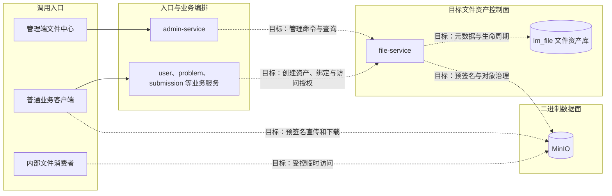
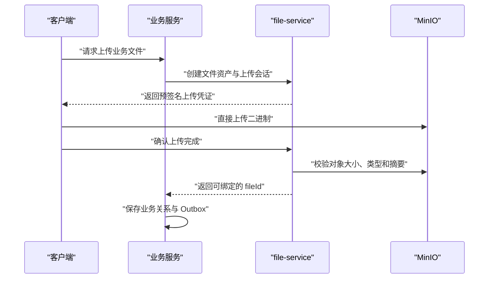
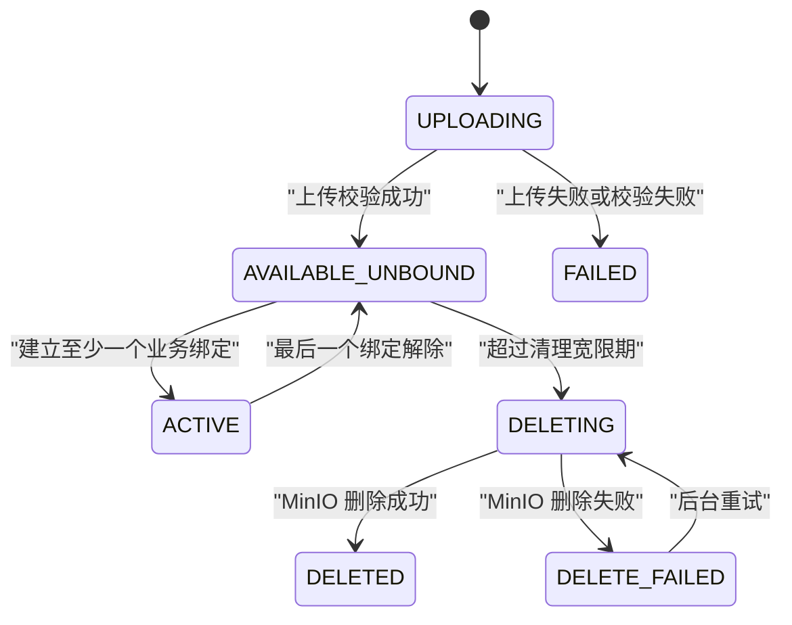

## 文件资产管理架构

> 设计状态：方向已确认，尚未实施。当前代码仍由 user-service、problem-service、submission-service 等服务分别访问 MinIO，数据库也仍保存各自的对象路径。本文描述目标架构与迁移边界，不能当作当前运行事实。

### 文档目标

本文解决全平台文件应由公共 Jar、admin-service、业务服务还是独立微服务管理的问题，并确定文件资产、业务引用、二进制对象和管理入口的职责边界。

设计需要同时处理以下方面：

- 文件资产的稳定身份、技术元数据和生命周期。
- 题目附件、头像、论文等业务关系的数据所有权。
- 管理员手动上传、逻辑分组、查询、临时链接和删除能力。
- 大文件上传的数据链路、服务负载和 MinIO 凭证边界。
- 跨服务绑定的最终一致性、删除保护和失败补偿。
- 现有共享 Bucket 与历史对象的渐进迁移。

### 总体概览

实线表示当前已经存在的入口关系，虚线表示 file-service 建成后的目标关系。file-service 是文件资产控制面，不应成为所有二进制字节必经的网络中转站。

### 核心决策

| 决策点 | 已确认结论 | 主要原因 |
|------|----------|----------|
| 服务归属 | 建设独立 file-service | 文件已经形成跨业务复用的稳定身份、访问策略、生命周期和治理需求 |
| 管理入口 | admin-service 只代理 file-service | admin-service 按既有约束保持无状态，不拥有文件资产事实 |
| 业务归属 | 业务服务继续拥有附件、头像选择和提交版本等关系 | 文件服务不能吞并领域规则 |
| 二进制存储 | MinIO 继续保存文件字节 | 避免数据库 BLOB 和业务数据库膨胀 |
| 数据传输 | 控制面与数据面分离 | 大文件优先预签名直传，避免 file-service 成为带宽瓶颈 |
| 文件链接 | 保存 fileId 和 objectKey，不保存预签名 URL | 预签名 URL 有时效，不能作为稳定事实 |
| 引用治理 | file-service 保存引用投影，业务服务仍是关系事实源 | 支持统一删除保护，同时避免复制业务主数据 |
| 一致性 | Outbox 事件、幂等消费和延迟清理 | 不使用跨库分布式事务，不因短暂不同步误删对象 |
| 分组 | namespace 与 groupPath 是逻辑事实，objectKey 是物理路由 | 防止仅靠字符串前缀推断业务归属 |
| 删除 | 先解除引用，再逻辑删除，最后延迟物理清理 | 为消息延迟、误操作和恢复保留安全窗口 |

### 方案比较

#### 公共 Jar 加业务服务自治

公共 `StorageService` 适合隔离 MinIO SDK、生成对象 Key、上传、下载、预签名和删除。它不拥有运行时状态，无法回答文件归属、访问级别、引用来源和清理期限。

当文件只属于单一业务且没有统一治理需求时，这种方式最简单。LeetModel 已经出现管理员手动资产、跨服务文件清单和统一删除保护需求，因此仅靠公共 Jar 已不足以支撑目标能力。

#### 集成到 problem-service

problem-service 只拥有题目、题面和题目附件。它无法解释头像、论文、上传分片和 AI 中间文件。由它扫描或删除整个共享 Bucket 会越过数据所有权边界，因此只允许它维护题目附件关系，不允许它长期承担全桶管理。

#### 集成到 admin-service

admin-service 是管理入口与跨服务聚合层。按照当前架构，它没有独立业务数据库，不复制下游事实，也不执行领域事务。把文件元数据、上传状态和生命周期写入 admin-service 会把无状态编排层变成隐藏的文件领域服务。

admin-service 可以代理文件查询和管理命令，但不能成为普通用户上传依赖，也不能拥有文件资产表。

#### 独立 file-service

独立服务只有在承担文件身份、元数据、访问策略、生命周期、引用治理和存储盘点时才成立。如果它只是接收 MultipartFile 后再调用 MinIO，就是分布式工具类，会增加一次网络传输、故障点和部署成本而没有形成数据主权。

LeetModel 的目标 file-service 必须是控制面服务，二进制数据面仍尽量由客户端或受控内部消费者直接访问 MinIO。

### 职责与数据所有权

| 能力或事实 | 所有者 | 说明 |
|-----------|-------|------|
| 文件稳定身份与技术元数据 | file-service | 包含 fileId、objectKey、大小、媒体类型、摘要和状态 |
| 文件逻辑命名空间与分组 | file-service | namespace 由系统控制，groupPath 按授权维护 |
| 上传会话与对象校验 | file-service | 管理上传凭证、完成确认、HEAD 校验和失败状态 |
| 预签名访问策略 | file-service | 按调用方、文件级别和用途生成有界时效地址 |
| 文件引用投影 | file-service | 用于治理和删除保护，不替代业务主数据 |
| 题目附件说明、顺序与题目归属 | problem-service | 题目附件关系仍是题目领域事实 |
| 用户当前头像 | user-service | 用户服务决定哪个文件是当前头像 |
| 论文版本、最终提交和上传流程 | submission-service | 提交服务拥有论文业务状态与临时分片流程 |
| 管理员入口、权限和跨服务展示 | admin-service | 只代理和聚合，不保存文件资产副本 |
| 文件二进制 | MinIO | 不写入关系数据库 BLOB |

### 文件资产与业务引用

目标数据模型分为物理资产事实和业务引用投影。

`file_asset` 至少表达以下信息：

- 稳定 fileId、存储提供方、Bucket 和唯一 objectKey。
- 原始文件名、媒体类型、文件大小和内容摘要。
- namespace、groupPath、访问级别和来源类型。
- 上传者、生命周期状态、创建时间和删除时间。

`file_binding` 至少表达以下信息：

- fileId、ownerService、resourceType 和 resourceId。
- 绑定状态、事件版本和幂等标识。

业务服务只保存稳定 fileId 和自己的业务字段。file_binding 是从业务事件形成的治理投影，不得被当作题目附件、当前头像或最终提交的唯一事实源。

完整拟议数据边界由 [file-service 数据与分组设计](../03-微服务设计/file-service/文件资产管理/数据与分组.md) 维护。

### 上传与访问

后台小文件可以由 file-service 代理上传。论文等大文件优先采用预签名直传。内部消费者使用受控临时地址或由文件所有者提供的内部读取契约，不长期保存临时 URL。

### 引用一致性与生命周期

业务关系和文件资产分属不同数据库，不能依赖一次同步双写获得强一致。目标流程是：

1. 上传完成后文件进入 `AVAILABLE_UNBOUND`。
2. 业务服务在本地事务保存业务关系和绑定 Outbox。
3. file-service 幂等消费绑定事件并更新 file_binding。
4. 解绑同样由业务服务本地事务产生事件。
5. 最后一个引用解除后只进入待清理状态，不立即物理删除。
6. 宽限期结束且引用投影仍为空时，后台任务删除 MinIO 对象。
7. 删除失败进入可重试状态，保留 objectKey 和失败信息。

详细规则由 [引用与删除设计](../03-微服务设计/file-service/文件资产管理/引用与删除.md) 维护。

### 命名空间与文件类型

namespace 由系统控制，不能允许管理员随意向业务命名空间制造未绑定对象。

| 文件类型 | 目标 namespace | 生命周期边界 |
|---------|----------------|-------------|
| 题目附件 | problem | file-service 管物理资产，problem-service 管附件关系 |
| 用户头像 | avatar | file-service 管物理资产，user-service 管当前头像选择 |
| 正式论文 PDF | submission | file-service 管正式文件，submission-service 管提交版本 |
| 上传分片 | submission-temp | 保留在提交上传流程，使用独立临时生命周期和自动过期策略 |
| 管理员手动素材 | manual | 由 file-service 直接管理和分组 |
| AI 中间文件 | ai-temp | 由所属 AI 服务声明用途并配置明确过期时间 |

管理员第一阶段只能在 `manual` 命名空间创建自定义 groupPath。系统业务命名空间必须由对应业务服务声明用途后创建文件。

### 删除与高风险操作

普通删除必须经过引用校验、逻辑删除和延迟物理清理。管理页面不能把“引用投影为空”直接等同于“绝对没有业务引用”。当绑定消费积压、引用快照过期或所属服务不可用时，删除应 fail-closed。

强制物理删除属于独立高风险能力，不能与普通删除共用一个按钮。若未来开放，必须要求更高权限、填写原因、记录不可变审计，并展示已知引用和影响范围。

### Bucket 与凭证边界

共享 Bucket 便于当前本地开发，但单一高权限凭证会扩大误删和泄漏影响。目标上应至少按访问级别和生命周期区分：

- 永久私有文件 Bucket。
- 可公开读取的资产 Bucket。
- 临时上传与分片 Bucket，并配置自动过期。

file-service 持有正式资产 Bucket 的存储权限。submission-service 在迁移期间可以保留临时 Bucket 的受限凭证，用于分片合并，不因此获得永久资产 Bucket 的全量删除权限。

### 渐进迁移

1. 建立 file-service、lm_file、文件资产 API 和管理端代理入口。
2. 扫描现有 Bucket，将历史对象登记为 `DISCOVERED`，此状态默认禁止删除。
3. 先迁移管理员手动素材和题目附件，验证上传、绑定、访问与删除闭环。
4. 再迁移头像和正式论文文件。
5. 论文临时分片继续由 submission-service 管理，待独立验证后再决定是否统一。
6. 各业务完成迁移后，回收其正式资产 Bucket 的宽权限凭证。
7. 对账任务持续比较 MinIO 对象、file_asset 和业务绑定事件，显式报告缺失对象与未知对象。

迁移期间必须区分当前 objectKey 和目标 fileId，不能在尚未完成数据迁移时修改文档声称 file-service 已经是唯一入口。

### 非目标

- 当前设计不包含服务端静态图标和宣传图片的动态替换。
- 当前设计不包含 Markdown 外部资源自动下载和链接替换。
- 当前设计不包含压缩包解压、内容预览或恶意内容扫描。
- 当前设计不要求首期统一接管论文临时分片。
- 当前设计不使用关系数据库保存文件 BLOB。
- 当前设计不允许 admin-service 直连业务数据库或复制业务关系主数据。

### 设计后果

该方案增加一个可部署服务、独立数据库、服务调用和异步一致性治理，实施成本高于直接扫描 MinIO。收益是文件拥有稳定身份、权限和生命周期，管理端不再根据路径猜测归属，也能逐步收敛分散凭证和不安全物理删除。

如果未来只保留一个简单的本地开发桶浏览器，独立服务的成本不成立。但只要继续要求全平台文件台账、手动资产、跨服务删除保护和统一访问策略，file-service 就是独立且可解释的限界上下文。
