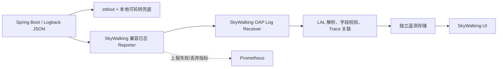

## 日志系统

> 设计状态：目标设计已确认，尚未完成全服务 JSON 日志、SkyWalking 日志上报、LAL 规则、保留策略和中央查询验收。当前只有 gateway、user 和 problem 服务存在自定义 `logback-spring.xml`，启动脚本将各服务 stdout 重定向到本地文件。

### 目标与分类

日志系统负责解释技术执行，不担任业务主数据、领域历史或不可变操作审计。

| 日志类型 | 内容 | 主要用途 |
|----------|------|----------|
| Access | 路由模板、HTTP 方法、状态码、耗时、响应错误码 | 流量与失败入口排查 |
| Application | 关键状态转换、依赖调用、降级、重试、异常 | 技术根因定位 |
| Async task | Outbox/MQ/Inbox、任务领取、租约、heartbeat、attempt、fencing | 长耗时异步链路解释 |
| Security event | 登录失败、鉴权拒绝、非法 Token、输入校验攻击特征 | 安全监测；高风险事件同时生成操作审计 |
| Infrastructure | MySQL、Redis、RocketMQ、Nacos、MinIO、ES、OAP 自身日志 | 依赖和采集链路排查 |

### 统一结构

所有 Java 服务使用同一份可版本化 JSON 字段规范。稳定字段为：

| 字段组 | 字段 |
|--------|------|
| 时间与级别 | `timestamp` UTC ISO-8601、`level`、`eventCode`、`message` |
| 资源 | `service`、`environment`、`serviceVersion`、`instance`、`logger`、`thread` |
| 调用关联 | `traceId`、`swTraceId`、`swSpanId`、`requestId` |
| HTTP | `httpMethod`、`routeTemplate`、`statusCode`、`durationMs`、`errorCode` |
| 业务关联 | `businessType`、`businessId`、`domainTaskId`、`attemptNo`、`eventId`、`aiCallId` |
| 异常 | `exceptionType`、`failureCategory`、脱敏栈信息 |

`eventCode` 是稳定机器可查字段，如 `REVIEW_TASK_LEASE_EXPIRED`、`AI_CALL_RESULT_UNKNOWN`、`OUTBOX_PUBLISH_RETRY`，不使用中文 message 当聚合维度。`routeTemplate` 记录 `/api/users/{id}` 而不是带真实主键的 URL。`service`、`environment`、`serviceVersion` 和 `instance` 在进程启动时确定，不允许业务请求覆盖。

### 输出、采集与查询

首期复用 SkyWalking 的日志接收、LAL 和 Trace 关联，不同时引入 Loki/ELK 建第二套业务日志主存储。如果后续的全文检索、保留或多数据源需求超出 SkyWalking 边界，再以同一 JSON 契约接入专用日志平台。

日志上报必须异步且有界：OAP 不可用时不阻塞请求、MQ Consumer 或 AI Worker。本地 stdout 始终保留，开发脚本继续可将其重定向到文件。队列溢出时先丢弃 DEBUG/INFO 且递增 Prometheus 丢弃指标，不允许无界内存缓冲。

### 级别与事件规则

| 级别 | 使用条件 |
|------|----------|
| ERROR | 未知系统异常、数据一致性风险、无法自动恢复、AI UNKNOWN、审计可能丢失 |
| WARN | 已知降级、依赖短故障、有界重试、租约过期、鉴权/校验拒绝 |
| INFO | 服务启停、脱敏配置摘要、关键领域终态和人工恢复结果 |
| DEBUG | 本地开发与短时受控排障，生产默认关闭 |
| TRACE | 默认关闭，不对全服务开启 |

预期业务拒绝不打 ERROR 堆栈。同一任务的心跳成功不每次打 INFO；只在领取、丢失、过期、终态和超阈值时记录。重复依赖故障日志采用限频和汇总，具体数量交给 Prometheus 计数，避免积压期日志风暴。

### AI 与异步链路必需日志

| 阶段 | 必需标识和状态 |
|------|------------------|
| 任务创建 | `traceId`、`domainTaskId`、工作流版本、排队结果 |
| Outbox Relay | `eventId`、事件类型、attempt、发布结果、耗时；无 Payload |
| Inbox Consumer | `eventId`、消费组、首次/重复、事务结果；不在消费线程写 AI 详细 |
| Worker 领取 | `domainTaskId`、`attemptNo`、租约 owner/fencing token 的安全摘要 |
| 依赖阶段 | PDF 版本、RAG/工作流/模型配置版本、状态、耗时；无内容 |
| AI 调用 | `aiCallId`、功能/操作编码、优先级、排队/执行/总耗时、结果类型 |
| 任务终态 | 终态、failure category、本次耗时、是否等待人工处置 |

### 脱敏与注入防护

以下内容不得记录：Authorization/Cookie/JWT/Session、密码与验证码、数据库/对象存储/模型渠道凭据、完整请求与响应体、论文与 PDF 解析正文、Prompt、AI 回答、RAG 知识片段、Embedding 向量、RocketMQ Payload、幂等键和完整第三方 URL 查询参数。

用户输入、第三方错误、User-Agent 和异常 message 在入日志前统一限长、移除 CR/LF/分隔符并按字段规则脱敏，防止日志注入。GlobalExceptionHandler 对客户端仍返回稳定错误，日志仅保存错误码、异常类型和脱敏摘要。

### 查询、保留与权限

- SkyWalking UI、OAP 查询端口不经公网 Gateway 暴露，只供内部运维角色访问。
- 运行日志、Trace 和审计使用分离的保留策略；日志与 Trace 保留期根据写入量和排障窗口配置，不因审计长期要求无限保留。
- 生产 SkyWalking 遥测存储与 LeetModel RAG Elasticsearch 隔离；本地开发如复用单机资源也必须用独立 namespace/数据目录且不对外推导生产容量。
- 日志导出、日志级别修改、保留策略修改和遥测管理权限变更进操作审计。

### 可观测性与验收

Prometheus 至少监测日志上报成功/失败/丢弃、本地文件存储、OAP 接收和处理延迟、非法 JSON/schema、遥测存储可用性。关键 ERROR 不仅依赖日志文本告警；AI UNKNOWN、DLQ、审计归档缺口和数据一致性风险必须同时有结构化指标。

验收覆盖：

1. 全部业务服务输出同 schema JSON，`traceId` 与 SkyWalking Trace 可双向关联。
2. 开发、测试、生产级别与 SQL 日志策略受测试约束，生产默认不输出 DEBUG 和 SQL 参数。
3. 对密码、Token、Prompt、论文、消息 Payload、CR/LF 注入建立负面测试。
4. OAP 断开时业务主链继续，本地日志可读，上报队列不无界增长并产生丢弃/失败指标。
5. 租约接管、重复消费、AI UNKNOWN 和 DLQ 重放时日志不风暴，且能按业务 `traceId`、任务 attempt 和 `aiCallId` 还原过程。
