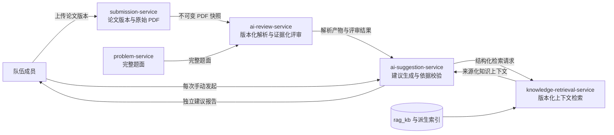
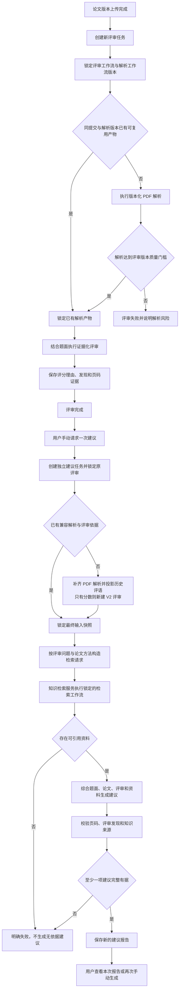

## 有依据的论文建议链路

> 实现状态：S12 已完成最小运行闭环。本文同时记录已经落地的论文解析、证据化评审、知识检索和多次建议之间的跨服务边界。

### 设计目标

“AI 提建议”不能只把论文交给模型自由生成文本。每份建议必须同时回答三个问题：论文中什么现象需要修改，评审为什么认为它有影响，数学建模参考资料支持怎样修改。

目标链路由四类事实组成：submission-service 拥有论文版本与原始 PDF，ai-review-service 拥有解析产物和评审结果，knowledge-retrieval-service 拥有知识索引与检索运行，ai-suggestion-service 拥有用户手动创建的建议任务和建议报告。

### 总体结构

历史客服仍由 ai-assistant-service 内置 RAG V1，`BASIC_REVIEW_V1` 仍直接读取 PDF 页面图像，`IMPROVEMENT_V1` 仍保留单任务语义。新链路通过 `PAPER_PARSE_V1`、`EVIDENCE_REVIEW_V2`、独立检索工作流和 `GROUNDED_SUGGESTION_V2` 实现，不修改这些历史版本的语义。

### 完整业务流程

### 核心规则

#### 版本只能新增

解析、评审、知识检索和建议是四套分别演进的工作流。已经发布并被任务引用的版本永久不可覆盖；步骤、依赖、规则、Prompt 变量或输出语义发生变化时必须发布新版本。旧版本可以停用新任务，但历史任务、结果和运行快照必须继续可读。

#### PDF 解析是评审必经步骤

新证据化评审版本不得直接绕过解析产物读取原始 PDF。评审任务先锁定 `paperParsingWorkflowVersion` 和解析产物，再进入评分步骤。相同提交、文件摘要和解析版本可以复用同一不可变产物；新解析版本产生新产物，不覆盖旧产物。历史 V1 论文没有解析产物时，新建议任务在准备阶段请求 ai-review-service 补齐，因此不会被排除。

解析仍归 ai-review-service。建议优先读取评审已经锁定的解析上下文；对历史 V1 数据只能请求 ai-review-service 按明确版本创建兼容补齐任务，不在建议服务内建立第二套解析实现。若以后出现更多不依赖评审的直接消费者、独立扩缩容或解析权限隔离需求，再评估独立论文解析服务。

#### 历史评审不阻断新建议

建议功能的解锁条件是该论文版本存在任意已完成评审，不是必须已有 V2 评审。历史评审有结构化评语时，使用版本化的确定性投影保留原字段和稳定发现编号；如果真实只有分数、无可用反馈，则在同一论文版本上新建 `EVIDENCE_REVIEW_V2` 任务。原评审作为解锁事实，投影或新评审作为建议依据，两者均保留且页面明示。

#### 建议由用户手动多次创建

具备论文访问权限和建议功能权限的用户，可以对任何有已完成兼容评审的论文版本手动发起建议。同一论文版本、同一评审结果和同一建议工作流允许产生多份独立报告，不使用 `submissionId + workflowVersion` 作为业务唯一键。是否收费或限定会员等级属于功能授权策略，不改变多次生成和证据契约。

请求使用 `clientRequestId` 防止一次点击或网络重试被重复创建。相同用户与相同 `clientRequestId` 返回同一任务；用户明确再次生成时使用新的 `clientRequestId`，创建新的任务、调用和报告。失败重试属于原任务的新执行轮次，不等于用户重新生成一份报告。

#### 建议必须形成三段依据链

每项建议至少关联以下内容：

- 论文依据：解析产物中的物理 PDF 页码、章节和可核验现象。
- 评审依据：证据化评审中的发现编号、评分维度和影响说明。
- 知识依据：本次检索实际返回的来源、片段、内容版本和适用层级。

任何引用无法回指本次锁定输入时，该建议项无效。无有效建议项时整份任务失败，不允许让模型补造依据后按成功保存。

### 数据与快照

每次建议任务必须保存或引用以下不可变事实：

| 事实 | 所有者 | 建议任务保存内容 |
|------|--------|------------------|
| 论文版本 | submission-service | `submissionId` 与文件摘要引用 |
| 题目 | problem-service | `problemId` 与本次使用的题面版本摘要 |
| PDF 解析 | ai-review-service | `parseArtifactId`、`paperParsingWorkflowVersion`、产物 schema |
| AI 评审 | ai-review-service | `eligibilityReviewTaskId`、`evidenceReviewTaskId` 或历史评语投影、评审工作流版本、投影版本和结果 schema |
| 知识检索 | knowledge-retrieval-service | `retrievalRunId`、检索工作流版本、索引或目录版本 |
| 建议生成 | ai-suggestion-service | 建议工作流、Prompt、模型执行配置和结果 schema |

跨服务调用方只保存必要引用和用户报告需要的来源快照，不复制其他服务的完整主数据。建议报告可以保存来源标题、稳定路径、片段标识、内容哈希和简短支撑结论，以保证知识索引切换后历史报告仍可解释。

### 失败边界

- 解析失败或未达到所选评审 / 建议版本的质量门槛时，不开始后续评审准备或检索。
- 评审未完成时，不允许创建依赖该评审的建议任务。
- 历史结构化评语投影失败，或只有分数时新建的 V2 评审失败，建议任务在 `PREPARING_REVIEW` 阶段失败并保留原评审。
- 知识检索失败、没有可靠来源或只命中不适用资料时，不生成无依据建议。
- 单个候选建议引用无效时丢弃该项并记录校验原因；全部候选无效时任务失败。
- 新一次建议失败不影响同一论文版本已有的成功建议报告。
- 服务不得在运行中静默替换解析、评审、检索、Prompt、模型配置或建议工作流版本。

### 非目标

- 不自动在评审完成后生成建议。
- 不让建议服务修改原始 PDF 或直接生成可提交论文。
- 不让知识检索服务读取用户完整论文或拥有评审业务规则。
- 不用其他题目的专属评分细则指导当前题目。
- 不因本次设计直接建设开放互联网搜索、任意文件 Agent 或在线知识编辑平台。

### 关键取舍

建议与评审保持分离。评审回答“论文完成得怎样、分数为何如此”，建议回答“下一步具体怎样修改”。如果把知识检索和改写方案塞进评审结果，评审版本会同时承担评分与辅导两种目标，难以稳定比较，也会让用户无法对同一评审多次获取不同侧重点的建议。

知识检索独立部署，因为客服与论文建议已经构成两个真实消费者，且向量召回、AI 目录选文和后续组合策略需要独立版本、索引生命周期与运行审计。PDF 解析暂不独立部署，因为它仍是 ai-review-service 拥有的评审必需子流程；建议只优先消费评审锁定的产物，对历史数据也只请求该服务做兼容补齐。过早拆分会增加一个没有独立业务规则的服务。
