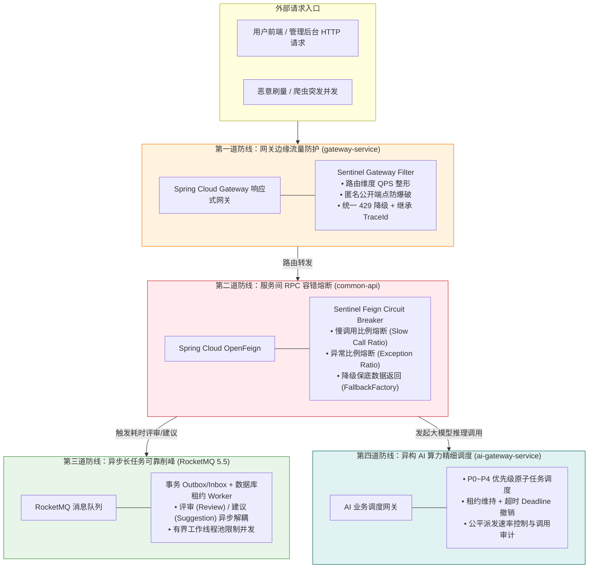
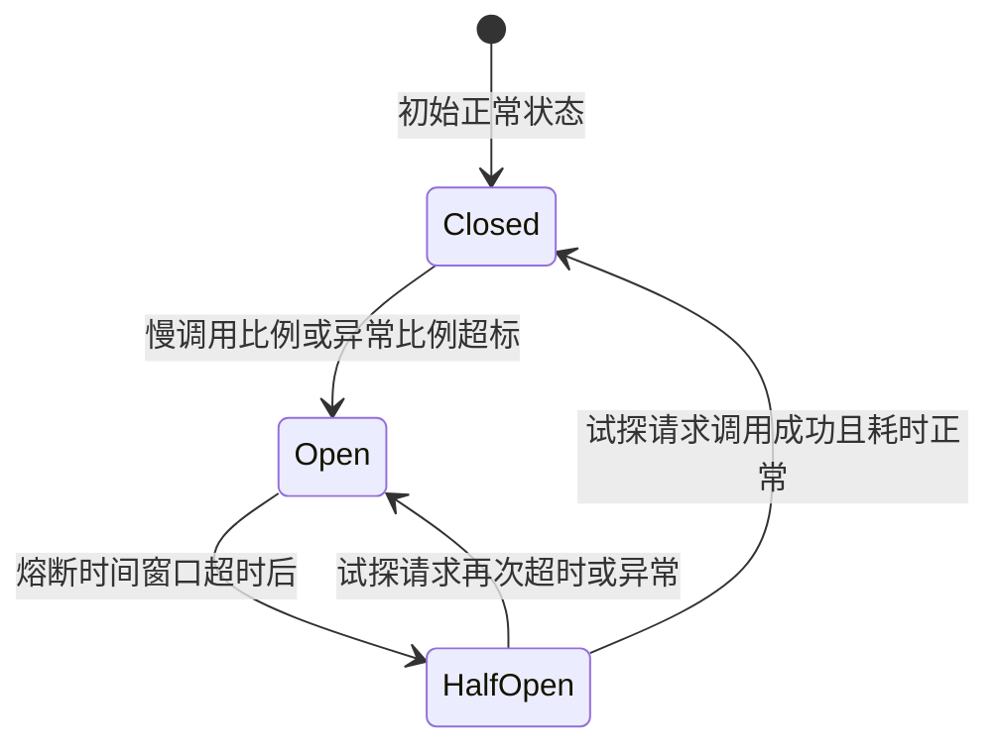
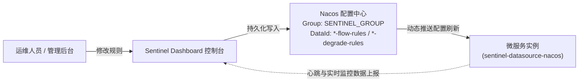

## 流量治理与服务容错设计

> 创建日期：2026-09-06  
> 核心组件：Sentinel 1.8.6 + Spring Cloud Alibaba 2023.0.1.0 + Spring Cloud Gateway + OpenFeign + Nacos 2.3.2  
> 治理定位：构建分层流量防线，明确 Sentinel、RocketMQ 与自研 AI 调度器的职责边界

---

### 一、服务保护与流量治理全景

在微服务分布式体系中，高并发突发流量、恶意爬虫、网络分区与下游慢查询是导致服务雪崩（Cascading Failure）的主要诱因。LeetModel 平台结合业务负载特性，构建了“边缘防刷、RPC 熔断、异步削峰、算力精细调度”四道互不越位的防护防线：



---

### 二、职责划分与设计边界

微服务稳定性建设最忌讳单一工具无边界扩展。LeetModel 严格遵循如下职责划分：

| 治理维度 | 负责组件 | 治理策略 | 为什么不由其他组件承担？ |
| :--- | :--- | :--- | :--- |
| **网关边缘入口** | **Sentinel Gateway** | 基于 Route ID 与 API 分组的 QPS 阈值限流；阻断非预期高频请求。 | 网关是系统唯一对外入口，在最外层阻断流量可避免后端无效消耗 Tomcat 线程与数据库连接。 |
| **内部服务间调用** | **Sentinel OpenFeign** | 基于慢调用比例（RT > 阈值）与异常比例进行熔断断路，触发 Fallback。 | 防止下游单点阻塞扩散为全链路级联雪崩；由 RPC 客户端断路保护上游自身线程池。 |
| **异步长任务削峰** | **RocketMQ 5.5 + Worker** | 本地事务 Outbox 落库，消费端短事务写 Inbox，有界 Worker 租约拉取。 | **禁止 Sentinel 介入**：长任务由 MQ 削峰，Sentinel 滑动窗口抛错会导致 MQ 频繁重试打满 Broker。 |
| **大模型推理调用** | **ai-gateway-service** | P0~P4 业务优先级排队、租约管理、执行 Deadline、公平调度与用量审计。 | **禁止 Sentinel 介入**：AI 调用耗时原生在 3s~30s，常规 QPS 限流或慢调用熔断会严重误杀正常业务。 |
| **供应商渠道健康** | **new-api** | 供应商渠道轮询、密钥健康检测、渠道故障重试与额度治理。 | LeetModel 不重复建设外部供应商渠道熔断器，业务请求以标准逻辑模型与 new-api 交互。 |

---

### 三、网关层 Sentinel 架构与运行时契约

#### 3.1 网关适配原理

网关采用 WebFlux 响应式非阻塞模型。`spring-cloud-alibaba-sentinel-gateway` 提供了以下核心适配组件：
1. **`SentinelGatewayFilter`**：作为全局过滤器注入 Gateway Filter 链，利用 Sentinel 底层的 `LeapArray`（滑动时间窗口）进行实时指标统计，命中阈值时抛出 `BlockException`。
2. **`GatewayCallbackManager`**：提供 `setBlockHandler` 回调挂载点。项目实现自定义响应处理器，杜绝默认的纯文本返回，与平台统一规范对齐。

#### 3.2 统一响应契约与 TraceId 继承

触发限流时，网关必须返回平台标准的统一信封结构，同时在响应头与响应体内维持全链路可观测标识：

* **HTTP 状态码**：`429 Too Many Requests`
* **响应头**：`X-Trace-Id: <当前追踪链路ID>`，`Content-Type: application/json;charset=UTF-8`
* **响应 Payload**：

```json
{
  "code": 40004,
  "message": "请求过于频繁，请稍后再试",
  "data": null,
  "timestamp": 1772864400000
}
```

#### 3.3 路由保护规则策略

根据接口暴露特性配置差异化流控规则（`GatewayFlowRule`）：

1. **公开与认证接口（高风险端点）**：
   * `user-auth`（`/api/auth/**`）：防暴力撞库与脚本爆破，单 IP / 单路由配置低 QPS 阈值。
   * `problem-public`（`/api/public/problems/**`）：防恶意爬虫抓取题面，设置合理突发上限。
2. **普通已认证业务接口**：
   * `team-service`、`submission-service` 等：配置较高的保护性 QPS 阈值，保障正常团队操作和作品提交通畅，仅在极端突发情况下削峰阻断。

---

### 四、RPC 间 Feign 熔断断路器设计

针对微服务内部的 OpenFeign 同步调用，基于 `spring-cloud-circuitbreaker-sentinel` 实施断路保护。

#### 4.1 熔断状态机流转



1. **Closed（闭合状态）**：所有 RPC 正常通行。Sentinel 在滑动窗口内统计调用总数、慢调用比例（RT > 预设阈值）和异常比例。
2. **Open（熔断打开）**：当指标超过配置阈值（且最小请求数满足要求），断路器立即切换为 Open。在熔断持续时间内，所有请求**不再发送网络 IO**，直接执行本地 `FallbackFactory` 快速失败。
3. **Half-Open（半开试探）**：熔断窗口期结束后，断路器放行单次探测请求。若探测成功，断路器闭合；若仍异常或慢，立即重新进入 Open 状态。

#### 4.2 降级保底策略

各 Feign 客户端的 `FallbackFactory` 遵循严格的业务安全语义：
* 读接口（如查询题目详情、查询团队摘要）：返回只读缓存保底数据或明确的系统降级提示。
* 写接口与资格校验（如参赛资格检查）：严禁静默放行，必须明确返回依赖服务不可用错误，阻断下游可能产生脏数据的写事务。

---

### 五、规则持久化与生产演进（Nacos Push 模式）

Sentinel 控制台默认采用内存模式推送，应用重启后规则清空。在生产基准演进中，结合已部署的 Nacos 2.3.2 采用**双向 Push 模式**：



* **微服务端**：通过 `sentinel-datasource-nacos` 注册监听器，Nacos 配置发生变动时异步拉取并热更新内存中的 `FlowRuleManager` / `GatewayRuleManager`。
* **可靠性保障**：即使 Sentinel 控制台宕机，微服务依然可从 Nacos 读取最新持久化规则并维持稳定防御。

---

### 六、本地可视化控制台指南 (Sentinel Dashboard)

项目在 `docker-compose.yml` 中集成了 `sentinel-dashboard:1.8.6`，作为本地开发与调试流控规则的可选观察工具。

#### 6.1 启动与端口规划

* **启动命令**：`docker compose --profile tools up -d sentinel-dashboard`
* **Web 访问地址**：`http://127.0.0.1:8858`
* **默认登录凭据**：账号 `sentinel` / 密码 `sentinel`
* **端口冲突避让**：原生控制台默认使用 `8080`，因项目 API 网关占用 `8080`，控制台统一调整为 **`8858`**。
* **网络模式**：容器采用 `network_mode: host`，保障控制台可无障碍拉取宿主机微服务客户端暴露的 `8719` 实时指标端点。

#### 6.2 客户端心跳与懒加载机制

* Sentinel 客户端采用**懒加载**设计：微服务启动初期不会主动向 Dashboard 注册心跳；
* **激活条件**：只有当微服务接收到**第一笔真实业务请求**后，Sentinel 统计切片才会触发向 `8858` 发送心跳包。此时刷新控制台，左侧菜单栏才会显示对应微服务实例（如 `gateway-service`）。
