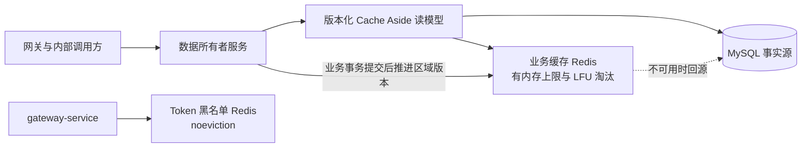
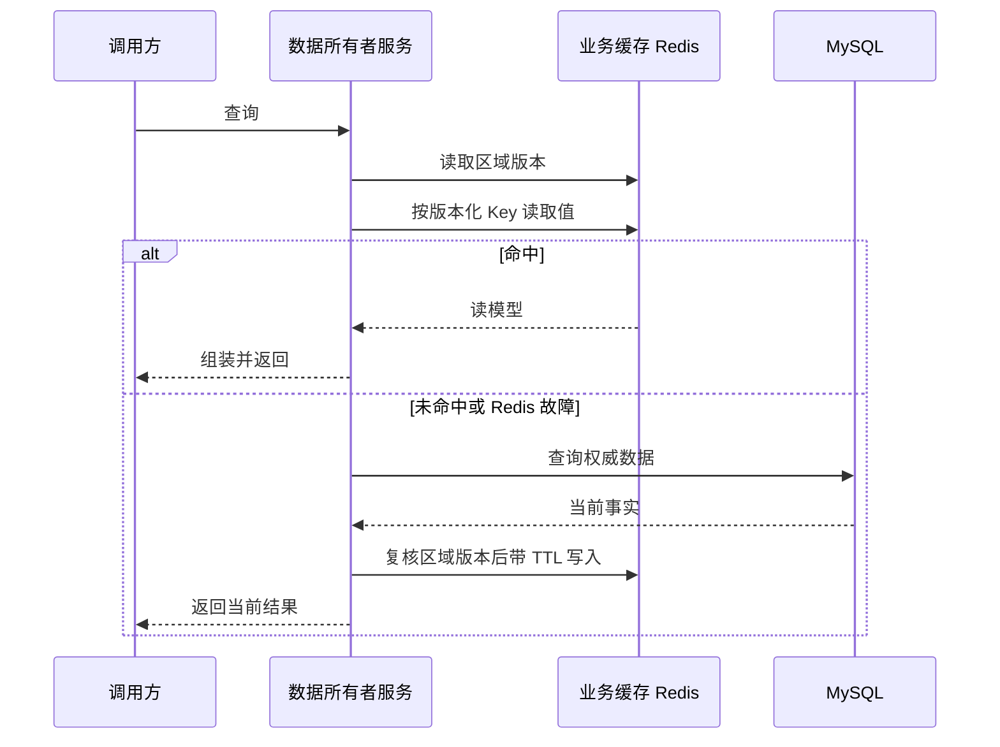
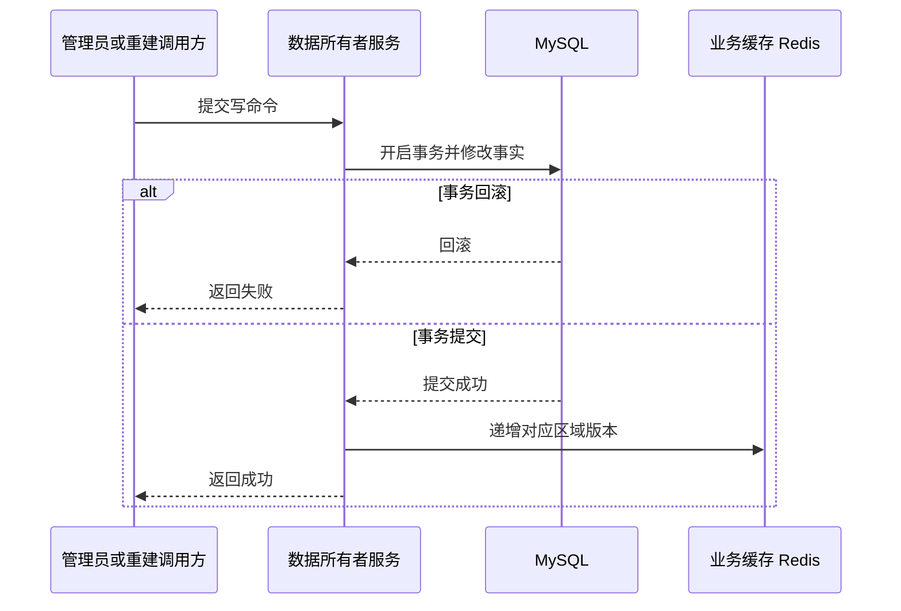

## 缓存策略

> 设计状态：已确认目标设计，尚未实现。
>
> 适用范围：LeetModel 业务查询缓存。JWT Token 黑名单是安全状态，不属于业务查询缓存。


### 设计结论

首期只缓存已发布题库读模型和当前排行快照。这两类数据都是少写多读、公开可读、由单一服务拥有，并且能够在写事务提交后精确触发失效。

缓存采用 Cache Aside 模式。命中时返回缓存读模型，未命中时回源数据所有者的 MySQL，写操作只修改业务数据，在事务提交后推进缓存区域版本。Redis 不参与业务事务，不成为事实源。

业务缓存与 JWT Token 黑名单使用不同 Redis 实例。业务缓存可以按 LFU 策略淘汰，Token 黑名单必须使用 `noeviction`。两者只分 Redis logical database 不能提供内存和淘汰隔离，因此不作为目标方案。


### 当前基线

当前代码已经具备 Redis 7.2 容器和 Lettuce 客户端，但业务缓存尚未实际启用。

| 现状 | 影响 |
|------|------|
| `common-security` 引入 Redis 并提供 `RedisCacheConfig` | 通用缓存基础设施与安全模块职责混合 |
| 代码中没有业务缓存注解或等价的编程式缓存读写 | 题库、排行和管理聚合仍每次直接查询数据库或下游服务 |
| 默认 TTL 是固定 30 分钟 | 现有注释声称存在随机偏移，实际实现没有偏移 |
| 序列化启用 `LaissezFaireSubTypeValidator` | 反序列化类型过于宽松，不应直接用于业务缓存 |
| 多个服务通过 `common-security` 间接引入 Redis，但只有少数开发配置显式声明连接 | 启用缓存前需要统一配置所有权和服务启用边界 |

现有代码中与模型输入缓存相关的 Token 统计只是 AI 供应商用量事实，不是 LeetModel 业务缓存。


### 目标与非目标

本设计要达成以下结果：

- 减少公开题库的重复分页、赛事、标签、详情和附件元数据查询。
- 减少当前排行的重复全量快照读取和内存转换。
- 使用主动失效保证正常写入后的新鲜度，使用 TTL 限制异常时的最大陈旧窗口。
- Redis 超时或不可用时回源 MySQL，不让可选优化变成业务强依赖。
- 让命中率、回源耗时、失效失败和内存水位可观测。

首期不实现以下能力：

- 不缓存权限和角色。权限变更继续以 user-service 实时结果为准。
- 不缓存上传进度、队伍状态、评审任务、建议任务和 AI 评价任务。这些状态正在变化或被前端轮询。
- 不缓存 AI Prompt、会话消息、论文正文、知识片段和模型回答。
- 不缓存 AI 客服当前生产版本指针。每次新任务继续直接读取已提交的本服务数据库状态。
- 不在 admin-service 复制下游业务事实。管理看板短时聚合快照留到实测证明是瓶颈后再引入。
- 不引入本地二级缓存、分布式锁、布隆过滤器、缓存预热和缓存压缩。


### 整体架构



业务服务只缓存自己拥有或已经持久化为本服务读模型的数据。首期不在 Feign 调用方再缓存下游返回值，避免同一业务事实散落在多个服务并产生无法追踪的失效链。


### 首期缓存矩阵

| 缓存区域 | 数据所有者 | 键 | 基准 TTL | 主动失效 | 缓存条件 |
|------|------|------|------|------|------|
| 公开题库筛选项 | problem-service | 固定键 `all` | 60 分钟 | 公开题库区域版本推进后统一失效 | 始终允许 |
| 公开题库分页 | problem-service | 标准化查询的 SHA-256 摘要 | 5 分钟 | 题目、赛事或标签写事务提交后推进区域版本 | 页码不大于 10，每页不大于 50，关键词为空 |
| 已发布题目详情 | problem-service | 题目 ID | 10 分钟 | 题目、附件、赛事或已关联标签写事务提交后推进区域版本 | 只缓存稳定元数据，不缓存 MinIO 预签名 URL |
| 当前题目排行 | ranking-service | 题目 ID | 5 分钟 | 对应题目排行重建事务提交后推进该题目的排行区域版本 | 整份当前排行只缓存一次，关键词过滤和队伍定位在命中后内存计算 |

所有基准 TTL 在写入时生成正负 20% 的随机偏移。不存在的题目详情和尚未建立的空排行使用 30 秒空值标记，同样受区域版本约束。

题库随机接口不缓存，否则会把随机语义固化。带自由文本关键词的分页查询首期不缓存，避免公开接口被大量唯一关键词制造高基数 Key。


### Key 与值设计

Key 统一使用以下命名空间：

```text
lm:<environment>:cache:<owner-service>:<region>:<schema-version>:r<region-revision>:<logical-key>
```

示例：

```text
lm:dev:cache:problem:public:v1:r12:detail:51001
lm:dev:cache:problem:public:v1:r12:page:8f5c9a...
lm:dev:cache:ranking:current:v1:r7:overview:51001
```

Key 遵守以下规则：

- 环境、数据所有者、缓存区域和值结构版本必须进入命名空间。
- 分页查询在计算摘要前先应用默认页码、默认排序，去除空白文本，对标签 ID 去重和排序。
- Key 中不放用户名、Token、Prompt、论文内容和其他敏感数据。
- 不使用 `KEYS` 或全区域 `SCAN` 做日常失效。区域版本递增是常数复杂度操作，旧版本值由 TTL 自然清理。

缓存值使用服务自己定义的不可变读模型，不直接序列化 MyBatis 实体、分页实现类、HTTP `Result` 包装和带临时签名的 URL。JSON 反序列化由调用方显式提供目标类型，不启用宽松的任意子类反序列化。

单个值序列化后不得超过 512 KiB。当题面或排行快照超过上限时，本次结果直接返回但不写缓存，并记录低基数指标。首期不使用压缩隐藏大 Key 问题。


### 读取与失效流程



同一 JVM 内的同 Key 未命中使用单航加载，把并发回源合并为一次。这个保护不是分布式锁，多实例时最多仍会有每个实例一次回源。当前单实例部署足够使用，只有多实例压测证明同 Key 回源已经造成数据库尖峰时才引入分布式互斥。

未命中回源完成后必须再读一次区域版本。如果版本已经改变，说明回源期间发生了写事务，本次结果不写入旧版本缓存，最多重试一次。该规则防止旧读取在写事务失效之后又把陈旧值填回当前 Key。



区域版本只在业务事务成功提交后递增。缓存失效失败不反向回滚已提交的业务事实，但必须进行有界重试、记录指标并告警。TTL 是失效通道故障时的最终一致性上限，不是正常失效机制。


### 各写入入口的失效边界

| 写入事件 | 提交后动作 |
|------|------|
| 创建、修改、发布、下线或删除题目 | 推进 problem-service 公开题库区域版本 |
| 替换题目标签 | 推进 problem-service 公开题库区域版本 |
| 上传或删除题目附件 | 推进 problem-service 公开题库区域版本 |
| 创建、改名或删除标签 | 推进 problem-service 公开题库区域版本 |
| 修改赛事编码或名称 | 推进 problem-service 公开题库区域版本 |
| 重建指定题目排行 | 只推进该题目的 ranking-service 当前排行区域版本 |

problem-service 的题量有限且写入频率很低，因此首期使用一个公开题库区域版本同时失效筛选项、分页和详情。这会在单题修改时牺牲少量命中率，但能避免维护标签、赛事、附件和多组分页 Key 的复杂反向索引。只有实测显示写入后的全区域冷启动明显影响性能时，才细分区域版本。


### 穿透、击穿与雪崩

| 问题 | 首期处理 |
|------|------|
| 缓存穿透 | 对不存在的数字 ID 保存 30 秒空值标记；参数校验和网关限流仍是应对大量唯一无效 ID 的主要防线 |
| 热点 Key 击穿 | 同 JVM 单航加载合并并发回源；多实例分布式锁按实测触发 |
| 缓存雪崩 | 每个值的 TTL 加正负 20% 随机偏移；不在启动时全量预热 |
| 高基数 Key | 只缓存有界分页，不缓存自由文本搜索，单值超限时跳过写入 |
| 大 Key | 单值上限 512 KiB，指标记录跳过原因，不用压缩掩盖问题 |

布隆过滤器暂不引入。公开题目总量通常不超过一万，数字 ID 又有完整参数校验，短期空值与限流的成本更低。


### Redis 部署与故障语义

| 实例 | 保存内容 | 持久化 | 内存与淘汰 | 故障语义 |
|------|------|------|------|------|
| 安全状态 Redis | JWT Token 黑名单 | 保留并按安全状态恢复需求配置 | `noeviction` | 保持现有认证语义，不由本设计改成可选依赖 |
| 业务缓存 Redis | 可重建读模型和区域版本 | 关闭 | 开发环境初始上限 256 MiB，使用 `volatile-lfu` | 超时、读取、写入和失效失败都不中断业务读取 |

业务缓存的所有数据值都有 TTL，区域版本键没有 TTL。`volatile-lfu` 只淘汰带 TTL 的值，保留数量有界的区域版本。Redis 实例重启时缓存值和版本一起清空，不存在新旧版本冲突。

业务缓存客户端使用独立连接工厂和显式超时。开发初始值为连接 200 毫秒、命令 100 毫秒，最终值根据目标环境压测调整。服务启动和业务就绪不以业务缓存可用为前提，但必须在健康详情中暴露降级状态。


### 公共能力与服务职责

目标实现新增独立 `common-cache` 公共 Jar。它只提供以下稳定基础能力：

- 业务缓存 Redis 连接、命名空间和显式超时。
- 强类型 JSON 编解码、TTL 偏移、值大小限制和空值标记。
- 区域版本读取与递增、同 JVM 单航加载、故障回源和统一指标。

题库和排行的缓存名称、缓存条件、读模型、回源函数和事务提交后失效仍由各数据所有者服务维护。`common-cache` 不识别题目、排行和任何业务字段。

现有 `RedisCacheConfig` 不直接启用，实现时从 `common-security` 移除。`common-security` 只保留认证和 Token 黑名单所需 Redis 能力。首期使用编程式、强类型的版本化 Cache Aside 客户端，不依赖 Spring Cache 注解隐式处理事务顺序和动态 TTL。


### 可观测性

每个缓存区域至少记录以下 Micrometer 指标：

- 请求数，结果维度只使用 `hit`、`miss`、`bypass` 和 `error`。
- 回源次数、回源耗时和回源失败数。
- 写入数、空值写入数、超大值跳过数和单航合并数。
- 区域版本推进数、重试数和最终失败数。
- Redis 使用内存、命中率、淘汰数、过期数、连接数和命令延迟。

指标标签只使用服务名、缓存区域和结果类型。不把原始 Key、题目 ID、查询摘要和异常文本放入指标标签。日志中只记录缓存区域、操作类型和已缩短的 Key 摘要，不记录缓存值。

运行中使用以下信号判断是否扩大缓存范围：

- 稳定请求流量进入后命中率仍低于 60% 时，先检查 Key 标准化和入场条件，不直接增加 TTL。
- 连续 5 分钟的缓存操作错误率超过 1% 时告警，同时确认业务回源成功率。
- Redis 内存超过上限的 80% 或大 Key 跳过持续增长时，先收紧入场条件和值结构。
- 多实例下同 Key 回源尖峰仍导致 MySQL 耗时异常时，才评估分布式互斥或逻辑过期。


### 验收方案

实现必须通过以下自动化与运行验收：

| 验收类型 | 完成标准 |
|------|------|
| Key 与编解码 | 等价查询产生相同 Key，不同环境、服务、区域和结构版本不冲突，强类型读模型可往返序列化 |
| 命中与过期 | 同 Key 首次回源，后续命中，TTL 到期后重新回源 |
| 事务一致性 | 提交后下一次读取使用新区域版本，回滚不推进版本，并发旧回源不能写回新版本 Key |
| 故障降级 | Redis 停止、超时、反序列化失败和写入失败时，题库与排行仍可从 MySQL 返回，异常不伪装成业务空数据 |
| 穿透与击穿 | 不存在的同 ID 在空值 TTL 内只回源一次，单 JVM 并发请求只执行一次回源 |
| 安全隔离 | 业务缓存写满和淘汰不会删除或阻止 Token 黑名单写入 |
| 数据安全 | 业务 Redis 中不存在 MinIO 预签名 URL、Token、Prompt、会话、论文和知识片段 |
| 性能 | 固定热点数据自然热身后命中率不低于 80%，重复读取的 MySQL 查询数降低不少于 90%，命中请求 P95 相对基线降低不少于 40% |
| 内存 | 压测期间没有超过 512 KiB 的单 Key，没有无 TTL 的业务数据值，内存水位与淘汰数可观测 |

性能对比使用同一数据库快照、同一 JVM 参数和同一压测请求集。报告同时保留未命中和命中两类耗时，不用只压测已热身 Key 的结果代替完整结论。任一候选缓存没有达到性能门槛时，应从首期范围移除，不为了保留缓存而降低验收标准。


### 实施路线

后续实现按以下任务卡串行推进：

1. 建立基线。为目标接口增加查询次数、延迟和固定请求集，保存未启用缓存时的对比结果。
2. 隔离基础设施。新增业务缓存 Redis 和 `common-cache`，从 `common-security` 移除通用缓存配置，先完成故障回源、版本、编解码和指标集成测试。
3. 接入公开题库。实现有界分页、筛选项、稳定详情和所有写入入口的提交后区域版本推进。
4. 接入当前排行。使 `getCurrent` 和 `locate` 共用同一份当前快照，在排行重建提交后推进单题区域版本。
5. 执行对比验收。验证正确性、降级、并发、内存和性能目标，再决定是否引入管理看板短时快照或其他服务缓存。

一次只实施一张任务卡。前一张任务卡的自动化测试和运行验收通过后，才进入下一张。


### 后续触发条件

| 候选能力 | 开始设计或实现的证据 |
|------|------|
| user-service 用户公开摘要 | team-service 的批量组装证明该内部查询是稳定瓶颈，并且资料与头像更新已有提交后失效点 |
| ranking-service 全局统计 | 管理看板频繁调用导致评审、提交和题目服务全量查询，且页面能展示计算时间和最大新鲜度 |
| admin-service 聚合快照 | 看板请求量和 Feign 扇出已成为实测瓶颈，且响应契约能显式返回数据时间与局部不可用状态 |
| 已完成评审与建议结果 | 已完成结果的重复读取证明是瓶颈，且可只缓存不可变结果而不缓存运行中任务 |
| 多实例击穿保护 | 目标服务部署多个实例，且同 Key 并发回源对 MySQL 造成可测尖峰 |
| HTTP ETag 与网关响应缓存 | 服务内 Redis 缓存验收后，网络响应体仍是主要成本，并且只对无个人化的公开 GET 接口开放 |


### 方案取舍与面试要点

- 选择 Cache Aside 而不是把 Redis 作为主数据库，因为题目和排行事实已由 MySQL 持久化，缓存必须能够随时丢弃并重建。
- 选择删除语义的区域版本推进，而不在写事务中同时更新缓存值，避免 MySQL 和 Redis 变成两个需要原子提交的事实源。
- 选择事务提交后推进版本，避免读请求在数据库尚未提交时回填旧值。回源后复核版本进一步关闭并发回填窗口。
- 选择物理隔离 Token 黑名单和业务缓存，因为业务缓存需要淘汰，黑名单被淘汰会让已登出 Token 重新通过验证。
- 选择数据所有者内缓存，不在每个 Feign 消费者复制缓存，因为失效规则应由能够解释写入事件的服务维护。
- 首期不缓存 RBAC，是在授权变更的立即生效和每次 Feign 查询成本之间优先选择安全一致性。后续只有引入可追踪的授权修订号和失效机制后才重新评估。
