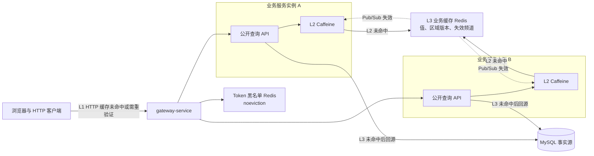
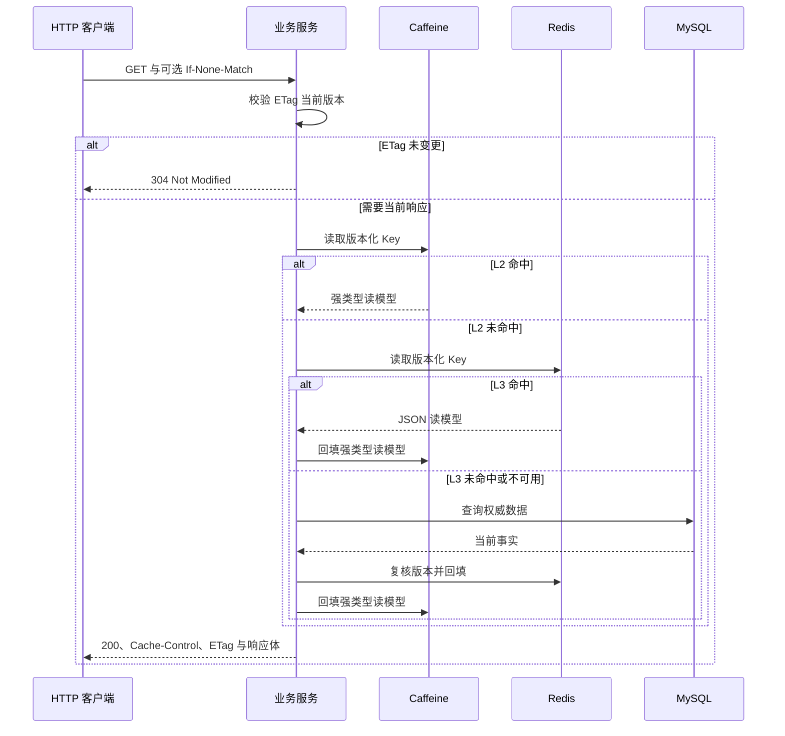
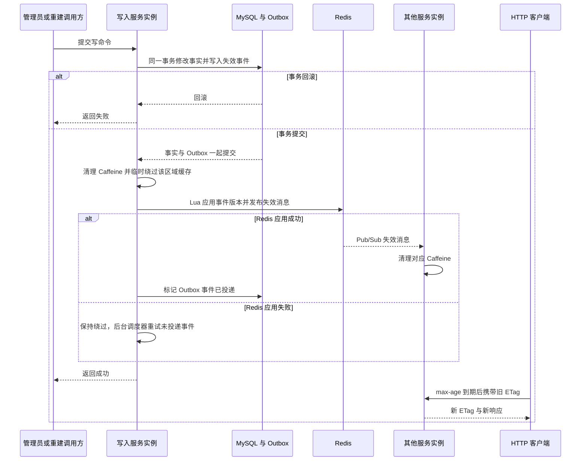

## 三级缓存策略

> 实施状态：C2 已于 2026-08-31 完成开发与功能验收。
>
> 适用范围：LeetModel 公开题库与当前排行查询。JWT Token 黑名单是安全状态，不属于业务缓存。


### 术语约定

本项目的三级缓存是三个真实缓存层：

1. L1 是 HTTP 条件缓存，使用 `Cache-Control` 和 `ETag` 减少请求与响应体传输。
2. L2 是 Caffeine 本地缓存，每个服务实例独立保存热点读模型。
3. L3 是 Redis 分布式缓存，在所有服务实例之间共享读模型与区域版本。

MySQL 是最终回源的事实源，不是第三级缓存。面试时应表述为“HTTP、Caffeine、Redis 三级缓存，MySQL 作为权威数据源”，不把“Caffeine、Redis、MySQL”称为三个缓存。


### 设计结论

首期只缓存已发布题库读模型和当前排行快照。这两类数据少写多读、公开可读、由单一服务拥有，并且能够在写事务提交后明确触发失效。

完整读链路为 L1 HTTP 缓存、L2 Caffeine、L3 Redis、MySQL。L1 命中时不进入服务读链路，L2 命中时不访问网络缓存，L3 命中时不查询 MySQL。只有全部未命中时才回源 MySQL，并按 L3、L2 顺序回填。

业务缓存采用 Cache Aside 模式。写操作在修改 MySQL 业务事实的同一事务中记录缓存失效 Outbox 事件，事务提交后将事件版本应用到 Redis 并发布本地缓存失效消息。Caffeine 通过主动失效、版本对账和短 TTL 三重保护收敛。HTTP 缓存使用短 `max-age` 限制最大陈旧时间，再通过 `ETag` 进行重验证。

业务缓存 Redis 与 JWT Token 黑名单 Redis 物理隔离。业务缓存允许淘汰，Token 黑名单必须使用 `noeviction`。只使用 Redis logical database 无法隔离内存、淘汰和故障，因此不作为目标方案。


### 实现基线

| 已实现能力 | 当前落点 |
|------|------|
| L1 HTTP 条件缓存 | problem-service 公开筛选、受控分页和已发布详情；ranking-service 当前排行与队伍定位 |
| L2 Caffeine | `common-cache` 使用 64 MiB 默认最大权重、按值 TTL、单值 512 KiB 上限和原子加载 |
| L3 Redis | 独立 Lettuce 客户端连接 `6380` 业务缓存实例，使用强类型 JSON 包装、随机代际和版本化 Key |
| 可靠失效 | problem-service V9、ranking-service V3 Outbox；事务内记录、提交后立即投递、每秒重试 |
| 跨实例收敛 | Redis Lua 单调应用版本、Pub/Sub 主动失效、每 5 秒代际与区域版本对账 |
| 故障降级 | Redis 故障时清理常规 L2，回源 MySQL 并只保留 5 秒独立降级缓存；恢复时清理降级值 |
| 安全隔离 | Token 黑名单继续使用安全状态 Redis `6379`；业务缓存 Redis `6380` 关闭持久化并使用 `volatile-lfu` |

与模型输入缓存相关的 Token 统计仍是 AI 供应商用量事实，不属于 LeetModel 业务缓存。


### 目标与非目标

本设计要达成以下结果：

- 用 HTTP 缓存减少公开请求数、响应体传输和重复序列化。
- 用 Caffeine 吸收服务实例内的高频热点读取。
- 用 Redis 减少跨实例重复回源并保持分布式读模型共享。
- 用区域版本、失效消息、版本对账和 TTL 控制多级缓存一致性。
- 任一缓存层失效时自动访问下一层，不让可选优化变成业务强依赖。
- 让每层命中率、回源耗时、失效延迟、内存水位和降级状态可观测。

首期不实现以下能力：

- 不缓存权限和角色。权限变更继续以 user-service 实时结果为准。
- 不缓存上传进度、队伍状态、评审任务、建议任务和 AI 评价任务。
- 不缓存 AI Prompt、会话消息、论文正文、知识片段和模型回答。
- 不缓存 AI 客服当前生产版本指针。每次新任务继续直接读取已提交的本服务数据库状态。
- 不在 admin-service 复制下游业务事实。
- 不在启动时全量预热，不首先引入布隆过滤器和缓存压缩。


### 整体架构



网关只负责转发和保留 HTTP 缓存头，不复制业务响应为新的事实源。Caffeine 只保存当前实例的临时读模型。Redis 是跨实例共享的缓存和失效协调层。MySQL 始终是最终事实源。

L1 只对无用户差异的公开 GET 响应返回 `Cache-Control: public, max-age=<seconds>` 和 `ETag`。鉴权管理接口、个人化响应和异常响应统一使用 `Cache-Control: no-store`。`304` 响应仍返回当前 `ETag` 与缓存策略头。网关不启用独立响应缓存，只透传这些头。


### 各级缓存职责

| 层级 | 位置与技术 | 核心作用 | 容量边界 | 一致性边界 |
|------|------|------|------|------|
| L1 | 浏览器或 HTTP 客户端，使用 `Cache-Control` 与 `ETag` | 避免新鲜期内重复请求，通过 `304` 避免未变更响应体传输 | 由客户端控制，服务端只对公开 GET 响应授权缓存 | 不主动广播失效，由短 `max-age` 与 `ETag` 重验证收敛 |
| L2 | 每个 problem-service 与 ranking-service 实例内的 Caffeine | 吸收超高频热点，避免每次命中都产生 Redis 网络访问 | 每个服务实例初始最大权重 64 MiB，使用按序列化预估字节的 Weigher 和频率感知淘汰 | 提交后本地失效、Redis Pub/Sub、5 秒版本对账和短 TTL |
| L3 | 独立业务缓存 Redis | 在多实例间共享读模型，保存缓存代际与区域版本，发布本地失效消息 | 开发环境初始上限 256 MiB，业务值全部带 TTL，使用 `volatile-lfu` | 事务提交后应用 Outbox 事件版本，缓存 Key 携带代际和版本，TTL 是最终兜底 |
| 回源 | MySQL | 返回当前权威业务事实 | 依据当前数据模型和索引 | 由本地事务保证数据正确性 |

Caffeine 使用 `maximumWeight`，不只使用条目数限制。题面和排行快照的体积差异很大，单纯 `maximumSize` 可能让少量大对象占满堆内存。服务可用内存与最大权重必须在压测后一起调整。


### 首期缓存矩阵

| 缓存对象 | L1 HTTP | L2 Caffeine | L3 Redis | 主动失效 | 入场条件 |
|------|------|------|------|------|------|
| 公开题库筛选项 | `max-age` 60 秒并返回 `ETag` | 5 分钟 | 30 分钟 | problem-service 公开区域版本变更 | 始终允许 |
| 公开题库分页 | `max-age` 20 秒并返回 `ETag` | 30 秒 | 5 分钟 | problem-service 公开区域版本变更 | 页码不大于 10，每页不大于 50，关键词为空 |
| 已发布题目详情 | `max-age` 60 秒并返回 `ETag` | 2 分钟 | 10 分钟 | problem-service 公开区域版本变更 | 只缓存稳定元数据，不缓存 MinIO 预签名 URL |
| 当前题目排行 | `max-age` 10 秒并返回 `ETag` | 15 秒 | 5 分钟 | 对应题目排行区域版本变更 | 整份当前排行只缓存一次，关键词过滤和队伍定位在命中后计算 |

TTL 保持 L1 不长于 L2，L2 不长于 L3。Caffeine 和 Redis 在每次写入时为基准 TTL 生成正负 20% 的随机偏移。HTTP `max-age` 保持接口契约中的固定短值，便于客户端和网关稳定解释。

不存在的数字 ID 不进入 L1。L2 保存 5 秒空值标记，L3 保存 30 秒空值标记。题库随机接口不缓存，否则会把随机语义固化。带自由文本关键词的分页查询首期不缓存，避免公开接口被唯一关键词制造高基数 Key。


### Key、ETag 与缓存值

L3 Redis Key 使用以下命名空间：

```text
lm:<environment>:cache:g<cache-generation>:<owner-service>:<region>:<scope>:<schema-version>:r<region-revision>:<logical-key>
```

示例：

```text
lm:dev:cache:g8a1f:problem-service:public:all:v1:r12:detail:51001
lm:dev:cache:g8a1f:problem-service:public:all:v1:r12:page:8f5c9a...
lm:dev:cache:g8a1f:ranking-service:current:problem-51001:v1:r7:overview
```

L2 Caffeine 使用与 L3 相同的缓存代际、服务、区域、结构版本、区域版本和逻辑 Key，但不包含环境与 Redis 前缀。缓存值必须同时保存代际与区域版本，命中时先校验再返回。

业务 Redis 为空时，首个实例使用 `SET NX` 创建 128 位随机缓存代际，其他实例只读取。示例中的 `g8a1f` 是为了可读性而缩写，实际 Key 与 `ETag` 使用完整代际或其无损 Base64url 表示。Redis 重启、清空或代际改变时，所有实例清理 Caffeine，客户端也会因 `ETag` 代际不同而获得新响应。这避免 Redis 不持久化时区域版本从零开始，与历史 Key 或客户端 `ETag` 发生碰撞。

L1 `ETag` 使用区域版本、读模型结构版本与逻辑 Key 摘要生成弱验证标识。排行响应可直接结合已持久化的 `batchId`。`ETag` 不包含用户标识和业务正文。

```text
W/"g8a1f-problem-public-v1-r12-8f5c9a"
W/"g8a1f-ranking-current-v1-batch-demo-51001"
```

Key 与值遵守以下规则：

- 分页查询在计算 SHA-256 摘要前先应用默认页码、默认排序，去除空白文本，对标签 ID 去重和排序。
- Key 中不放用户名、Token、Prompt、论文内容和其他敏感数据。
- 不使用 `KEYS` 或全区域 `SCAN` 做日常失效。区域版本递增后，旧版本值由 TTL 自然清理。
- 缓存值使用服务定义的不可变读模型，不直接序列化 MyBatis 实体、分页实现类和 HTTP `Result` 包装。
- 缓存的题目附件只保存稳定元数据与对象路径，MinIO 预签名 URL 在响应组装时重新生成。
- 题目详情的 `ETag` 额外包含签名时间桶。时间桶必须明显短于预签名 URL 有效期，例如一小时换一批七天有效的 URL，避免客户端通过重复 `304` 无限延用已过期 URL。
- L2 单值权重和 L3 单值序列化结果均不得超过 512 KiB。超限时直接返回但不进入该层。
- JSON 反序列化由调用方显式提供目标类型，不启用宽松的任意子类反序列化。


### 多级读取与回填



未命中回源完成后必须再读一次 Redis 区域版本。如果版本已经改变，说明回源期间发生写事务，本次结果不写入旧版本 Key，最多重试一次。

Caffeine 使用原子 `get` 加载合并同 JVM 内的同 Key 并发回源。对已被压测证明的热点详情和排行 Key，L3 未命中后可使用 Redis `SET NX PX` 短锁控制跨实例回源。锁持有者回填 L3，其他实例使用带随机偏移的短等待后重读 L3。等待超时时直接回源 MySQL，不让锁成为业务可用性前提。解锁必须使用随机 Token 和 Lua 脚本比对持有者。


### 事务后失效与版本对账



失效频道使用以下命名：

```text
lm:<environment>:cache:invalidation
```

失效 Outbox 事件只保存 `eventId`、`ownerService`、`region`、`scopeKey`、`revision`、`schemaVersion`、`occurredAt` 和投递状态。`revision` 使用数据库产生的单调事件序号。这些字段与对应缓存代际构成 Pub/Sub 消息，不包含缓存值和业务正文。

事务提交后先在当前请求内尝试一次投递。Redis Lua 只在事件版本大于当前区域版本时设置新版本并发布消息，因此投递和重试都是幂等的。当前实例立即将事件版本记为本地待投递版本，用它生成新 `ETag`，并在投递成功前绕过受影响区域的 L2 和 L3。后台调度器每秒重试未投递事件，即使实例在 MySQL 提交后、Redis 更新前崩溃，其他实例也能继续投递。

只使用事务提交后回调会存在“MySQL 已提交，进程在 Redis 失效前崩溃”的永久窗口。本项目目标写操作很少，每次写入增加一条小 Outbox 记录的成本可接受，因此选择可靠失效而不只依赖 TTL。

Redis Pub/Sub 不提供持久化与离线重放，因此不单独承担一致性。订阅者在同代际内只处理大于本地已观测版本的消息，重复与乱序消息不会将版本回退；发现代际不同时直接清空当前 L2。每个实例每 5 秒批量对账当前已缓存区域的 Redis 代际和版本。对账发现版本落后时清理对应 Caffeine。Caffeine TTL 是消息与对账同时失败时的最终兜底。

版本对账任务同时检查 Redis 可用性。实例发现 Redis 不可用时立即清理常规 Caffeine，切换到独立的降级本地缓存，只保存从 MySQL 新读取的值并使用 5 秒紧急 TTL。Redis 恢复后先清理降级缓存、重新对账区域版本，再恢复常规 L2 命中。该流程避免实例在 Redis 故障期间长时间使用无法跨实例失效的本地值。

L1 HTTP 缓存无法接收服务端主动失效，因此公开题库的浏览器最大陈旧窗口为 60 秒，排行为 10 秒。这是显式接受的业务一致性预算。如果未来业务要求写后立即可见，对应接口必须改为 `max-age=0, must-revalidate` 或关闭 L1。


### 各写入入口的失效边界

| 写入事件 | 提交后动作 |
|------|------|
| 创建、修改、发布、下线或删除题目 | 推进 problem-service 公开题库区域版本并广播本地失效 |
| 替换题目标签 | 推进 problem-service 公开题库区域版本并广播本地失效 |
| 上传或删除题目附件 | 推进 problem-service 公开题库区域版本并广播本地失效 |
| 创建、改名或删除标签 | 推进 problem-service 公开题库区域版本并广播本地失效 |
| 修改赛事编码或名称 | 推进 problem-service 公开题库区域版本并广播本地失效 |
| 重建指定题目排行 | 只推进该题目的 ranking-service 排行区域版本并广播单题本地失效 |

problem-service 的题量有限且写入频率很低，因此首期使用一个公开题库区域版本同时失效筛选项、分页和详情。这会在单题修改时牺牲少量命中率，但避免了标签、赛事、附件和多组分页 Key 的复杂反向索引。只有实测显示全区域冷启动明显影响性能时，才细分区域版本。


### 穿透、击穿、雪崩与热 Key

| 问题 | 处理策略 |
|------|------|
| 缓存穿透 | 对不存在的数字 ID 使用 L2 五秒和 L3 三十秒空值标记；参数校验和网关限流仍是应对大量唯一无效 ID 的主要防线 |
| 单实例击穿 | Caffeine 原子加载合并同 Key 并发回源 |
| 多实例击穿 | 只对实测热 Key 使用有超时、有主权 Token 的 Redis 短锁；锁失败时仍可回源 |
| 缓存雪崩 | L1、L2 和 L3 设置逐级不同 TTL，写入时加随机偏移，不在启动时全量预热 |
| 热 Key | L1 减少重复 HTTP 请求，L2 吸收实例内热度，L3 保留跨实例共享副本；指标统计不记录原始 Key |
| 高基数 Key | 只缓存有界分页，不缓存自由文本搜索，使用容量上限和 LFU 淘汰 |
| 大 Key | L2 与 L3 单值上限 512 KiB，超限时跳过，不使用压缩掩盖结构问题 |

首期不引入布隆过滤器。公开题目总量通常不超过一万，数字 ID 有完整参数校验，短期空值与限流的实现成本更低。只有无效唯一 ID 已经造成可测 MySQL 压力时才重新评估布隆过滤器。


### 故障降级

| 故障 | 处理 | 数据新鲜度 |
|------|------|------|
| 客户端禁用 L1 | 直接进入业务服务读链路 | 不受影响 |
| Caffeine 未命中或内存压力淘汰 | 自动读取 Redis | 不受影响 |
| Pub/Sub 断连或消息丢失 | 5 秒版本对账清理陈旧 Caffeine | 跨实例常规上限 5 秒，对账故障时由 L2 TTL 兜底 |
| Redis 超时或不可用 | 健康检查清理常规 L2，跳过 L3 回源 MySQL，用独立降级 Caffeine 保存 5 秒 | 其他实例最大受 5 秒检查周期与 5 秒紧急 TTL 约束 |
| Redis 版本应用失败 | 业务事务不回滚，当前实例绕过该区域 L2 和 L3，Outbox 每秒幂等重试并对最旧事件延迟告警 | Redis 可用时目标一秒内收敛，Redis 不可用时进入上一行降级路径 |
| MySQL 不可用 | 只返回仍在正常 TTL 内的 L2 或 L3 值，不无限期返回陈旧值 | 不超过各层已声明 TTL |

业务缓存客户端使用独立 Lettuce 连接和显式超时，不注册或覆盖安全状态 Redis 的 Spring Data 连接工厂。开发初始值为连接 200 毫秒、命令 100 毫秒，最终值根据目标环境压测调整。服务启动和业务就绪不以业务缓存可用为前提，但必须在健康详情中暴露降级状态。


### Redis 部署隔离

| 实例 | 保存内容 | 持久化 | 内存与淘汰 | 故障语义 |
|------|------|------|------|------|
| 安全状态 Redis | JWT Token 黑名单 | 保留并按安全状态恢复需求配置 | `noeviction` | 保持现有认证语义，不改成可选依赖 |
| 业务缓存 Redis | 可重建读模型、区域版本和失效频道 | 关闭 | 开发环境初始上限 256 MiB，使用 `volatile-lfu` | 读写失败都不中断业务读取 |

业务缓存的数据值全部带 TTL，数量有界的缓存代际和区域版本键不带 TTL。`volatile-lfu` 只淘汰带 TTL 的数据值。Redis 实例重启时缓存值和版本一起清空，新建的随机缓存代际负责隔离重启前后的 Key 与 `ETag`。


### 公共能力与服务职责

当前实现新增了独立 `common-cache` 公共 Jar。它只提供以下稳定基础能力：

- Caffeine 容量、权重、TTL、原子加载和指标的统一配置。
- 业务缓存 Redis 连接、命名空间、显式超时和强类型 JSON 编解码。
- 缓存代际管理、区域版本读取与幂等应用、Pub/Sub 失效、版本对账、TTL 偏移、值大小限制、空值标记和故障降级。
- 统一的低基数读取、回源与跳过指标，以及业务缓存健康检查。

题库和排行的缓存名称、入场条件、读模型、回源函数、HTTP 缓存契约和 Outbox 持久化适配器仍由各数据所有者服务维护。`common-cache` 不识别题目、排行和任何业务字段。

原 `RedisCacheConfig` 已从 `common-security` 移除。`common-security` 只保留认证和 Token 黑名单所需 Redis 能力。多级缓存使用编程式、强类型的 Cache Aside 客户端，不依赖 Spring Cache 注解隐式处理多级顺序、事务时机和动态 TTL。


### 可观测性

当前代码已记录 `leetmodel.cache.reads`、`leetmodel.cache.load` 和 `leetmodel.cache.skipped`，标签只包含区域、层级、结果或跳过原因；健康检查同时读取业务 Redis 与 Outbox 待投递数量。Redis 内存、淘汰和命令指标由独立实例的 Redis INFO 或后续监控采集。

生产监控完善后应补充以下面板指标：

- L1 的 `200`、`304`、响应字节与客户端可缓存响应数。
- L2 的 `hit`、`miss`、`eviction`、当前权重、原子加载次数与加载耗时。
- L3 的 `hit`、`miss`、`error`、使用内存、淘汰数、过期数、连接数与命令延迟。
- MySQL 回源次数、回源耗时和回源失败数。
- Outbox 待投递数、最旧事件年龄、重试数、区域版本应用数、Pub/Sub 消息数、订阅断连数、对账不一致数和最终失效延迟。
- 空值写入数和超大值跳过数；只有多实例热 Key 短锁被真实瓶颈触发后才增加锁竞争与等待指标。

L1 在新鲜期内的真实命中不会到达服务端，因此服务端不能仅根据 `304` 计算 L1 命中率。L1 收益必须由可控 HTTP 客户端压测统计本地命中、重验证、完整响应和节省字节数。

指标标签只使用服务名、缓存层级、缓存区域和结果类型。不把原始 Key、题目 ID、查询摘要和异常文本放入指标标签。日志中只记录区域、层级、操作类型和已缩短 Key 摘要，不记录缓存值。


### 验收方案

| 验收类型 | 完成标准 |
|------|------|
| L1 契约 | 公开响应返回正确 `Cache-Control` 和 `ETag`，未变更的 `If-None-Match` 返回带当前缓存头的 `304`，非公开响应返回 `no-store`，写入、签名时间桶切换或 Redis 代际变化后返回新 `ETag` |
| L2 命中 | 自然热身后同实例重复读取不访问 Redis，容量与 TTL 淘汰后正常访问 L3 |
| L3 命中 | L2 未命中时从 Redis 回填，不查询 MySQL，区域与结构版本不冲突 |
| 多级回填 | 首次读取回源 MySQL 并按 L3、L2 顺序回填，后续分别证明 L2 与 L3 命中 |
| 事务一致性 | 业务事实与 Outbox 同一事务提交，写入实例立即绕过旧缓存，其他实例通过失效消息收敛，提交后崩溃仍会重试投递，丢失消息时在 5 秒对账周期内收敛，回滚不产生事件 |
| 并发一致性 | 回源期间版本变更时不将旧值写入新版本 Key，Outbox 重投、重复和乱序失效消息不回退本地版本，Redis 代际变化后不命中上一代本地值 |
| 穿透与击穿 | 同一不存在 ID 在空值 TTL 内只回源一次，单实例并发只加载一次；多实例短锁属于有压测证据后才触发的候选能力 |
| 故障降级 | Caffeine、Pub/Sub 或 Redis 故障时仍能从下一层或 MySQL 返回，缓存异常不伪装成空业务数据 |
| 安全隔离 | 业务 Redis 写满和淘汰不会删除或阻止 Token 黑名单写入 |
| 数据安全 | Caffeine 与业务 Redis 中不存在 MinIO 预签名 URL、Token、Prompt、会话、论文和知识片段 |
| 性能 | 热点请求的综合缓存命中率不低于 90%，MySQL 查询数降低不少于 90%，L2 命中 P95 低于 L3 命中 P95，L3 命中 P95 低于 MySQL 回源 P95 |
| 内存 | L2 堆内存增量与 L3 内存水位不超过配置上限，没有超过 512 KiB 的单值，没有无 TTL 的业务数据值 |

性能对比必须使用同一数据库快照、同一 JVM 参数和同一压测请求集。报告分别保留 L1、L2、L3 命中与 MySQL 回源耗时。任一候选缓存没有达到性能门槛时，应从实现范围移除，不为了保留三级形式而降低验收标准。


### 实施与验收结果

1. `common-cache` 已完成强类型 Cache Aside、Caffeine 权重与按值 TTL、独立 Lettuce 连接、随机代际、区域版本、Outbox、Pub/Sub、对账、空值和五秒故障降级。
2. problem-service 已缓存公开筛选项、受控分页和稳定详情读模型；MinIO 预签名 URL 仍在响应组装阶段生成。题目、标签、赛事和附件写操作在本地事务中记录公开区域失效事件。
3. ranking-service 已缓存每道题的整份当前排行，关键词过滤与队伍定位在命中后计算；排行重建事务记录单题失效事件。
4. 公共组件 21 项测试覆盖 L1 验证器、L2/L3 命中与回填、空值、单实例并发合并、版本竞态、Redis 故障、损坏值、Pub/Sub 单调版本以及真实 Redis/MySQL 协议。
5. 真实启动验收确认 problem-service V9 与 ranking-service V3 迁移成功，目标接口生成版本化 Redis Key，`If-None-Match` 返回 `304`；Redis 停机后接口继续返回 `200` 且 `max-age` 收紧到 5 秒，恢复后随机代际与 `ETag` 同步切换。
6. 本阶段完成的是功能与故障验收。90% 命中率和分层 P95 属于部署规格相关的性能验收，必须在确定实例数、JVM 参数和固定请求集后单独执行，不能用本地功能测试数据冒充压测结论。


### 后续触发条件

| 候选能力 | 开始设计或实现的证据 |
|------|------|
| user-service 用户公开摘要 | team-service 的批量组装证明该内部查询是稳定瓶颈，并且资料与头像更新已有提交后失效点 |
| ranking-service 全局统计 | 管理看板频繁调用导致评审、提交和题目服务全量查询，且页面能展示计算时间和最大新鲜度 |
| admin-service 聚合快照 | 看板请求量和 Feign 扇出已成为实测瓶颈，且响应契约能显式返回数据时间与局部不可用状态 |
| 已完成评审与建议结果 | 已完成结果的重复读取证明是瓶颈，且可只缓存不可变结果而不缓存运行中任务 |
| 布隆过滤器 | 大量唯一无效 ID 在空值与限流保护下仍导致可测 MySQL 压力 |
| 多实例热 Key 短锁 | 目标服务部署多个实例，且同 Key 并发回源对 MySQL 造成可测尖峰 |


### 面试讲解主线

可以使用以下一分钟版本介绍设计：

> 我们没有简单给所有查询加 `Cacheable`，而是先选择公开题库和当前排行这两类少写多读数据。请求依次访问 HTTP 条件缓存、Caffeine 本地缓存和 Redis 分布式缓存，最后才回源 MySQL。写事务与失效 Outbox 同时提交，事件版本幂等应用到 Redis，再通过 Pub/Sub 清理各实例 Caffeine，用五秒版本对账和逐级 TTL 兜底。空值、单航加载、随机 TTL 和容量权重分别处理穿透、单实例击穿、雪崩与大 Key；只有多实例热点回源成为实测瓶颈后才引入 Redis 短锁。Redis 故障时回源 MySQL，而且业务缓存与 Token 黑名单物理隔离，不会因缓存淘汰破坏登出语义。

面试官继续追问时，可以按以下顺序展开：

1. 为什么是这三层。HTTP 省网络，Caffeine 省 Redis 访问，Redis 省 MySQL 查询并跨实例共享。
2. 为什么 MySQL 不是第三级缓存。MySQL 保存权威业务事实，缓存可以丢弃，事实源不能。
3. 如何保证一致性。业务事实与 Outbox 同事务是可靠失效主线，Pub/Sub 用于快速失效，版本对账处理消息丢失，TTL 限制最终陈旧时间。
4. 如何处理穿透、击穿和雪崩。空值与限流、Caffeine 原子加载与可选 Redis 短锁、多级差异 TTL 与随机偏移分别对应三类问题。
5. 为什么不缓存所有数据。只有少写多读、可明确失效、实测有收益的查询才进缓存，权限与运行中任务优先保证实时正确性。
6. 如何证明不是过度设计。每层独立压测命中率、P95、数据库查询降幅和内存代价，没有达到门槛的层直接移除。
