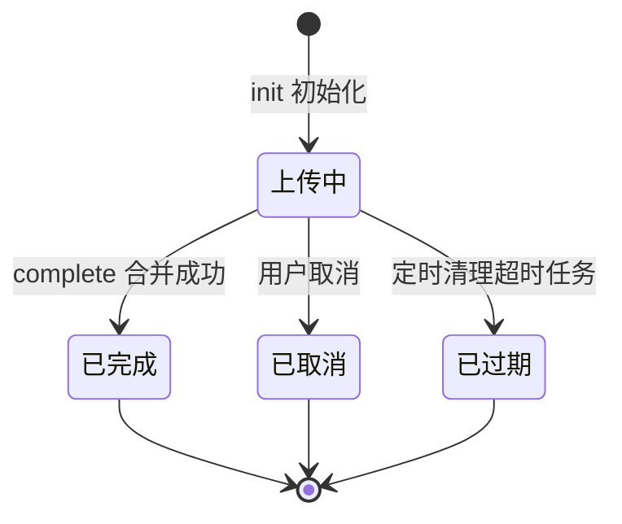
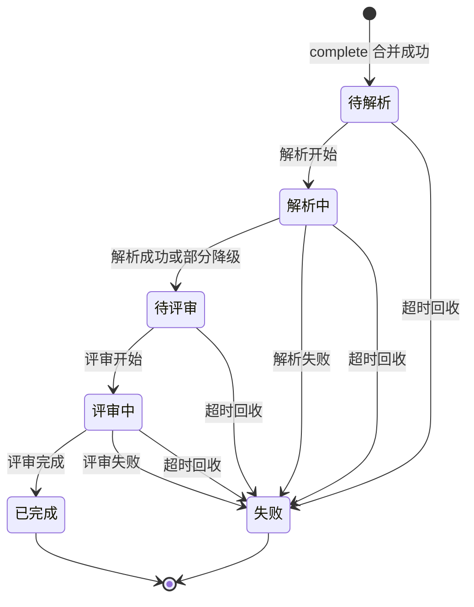

## 论文处理链路

> 设计状态：目标链路，尚需在后续实现任务中与现有 submission 与 review 代码对齐。本文统一上传、解析和评审阶段的状态语义，并以提交记录状态作为生命周期的单一事实来源。

---

### 一、设计目标与边界

一篇论文的完整生命周期分为三个阶段：提交、评审、改进建议。本文档定义前两个阶段的状态机——从 PDF 上传到评审完成的全部状态、触发事件、流转规则与防护手段。

**边界说明**

- 改进建议是评审完成后由有权用户手动发起的独立动作，由 suggestion 服务承载，不进入本状态机，见决策记录 6。
- 评审内部的 PDF 解析版本、题目对齐、证据定位、分项评分和汇总校验属于 ai-review-service 子流程，本状态机只到解析中 / 评审中这一粒度。
- 评审任务表的字段设计与 MQ 消息结构属域 3 与域 5，本文档只定义状态衔接语义。

---

### 二、生命周期总览

生命周期由两段状态机首尾衔接构成：上传任务状态机管上传段，提交记录状态机管解析与评审段。complete 合并成功是交接点——上传任务进入已完成终态，提交记录以待解析为初始状态接棒队伍互斥。

两段拆分的原因：上传任务可能取消、过期而从不产生提交记录，两者生命周期长度不同、清理策略不同，合并为一个状态机会让大量上传期状态污染论文主生命周期，见决策记录 1。

#### 上传任务状态机

沿用提交服务已定稿的设计，此处收敛为正式定义：

上传中是唯一活跃态，配合 `uk_team_active` 唯一约束实现队伍互斥。三个终态均释放互斥，其中已完成的释放与提交记录待解析的占用在同一事务内完成，繁忙状态无缝衔接。

#### 提交记录状态机

论文主生命周期，状态字段落 submission 表 status：

状态语义：

| 状态 | 语义 | 繁忙 | 终态 |
|------|------|------|------|
| 待解析 | 提交记录已创建，等待解析触发 | 是 | 否 |
| 解析中 | 解析执行中 | 是 | 否 |
| 待评审 | 解析产物就绪，评审任务已入队等待消费 | 是 | 否 |
| 评审中 | ai-review-service 已领取任务，评审执行中 | 是 | 否 |
| 已完成 | 评审结果已入库，可查看，可发起改进建议 | 否 | 是 |
| 失败 | 链路在某一阶段失败，失败阶段与原因可查 | 否 | 是 |

繁忙集合与互斥释放时机与提交服务设计完全一致：四个中间态繁忙，两个终态释放互斥、允许再次提交。

---

### 三、事件与流转规则

全部合法流转收敛为一张事件表，表外的任何状态变更都是非法流转：

| 事件 | 前置状态 | 目标状态 | 触发方 | 附带动作 |
|------|---------|---------|--------|---------|
| 提交创建 | 无记录 | 待解析 | submission 服务 complete 接口 | 触发解析 |
| 解析开始 | 待解析 | 解析中 | 解析执行方 | 无 |
| 解析成功或部分降级 | 解析中 | 待评审 | 解析执行方 | 评审任务入队 |
| 解析失败 | 解析中 | 失败 | 解析执行方 | 记录失败阶段为解析 |
| 评审开始 | 待评审 | 评审中 | ai-review-service | 无 |
| 评审完成 | 评审中 | 已完成 | ai-review-service | 评审结果入库 |
| 评审失败 | 评审中 | 失败 | ai-review-service | 记录失败阶段为评审 |
| 超时回收 | 全部四个中间态 | 失败 | 看门狗定时任务 | 记录失败阶段与超时原因 |

规则要点：

- 解析是目标新评审版本的强制步骤。解析部分成功时必须由评审版本的固定质量门决定放行或失败，缺页、低可信页和内容类型限制随不可变解析产物传递；不允许绕过解析将原始 PDF 静默交给新评审。
- 解析执行时锁定 `paperParsingWorkflowVersion` 和产物 schema；相同文件摘要与版本可复用已完成产物，新解析版本生成新产物，不覆盖历史结果。
- 失败是单一终态，用 fail_stage 字段区分解析失败与评审失败，不拆多个失败状态，见决策记录 2。
- 互斥释放无独立动作：繁忙判断的事实源就是 status 本身，进入终态即隐式释放，submission 表没有额外的活跃标记需要清理。
- 事件上报有顺序约束：执行方必须在开始事件回写成功后才允许上报结束事件，避免结束事件先到被判状态冲突而丢失结果。
- 评审任务入队当前以 Feign 同步调用先行，RocketMQ 实装后替换为异步消息，事件语义与状态流转不变，沿用队长变更通知的演进模式。

---

### 四、非法流转防护

状态流转的并发风险：重复消费、乱序回调、宕机后的迟到回调，都可能对同一记录发起不符合前置状态的变更。防护采用数据库条件更新：

- 每次流转执行 `UPDATE submission SET status = 目标 WHERE id = ? AND status = 前置`，影响行数为 0 即流转失败。
- 数据库原子性保证并发流转只有一个成功，无需分布式锁，与队伍互斥的唯一约束防护是同一哲学——用数据库最便宜的原子能力兜住并发正确性。
- 流转失败时区分两种语义：当前状态已是目标状态视为重复投递，幂等返回成功；否则返回状态冲突错误码，调用方据此放弃或告警。

不引入状态机框架，流转表以常量与条件更新落码，见决策记录 4。

---

### 五、状态单一事实来源

对应跨切面 C-5 的裁决：

- **submission 表 status 是论文生命周期的唯一权威状态**。进度查询、繁忙判断、互斥释放全部以它为准。
- upload_task 状态只管上传段自身，complete 之后不再被生命周期查询消费。
- 解析记录、评审任务记录中的执行状态是各自执行方的诊断细节，用于重试判断与问题排查，不作为生命周期进度的取数来源。
- 执行方内部状态与 submission 状态的同步方向单一：执行方先落自己的记录，再通过事件接口回写 submission，回写失败重试。查询侧永远不需要跨表合成状态。

看门狗兜底：定时任务扫描停留在任一中间态超过阈值的记录，置为失败并释放互斥，阈值按状态分别参数化。待解析与待评审的超时覆盖触发解析失败、评审任务入队丢失的场景，解析中与评审中的超时覆盖消费中宕机、回调丢失的场景，防止队伍被永久繁忙锁死。评审链路的洪峰排队修正：待评审与评审中的合法排队等待可能远超固定阈值，这两个状态的超时判定在时间超阈值之外，追加一次 ai-review-service 侧任务存在性查询。任务存在即视为合法排队不回收，精确区分入队丢失与洪峰排队，避免批量误杀。扫描的比较基准是进入当前状态的时间，落 stage_time 字段，每次流转随状态同一条更新语句写入。具体接口和恢复机制需要结合当前实现重新设计。

---

### 六、API 契约

状态字段在 submission 服务，事件接口全部挂载 submission 服务。解析能力通过事件接口声明执行结果，其部署归属不影响生命周期契约。

| 方法 | 路径 | 说明 | 关键响应 |
|------|------|------|---------|
| POST | `/internal/submission/submissions/{submissionId}/events/parse-started` | 内部接口，解析开始，幂等 | 流转结果 |
| POST | `/internal/submission/submissions/{submissionId}/events/parse-finished` | 内部接口，解析结束，请求体带 parseId 与 outcome，SUCCESS 与 PARTIAL 推进待评审并入队评审任务，FAILED 置失败 | 流转结果 |
| POST | `/internal/submission/submissions/{submissionId}/events/review-started` | 内部接口，评审开始，幂等 | 流转结果 |
| POST | `/internal/submission/submissions/{submissionId}/events/review-finished` | 内部接口，评审结束，请求体带结果标志与失败原因 | 流转结果 |
| GET | `/api/submission/submissions/{submissionId}` | 查询提交详情与生命周期状态，校验归属本人或本队 | 状态、失败阶段与原因、终态时间 |

契约要点：

- 事件接口按事件命名而非通用的状态修改接口，调用方只声明发生了什么，合法性由状态机裁决，杜绝越权直改状态。
- 幂等语义：重复投递同一事件且记录已处于目标状态时返回成功；前置状态不匹配返回状态冲突。
- 详情接口只承担生命周期状态的取数，提交列表、多次提交对比、结果版本管理归历史查询域，不在本契约扩展。
- 错误码新增 40608 非法状态流转，续用 BB=06 提交号段；评审侧业务错误码使用 07 号段。

---

### 七、数据模型增量

submission 表在已定稿字段基础上的增量：

| 字段 | 说明 |
|------|------|
| fail_stage | 失败阶段，解析、评审，仅失败态非空 |
| parse_id | 当前生效的解析产物标识，进入待评审时写入 |
| stage_time | 进入当前状态的时间，随每次流转更新，看门狗扫描的比较基准 |
| finished_time | 进入终态的时间，历史查询消费 |

状态与附属字段在同一条条件更新语句中写入，避免状态与属性分两次写产生的竞态窗口。评审任务表、评审结果表的设计属域 3 与域 5，随异步调度设计推进。

---

### 八、决策记录

按项目规范，所有设计决策记录结论与原因，面试可讲解取舍。

#### 1. 生命周期采用两段状态机首尾衔接，不合并为一个

**结论**：采纳。上传任务与提交记录各自独立状态机，complete 交接。

**原因**：上传任务可能取消、过期而从不产生论文记录，两者数量级、生命周期长度、清理策略都不同；合并会让论文主状态机塞满上传细节状态。首尾衔接由同一事务保证互斥不断档，已在提交服务设计中定稿，本文档收敛为正式定义。

**面试点**：状态机拆分粒度的判断依据——生命周期长度与清理策略不同的实体不共享状态机。

#### 2. 单一失败终态加 fail_stage 字段，不拆多个失败状态

**结论**：采纳。失败是唯一失败终态，fail_stage 区分解析失败与评审失败。

**原因**：拆成解析失败、评审失败两个状态，消费方做终态判断与互斥释放时要枚举全部失败态，将来阶段增多状态数线性膨胀；单一失败态加阶段字段，终态判断稳定，阶段信息不丢失。符合能字段化就不标签化的既有原则。解析设计中"解析失败终态"的表述统一为失败态加 fail_stage 为解析。

**面试点**：状态与状态属性的建模区分——正交信息用字段表达，不塞进状态枚举。

#### 3. submission.status 为生命周期单一事实来源

**结论**：采纳。进度查询、繁忙判断只读 submission 表，执行方内部状态仅作诊断。

**原因**：状态散落上传任务、解析记录、评审任务多表，查询侧跨表合成状态必然出现主从不一致的裁决难题。定死主从关系与单向同步后，查询逻辑简单且结果确定。裁决跨切面 C-5。

**面试点**：分布式链路中状态一致性的低成本方案——不是强一致，是单一权威加最终回写。

#### 4. 条件更新防非法流转，不引入状态机框架

**结论**：采纳数据库 CAS 式条件更新；舍弃 Spring Statemachine 等框架。

**原因**：全部合法流转只有八条，一张流转表加条件更新完整表达；状态机框架的持久化配置、拦截器体系对八条流转是杀鸡用牛刀，引入学习与维护成本。条件更新影响行数判断是数据库原生原子能力，并发防护零额外组件。

**面试点**：并发状态变更的防护选型——数据库条件更新对比分布式锁对比状态机框架。

#### 5. 状态变更收敛为事件接口，不提供通用状态修改接口

**结论**：采纳。内部接口按事件命名，parse-started、parse-finished、review-started、review-finished。

**原因**：通用的改状态接口把流转合法性的判断责任分散给每个调用方，任何一方出错都能把状态改乱；事件接口下调用方只声明事实，合法性由状态机统一裁决。接口语义也更贴近业务对话。

**面试点**：接口设计中的职责收敛——能力接口与事实声明接口的区别。

#### 6. 改进建议不纳入论文状态机

**结论**：采纳。已完成是评审生命周期的终态，改进建议是终态之后的独立增值动作。

**原因**：改进建议可多次手动发起，可在评审完成后任意时刻发起，与一次性单向推进的评审生命周期形态完全不同；纳入状态机会把终态变成中间态，破坏互斥释放语义。suggestion 服务以 submissionId 和已完成 reviewTaskId 关联后独立建模；是否需要会员或付费权限属于入口授权策略，不改变该生命周期决策。

**面试点**：生命周期终点的判断——后续动作存在不等于生命周期未结束。

#### 7. 看门狗超时回收覆盖全部中间态

**结论**：采纳。定时扫描停留在待解析、解析中、待评审、评审中超过阈值的记录置为失败，阈值按状态分别设置。

**原因**：消费中宕机、回调丢失、触发调用失败、入队消息丢失都是低频事件，但后果都是队伍永久繁忙、无法再次提交，属低频有害场景，必须兜底；只盯执行中状态会漏掉等待态卡死的路径。看门狗实现成本一个定时任务。完整的消费端恢复与重试机制属域 3，不在本期展开。

**面试点**：异步链路卡死的自愈设计，低频有害场景的兜底原则。

#### 8. 状态机粒度到评审中为止，评审内部步骤不进状态机

**结论**：采纳。检索增强、分段评审、汇总打分等编排步骤不设状态。

**原因**：评审内部步骤属工作流编排域 4-2，步骤会随评审方案演进频繁调整，进状态机则每次调整都动生命周期契约；状态机管对外可见的生命周期，工作流管内部执行，两层各自演进。评审进度的细粒度呈现留域 6-2 进度查询设计。

**面试点**：状态机与工作流的分层——稳定的对外生命周期与易变的内部编排分离。
