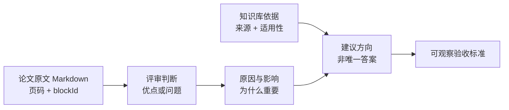

## 论文评审与建议 V4 专业报告链路

> 设计状态：已完成实现并经验收。本文记录 `DEEP_EVIDENCE_REVIEW_V4` 与
> `GROUNDED_SUGGESTION_V4` 的跨服务目标、职责边界、端到端流程和版本迁移规则。
> 确认日期：2026 年 9 月 16 日。

### 一、设计目标

V4 的目标不是让模型输出更多文字，而是把论文解析、评审推理、知识检索和前端富文本展示组合成
通用型 AI 难以稳定提供的专业证据报告。

专业价值由以下四项共同形成：

1. **论文事实可核对**：每个优点、问题和建议都引用锁定解析产物中的真实页码、章节、块和短原文。
2. **专业判断可解释**：结论使用完整句子说明发现、原因、影响和适用边界，不只给标签或一句动作。
3. **知识依据可追溯**：建议展示真实检索来源、支撑结论和适用性，不把相似度或通用常识冒充权威规则。
4. **建模自由度受保护**：对主观建模选择只指出可补充的维度和验证方向，不宣称存在唯一正确模型、算法或参数。

### 二、版本边界

本次调整发布为两个新版本：

| 能力 | 新工作流版本 | 新结果契约 | 历史版本处理 |
|------|--------------|------------|--------------|
| 论文评审 | `DEEP_EVIDENCE_REVIEW_V4` | `DEEP_EVIDENCE_REVIEW_V4` | V1/V2/V3 原样可读，不重算、不覆盖 |
| 论文建议 | `GROUNDED_SUGGESTION_V4` | `GROUNDED_SUGGESTION_V4` | V1/V2/V3 原样可读，不改变历史解释 |

评审权重、分数求和和 `[0,100]` 边界仍由服务端确定性计算，但 V4 的 Prompt、解释语义、
证据展示和建议边界均发生变化，因此工作流、Prompt、模型执行配置和结果 Schema 必须发布新版本。
评审量表在实现时登记为新的 `MODELING_TRAINING_RUBRIC_V4`，不得复用 V3 名称伪装语义不变。

### 三、参与者与数据所有权

| 参与者 | V4 职责 | 不负责 |
|--------|----------|--------|
| `submission-service` | 提供不可变论文提交引用 | 不解释论文内容 |
| `problem-service` | 提供锁定题面和小问要求 | 不产生评审意见 |
| `ai-review-service` | 评审、原文证据补全、优点/问题排序、评分 | 不生成完整修改方案 |
| `ai-suggestion-service` | 生成方向性建议、知识依据和验收方式 | 不重新评分，不覆盖评审 |
| `knowledge-retrieval-service` | 返回版本化知识引用及适用性 | 不判断论文事实 |
| `ai-gateway-service` | 锁定模型执行配置并审计调用 | 不拥有业务 Prompt 语义 |
| 前端 | 使用统一 Markdown/KaTeX 安全渲染并组织信息层级 | 不在浏览器推断优先级或伪造原文 |

原始论文和解析块仍由既有服务拥有。V4 结果只保存引用、服务端生成的短摘录和知识引用快照，
不复制整篇论文成为新的内容所有者。

### 四、端到端主流程

```mermaid
flowchart LR
    submission["不可变论文提交"] --> parse["PAPER_DOCUMENT_V2"]
    problem["锁定题面"] --> reviewPlan["V4 评审规划"]
    parse --> reviewPlan
    reviewPlan --> reviewWorkers["结构 / 小问 / 验证评审"]
    reviewWorkers --> reviewRaw["模型结构化结论"]
    reviewRaw --> evidenceHydrator["服务端原文证据补全"]
    parse --> evidenceHydrator
    evidenceHydrator --> reviewPolicy["分类、去重、优先级排序、Markdown 校验"]
    reviewPolicy --> reviewV4["DEEP_EVIDENCE_REVIEW_V4"]

    reviewV4 --> suggestionPlan["V4 建议规划"]
    parse --> suggestionPlan
    problem --> suggestionPlan
    suggestionPlan --> retrieval["按需知识检索"]
    retrieval --> suggestionWorkers["确定性补缺 / 完整性增强 / 可选探索"]
    suggestionWorkers --> suggestionPolicy["措辞边界、依据链、排序与去重"]
    suggestionPolicy --> suggestionV4["GROUNDED_SUGGESTION_V4"]

    reviewV4 --> frontend["统一 MarkdownView"]
    suggestionV4 --> frontend
```

### 五、专业证据链

V4 的每个核心结论必须形成四段闭环：

原文摘录由服务端根据模型返回的 `blockId` 从锁定的 `PAPER_DOCUMENT_V2` 中确定性生成。
模型不得返回自由文本冒充原文，不得自由填写图片 URL、页码或知识引用 ID。

### 六、Markdown 与媒体边界

- 所有面向用户的长说明字段使用 Markdown，支持标题、列表、引用块、表格、代码和 KaTeX。
- 行内公式使用 `$...$`，块级公式使用 `$$...$$`。
- 公式、HTML 表格和代码从论文解析块搬运时由 Jackson 负责 JSON 转义，不手拼 JSON。
- 前端统一通过 `MarkdownView` 和 `renderSafeMarkdown()` 渲染，禁止业务页面复制局部 Markdown 渲染器。
- V4 第一阶段不接受模型输出外部图片 URL。
- 图像证据只允许展示解析器已有的图题、图号、物理页码和受信图像描述。
- 实际局部截图需要坐标级解析、内部文件资产和访问控制，属于独立后续能力，不混入 V4 最小闭环。

### 七、非目标

- 不承诺通过连续生成建议自动迭代出获奖论文。
- 不为每个主观问题指定唯一模型、算法、公式、求解器或参数。
- 不生成可以直接替换用户正文的大段代写内容。
- 不允许知识库结论覆盖论文事实，也不允许论文原文替代专业方法依据。
- 不修改 V3 Prompt、Schema、历史结果和已有排行榜解释。

### 八、实施顺序

1. 发布 V4 文档、DTO 与版本目录。
2. 实现评审 V4 原文证据补全、排序和 Markdown 契约。
3. 实现建议 V4 语义边界、知识依据展示和措辞校验。
4. 前端新增 V4 报告视图并保留 V1-V3 兼容分支。
5. 使用中英文、高分与低分、公式密集和图表密集样本完成真实链路验收。
