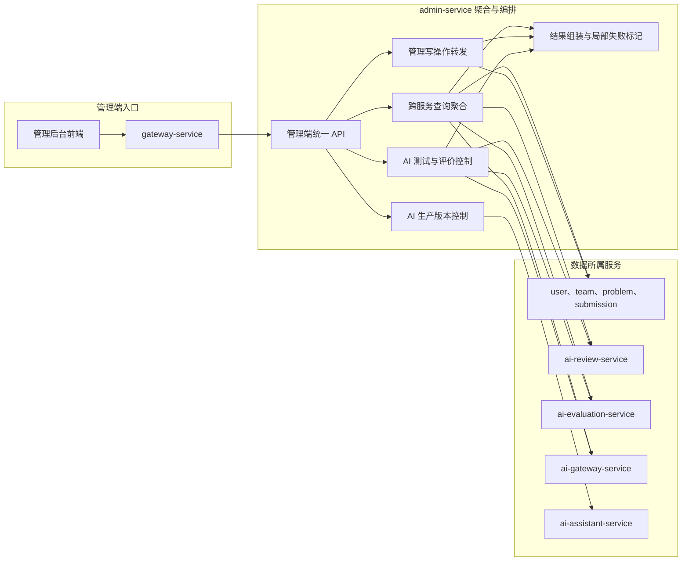

# 管理后台服务

> 管理后台服务是管理端统一入口和跨服务聚合层，不拥有各业务领域的核心数据。

## 整体结构与工作流程

管理请求先经过 API 网关进入 admin-service。查询请求由聚合模块向数据所属服务读取并组装，写请求只负责鉴权、注入登录操作者并转发，最终规则和事务仍由领域服务执行。ai-evaluation-service 的固定数据集、评价任务、版本化权重和结果重算契约已由 admin-service 提供管理员入口；评价调用通过 ai-gateway-service 的结构化条件追踪。admin-service 当前没有独立业务数据库，也不直连任何下游数据库。

## 职责边界

### 负责

- 为管理端提供统一 API 入口和面向管理页面的响应模型。
- 调用各业务服务聚合用户、团队、题目、提交、评审和运行统计。
- 转发管理写操作，由数据所属服务执行校验和事务。
- 聚合 ai-review-service 的评审数据、ai-evaluation-service 的稳定性统计与 ai-gateway-service 的资源消耗数据。
- 提供 AI 调用监控、评审版本重复实验和稳定性结果查询入口。
- 对 AI 客服生产版本操作执行管理员鉴权、操作者注入和命令转发。
- 对聚合查询中的局部失败进行显式标记，对管理写操作失败返回明确错误。

### 不负责

- 不拥有用户、团队、题目、提交、评审和 AI 调用主数据。
- 不直连任何业务服务数据库，不在本地复制业务数据。
- 不执行领域写操作的业务规则和事务。
- 不执行 PDF 解析、AI 评审工作流、稳定性统计算法和模型供应商调用。
- 不因为管理页面增多就拆出与各领域服务对应的影子管理微服务。

## 数据与协作边界

admin-service 当前不独占业务数据库，是无状态的管理端聚合服务。单领域事实与统计由数据所属服务提供，跨领域视图由 admin-service 在查询时组装。用户与 RBAC 数据来自 user-service，团队数据来自 team-service，题目数据来自 problem-service，提交数据来自 submission-service，评审数据来自 ai-review-service，质量评价数据来自 ai-evaluation-service，模型调用和资源数据来自 ai-gateway-service，客服生产版本与变更审计来自 ai-assistant-service。

管理端发起写操作时，admin-service 负责入口保护、请求编排和结果转换，数据所属服务负责最终业务校验、状态变更和事务一致性。下游不可用时不得使用零值、空集合或成功响应掩盖故障。

## 功能清单

| 功能 | 功能说明 |
|------|----------|
| 管理看板 | 聚合用户、队伍、题目、提交和 AI 运行摘要 |
| 用户管理入口 | 查询用户并转发账号管理操作 |
| RBAC 管理入口 | 管理角色、权限、用户角色和角色权限 |
| 题目与赛事管理入口 | 转发题目、标签和赛事管理操作 |
| 提交与评审查询 | 查询提交、评审任务和评审结果摘要 |
| AI 调用监控 | 展示模型、场景、Token、成本、耗时和成功率 |
| AI 测试集管理 | 提供选择题目与 PDF 并组建固定测试集的操作界面 |
| AI 版本评价控制 | 选择测试集、候选版本和重复次数并启动评价 |
| AI 评价进度 | 聚合展示评审运行、质量评价和失败重试进度 |
| AI 版本对比 | 聚合展示同口径方差、标准差、波动范围和运行诊断 |
| AI 客服生产版本 | 展示实验候选与当前生产配置，代理二次确认激活和同协议回滚 |
| 局部失败表达 | 在跨服务聚合失败时明确标记哪部分数据不可用 |

## 文档索引

| 文档 | 内容摘要 |
|------|----------|
| [服务设计.md](服务设计.md) | 聚合架构、管理接口边界、统计分层和拆分条件 |
| [AI调用监控/](AI调用监控/) | 按模型和场景监控 Token、成本、延迟和成功率 |
| [AI测试控制/](AI测试控制/) | 管理员启动固定样本重复实验并查看稳定性结果 |
| [生产版本切换/](生产版本切换/) | 管理员查看、预览、确认和回滚 AI 客服生产版本 |
