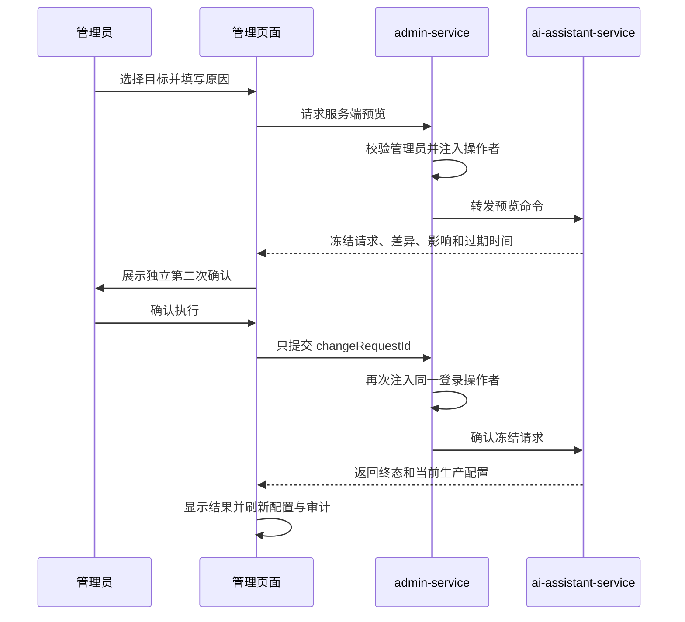

## 生产版本管理操作

### 任务卡

目标：管理员能够明确区分实验候选工作流与当前生产配置，在理解版本差异和影响范围后安全激活，并能对历史已生效配置执行同协议回滚。

入口：管理端独立页面调用 `admin-service` 的 AI 客服生产版本接口；admin-service 使用 `AssistantFeignClient` 转发到业务 owner。

主流程：页面加载工作流、当前配置、历史配置和审计；管理员选择激活或回滚目标并填写原因；服务端返回冻结差异；页面展示第二次确认；确认阶段只发送 `changeRequestId`；页面展示生效、冲突、拒绝或过期结果并刷新事实。

完成标准：所有接口受管理员角色保护；请求体不能声明操作者；差异和影响范围来自服务端预览；所有成功变更能从审计追溯；页面明确区分实验候选与生产生效；真实激活和回滚完成浏览器验收。

修改范围：admin-service 管理代理、前端 API、路由和生产版本页面，以及对应测试与文档。

非目标：不在 admin-service 保存生产配置，不从评价选择指数自动激活，不修改 new-api 渠道，不实现其他 AI 功能的生产切换，不引入 REST `/v1` 或 `/v2`。

### 页面信息

页面顶部独立展示“生产生效”卡片，包含生产配置版本、工作流、Prompt、模型执行配置、RAG 模式、固定索引、revision、操作者和观察期。工作流列表使用“实验候选”标识，该标识不等于已生产生效。

激活区域只允许选择已启用且不是当前项的工作流。固定 RAG 要求填写物理索引版本；无 RAG 禁止携带索引。回滚区域只允许选择历史配置，不能手工重新拼接字段。

审计列表展示动作、来源与目标配置、revision 变化、操作者、原因和时间。失败预览和冲突结果不伪装为成功审计。

### 二次确认

关闭确认弹窗不触发变更。预览过期、目标依赖失效或 revision 冲突时，页面保留明确结果并要求刷新后重新预览，不复用旧请求。
