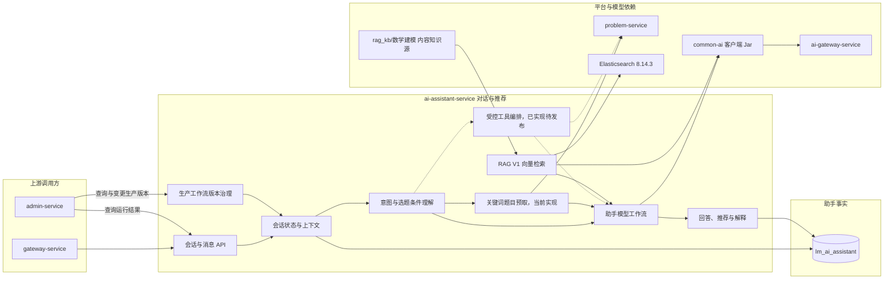

## AI 助手服务

ai-assistant-service 负责与用户进行受控文本对话，帮助用户理解平台功能、获取基础数学建模学习建议，并在需要时基于已发布题目候选做选题辅助。

> 分层定位：AI 业务能力层。MVP 会话、关键词题目预取和常规向量 RAG V1 已落地；标准受控工具协议、执行循环、题目查询/推荐、终止式知识讲解与独立调用审计也已实现，但尚未通过独立生产工具工作流启用。长期记忆、开放式 Agent、自主写操作、语音和多模态会话仍不在当前范围。

评价侧已发布无 RAG 与 RAG V1 两个单轮工作流版本。隔离入口不创建正式会话或消息；RAG 版本必须指定物理 `ragIndexVersion`，不会读取当前别名后静默漂移。

### MVP 当前实现

- 服务端口为 `8089`，独占 `lm_ai_assistant` 数据库，Flyway 管理会话表、消息表和两项幂等唯一约束。
- 用户可以创建、列出、恢复和结束自己的会话，发送消息时必须提供 `clientRequestId`；相同请求只保存一条用户消息和一条助手回复。
- 仅当当前问题命中固定选题关键词时，服务才通过 problem-service 查询最多 8 个已发布题目。候选为空时也会把空结果明确交给模型，禁止编造题目。这是目标工具调用上线前的临时预取方案，不是标准 `tool_calls`。
- AI 或题目工具失败时保留用户消息和失败回复，前端可对失败回复显式重试；生成或重试中断超过 5 分钟会转为可恢复失败。
- 对用户返回可操作的失败说明，连接地址等内部异常细节只写服务日志。
- 管理端通过内部接口查询会话总数和最近会话摘要，不读取模型供应商密钥或修改用户对话。

### 整体结构与工作流程

当前流程从用户会话开始，保存最近 20 条已完成消息作为短期上下文，根据固定关键词决定是否预取只读题目候选，最终通过 common-ai 调用 AI 网关并保存回答或失败结果。题目事实仍由 problem-service 拥有；MVP 当前不调用 user-service 获取额外用户摘要。

工具版工作流由模型返回结构化 `toolCalls`，ai-assistant-service 使用白名单执行题目查询、题目推荐或知识点讲解。公共协议、受控循环、题目工具和独立调用记录已经落地；图中仍使用虚线表示它尚未被生产配置引用，知识讲解和发布闭环完成前不会改变现有客服行为。详细设计见 [受控工具调用](受控工具调用/README.md)。

RAG V1 默认关闭。启用后，用户问题先经 Query Embedding 和 Elasticsearch 召回，命中片段在阈值与 Token 预算内作为带来源、明确标记为不可信的参考上下文注入现有工作流。检索失败或无命中时保持当前无 RAG 回答；Chat 失败仍沿用现有失败回复。Embedding 只能通过 `common-ai → ai-gateway-service → new-api` 调用。

### 职责边界

#### 负责

- 维护用户与 AI 助手的会话和消息。
- 理解用户的选题条件和学习需求。
- 调用题目查询能力并组织题目推荐结果。
- 拥有客服工具集、工具参数校验、工具执行循环和工具调用事实。
- 回答与平台使用和数学建模学习有关的辅助问题。
- 拥有第一版客服 RAG 的检索规则、索引协作和上下文注入边界。
- 拥有客服工作流发布目录、不可变生产配置、当前指针、变更请求和成功审计。
- 保存必要的对话上下文和 AI 输出结果。

#### 不负责

- 不拥有题目、标签和赛事主数据。
- 不执行论文评审和论文改善建议。
- 不维护模型供应商、密钥、成本和路由。
- 不为其他业务服务提供通用 RAG 接口，不索引原始抓取数据或 PDF。
- 不直接修改用户、题目或队伍数据。

### 数据与协作边界

ai-assistant-service 独占 `lm_ai_assistant` 数据库，拥有会话、消息、工具调用事实与结果快照、生产配置、当前指针、变更请求、成功审计和 AI 调用标识。题目数据由 problem-service 提供，模型调用通过 ai-gateway-service 完成。admin-service 只代理管理员命令，不直接读写这些生产事实。

### 功能清单

| 功能 | MVP 状态 | 功能说明 |
|------|----------|----------|
| 会话管理 | 已实现 | 创建、查询、继续和幂等结束当前用户会话 |
| 消息管理 | 已实现 | 保存用户问题、AI 回复、最近上下文和调用标识 |
| 平台使用问答 | 已实现 | 通过版本化 Prompt 回答平台流程和基本规则问题 |
| 关键词选题辅助 | 已实现 | 固定关键词命中后预取 problem-service 返回的已发布候选，属于工具版上线前的临时方案 |
| 受控工具调用 | 已实现、待发布 | 标准协议、受控循环、三个首版工具与审计已实现；独立生产工具工作流和端到端验收待完成 |
| 客服 RAG V1 | 已实现 | LangChain4j、统一 Embedding、Elasticsearch 基础向量召回、版本审计和安全降级 |
| AI 目录导航 RAG V2 | 设计完成、未实现 | 使用受控轻量目录选文并与 V1 组合，需固定对比实验证明增益后再另立实现任务 |
| 对话安全与失败处理 | 已实现 | 限定能力范围，保存失败、支持抢占重试和中断恢复 |
| 条件化题目筛选 | 已实现、待工具工作流启用 | 题目工具支持关键词、赛事、年份、难度、语言和时长的确定性只读筛选 |
| 助手质量评价 | 独立服务负责 | 由 ai-evaluation-service 建立测试集和版本评价，不归本服务所有 |
| 客服隔离实验 | 已实现 | 提供版本目录及无正式会话副作用的单轮通用实验入口 |
| 生产工作流版本治理 | 已实现 | 提供不可变配置、条件激活、运行快照、审计和同协议回滚；管理端完成强鉴权、服务端预览、二次确认和真实回滚闭环 |

### 文档规则

后续每个需要深入设计的功能使用独立文档。当前不提前创建空文档。

标准工具协议、首版三个工具、安全边界、调用记录和实施路线见 [受控工具调用](受控工具调用/README.md)。

RAG 的知识边界、配置、索引、回滚、测试和故障处理统一维护在 [RAG知识库.md](../../02-架构设计/RAG知识库.md)，RAG V2 的受控目录、两阶段流程、固定实验和实施门槛见 [RAG目录导航V2](RAG目录导航V2/README.md)，本 README 不复制操作步骤。

生产工作流的配置所有权、安全切换、运行快照和审计统一维护在 [生产工作流版本治理](生产工作流版本治理/README.md)。该能力首先只在 AI 客服落地，不代表已经形成跨服务中央版本平台。
