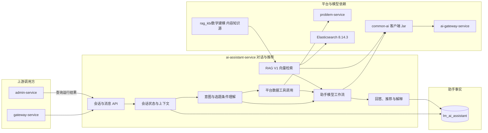

## AI 助手服务

ai-assistant-service 负责与用户进行受控文本对话，帮助用户理解平台功能、获取基础数学建模学习建议，并在需要时基于已发布题目候选做选题辅助。

> 分层定位：AI 业务能力层。MVP 会话、题目工具和常规向量 RAG V1 已落地；长期记忆、开放式 Agent、自主写操作、语音和多模态会话仍不在当前范围。

### MVP 当前实现

- 服务端口为 `8089`，独占 `lm_ai_assistant` 数据库，Flyway 管理会话表、消息表和两项幂等唯一约束。
- 用户可以创建、列出、恢复和结束自己的会话，发送消息时必须提供 `clientRequestId`；相同请求只保存一条用户消息和一条助手回复。
- 仅当当前问题包含明确选题意图时，服务才通过 problem-service 查询最多 8 个已发布题目。候选为空时也会把空结果明确交给模型，禁止编造题目。
- AI 或题目工具失败时保留用户消息和失败回复，前端可对失败回复显式重试；生成或重试中断超过 5 分钟会转为可恢复失败。
- 对用户返回可操作的失败说明，连接地址等内部异常细节只写服务日志。
- 管理端通过内部接口查询会话总数和最近会话摘要，不读取模型供应商密钥或修改用户对话。

### 整体结构与工作流程

当前流程从用户会话开始，保存最近 20 条已完成消息作为短期上下文，根据明确选题意图决定是否只读查询题目，最终通过 common-ai 调用 AI 网关并保存回答或失败结果。题目事实仍由 problem-service 拥有；MVP 当前不调用 user-service 获取额外用户摘要。

RAG V1 默认关闭。启用后，用户问题先经 Query Embedding 和 Elasticsearch 召回，命中片段在阈值与 Token 预算内作为带来源、明确标记为不可信的参考上下文注入现有工作流。检索失败或无命中时保持当前无 RAG 回答；Chat 失败仍沿用现有失败回复。Embedding 只能通过 `common-ai → ai-gateway-service → new-api` 调用。

### 职责边界

#### 负责

- 维护用户与 AI 助手的会话和消息。
- 理解用户的选题条件和学习需求。
- 调用题目查询能力并组织题目推荐结果。
- 回答与平台使用和数学建模学习有关的辅助问题。
- 拥有第一版客服 RAG 的检索规则、索引协作和上下文注入边界。
- 保存必要的对话上下文和 AI 输出结果。

#### 不负责

- 不拥有题目、标签和赛事主数据。
- 不执行论文评审和论文改善建议。
- 不维护模型供应商、密钥、成本和路由。
- 不为其他业务服务提供通用 RAG 接口，不索引原始抓取数据或 PDF。
- 不直接修改用户、题目或队伍数据。

### 数据与协作边界

ai-assistant-service 独占 `lm_ai_assistant` 数据库，拥有会话、消息、工具候选快照和 AI 调用标识。题目数据由 problem-service 提供，模型调用通过 ai-gateway-service 完成。

### 功能清单

| 功能 | MVP 状态 | 功能说明 |
|------|----------|----------|
| 会话管理 | 已实现 | 创建、查询、继续和幂等结束当前用户会话 |
| 消息管理 | 已实现 | 保存用户问题、AI 回复、最近上下文和调用标识 |
| 平台使用问答 | 已实现 | 通过版本化 Prompt 回答平台流程和基本规则问题 |
| 受控选题辅助 | 已实现 | 识别明确选题意图，只注入 problem-service 返回的已发布候选 |
| 客服 RAG V1 | 已实现 | LangChain4j、统一 Embedding、Elasticsearch 基础向量召回、版本审计和安全降级 |
| AI 目录导航 RAG V2 | 仅设计 | 读取目录元数据自主选文，需 V1 对比实验证明增益后再评估 |
| 对话安全与失败处理 | 已实现 | 限定能力范围，保存失败、支持抢占重试和中断恢复 |
| 条件化题目筛选 | 暂不实现 | MVP 不把赛事、标签等自然语言条件转换成开放查询参数 |
| 助手质量评价 | 独立服务负责 | 由 ai-evaluation-service 建立测试集和版本评价，不归本服务所有 |

### 文档规则

后续每个需要深入设计的功能使用独立文档。当前不提前创建空文档。

RAG 的知识边界、配置、索引、回滚、测试和故障处理统一维护在 [RAG知识库.md](../../02-架构设计/RAG知识库.md)，本 README 不复制操作步骤。
