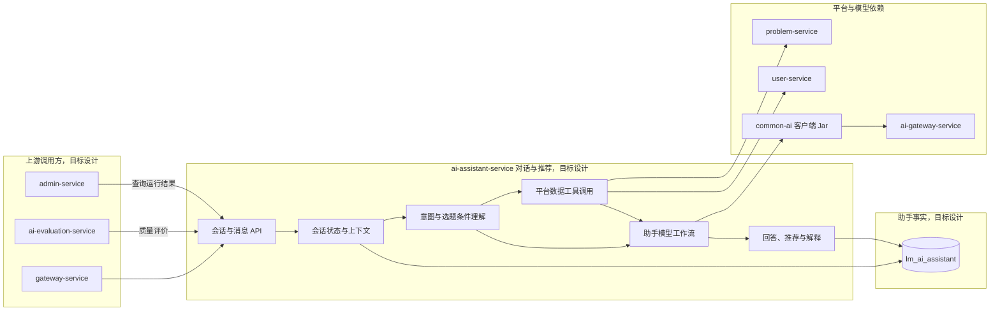

## AI 助手服务

ai-assistant-service 负责与用户进行对话，帮助用户理解平台功能、筛选题目和获得选题建议。

当前只建立服务边界和功能目录。该服务不属于当前 AI 评审核心闭环，具体功能后续逐个设计。

> 分层定位：AI 业务能力层。当前服务尚无 Maven 运行模块，以下职责边界是待逐项讨论确认的初始草案。

### 整体结构与工作流程

目标流程从用户会话开始，先维护上下文并理解问题或选题条件，再按需要查询题目与用户摘要，最终通过 AI 网关生成回答和推荐解释。题目与用户事实仍由对应领域服务拥有；当前整张图均为目标设计，不表示已经存在运行模块。

### 职责边界

#### 负责

- 维护用户与 AI 助手的会话和消息。
- 理解用户的选题条件和学习需求。
- 调用题目查询能力并组织题目推荐结果。
- 回答与平台使用和数学建模学习有关的辅助问题。
- 保存必要的对话上下文和 AI 输出结果。

#### 不负责

- 不拥有题目、标签和赛事主数据。
- 不执行论文评审和论文改善建议。
- 不维护模型供应商、密钥、成本和路由。
- 不直接修改用户、题目或队伍数据。

### 数据与协作边界

ai-assistant-service 独占 `lm_ai_assistant` 数据库，拥有会话、消息、助手任务和推荐解释。题目数据由 problem-service 提供，用户摘要由 user-service 提供，模型调用通过 ai-gateway-service 完成。

### 功能清单

| 功能 | 功能说明 |
|------|----------|
| 会话管理 | 创建、查询、继续和结束 AI 助手会话 |
| 消息管理 | 保存用户问题、AI 回复和必要上下文 |
| 平台使用问答 | 回答平台功能、操作流程和基本规则问题 |
| 选题条件收集 | 收集赛事、难度、方向、标签和完成时间等偏好 |
| 题目筛选 | 将用户条件转换为 problem-service 可执行的查询 |
| AI 题目推荐 | 对候选题目进行排序并解释推荐原因 |
| 对话安全与失败处理 | 处理超时、无效工具调用和不可回答内容 |
| 助手质量评价 | 后续由 ai-evaluation-service 对助手回答和推荐质量进行评价 |

### 文档规则

后续每个需要深入设计的功能使用独立文档。当前不提前创建空文档。
