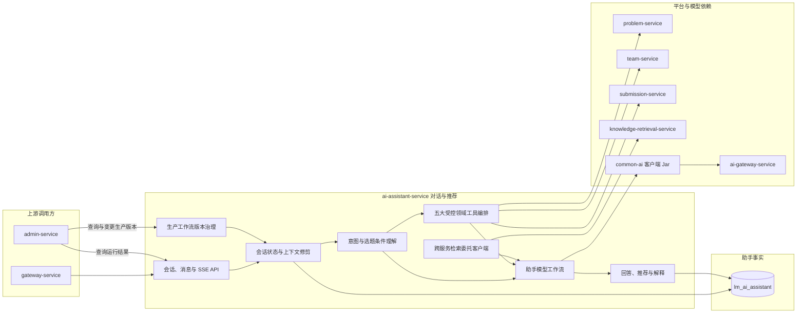

## AI 助手服务

ai-assistant-service 负责与用户进行受控文本对话，帮助用户理解平台功能、获取基础数学建模学习建议，并在需要时基于已发布题目候选做选题辅助。

> 分层定位：AI 业务能力层。首选大模型统一切换为 `gemini-3.8-flash-high`；已完成会话完整生命周期（软删除、自定义重命名、空白复用、游标分页）、多轮上下文智能修剪与工具事实折叠；客服 RAG 已解耦迁移至 `knowledge-retrieval-service`（发布 `ASSISTANT_TOOLS_RETRIEVAL_V1` 工作流并支持向量+BM25 RRF 混合检索）；领域只读工具链已扩展组队与提交状态查询，解耦知识工具终止型限制支持多意图复合编排；提供标准 SSE 流式通信与工具执行状态实时透出。

> 演进方向：历史 `ASSISTANT_NO_RAG_V1` 与 `ASSISTANT_RAG_V1` 保持不可变兼容；新生产默认推荐采用 `ASSISTANT_TOOLS_RETRIEVAL_V1`。长期记忆、开放式自主 Agent、主动写操作及多模态会话仍不在当前范围。

评价侧已发布无 RAG 与 RAG V1 两个单轮工作流版本。隔离入口不创建正式会话或消息；RAG 版本必须指定物理 `ragIndexVersion`，不会读取当前别名后静默漂移。

### MVP 当前实现

- 服务端口为 `8089`，独占 `lm_ai_assistant` 数据库，Flyway (V1~V8) 管理会话、消息、工具调用、生产配置与变更审计事实。
- 用户可以创建（未发问空白会话自动复用）、列出、重命名、软删除、游标分页拉取和结束自己的会话，发送消息时必须提供 `clientRequestId` 保障幂等性。
- 支持同步 `POST /messages` 与 SSE 流式 `POST/GET /messages/stream` 端点，向前端实时推送 `tool_start`、`tool_end`、`delta` 及 `message_end` 结构化事件。
- 工具链涵盖题目检索 (`search_problem`)、条件推荐 (`recommend_problem`)、知识讲解 (`explain_modeling_knowledge`)、队伍状态 (`query_user_team`) 和提交评测状态 (`query_submission_status`)，支持单轮复合意图调度。
- 多轮上下文集成 `AssistantContextPruner`：自动对过往轮次的工具原始 JSON 折叠为单行轻量事实标记，并按 Token 预算（默认 3,000 Tokens）滑动窗口成对淘汰远期历史。
- 知识检索全面委托中央 `knowledge-retrieval-service`，由其执行向量 + BM25 混合检索与 RRF 融合重排；服务不可用时优雅降级。

### 整体结构与工作流程

### 职责边界

#### 负责

- 维护用户与 AI 助手的会话和消息。
- 理解用户的选题条件和学习需求。
- 调用题目查询能力并组织题目推荐结果。
- 拥有客服工具集、工具参数校验、工具执行循环和工具调用事实。
- 回答与平台使用和数学建模学习有关的辅助问题。
- 当前拥有第一版客服 RAG 的实现与历史契约；迁移后仍拥有检索时机、客服上下文注入和降级语义。
- 拥有客服工作流发布目录、不可变生产配置、当前指针、变更请求和成功审计。
- 保存必要的对话上下文和 AI 输出结果。

#### 不负责

- 不拥有题目、标签和赛事主数据。
- 不执行论文评审和论文改善建议。
- 不维护模型供应商、密钥、成本和路由。
- 不为其他业务服务提供通用 RAG 接口；目标共享检索由 knowledge-retrieval-service 提供。不索引原始抓取数据或 PDF。
- 不直接修改用户、题目或队伍数据。

### 数据与协作边界

ai-assistant-service 独占 `lm_ai_assistant` 数据库，拥有会话、消息、工具调用事实与结果快照、生产配置、当前指针、变更请求、成功审计和 AI 调用标识。题目数据由 problem-service 提供，模型调用通过 ai-gateway-service 完成。admin-service 只代理管理员命令，不直接读写这些生产事实。

### 功能清单

| 功能 | 状态 | 功能说明 |
|------|------|----------|
| 会话管理 | 已完善 | 创建（空白复用）、列表、重命名、软删除、游标分页及幂等关闭 |
| 消息管理 | 已完善 | 保存提问与回复，支持同步与 SSE 流式输出，提供打字机与工具状态事件 |
| 平台使用问答 | 已实现 | 通过版本化 Prompt 回答平台流程、操作指引与建模赛题规则 |
| 受控工具调用 | 已完善 | 涵盖题目查询、题目筛选、知识讲解、队伍状态、提交评测五大工具，解耦终止型约束支持复合意图编排 |
| 跨服务混合检索 | 已实现 | 迁移至 `knowledge-retrieval-service`，采用向量+BM25 RRF 融合重排，发布 `ASSISTANT_TOOLS_RETRIEVAL_V1` |
| 多轮上下文工程 | 已实现 | `AssistantContextPruner` 执行过往工具事实紧凑折叠与 Token 预算滑动窗口裁剪 |
| 对话安全与容灾降级 | 已实现 | 限定只读能力范围，检索与工具异常平滑降级，支持中断恢复与重试 |
| 前端交互与品牌 | 已落地 | 提问乐观上屏、题意自动提取、题目推荐卡片、KaTeX 数学公式排版、代码块高亮及一键复制、全套卡通吉祥物形象 |
| 助手质量评价 | 独立服务负责 | 由 ai-evaluation-service 建立测试集和版本评价，不归本服务所有 |
| 客服隔离实验 | 已实现 | 提供版本目录及无正式会话副作用的单轮通用实验入口 |
| 生产工作流版本治理 | 已实现 | 提供不可变配置、条件激活、运行快照、审计和同协议回滚；管理端完成强鉴权、服务端预览、二次确认和真实回滚闭环 |

### 文档规则

后续每个需要深入设计的功能使用独立文档。当前不提前创建空文档。

标准工具协议、首版三个工具、安全边界、调用记录和实施路线见 [受控工具调用](受控工具调用/README.md)。

RAG 的当前知识边界、配置、索引、回滚、迁移目标和故障处理统一维护在 [RAG知识库.md](../../02-架构设计/RAG知识库.md)，独立服务契约见 [knowledge-retrieval-service](../knowledge-retrieval-service/README.md)，RAG V2 的受控目录、两阶段流程、固定实验和实施门槛见 [RAG目录导航V2](RAG目录导航V2/README.md)。

生产工作流的配置所有权、安全切换、运行快照和审计统一维护在 [生产工作流版本治理](生产工作流版本治理/README.md)。该能力首先只在 AI 客服落地，不代表已经形成跨服务中央版本平台。

前端浮窗状态机、提问乐观上屏、思考占位与会话标题自动推导机制见 [前端交互与会话标题状态机](前端交互与会话标题状态机.md)。

前端工具结果解析、题目推荐结构化卡片与题面路由直达协议见 [前端工具结果渲染协议](前端工具结果渲染协议.md)。

AI 客服专属卡通品牌形象规范与四大交互触点视觉定义见 [视觉资产与品牌形象规范](视觉资产与品牌形象规范.md)。

会话完整生命周期管理、空白会话自动复用、软删除与逆向游标分页契约见 [会话生命周期与游标分页契约](会话生命周期与游标分页契约.md)。

多轮对话上下文智能修剪、历史工具事实紧凑折叠与 Token 预算控制机制见 [上下文修剪与工具事实折叠设计](上下文修剪与工具事实折叠设计.md)。

客服 RAG 向独立知识检索微服务迁移、不可变工作流发布与向量+BM25 RRF 混合检索设计见 [客服RAG迁移与混合检索设计](客服RAG迁移与混合检索设计.md)。

只读领域工具扩展（组队与提交状态查询）与非终止型多意图复合编排机制见 [只读领域工具扩展与非终止型工具编排](只读领域工具扩展与非终止型工具编排.md)。

客服 SSE 流式协议、工具执行状态事件透出与打字机输出规范见 [客服SSE流式协议与事件透出规范](客服SSE流式协议与事件透出规范.md)。
