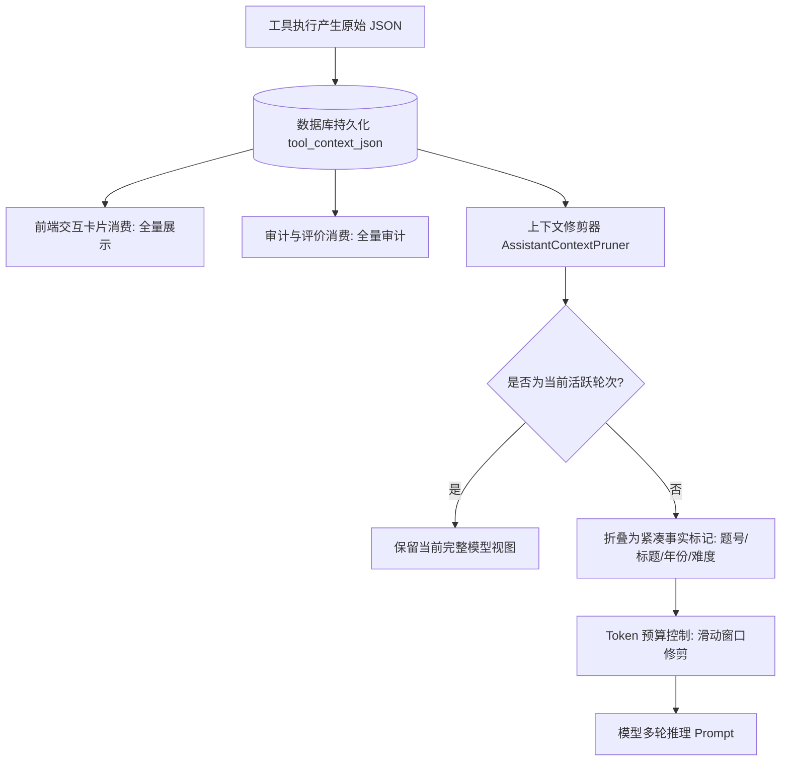

## 上下文修剪与工具事实折叠设计

> 实施状态：已落地。定义在多轮客服对话中，如何对过往轮次的工具原始输出进行轻量事实折叠与基于 Token 预算的滑动窗口修剪。

---

### 1. 核心挑战：Token 膨胀与注意力稀释

在多轮对话中，如果直接将历史轮次中的工具原始输出（例如 5 道题目的完整属性、长达数百字的背景概览及元数据 JSON）逐轮带入 Prompt：
1. **Token 线性膨胀**：每轮工具调用会给后续每一轮增加 1,000 ~ 3,000 Token 的开销，10 轮交互将耗尽上下文预算。
2. **注意力稀释（Lost in the Middle）**：模型在长达数万字的原始 JSON 堆砌中难以聚焦当前用户真实意图，容易产生幻觉或重复调用。
3. **记忆断层**：若简单暴力地把历史工具数据全量剔除，当用户在第 2 轮询问“你刚才推荐的第二题是什么”时，模型将无法感知自己历史推荐过什么题目。

---

### 2. 双重视图设计原则

系统确立“存储全量事实，推理轻量折叠”的双重视图隔离原则：



1. **持久化视图（全量）**：完整快照写入数据库 `tool_context_json`，供前端渲染富交互卡片与审计查询。
2. **推理视图（折叠）**：在装配历史消息发送给大模型时，过往轮次的庞大 JSON 被收缩为极轻量的单行事实标记。

---

### 3. 紧凑事实折叠标记语法

针对不同客服工具生成结构化、高辨识度的纯文本事实标记：

#### 题目检索与推荐工具 (`search_problem` / `recommend_problems`)
原始数百行 JSON 收缩为：
```text
[历史工具事实: search_problem -> 找到 P1001《电力系统短期负荷预测模型》(2024年, 难度2); P1003《共享单车调度优化》(2023年, 难度1)]
```
**提取信息**：仅保留题号、标题、年份、难度，剥离超长题面描述与空字段。Token 消耗从 ~2500 压缩至 ~40（压缩比 > 98%）。

#### 知识点讲解工具 (`explain_modeling_knowledge`)
收缩为：
```text
[历史工具事实: explain_modeling_knowledge -> 已讲解该知识点核心概念与建模步骤]
```

---

### 4. 基于轮次的滑动窗口与预算控制算法

1. **预算上限**：默认分配历史消息上下文 Token 预算（例如 3,000 Tokens）。
2. **逆向遍历与成对保护**：
   - 从最新一轮历史消息向前扫描；
   - 遇到折叠后的消息累计字符估算（中文及符号按 1 Token ≈ 1.5 字符估算）；
   - 若超出预算，以“用户提问 + 助手回复”完整轮次为单位进行淘汰，严禁遗留孤立的用户消息或助手回复；
3. **锚点保护**：
   - 系统 Prompt（含规则指令）；
   - 当前轮次 RAG 知识检索片段；
   - 当前轮次用户最新提问；
   上述三者享有绝对优先级，不参与历史滑动窗口淘汰。
