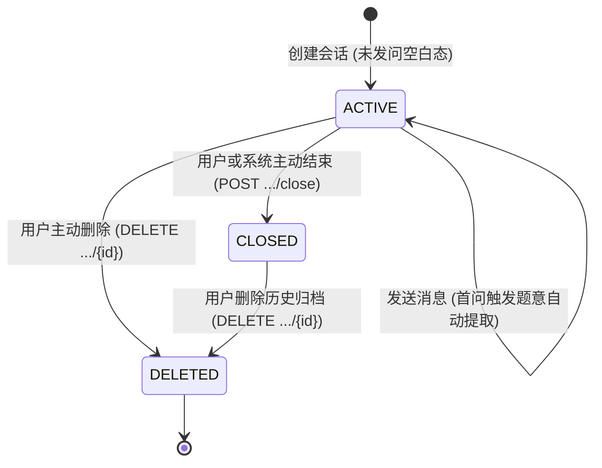

## 会话生命周期与游标分页契约

> 实施状态：已落地。定义 AI 客服会话的完整生命周期管理（创建与空白复用、重命名、关闭、软删除）以及历史消息逆向游标分页契约。

---

### 1. 会话生命周期与状态流转



#### 空白会话自动复用契约
- **触发场景**：用户调用 `POST /api/assistant/conversations`。
- **复用条件**：用户当前存在状态为 `ACTIVE` 且历史消息数为 0 的会话。
- **行为**：直接返回该空白会话，若请求体指定了新标题则静默更新该会话标题，阻止多余无效空行膨胀。

#### 会话软删除契约
- **端点**：`DELETE /api/assistant/conversations/{conversationId}`
- **语义**：逻辑删除，基于 MyBatis-Plus `@TableLogic` 机制将 `assistant_conversation.deleted` 置为 1，并级联将对应 `assistant_message.deleted` 置为 1。
- **防护**：强校验会话归属 (`userId`)，非拥有者或不存在返回 `40501 (CONVERSATION_NOT_FOUND)`。

#### 用户自定义重命名契约
- **端点**：`PUT /api/assistant/conversations/{conversationId}/title`
- **请求体**：`{ "title": "自定义标题" }`
- **约束**：标题非空且长度限定在 1~50 字符之间。

---

### 2. 消息历史逆向游标分页契约

对话场景下，客户端首次加载希望看到最新的消息流（位于底部），向上滚动翻阅更早的历史消息。

#### 端点定义
`GET /api/assistant/conversations/{conversationId}?cursor={cursor}&limit={limit}`

| 参数 | 类型 | 必填 | 默认值 | 说明 |
|------|------|------|--------|------|
| `cursor` | Long | 否 | `null` | 游标标识，对应客户端当前可见最上方消息的 `id` |
| `limit` | Integer | 否 | 50 | 单页拉取条数（服务端安全边界 1~100） |

#### 查询与翻页时序
1. **首次拉取 (`cursor = null`)**：
   - 数据库执行：`WHERE conversation_id = ? ORDER BY id DESC LIMIT (limit + 1)`
   - 若返回条数大于 `limit`，说明存在更早历史，取截断后最上一条消息 ID 作为 `nextCursor`，标记 `hasMore = true`；
   - 结果倒序反转为自然时间升序（`ASC`）返回给前端，直接对齐聊天时间轴。
2. **翻阅更早历史 (`cursor = nextCursor`)**：
   - 数据库执行：`WHERE conversation_id = ? AND id < cursor ORDER BY id DESC LIMIT (limit + 1)`
   - 同样截断并计算更新下一级 `nextCursor`。

#### 响应扩展 Schema (`ConversationVO`)
```json
{
  "id": "189871234567890123",
  "title": "线性规划与对偶理论探讨",
  "status": "ACTIVE",
  "messages": [
    { "id": "201", "role": "USER", "content": "..." },
    { "id": "202", "role": "ASSISTANT", "content": "..." }
  ],
  "nextCursor": "201",
  "hasMore": true
}
```
