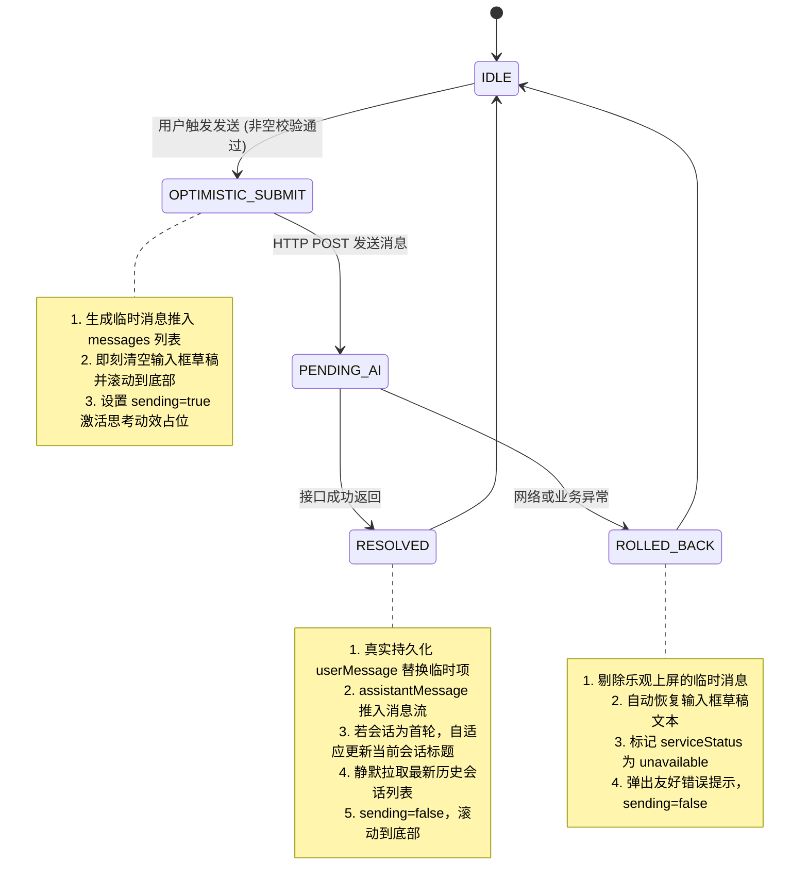

## 前端交互与会话标题状态机

> 实施状态：已落地。服务于 AI 客服前端浮窗与移动端交互，对齐后端会话标题自动归纳契约与无缝乐观更新。

### 背景与问题

1. **标题推导契约偏差**：后端 `AssistantService` 约定仅当会话标题为 `"新会话"` 时，首条用户消息才会自动触发题意截取（不超过 30 字符）。旧前端在新建会话时固定传递 `"AI 客服咨询"`，破坏了该条件判断，导致所有对话标题均停留在静态字符串。
2. **提问假死感**：旧前端在网络请求返回前不将用户消息推入渲染列表，用户发送后输入框清空但屏幕无任何即时反馈，高延迟下极易导致重复点击或误以为页面假死。

### 交互状态机设计



### 标题自动推导与同步契约

1. **新建会话入参**：
   前端新建会话时显式对齐默认值：
   ```javascript
   const res = await createConversation("新会话");
   ```
2. **后端推导规则**：
   首轮提问落库后，后端自动执行：
   ```java
   if (DEFAULT_TITLE.equals(conversation.getTitle())) {
       String title = content.length() <= 30 ? content : content.substring(0, 30) + "…";
       conversation.setTitle(title);
   }
   ```
3. **前端乐观归纳**：
   在发送成功后，若当前对话标题仍为 `"新会话"`，前端立即基于首句提取前 30 字符更新本地 `conversations` 列表中的条目，随后由静默刷新的 `listConversations()` 获得最终权威标题，实现零闪烁平滑过渡。

### 异常防护与重试

- 乐观上屏的临时消息带有 `temp-` 唯一临时标识，即使与后端异步事件交错也不会造成 ID 冲突或重复推入。
- 若发送失败，草稿无损回填，避免用户重输长段问题的挫败感。
