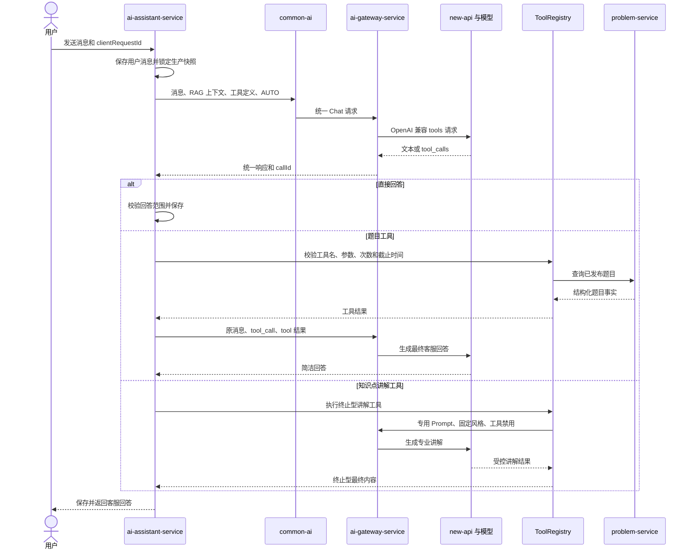

## 总体流程与职责

> 设计状态：设计草案已完成，等待开发者确认后进入实施。

### 设计结论

首版采用单客服工作流内的原生工具调用，不引入 TianJiXueTang 的路由 Agent 和多个专项 Agent。模型通过统一 `tool_calls` 契约选择工具，业务服务通过固定注册表执行工具。

选择该方案的原因如下：

- LeetModel 已有稳定的会话、消息、RAG、生产配置和 AI 网关链路，新增路由 Agent 会产生额外模型调用和新的记忆边界。
- 题目查询和知识讲解都属于客服回复内部步骤，不需要独立会话或独立 Agent 生命周期。
- 工具执行权必须留在业务服务。模型只能提出结构化调用请求，不能反射调用任意 Bean 或直接访问其他服务。
- 原生工具协议能够保留清晰的参数 Schema、供应商调用标识和工具结果角色，面试叙事也比把 JSON 文本伪装成工具更完整。

TianJiXueTang 可借鉴的部分是专项工具、ToolContext、专用 Prompt 和结果回传。LeetModel 不照搬它的进程内静态结果容器、供应商客户端直连和开放式 Agent 路由。

### 总体流程

### 单轮执行规则

一次用户消息对应一个已有的助手回复记录。回复生成内部允许多次模型调用和工具执行，但对用户仍表现为一条助手消息。

1. `AssistantService` 继续按 `clientRequestId` 幂等保存用户消息，并为该消息创建唯一助手回复。
2. 回复创建时锁定 `productionConfigVersion`、`workflowVersion`、`promptVersion`、`toolsetVersion`、`modelExecutionConfigVersion` 和可选 `ragIndexVersion`。
3. `AssistantToolOrchestrator` 组装最近 20 条已完成消息、系统 Prompt、受控 RAG 上下文和当前工具集。
4. 模型返回普通文本时，工作流直接进入范围校验和持久化。
5. 模型返回工具调用时，编排器只接受一个调用。首版不并行执行多个工具。
6. 工具执行完成后，题目工具结果以 `TOOL` 消息回传模型，由模型形成最终客服回答。
7. `explain_modeling_knowledge` 是终止型工具。它使用独立 Prompt 生成可直接返回的最终内容，不再调用外层模型改写，避免一次知识问答产生三次 Chat 调用。
8. 每次回复最多执行两次工具。超过次数、重复无进展调用或总截止时间耗尽时，回复失败并允许用户重试。

### 回答范围

| 用户意图 | 处理方式 |
|----------|----------|
| 平台操作和流程 | 客服主 Prompt 直接回答，允许 RAG 提供受控依据 |
| 指定题号、题名或题面信息 | 必须调用 `search_problem`，不得依靠模型记忆回答 |
| 选题、推荐题目和适合什么题 | 必须调用 `recommend_problem`，只能推荐工具返回的已发布题目 |
| 数学建模知识点、方法和概念 | 必须调用 `explain_modeling_knowledge`，使用专用 Prompt 回答 |
| 论文评分和正式评审 | 说明应使用平台评审功能，不在客服会话内代替正式评审 |
| 平台与数学建模无关 | 简短说明服务范围，不调用工具，不继续开放问答 |

工具调用约束由系统 Prompt、工具描述和离线评价共同保证。首版不再使用当前的关键词列表作为主要路由器。对于明确题号格式，可以保留服务端兜底规则，强制暴露 `search_problem` 并拒绝无工具的题目事实回答。

### 职责边界

#### ai-assistant-service

- 拥有客服 Prompt、工具集版本、工具描述、工具路由规则和执行循环。
- 从认证上下文构造可信 `ToolExecutionContext`，不接受模型伪造用户 ID、会话 ID 或权限。
- 校验工具参数并执行只读业务工具。
- 保存会话、消息、工具调用事实和必要结果快照。
- 决定失败是否可重试以及向用户显示什么错误。

#### common-ai

- 定义供应商无关的工具定义、工具选择、工具调用和工具结果契约。
- 保持不带工具的现有 Chat 调用源码兼容和 JSON 兼容。
- 不注册、不执行、不持久化业务工具。

#### ai-gateway-service

- 校验锁定模型是否声明工具能力。
- 将统一工具契约映射到 new-api 的 OpenAI 兼容协议。
- 返回统一 `toolCalls`、停止原因、Token、费用和 `callId`。
- 不执行工具，不保存完整参数和结果正文，不判断工具是否符合业务权限。

#### problem-service

- 拥有题目、赛事、标签和发布状态事实。
- 提供面向客服工具的内部只读查询契约。
- 校验只返回已发布题目，并限制查询条数和题面长度。
- 不拥有推荐话术和客服 Prompt。

### 方案取舍

| 方案 | 结论 | 原因 |
|------|------|------|
| 原生 `tool_calls` | 采用 | 结构明确，可校验，可追踪，适合后续增加队伍查询工具 |
| 模型输出自定义 JSON 路由 | 不采用 | 容易把普通文本解析失败伪装成工具错误，协议语义弱 |
| 路由 Agent 加多个专项 Agent | 首版不采用 | 增加模型调用、上下文和版本治理复杂度，当前工具数量不足以证明收益 |
| Spring AI `@Tool` 反射注册 | 不采用 | 当前主链不使用 Spring AI，动态扫描也会扩大可调用边界 |
| 业务服务预查后拼接 Prompt | 作为迁移前现状 | 实现简单，但模型没有标准调用事实，无法扩展统一审计和多工具循环 |
