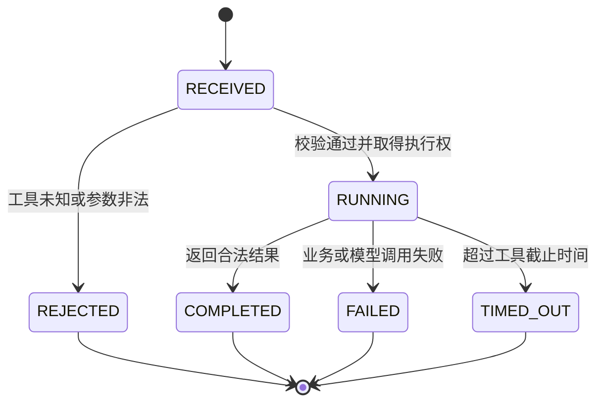

## 安全状态与审计

> 实现状态：V5 Flyway 已创建 `assistant_tool_call`，`RECEIVED → RUNNING → COMPLETED|FAILED|TIMED_OUT` 与 `RECEIVED → REJECTED` 条件迁移、参数/结果快照和 AI 调用关联已落地。V6 已发布生产工具工作流，并把消息级 `toolsetVersion` 与 `attemptCount` 纳入运行快照。

### 安全模型

工具调用采用服务端能力白名单。模型不是授权主体，也不是可信参数来源。

| 风险 | 控制方式 |
|------|----------|
| 模型请求未知工具 | `ToolRegistry` 精确匹配工具集版本和名称，未知名称直接拒绝 |
| 模型伪造用户或会话 | 身份和会话只从认证上下文与已保存消息生成 |
| 参数注入或超长输入 | JSON Schema 与 Java Bean Validation 双重校验，拒绝未知字段 |
| 工具结果提示词注入 | 结果使用字段白名单和数据边界标记，系统 Prompt 声明结果不可执行 |
| 未发布题目泄漏 | problem-service 在数据所有者边界强制校验发布状态 |
| 无限调用和成本放大 | 每次回复最多两次工具调用，禁止并行和递归，使用绝对截止时间 |
| 写操作越权 | 首版工具全部只读，注册表不提供写工具 |
| 无关内容开放回答 | 主客服 Prompt 和讲解 Prompt 都限定 LeetModel 与数学建模范围 |
| 敏感内容进入日志 | 日志只记录标识、状态、耗时和错误类型，不记录 Prompt、完整参数、题面或回答 |

### 执行状态

每次模型返回的工具调用建立一条调用记录，状态只允许按下图变化：

工具调用失败不会写入伪造的空结果。助手回复保持 `FAILED`，保存面向用户的短错误说明，并沿用现有重试入口。

### 幂等和重试

- 用户消息继续使用会话内 `clientRequestId` 唯一约束。
- 一条用户消息继续只拥有一条助手回复。
- 每次生成或重试分配递增 `attemptNo`，同一次尝试中的工具调用使用从 1 开始的 `sequenceNo`。
- 工具记录唯一键为 `assistantMessageId + attemptNo + sequenceNo`。
- 供应商 `toolCallId` 只在当前助手回复和当前尝试内唯一，不作为全局业务主键。
- 题目工具是只读调用，重复执行不产生业务副作用。
- 知识讲解的 AI 调用使用 `assistant:{assistantMessageId}:attempt:{attemptNo}:tool:{sequenceNo}` 作为 AI 网关幂等键。
- 重试重新查询实时题目事实，不复用上次失败调用的半成品。已完成回复不能重试。

### 工具调用目标表

新增 `assistant_tool_call`，保存一次回复内部的工具执行事实。

| 字段 | 语义 |
|------|------|
| `id` | 工具调用主键 |
| `conversation_id` | 会话关联标识 |
| `user_message_id` | 触发工具的用户消息 |
| `assistant_message_id` | 最终承载回答的助手消息 |
| `attempt_no` | 当前回复生成尝试序号 |
| `sequence_no` | 当前尝试内的工具序号 |
| `provider_tool_call_id` | 模型返回的工具调用标识 |
| `toolset_version` | 锁定的工具集版本 |
| `tool_name` | 工具名称 |
| `tool_version` | 单工具实现版本 |
| `status` | `RECEIVED`、`RUNNING`、`COMPLETED`、`FAILED`、`REJECTED`、`TIMED_OUT` |
| `arguments_json` | 通过 Schema 校验后的规范化参数 |
| `result_snapshot_json` | 题目工具的必要事实快照；知识工具只保存哈希和长度 |
| `planning_ai_call_id` | 产生本次 `toolCall` 的 AI 网关调用标识 |
| `nested_ai_call_id` | 知识讲解工具内部 AI 调用标识，普通数据工具为空 |
| `error_code` | 稳定的内部错误分类，不保存堆栈和下游地址 |
| `duration_ms` | 工具执行耗时 |
| `started_at` | 开始执行时间 |
| `finished_at` | 完成或失败时间 |

必须建立唯一索引 `assistant_message_id + attempt_no + sequence_no`，并为 `tool_name + status + create_time` 建立管理统计索引。

题目工具结果快照最多保存五条必要摘要，用于解释历史回答。知识讲解的完整结果已经保存在 `assistant_message.content`，工具表不重复保存正文。`arguments_json` 和 `result_snapshot_json` 不进入普通应用日志。

### 消息和版本快照调整

`assistant_message` 增加以下字段：

- `toolset_version`：本次回复允许使用的不可变工具集。
- `attempt_count`：已开始的生成尝试数，用于恢复和诊断。
- `ai_call_id` 继续指向产生最终可见回答的调用。题目工具流程中它指向工具结果后的最终生成调用，知识讲解流程中它指向讲解工具内部调用。

`assistant_workflow_version` 和 `assistant_production_config` 增加 `toolset_version`。回复创建时一次性锁定该值，运行中不读取当前工具集别名。

工具集版本不替代 `workflowVersion` 或 `promptVersion`。工作流定义何时和如何调用工具，工具集定义可调用工具的结构与限制，Prompt 定义模型行为和回答风格。

### 超时和限制

| 限制 | 首版值 |
|------|--------|
| 单次回复工具调用数 | 最多 2 次 |
| 单次模型响应工具调用数 | 只接受 1 次 |
| 题目工具结果数 | 最多 5 条 |
| 题面概览 | 每题最多 500 个 Unicode 码点 |
| 题目工具执行时间 | 3 秒 |
| 知识讲解 Chat 时间 | 120 秒，且不能超过回复绝对截止时间 |
| 整个回复截止时间 | 沿用当前 240 秒 AI 调用截止时间，并由编排器共享 |

### 故障分类

| 场景 | 工具状态 | 客服结果 |
|------|----------|----------|
| 未找到题目 | `COMPLETED` | 明确说明未找到，不推荐虚构结果 |
| problem-service 不可用 | `FAILED` | 回复失败，可重试 |
| 参数非法或未知工具 | `REJECTED` | 回复失败，记录协议错误，不执行下游调用 |
| 模型不支持工具 | 不创建工具记录 | AI 网关拒绝调用，回复失败 |
| 模型重复调用同一工具且参数不变 | `REJECTED` | 终止无进展循环 |
| 知识主题越界 | `COMPLETED` | 返回固定范围说明，不扩展回答 |
| 知识讲解模型超时 | `TIMED_OUT` | 回复失败，可重试 |
| 最终回答模型失败 | 题目工具保持 `COMPLETED` | 助手回复失败，重试时重新执行完整尝试 |

### 可观测性

首版管理统计只需要低基数字段：工具名、工具版本、状态、耗时区间、调用次数和错误分类。日志关联 `conversationId`、`assistantMessageId`、`attemptNo`、`sequenceNo`、`planningAiCallId` 和可选 `nestedAiCallId`。

不得在 ai-gateway-service 调用审计中保存工具参数与工具结果。AI 网关只记录是否启用工具、工具数量和是否返回工具调用，业务语义由 ai-assistant-service 拥有。
