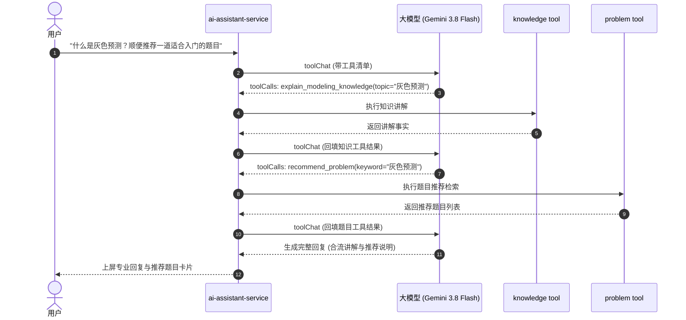

## 只读领域工具扩展与非终止型工具编排

> 实施状态：已落地。定义 AI 客服业务领域只读工具链（队伍与提交状态查询）与解耦终止型约束后的多意图复合编排机制。

---

### 1. 安全边界与只读原则

1. **绝对只读约束**：客服工具严禁开放任何写操作（如修改队名、加入队伍、替用户提交文件等），所有领域工具方法必须为 HTTP GET 或只读查询。
2. **用户身份强作用域**：工具执行上下文持有当前会话所有者的 `userId`，查询用户队伍或提交时默认限制在自身账号范围内，杜绝横向越权。
3. **敏感信息过滤**：对模型公开的事实剔除内部 MinIO 物理 Key、数据库系统字段与未发布敏感数据。

---

### 2. 新增只读领域工具定义

#### 工具一：`query_user_team`（查询用户当前队伍）
- **功能**：查询当前提问用户所属队伍的组队状态、队伍名称、队长标识、队员数量、实训状态及当前选题。
- **参数 Schema**：
  ```json
  {
    "type": "object",
    "properties": {},
    "additionalProperties": false
  }
  ```
- **输出事实**：
  ```json
  {
    "inTeam": true,
    "teamId": 1024,
    "name": "极值探索队",
    "memberCount": 3,
    "problemId": 51001,
    "practiceStatus": "IN_PROGRESS"
  }
  ```

#### 工具二：`query_submission_status`（查询提交与评测状态）
- **功能**：查询指定提交记录或用户当前队伍的论文提交状态、最新版本号与系统评审进度。
- **参数 Schema**：
  ```json
  {
    "type": "object",
    "properties": {
      "teamId": { "type": "integer", "description": "目标队伍ID（可选）" },
      "submissionId": { "type": "integer", "description": "指定提交记录ID（可选）" }
    },
    "additionalProperties": false
  }
  ```
- **输出事实**：
  ```json
  {
    "hasSubmission": true,
    "submissionId": 2048,
    "version": 2,
    "originalFilename": "MCM_Problem_C_Solution.pdf",
    "status": "SCORED",
    "createTime": "2026-09-05T18:00:00"
  }
  ```

---

### 3. 非终止型工具解耦与复合编排时序

旧版本中 `explain_modeling_knowledge` 工具被声明为 `terminal=true`，一旦被模型调用即刻终止整轮对话编排，无法支持用户复合意图（例如：“帮我讲解什么是灰色预测，并推荐一道相关的历年赛题”）。

通过将其调整为 `terminal=false`，知识讲解内容作为标准工具结果回填至消息流，模型可在单轮交互中依次调度多个工具完成知识沉淀与资源推荐的复合应答。


