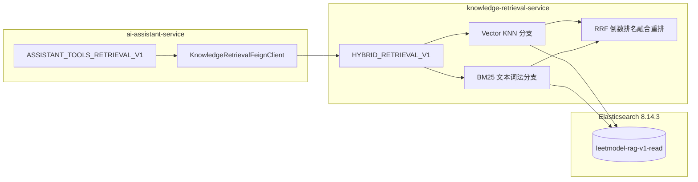

## 客服 RAG 迁移与混合检索设计

> 实施状态：已落地。定义 AI 客服向中央统一检索微服务 `knowledge-retrieval-service` 迁移、发布新不可变工作流 `ASSISTANT_TOOLS_RETRIEVAL_V1`，并在检索端引入向量 + BM25 混合检索与 RRF 融合重排算法。

---

### 1. 演进背景与架构解耦

在 MVP 初期，AI 客服在 `ai-assistant-service` 内部使用 LangChain4j 直接连接 Elasticsearch 和 Embedding 接口完成单路向量检索。随着论文改善建议（`ai-suggestion-service`）成为第二个检索消费者，平台已确立 `knowledge-retrieval-service` 作为中央知识权威。

本次演进将客服 RAG 消费迁移至 `knowledge-retrieval-service`，同时遵循项目红线：**不得破坏旧版本 `ASSISTANT_RAG_V1` 的历史语义**，采用发布新工作流版本 `ASSISTANT_TOOLS_RETRIEVAL_V1` 的不可变治理模式。

---

### 2. 向量 + BM25 混合检索与 RRF 融合重排

数学建模专业场景存在大量专有名词和缩写（如“AHP 层次分析法”、“TOPSIS 优劣解距离法”、“灰色预测”、“NSGA-II”等）。单一向量检索在专有名词短查询时易被通用语义平滑稀释；单一 BM25 则无法理解长句意图和近义词。

#### 双路召回
1. **向量路（KNN）**：
   - 输入经 `qwen3.7-text-embedding` 生成 1024 维向量；
   - ES 执行高维向量近邻搜索：`knn: { field: "embedding", query_vector: ..., k: 2*topK }`。
2. **BM25 词法路（Multi-Match）**：
   - ES 执行全文检索：`query: { multi_match: { query: ..., fields: ["title^3", "content^1"] } }`。

#### RRF (Reciprocal Rank Fusion) 重排公式
对于候选文档片段 $d$：
$$RRF(d) = \sum_{m \in \{vec, bm25\}} \frac{1}{k + r_m(d)}$$
其中：
- 常数 $k = 60$（信息检索标准平滑因子）；
- $r_{vec}(d)$ 与 $r_{bm25}(d)$ 分别为文档在向量路与 BM25 路中的名次排名（1, 2, ...）；未在某路召回则该项贡献为 0。

#### 效果优势
当查询包含“AHP”或“灰色预测”时，BM25 路将标题包含该词的文档排在第 1 名，向量路同样将其置于前列。双路叠加后 RRF 得分远超仅单路命中的文档，确保专业概念 100% 精准排在首位。

---

### 3. 新工作流发布与生产治理

#### 工作流元数据 (`V8__publish_assistant_tools_retrieval_workflow.sql`)
- **版本标识**：`ASSISTANT_TOOLS_RETRIEVAL_V1`
- **显示名称**：`客服工具版跨服务检索RAG V1`
- **提示词版本**：`PROMPT_ASSISTANT_TOOLS_0001`
- **模型执行配置**：`MODEL_CFG_ASSISTANT_TOOLS_0001`
- **工具集版本**：`ASSISTANT_TOOLSET_0001`
- **RAG 模式**：`RETRIEVAL_SERVICE`
- **目标阶段**：`PRODUCTION`

#### 优雅降级契约
当 `knowledge-retrieval-service` 发生超时、网络中断或 Elasticsearch 抖动时，客服服务自动捕获异常并降级为空上下文，保证普通问答与题目推荐主链畅通，绝不因此向用户抛出 500 错误。
