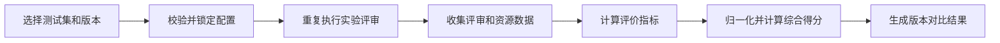

## 执行流程

```mermaid
flowchart LR
    A[选择测试集和版本] --> B[校验并锁定配置]
    B --> C[重复执行实验评审]
    C --> D[收集评审和资源数据]
    D --> E[计算评价指标]
    E --> F[归一化并计算综合得分]
    F --> G[生成版本对比结果]
```

管理员确定测试集、候选版本和重复次数后创建评价任务。ai-evaluation-service 校验输入并锁定本次配置，然后按测试用例、评审版本和重复轮次组织实验评审。

实验评审与用户正式评审隔离。运行结束后，系统收集评审结果、成本、耗时和调用状态，完成确定性检查与裁判模型评价，最后生成版本综合得分和横向对比结果。
