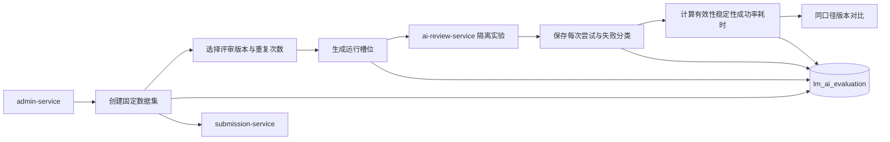

## AI 质量评价服务

ai-evaluation-service 是独立的 AI 业务质量评价微服务。MVP 只评价 AI 论文评审工作流版本：管理员用已有最终提交组成不可变固定数据集，选择评审版本和重复次数，启动与用户正式评审隔离的实验运行，查看指标、失败样本和版本对比。

> 实现状态：已有 Maven 运行模块，默认端口 `8091`，独占数据库 `lm_ai_evaluation`，表结构由 Flyway 管理。当前为 MVP 固定口径，不是通用实验平台。

### 已实现流程

1. 创建数据集时校验最终提交可用性，快照保存 `submissionId`、`teamId`、`problemId` 和排序，不复制 PDF。
2. 数据集创建后不允许修改；每个数据集最多 10 个样本，不能重复引用同一提交。
3. 创建任务时校验评审版本，重复次数限为 1–3，`clientRequestId` 保证幂等，相同标识不得改变配置。
4. 调度器每次领取一个待运行槽位，调用 ai-review-service 的隔离实验接口。实验不创建正式评审任务或覆盖用户评审。
5. 每次尝试都独立留痕。输出错误计入版本有效性；环境或配置错误阻断得分，可由管理员重试，旧尝试不被覆盖。
6. 任务完成后计算固定指标；版本对比只允许相同数据集和相同重复次数，每个版本取最新完成任务。

### 责任边界

#### 负责

- 拥有不可变数据集、样本快照、评价任务、运行尝试和汇总指标。
- 组织固定样本与重复运行，处理中断恢复和环境失败重试。
- 保存输出有效性、重复分数稳定性、成功率、平均耗时与综合得分。
- 输出单任务明细、失败样本和同口径版本比较。

#### 不负责

- 不执行或修改用户正式评审；评审工作流仍归 ai-review-service。
- 不拥有 PDF、题目、论文评审结果或模型供应商配置。
- MVP 不使用另一个 AI 裁判模型，不宣称识别评审的语义正确性。
- MVP 未接入 AI 网关成本聚合，综合得分不包含 Token 或价格成本。
- 不扩展为通用实验、模型训练、自动调权或自动发布系统。

### 数据与接口

| 资源 | 所有者 | 说明 |
|------|--------|------|
| `evaluation_dataset` | ai-evaluation-service | 不可变数据集定义 |
| `evaluation_sample` | ai-evaluation-service | 提交、队伍、题目快照，不保存 PDF |
| `evaluation_task` | ai-evaluation-service | 版本、重复次数、进度和汇总指标 |
| `evaluation_run_attempt` | ai-evaluation-service | 每个样本和轮次的多次尝试及失败分类 |
| PDF 与提交事实 | submission-service | 创建数据集时通过内部契约校验 |
| 可执行版本与实验结果 | ai-review-service | 提供版本列表和隔离实验契约 |

ai-evaluation-service 只暴露 `/internal/evaluations/**`，对外的管理员权限、操作入口和页面聚合由 admin-service 负责。

### 验证基线

- 自动化测试覆盖数据集边界、依赖失败、版本校验、幂等冲突、运行领取、三类结果、中断恢复、重试、计分、对比和大整数 ID。
- 真实 MySQL 已验证 Flyway V1 创建四张业务表和幂等/查询索引。
- 真实 `8091` HTTP 实例已验证计数、参数上下界、空数据集和依赖不可用映射。

### 文档索引

| 文档 | 内容摘要 |
|------|----------|
| [AI裁判/](AI裁判/) | MVP 评审版本质量评价口径与后续演进边界 |
