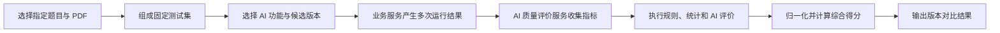

## AI 质量评价服务

ai-evaluation-service 是独立的 AI 业务质量评价微服务。它使用固定样本、规则、统计方法和裁判模型，评价不同 AI 功能或工作流版本的质量与综合表现。

当前第一个使用场景是 AI 论文评审版本对比。后续可以扩展到 AI 论文改善建议等其他对输出质量有明确要求的功能。

### 拆分目标

- 将 AI 功能生成与 AI 质量评价分为两个清晰的职责。
- 统一管理固定样本、重复测试、评价指标、归一化和综合得分。
- 避免评价规则与某个 AI 业务功能的实现过度绑定。
- 为后续新增 AI 功能提供独立的质量评价扩展边界。

### 职责边界

#### 负责

- 维护 AI 质量评价任务和执行状态。
- 维护由指定题目和指定 PDF 输入组成的测试集。
- 为不同 AI 功能定义各自的评价指标和评价口径。
- 组织固定样本与重复运行，保证对比输入一致。
- 执行确定性规则、统计指标和裁判模型评价。
- 对各项指标进行归一化并计算综合得分。
- 保存评价指标、综合得分和横向对比结论。

#### 不负责

- 不执行论文评审、论文改善建议或其他 AI 业务功能。
- 不修改 AI 业务功能的原始输出。
- 不拥有论文 PDF、评审结果或改善建议等业务事实。
- 不直接管理模型供应商、密钥、价格和路由。
- 不负责管理端页面聚合和展示。

### 数据与协作边界

ai-evaluation-service 独占 `lm_ai_evaluation` 数据库，拥有评价任务、样本集定义、指标结果、归一化结果和综合得分。样本集只保存对业务样本的引用，不复制 PDF 等原始业务数据。

- ai-review-service 拥有论文评审任务和评审结果，向 ai-evaluation-service 提供评价所需的结果和关联标识。
- problem-service 拥有测试用例引用的题目内容。
- submission-service 拥有测试用例引用的原始 PDF。
- ai-gateway-service 拥有模型调用、Token、成本、耗时和调用状态数据。
- ai-evaluation-service 通过 common-ai 调用裁判模型。
- admin-service 负责启动评价和聚合展示，不直接访问 `lm_ai_evaluation`。

### 功能清单

| 功能 | 功能说明 | 文档安排 |
|------|----------|----------|
| 测试集管理 | 组织由指定题目和指定 PDF 输入组成的固定测试用例 | [AI裁判/](AI裁判/) |
| 评价任务创建 | 锁定测试集、候选 AI 功能版本、重复次数和评价口径 | [AI裁判/](AI裁判/) |
| 重复运行编排 | 组织业务服务对同一测试用例执行多次运行 | [AI裁判/](AI裁判/) |
| 确定性检查 | 检查 AI 业务输出的结构、必填内容和数值范围 | [AI裁判/](AI裁判/) |
| AI 裁判 | 使用裁判模型评价难以由固定规则判断的质量与语义一致性 | [AI裁判/](AI裁判/) |
| 稳定性统计 | 统计同一样本重复运行时的分数波动和主要结论一致性 | [AI裁判/](AI裁判/) |
| 资源指标关联 | 根据调用关联标识获取完整工作流的成本、耗时和成功状态 | [AI裁判/](AI裁判/) |
| 指标归一化 | 将质量、稳定性、成本、响应时间和成功率转换为统一得分 | [AI裁判/](AI裁判/) |
| 综合得分 | 按固定权重聚合指标，生成 `[0,100]` 范围的 AI 功能版本综合得分 | [AI裁判/](AI裁判/) |
| 版本横向对比 | 展示各版本的综合排名、单项优势和主要代价 | [AI裁判/](AI裁判/) |
| 评价进度与重试 | 查询评价阶段和失败范围，对可恢复失败项重新执行 | [AI裁判/](AI裁判/) |
| 其他 AI 功能评价 | 后续为论文改善建议等 AI 功能分别建立评价指标和综合口径 | 有真实业务功能后再建立文档 |

### 评价流程

### 拆分取舍

当前只有 AI 论文评审这一个明确消费场景，拆分独立微服务会增加跨服务调用、数据关联、部署和故障处理成本。

本项目仍选择提前拆分，原因是 AI 功能生成与 AI 质量评价具有明确不同的职责，并且后续计划增加论文改善建议等新的 AI 质量评价场景。该拆分优先追求系统结构清晰和长期扩展边界，接受当前阶段的额外工程成本。

### 文档索引

| 文档 | 内容摘要 |
|------|----------|
| [AI裁判/](AI裁判/) | 第一版 AI 评审质量评价指标、归一化和综合得分 |
