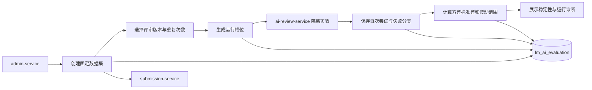

## AI 评价服务

ai-evaluation-service 是独立的 AI 业务评价微服务。当前实现只评价 AI 论文评审工作流的重复运行稳定性；目标平台按运行指标、稳定性指标、具备真值或人工标注的质量指标以及版本选择指数四层组织评价。

> 设计状态：D-04 已校准术语。现有 Maven 模块仍实现旧版极差归一化和 `overallScore`；该字段不是正式需求中的质量分。后续 S7 至 S9 迁移为原始指标、口径版本、权重快照和“版本选择指数”。

### 已实现流程

1. 创建数据集时校验最终提交可用性，快照保存 `submissionId`、`teamId`、`problemId` 和排序，不复制 PDF。
2. 数据集创建后不允许修改；每个数据集最多 10 个样本，不能重复引用同一提交。
3. 创建任务时校验评审版本，重复次数限为 1–3，`clientRequestId` 保证幂等，相同标识不得改变配置。
4. 调度器每次领取一个待运行槽位，调用 ai-review-service 的隔离实验接口。实验不创建正式评审任务或覆盖用户评审。
5. 每次尝试都独立留痕。输出错误计入版本有效性；环境或配置错误阻断得分，可由管理员重试，旧尝试不被覆盖。
6. 任务完成后按样本计算评分方差、标准差和波动范围，再汇总版本稳定性。只有使用相同样本集、重复次数和统计口径的运行才能比较。

### 责任边界

#### 负责

- 拥有不可变数据集、样本快照、评价任务、运行尝试和汇总指标。
- 组织固定样本与重复运行，处理中断恢复和环境失败重试。
- 保存重复评分、方差、标准差、波动范围、输出成功率和平均耗时。
- 输出单任务明细、失败样本和同口径稳定性比较。

#### 不负责

- 不执行或修改用户正式评审；评审工作流仍归 ai-review-service。
- 不拥有 PDF、题目、论文评审结果或模型供应商配置。
- 不使用另一个 AI 对日志、Prompt、回答或评审结果进行二次评价，也不保留该方向作为后续计划。
- 不判断评审内容是否客观正确，不把稳定性解释为用户满意度或语义质量。
- 未接入 AI 网关成本聚合，运行成本只作为运维信息的后续候选项，不参与稳定性结论。
- 当前实现不是通用实验平台；S7 至 S9 将按已确认路线扩展多个 AI 功能和管理闭环。始终不负责模型训练、自动调权或自动发布。

### 数据与接口

| 资源 | 所有者 | 说明 |
|------|--------|------|
| `evaluation_dataset` | ai-evaluation-service | 不可变数据集定义 |
| `evaluation_sample` | ai-evaluation-service | 提交、队伍、题目快照，不保存 PDF |
| `evaluation_task` | ai-evaluation-service | 版本、重复次数、进度和稳定性汇总指标 |
| `evaluation_run_attempt` | ai-evaluation-service | 每个样本和轮次的多次尝试及失败分类 |
| PDF 与提交事实 | submission-service | 创建数据集时通过内部契约校验 |
| 可执行版本与实验结果 | ai-review-service | 提供版本列表和隔离实验契约 |

ai-evaluation-service 只暴露 `/internal/evaluations/**`，对外的管理员权限、操作入口和页面聚合由 admin-service 负责。

### 验证基线

- 现有自动化测试覆盖数据集边界、依赖失败、版本校验、幂等冲突、运行领取、三类结果、中断恢复、重试、旧版计分、对比和大整数 ID。
- 真实 MySQL 已验证 Flyway V1 创建四张业务表和幂等/查询索引。
- 真实 `8091` HTTP 实例已验证计数、参数上下界、空数据集和依赖不可用映射。

### 文档索引

| 文档 | 内容摘要 |
|------|----------|
| [稳定性评价/](稳定性评价/) | 固定样本重复运行、统计指标、结论边界和后续实现差异 |
| [评价指标与版本选择指数.md](评价指标与版本选择指数.md) | 运行、稳定性、质量、归一化、权重与指数的统一术语 |
