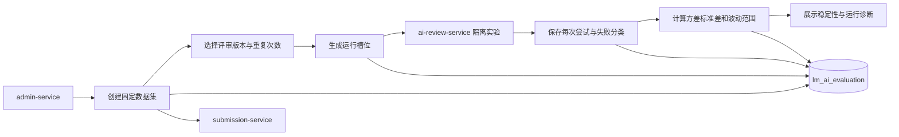

## AI 评价服务

ai-evaluation-service 是独立的 AI 业务评价微服务。当前已通过通用 Runner 评价论文评审与客服单轮工作流；目标平台按运行指标、稳定性指标、具备真值或人工标注的质量指标以及版本选择指数四层组织评价。

> 设计状态：S7 通用评价平台及迁移回归已落地，包括版本化样本、REVIEW/ASSISTANT Runner、批次控制、`METRIC_SET_V1/V2` 原始指标和同口径比较门禁；S8 已落地归一化规则、评价服务自有的版本化权重方案与首版“版本选择指数”快照。旧版 `overallScore` 仍只作为兼容字段。

### 已实现流程

1. 创建数据集时校验最终提交可用性，快照保存 `submissionId`、`teamId`、`problemId` 和排序，不复制 PDF。
2. 数据集创建后不允许修改；默认最多 100 个样本，不能重复引用同一业务样本。
3. 创建任务前预估样本、候选版本、重复次数、总槽位和调用量；默认重复次数上限为 20，服务端在创建时再次校验，`clientRequestId` 保证幂等。
4. 调度器每次领取一个待运行槽位，按 feature 选择 REVIEW 或 ASSISTANT Runner 调用 owner 的隔离实验接口。实验不创建正式评审任务、客服会话或消息。
5. 每次尝试都独立留痕。输出错误计入版本有效性；环境或配置错误阻断得分，可由管理员重试，旧尝试不被覆盖。
6. 任务完成后按样本计算评分方差、标准差和波动范围，再汇总版本稳定性。只有使用相同样本集、重复次数和统计口径的运行才能比较。
7. 管理员可暂停、恢复或取消任务；暂停阻断新派发，取消保留全部历史并尝试取消网关排队调用，控制动作记录操作者。

### 责任边界

#### 负责

- 拥有不可变数据集、样本快照、评价任务、运行尝试和汇总指标。
- 组织固定样本与重复运行，处理中断恢复和环境失败重试。
- 保存重复评分、方差、标准差、波动范围、输出成功率和平均耗时。
- 客服结果只保存回答哈希、长度、callId 和适用的物理 RAG 索引版本，不保存完整回答。
- 输出单任务明细、失败样本和同口径稳定性比较。

#### 不负责

- 不执行或修改用户正式评审；评审工作流仍归 ai-review-service。
- 不拥有 PDF、题目、论文评审结果或模型供应商配置。
- 不使用另一个 AI 对日志、Prompt、回答或评审结果进行二次评价，也不保留该方向作为后续计划。
- 不判断评审内容是否客观正确，不把稳定性解释为用户满意度或语义质量。
- 创建前缺少真实 Token 用量和可追溯价格快照时明确返回费用不可用，不生成伪精确金额；成本不参与稳定性结论。
- 当前已支持 REVIEW 与 ASSISTANT 的通用实验 Runner，S7 至 S9 继续完成运行控制、可信指标和管理闭环。始终不负责模型训练、自动调权或自动发布。

### 数据与接口

| 资源 | 所有者 | 说明 |
|------|--------|------|
| `evaluation_dataset` | ai-evaluation-service | 不可变数据集定义 |
| `evaluation_sample` | ai-evaluation-service | 提交、队伍、题目快照，不保存 PDF |
| `evaluation_task` | ai-evaluation-service | 版本、重复次数、进度和稳定性汇总指标 |
| `evaluation_run_attempt` | ai-evaluation-service | 每个样本和轮次的多次尝试及失败分类 |
| `evaluation_weight_scheme` | ai-evaluation-service | 不可变方案版本、功能、指标集、状态和创建/停用审计 |
| `evaluation_weight_scheme_item` | ai-evaluation-service | 指标口径、归一化参数和权重快照 |
| `evaluation_score_result` | ai-evaluation-service | 按任务与结果版本保存方案/原始指标快照和版本选择指数 |
| `evaluation_score_result_item` | ai-evaluation-service | 每项原值、归一化值、权重和贡献值 |
| PDF 与提交事实 | submission-service | 创建数据集时通过内部契约校验 |
| 可执行版本与实验结果 | ai-review-service、ai-assistant-service | 提供版本列表和隔离实验契约 |

ai-evaluation-service 只暴露 `/internal/evaluations/**`，对外的管理员权限、操作入口和页面聚合由 admin-service 负责。

### 验证基线

- 后端根 reactor 373 项测试通过（9 个外部 smoke 显式跳过），覆盖历史读取、新任务、恢复、控制、比较、限流、费用缺失和大整数 ID。
- 真实 MySQL 8.0.33 已验证 Flyway V1→V6 连续迁移、通用四表回填、attempt 幂等唯一索引、控制审计、原始指标和数据集版本快照。
- 真实 `8091` HTTP 实例已验证计数、参数上下界、空数据集和依赖不可用映射。

### 文档索引

| 文档 | 内容摘要 |
|------|----------|
| [稳定性评价/](稳定性评价/) | 固定样本重复运行、统计指标、结论边界和后续实现差异 |
| [通用评价/](通用评价/) | 通用功能、版本、数据集、任务和运行尝试的领域模型与迁移边界 |
| [通用评价/批次规模预估.md](通用评价/批次规模预估.md) | 创建前规模、调用量、费用完整性、P3 与服务端限制 |
| [通用评价/调用身份与未知结果.md](通用评价/调用身份与未知结果.md) | task/slot/attempt 身份、幂等键、P3 和 UNKNOWN 处理 |
| [通用评价/迁移回归与兼容退出.md](通用评价/迁移回归与兼容退出.md) | S7 回归矩阵、全量验证与旧接口/字段退出门槛 |
| [权重与选择指数/](权重与选择指数/) | S8 归一化、权重方案、结果版本和管理闭环 |
| [评价指标与版本选择指数.md](评价指标与版本选择指数.md) | 运行、稳定性、质量、归一化、权重与指数的统一术语 |
