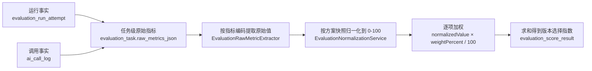

## 指标来源与组合影响

本文回答三个问题：版本选择指数由哪些指标算出、每个指标的数字从哪里来、为什么它同时受工作流版本和模型执行配置影响。归一化公式与权重方案的生命周期分别见 [归一化配置.md](归一化配置.md) 与 [版本化权重方案.md](版本化权重方案.md)。

管理端展示名称统一为“版本选择指数”，不使用“综合评分”“综合质量分”等容易与客观质量混淆的说法；指数旁必须同时展示评价目标与权重方案版本。

### 评价对象是版本组合

一次评价任务锁定的不是一个单一版本，而是一组执行组合：

| 字段 | 含义 | 保存位置 |
|------|------|----------|
| `featureCode` | 被评价功能（REVIEW、ASSISTANT、SUGGESTION） | `evaluation_task.feature_code` |
| `workflowVersion` | AI 业务工作流版本 | `evaluation_task.workflow_version` |
| `modelExecutionConfigVersion` | 模型执行配置版本（供应商、模型、参数、上限） | `evaluation_task.model_execution_config_version` |
| `ragIndexVersion` | 适用的物理 RAG 索引版本 | `evaluation_task.rag_index_version` |
| `datasetVersion` / `repeatCount` | 样本集版本与重复次数 | `evaluation_task.dataset_version`、`repeat_count` |
| `metricSetVersion` | 指标口径版本 | `evaluation_task.metric_set_version` |
| `weightSchemeVersion` | 权重方案版本 | `evaluation_task.weight_scheme_version` |

因此指数描述的是“某个工作流 × 某个模型执行配置，在锁定样本集、口径和权重偏好下更适合被选中”的程度。同一工作流换模型、或同一模型换工作流，都会得到不同的指数，两次结果只有在功能、样本集、重复次数、指标口径和环境约束都相同时才能直接比较。

### 计算链路

完整公式：

- 逐项贡献：`contributionValue = normalizedValue × weightPercent / 100`。
- 指数：`versionSelectionIndex = Σ contributionValue`，仅在全部权重项可用时计算。
- 精度：归一化与贡献保留 6 位小数、`HALF_UP`；权重保留 4 位小数；权重合计必须精确等于 `100.0000`。

### 指标清单

指标口径由 `EvaluationMetricRegistry`（当前版本 `METRIC_SET_V2`）唯一注册，未注册编码不能进入聚合、加权或比较。

| 指标编码 | 类别 | 单位 | 方向 | 原始来源 | 缺失策略 | 主要受哪个维度影响 |
|----------|------|------|------|----------|----------|--------------------|
| `RUN_SUCCESS_RATE` | RUNNING | PERCENT | 越高越好 | `evaluation_run_attempt.status` 汇总（成功槽位 / 总槽位） | 标记不可用 | 模型为主，工作流异常同样计入失败 |
| `STRUCTURE_VALID_RATE` | DETERMINISTIC_QUALITY | PERCENT | 越高越好 | 结构校验通过的槽位占比；当前实现与运行成功率取同一事实 | 标记不可用 | 工作流 |
| `INPUT_TOKENS` | RESOURCE | TOKEN | 越低越好 | `ai_call_log` 输入 Token 合计 | 标记不可用 | 模型 |
| `OUTPUT_TOKENS` | RESOURCE | TOKEN | 越低越好 | `ai_call_log` 输出 Token 合计 | 标记不可用 | 模型为主，工作流决定输出规模 |
| `ACTUAL_COST` | RESOURCE | CURRENCY | 越低越好 | `ai_call_log` 按币种汇总的供应商实际费用 | 标记不可用 | 模型（价格与用量） |
| `QUEUE_DURATION_MS` | RUNNING | MILLISECOND | 越低越好 | `ai_call_log` 平均排队耗时 | 标记不可用 | 模型与调用并发 |
| `EXECUTION_DURATION_MS` | RUNNING | MILLISECOND | 越低越好 | `ai_call_log` 平均执行耗时 | 标记不可用 | 模型 |
| `TOTAL_DURATION_MS` | RUNNING | MILLISECOND | 越低越好 | `ai_call_log` 平均总耗时 | 标记不可用 | 模型与工作流共同决定 |
| `REVIEW_SCORE_VARIANCE` | STABILITY | SCORE_SQUARED | 越低越好 | 按样本重复评分计算的总体方差 | 标记不可用 | 工作流 |
| `REVIEW_SCORE_STDDEV` | STABILITY | SCORE | 越低越好 | 同上方差的标准差 | 标记不可用 | 工作流 |
| `REVIEW_SCORE_RANGE` | STABILITY | SCORE | 越低越好 | 按样本重复评分的极差 | 标记不可用 | 工作流 |
| `RETRIEVAL_HIT_RATE` | DETERMINISTIC_QUALITY | PERCENT | 越高越好 | 锁定 RAG 索引的检索轨迹（仅 `ASSISTANT_RAG_V1` 适用） | 标记不可用 | 工作流与 RAG 索引 |
| `SOURCE_COVERAGE_RATE` | DETERMINISTIC_QUALITY | PERCENT | 越高越好 | 样本标准来源与检索来源精确匹配 | 标记未评价 | 工作流 |
| `FORMAT_RULE_PASS_RATE` | DETERMINISTIC_QUALITY | PERCENT | 越高越好 | 版本化格式规则的确定性判定 | 标记未评价 | 工作流 |
| `EXPECTED_POINT_COVERAGE_RATE` | EVIDENCE_QUALITY | PERCENT | 越高越好 | 样本标准要点的规范化文本覆盖 | 标记未评价 | 工作流 |
| `HUMAN_QUALITY_SCORE` | HUMAN_QUALITY | SCORE | 越高越好 | 版本化量表与人工标注 | 标记未评价 | 人工标注（当前未接入） |
| `REVIEW_SCORE` | BUSINESS_OUTPUT | SCORE | 不适用 | 单次评审结构分数 | 标记不可用 | 只作为事实保留 |
| `REVIEW_SCORE_MEAN` | BUSINESS_OUTPUT | SCORE | 不适用 | 按样本重复评分的均值 | 标记不可用 | 只作为事实保留 |

`REVIEW_SCORE` 与 `REVIEW_SCORE_MEAN` 的方向是 `NONE`，创建权重方案时会被拒绝：评审分数越高不代表质量越高，缺少独立证据时不能把分数大小直接当作优化目标。

注册表用 `REQUIRE` 标记“该任务必须产出该指标”，在归一化与方案校验中与 `MARK_UNAVAILABLE` 同样是不可用语义（不允许标记为未评价）。表中“标记不可用”与“标记未评价”的区别只影响不可用状态的命名，两者都不允许填零。

### 工作流与模型的职责划分

指数本身不区分维度，只按指标加权。下表说明每个指标通常由哪一侧主导，用于解释“同一套权重下分数为什么会变”，不是代码中的第二套权重规则。

| 维度 | 决定什么 | 对应指标 |
|------|----------|----------|
| 工作流版本 | 输出内容与重复运行的一致性 | `REVIEW_SCORE_STDDEV`、`REVIEW_SCORE_VARIANCE`、`REVIEW_SCORE_RANGE`、`STRUCTURE_VALID_RATE`、`RETRIEVAL_HIT_RATE`、`SOURCE_COVERAGE_RATE`、`FORMAT_RULE_PASS_RATE`、`EXPECTED_POINT_COVERAGE_RATE` |
| 模型执行配置 | 单次调用的成功、耗时、用量与费用 | `RUN_SUCCESS_RATE`、`QUEUE_DURATION_MS`、`EXECUTION_DURATION_MS`、`INPUT_TOKENS`、`OUTPUT_TOKENS`、`ACTUAL_COST` |
| 两者共同决定 | 调用次数与单次成本的乘积效应 | `TOTAL_DURATION_MS`、`ACTUAL_COST`、`RUN_SUCCESS_RATE`、`OUTPUT_TOKENS` |

共同影响的典型情形：

- 工作流决定一次实验需要发起几次模型调用。例如 `ASSISTANT_RAG_V1` 每个槽位期望检索与回答两次调用，调用次数变化会同时放大总耗时和总费用。
- 工作流决定输出长度和结构复杂度，进而影响输出 Token 与结构有效率。
- 模型决定单次调用的耗时与价格，因此即使工作流不变，替换模型也会改变 `TOTAL_DURATION_MS` 与 `ACTUAL_COST`。
- 工作流的输出解析失败与模型的调用失败都会进入失败分类，同时压低 `RUN_SUCCESS_RATE`。

### 权重从哪里来

- 权重方案是版本化的评价事实，由 ai-evaluation-service 独占，管理员通过 `POST /api/admin/ai/evaluations/weight-schemes` 创建，通过 `POST /api/admin/ai/evaluations/weight-schemes/{schemeId}/deactivate` 停用。
- 创建门禁：指标必须已注册且适用于该功能；口径版本与单位必须与注册表一致；归一化方法与指标方向必须匹配；缺失语义必须与注册表一致；每项权重大于零且合计精确等于 `100.0000`。
- 方案创建后不更新明细，改变偏好只能创建新版本；停用只阻止后续任务选择，不影响历史任务与复算读取。
- 任务创建时把方案完整快照写入 `evaluation_task.weight_scheme_snapshot_json`，任务执行只用这份快照，不回查当前方案。
- 任务不传 `weightSchemeId` 时进入纯基准观测模式：原始指标照常采集和展示，`versionSelectionIndex` 置空，不生成主观决策分。
- 管理员可用另一份活动方案对同一原始指标快照重算，生成新的结果版本，不覆盖首版结果。

### 归一化规则

归一化把不同量纲的原始值映射到 `[0,100]`，不产生新事实。外部边界 `L < U` 必须来自 `BUSINESS_THRESHOLD` 或 `VERSIONED_BASELINE`，不能使用本批次样本的最小值、最大值等即时统计量。

| 方向 | 公式 |
|------|------|
| 越高越好 | `(x - L) / (U - L) × 100` |
| 越低越好 | `(U - x) / (U - L) × 100` |
| 目标区间 | 区间 `[TL,TU]` 内为 `100`，`(L,TL)` 线性升到 `100`，`(TU,U)` 线性降到 `0`，区间外为 `0` |
| 不适用归一化 | 返回 `NOT_NORMALIZABLE`，不返回数值 |

越界值按固定边界截断，不参与重新估计边界；上下界相等、目标区间越界、缺少版本或来源等非法配置在创建时直接拒绝。

### 缺失与不可计算

- 原始值缺失按注册表的缺失策略返回 `MARK_UNAVAILABLE` 或 `MARK_NOT_EVALUATED`，不能填零。
- 任一权重项不可用时，结果状态为 `UNAVAILABLE`、指数为空，并在 `unavailable_reason` 列出缺失指标；其余可用项的原值、归一化值和贡献值仍然保存，用于定位问题。
- 资源类指标有完整的可用性前置条件：Token 要求全部调用 usage 完整；费用要求全部调用为同一币种的供应商实际费用且没有估算或缺失；耗时要求全部调用耗时字段完整。
- REVIEW 统计指标要求每个样本都达到 `COMPLETE`；客服指标要求证据覆盖状态为 `AVAILABLE`，`PARTIAL`、`NOT_EVALUATED`、`NOT_APPLICABLE` 原样保留。

### 可追溯字段

| 事实 | 位置 | 关键字段 |
|------|------|----------|
| 运行结果 | `evaluation_run_attempt` | `status`、`score`、`failure_type`、`metrics_json` |
| 调用事实 | `ai_call_log`（lm_ai_gateway） | `evaluation_task_id`、`status`、`usage_completeness`、各类 Token、`cost_amount`、`cost_currency`、`cost_completeness`、`cost_source`、`queue_ms`、`execution_ms`、`total_ms` |
| 任务级原始指标 | `evaluation_task.raw_metrics_json` | 任务终态 JSON 快照，含调用审计完整性 |
| 权重方案快照 | `evaluation_task.weight_scheme_snapshot_json` | 指标、单位、归一化参数、权重与创建审计 |
| 指数结果 | `evaluation_score_result` | `score_result_version`、`status`、`version_selection_index`、`unavailable_reason`、方案与原始指标快照 |
| 逐项贡献 | `evaluation_score_result_item` | `metric_code`、`raw_availability`、`raw_value`、`normalization_availability`、`normalized_value`、`weight_percent`、`contribution_value` |

### 确定性算例

某 REVIEW 任务重复运行后，成功率为 `80`、调用平均总耗时为 `2500ms`，锁定方案给出成功率权重 `60%`、总耗时权重 `40%`，固定边界分别为成功率 `0–100`、耗时 `0–10000ms`：

- 成功率归一化：`(80 - 0) / (100 - 0) × 100 = 80`，贡献 `80 × 60% = 48`。
- 耗时归一化（越低越好）：`(10000 - 2500) / (10000 - 0) × 100 = 75`，贡献 `75 × 40% = 30`。
- 指数：`48 + 30 = 78.000000`。

该结果只能解释为这两个指标在该权重下的加权结果，不能解释为准确率或客观质量分。

### 实现核对

本文与下列实现位置一致，核对日期 2026-09-19：

| 内容 | 实现位置 |
|------|----------|
| 指标注册表与口径版本 | `EvaluationMetricRegistry` |
| 原始指标提取与可用性门禁 | `EvaluationRawMetricExtractor` |
| 任务级原始指标聚合 | `EvaluationMetricsCalculator` |
| 归一化公式 | `EvaluationNormalizationService` |
| 逐项贡献与指数计算 | `EvaluationScoreResultService` |
| 权重方案创建门禁 | `EvaluationWeightSchemeService` |
| 调用事实聚合 | `AiEvaluationCallAggregationService` |

### 验收基线

- `ai-evaluation-service` 测试套件 105 项、零失败（1 项按条件跳过）。
- 真实评价库中，方案 `REVIEW_BALANCED_ACCEPTANCE_V1`（成功率 60%、总耗时 40%，边界 `0–100` 与 `0–10000ms`）作用于原始指标 `成功率 100`、`平均总耗时 4151ms`，逐项归一化为 `100` 与 `58.49`，贡献为 `60.000000` 与 `23.396000`，指数 `83.396000` 等于全部贡献之和，权重合计 `100.0000`。
- 同一任务的原始指标快照使用方案 `REVIEW_PERFORMANCE_ACCEPTANCE_V1`（40%/60%）重算，得到 `SCORE_RESULT_V2` 指数 `75.094000`，两项原始值与归一化值完全一致，首版结果未被覆盖。
- 逐项数值与固定边界公式一致，说明指数可复算、可追溯，不存在文档之外的隐含权重。
