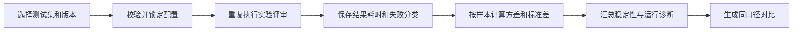

## 执行流程

```mermaid
flowchart LR
    A[选择测试集和版本] --> B[校验并锁定配置]
    B --> C[重复执行实验评审]
    C --> D[保存结果耗时和失败分类]
    D --> E[按样本计算方差和标准差]
    E --> F[汇总稳定性与运行诊断]
    F --> G[生成同口径对比]
```

管理员确定测试集、候选版本和重复次数后创建评价任务。ai-evaluation-service 校验输入并锁定本次配置，然后按测试用例、评审版本和重复轮次组织实验评审。

实验评审与用户正式评审隔离。运行结束后，系统保存评审得分、耗时、模型和失败分类，按固定统计口径计算稳定性。系统不把日志或结果再次发送给其他 AI，也不生成语义质量分或综合质量分。
