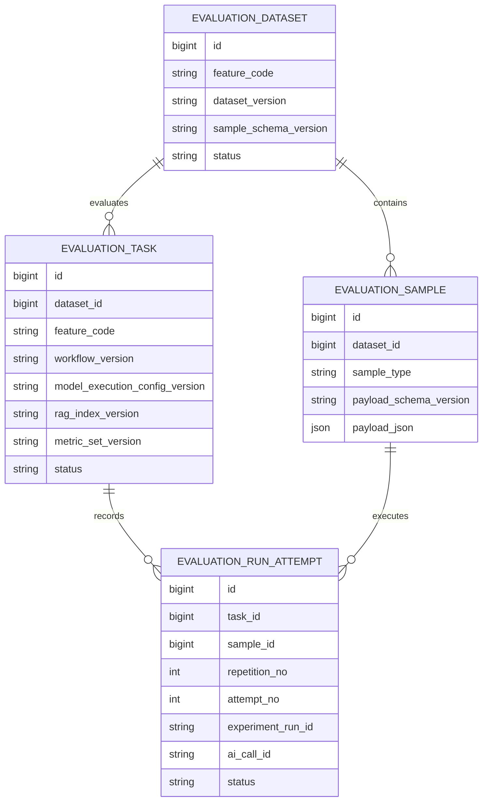
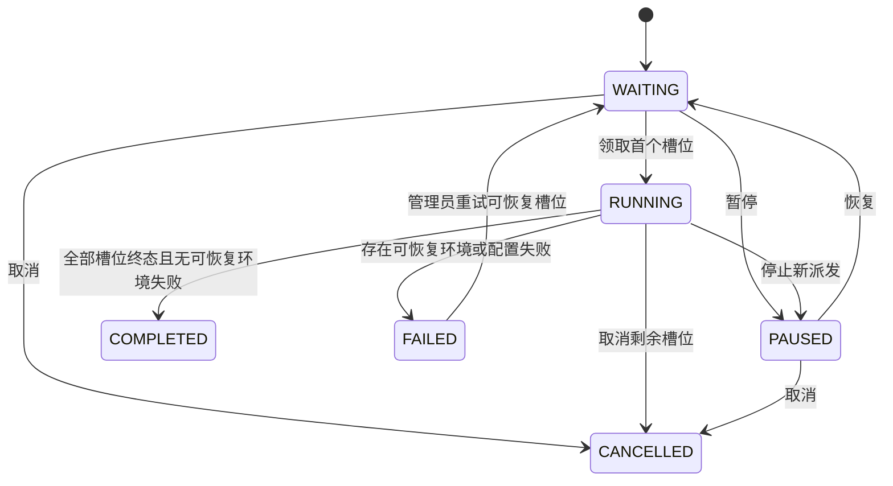

## 领域模型与兼容迁移

> 实现状态：S7-04 已通过 V2 将 REVIEW 专用结构兼容迁移为通用模型，S7-09 的 V3 已增加 attempt 级幂等键；当前事实以 Flyway、实体和运行测试为准。

### 设计结论

采用兼容扩列，不新建第二套 dataset、sample、task 和 run_attempt 主表。现有四表的主键与关联关系已经能表达通用评价；新增功能、版本、Payload 和快照字段即可保留历史 ID、查询入口与运行结果。新建平行表会造成双状态机、跨表分页和历史比较分叉，收益不足以覆盖迁移复杂度。

模型按以下关系组织：

### 实体职责

| 实体 | 拥有的事实 | 不拥有的事实 |
|------|------------|--------------|
| dataset | 功能、不可变数据集版本、样本 schema、样本数量、锁定状态和创建人 | PDF、正式评审结果、客服会话 |
| sample | 数据集内排序、样本类型、版本化 Payload 和可选标注 | 被引用业务实体的生命周期 |
| task | 候选工作流、模型执行配置、适用的 RAG 索引、指标集合、规模与任务状态快照 | 当前生产版本、供应商路由的可变配置 |
| run_attempt | 唯一槽位的尝试序号、稳定实验标识、调用关联、结果摘要、失败分类和时间事实 | 不必要的完整敏感回答、网关原始 Prompt |

数据集是一个不可变版本，不在锁定后原地编辑。需要增删样本或修改 Payload 时创建新的 datasetVersion。任务保存创建时的候选版本与口径快照，之后目录或配置变化不能改变历史含义。

### 功能映射

#### REVIEW

旧数据集和样本全部回填 `featureCode=REVIEW`、`sampleType=SUBMISSION_REFERENCE`、`payloadSchemaVersion=REVIEW_SUBMISSION_V1`。Payload 只引用 submissionId，并保留旧 teamId、problemId 字段作为历史查询兼容快照，不复制 PDF。

旧任务的 workflowVersion 原值保留，modelExecutionConfigVersion 回填首个评审不可变配置 `MODEL_CFG_REVIEW_MULTIMODAL_0001`，metricSetVersion 使用明确的旧口径标识。旧 `overallScore`、validityScore、stabilityScore 和 latencyScore 原样保留并标记为 legacy 指标，不能参与新口径排序。

#### ASSISTANT

样本使用独立问题 Payload，可包含问题、标签和可选标准要点，不包含 conversationId 或 messageId。任务分别选择 `ASSISTANT_NO_RAG_V1` 或 `ASSISTANT_RAG_V1`；只有后者必须锁定 ragIndexVersion。运行只保存必要结果摘要与 callId，不创建正式会话。

#### SUGGESTION

SUGGESTION 在业务 owner 提供版本目录和通用隔离实验入口前不允许创建数据集或任务。领域枚举可以识别未来编码，但不能把未实现能力发布为可执行候选项。

### 状态机

数据集状态保持简单：`DRAFT → LOCKED`。只有 DRAFT 可组装样本；任务只能引用 LOCKED 数据集。为兼容 V1，存量数据集直接视为 LOCKED。

任务目标状态机为：

暂停只阻止新槽位派发，不丢弃运行中结果。取消不删除任务、槽位或尝试；运行中且已发送的调用不能假定取消成功。COMPLETED 与 CANCELLED 为终态。FAILED 只允许对明确可恢复失败创建新 attempt。

每个逻辑槽位由 taskId、sampleId、repetitionNo 唯一标识。attemptNo 只描述该槽位的恢复尝试，不制造新的统计样本。尝试状态为 `WAITING → RUNNING → SUCCEEDED|FAILED|CANCELLED|UNKNOWN`；上游结果不确定时进入 UNKNOWN，不盲目重试。

### 兼容迁移

迁移采用先扩展、再回填、后收紧的单向步骤：

1. 为四张现有表添加允许为空的新字段，保留全部旧列、索引和主键。
2. 为存量数据集生成稳定 datasetVersion，并回填 REVIEW 与样本 schema 常量。
3. 由旧 submissionId 生成最小 Payload；teamId 和 problemId 继续保留，读取端优先使用新 Payload。
4. 为存量任务回填 feature、模型执行配置和 legacy 指标集合版本；旧分数字段不改值、不改名。
5. 为存量尝试生成确定性 experimentRunId，保留原 aiCallId、resultJson 和失败分类。
6. 完成非空校验后再收紧通用必填字段，并建立 task、slot、attempt、callId 查询索引。
7. 应用层在一个兼容周期内同时读取新字段与旧 REVIEW 字段；所有新写入只走通用模型。

迁移不删除列、不更新主键、不重排样本、不覆盖历史状态。回填表达的是兼容语义，不声称旧任务当时已经使用后来新增的通用 Runner。

### 查询兼容

历史数据集、任务详情、最近任务和比较入口继续使用原 ID。旧 DTO 在兼容周期内从通用实体投影：feature 固定为 REVIEW，submissionId 从 Payload 或旧列读取，旧综合分只以 legacy 标签展示。新同口径比较必须同时校验 featureCode、datasetVersion、metricSetVersion、候选执行配置和重复次数；旧比较接口不得把 legacy 结果与新结果混排。

### 实现约束

- 数据库仍由 `lm_ai_evaluation` 独占，不读取其他服务表。
- JSON Payload 必须携带 schema 版本并经过 feature Runner 校验，不能作为无约束字段袋。
- Flyway 只新增更高版本迁移，不修改 V1，不使用破坏性 SQL。
- 关键唯一性落在数据库：数据集版本、任务客户端幂等标识、逻辑槽位尝试和 experimentRunId。
- 状态变更使用条件更新，任务进度从每个槽位的最新 attempt 汇总，不累计历史失败尝试冒充槽位数量。
