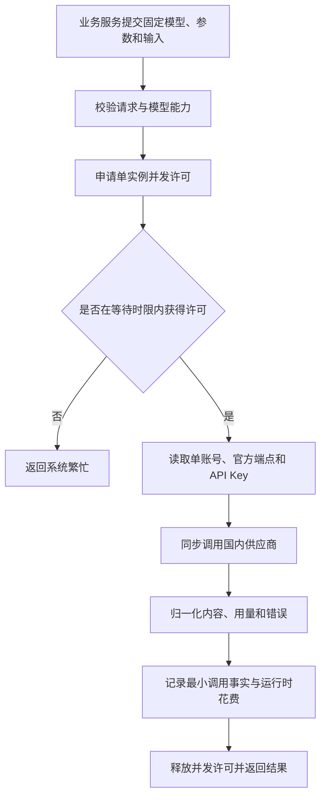
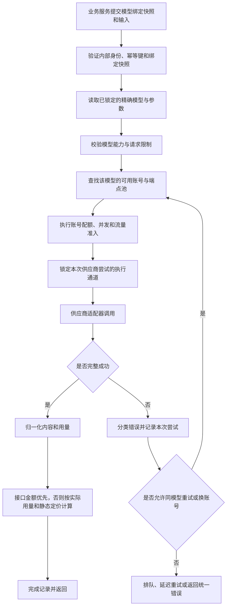

## 统一调用与路由

> 设计状态：0-1 主流程。首版只使用静态配置的单账号和官方端点完成同步调用，不实现网关任务队列、多账号路由、自动重试和熔断。原有复杂路由设计继续保留，供后续扩展使用。

### 0-1 调用流程



首版不在 AI 网关中再次包装和持久化原子任务。`ai-review-service` 等业务服务仍然负责消费自己的业务大任务，AI 网关只完成一次同步外部模型调用。调用失败后直接返回统一错误，由业务工作流决定是否在新的业务执行中再次调用。

### 保留的复杂版本流程

以下流程不进入 0-1 开发范围。它保留多账号、尝试记录、排队和重试等完整思路，只有恢复对应暂缓能力时才继续确认。



触发者是受信任的业务服务。前置条件是业务任务已经锁定工作流版本和模型执行配置，输入满足公共契约，并且网关模型目录中存在该精确模型。最终结果是一次统一调用响应，或一个可由业务工作流解释的统一错误。


### 模型选择与通道选择

模型选择和执行通道选择是两个不同决策。

| 决策 | 负责方 | 决策内容 | 是否允许执行中变化 |
|------|--------|----------|--------------------|
| 工作流步骤使用哪个模型 | 业务任务或实验配置 | 精确模型、参数、Prompt 版本和步骤绑定 | 不允许 |
| 使用哪个账号或接入端点调用该模型 | AI 网关 | 同一模型资源池中的账号、密钥引用和端点 | 允许 |

正式业务任务创建时锁定默认模型执行配置。实验任务可以为同一工作流版本选择另一套模型执行配置，但每次实验运行创建后同样不可变。AI 网关不得因为成本、延迟、限流或故障将已锁定模型替换成另一模型。

如果同一模型在多个账号下可用，AI 网关可以选择尚有配额的账号。账号切换不改变工作流和模型语义，但每次供应商尝试仍需记录实际账号引用、端点、模型、参数和价格快照。


### 工作流与模型执行配置

业务工作流描述步骤和依赖关系，不把模型绑定写死在工作流实现代码中。每个需要调用 AI 的步骤使用稳定步骤编码，例如 `STRUCTURE_EXTRACT`、`DIMENSION_SCORE` 和 `FINAL_ARBITRATION`。

模型执行配置将步骤编码映射到精确模型和参数：

```text
工作流版本 REVIEW_V2
  STRUCTURE_EXTRACT  -> 模型 A + 参数快照
  DIMENSION_SCORE    -> 模型 B + 参数快照
  FINAL_ARBITRATION  -> 模型 C + 参数快照
```

同一工作流版本可以建立多套执行配置，用于比较不同模型组合。修改模型绑定只创建新的执行配置或实验运行，不创建新的工作流版本；只有步骤、依赖、处理逻辑或业务输出语义变化时才建立新工作流版本。


### 固定快照

一次业务任务或实验运行开始前至少锁定：

- 工作流版本。
- 每个 AI 步骤的模型绑定。
- 精确模型标识和可核对的模型版本信息。
- Prompt 版本。
- 温度、最大输出、思考模式和结构化输出等参数。
- 模型能力档案版本。
- 供应商静态定价与固定汇率快照。
- 是否为正式任务或实验任务。

配置调整只影响后续新任务。历史任务保留原快照，不能使用新配置覆盖后重新计算。


### 账号与端点资源池

供应商、账号、端点和模型是不同层次：

- 供应商表示 DeepSeek、Kimi 等外部平台。
- 账号表示独立鉴权、配额和账单边界。
- 端点表示实际请求地址和协议入口。
- 模型表示本次推理必须使用的精确模型。

同一供应商可以在服务条款允许的前提下配置多个账号。同一固定模型可以由多个账号形成执行资源池，AI 网关聚合这些账号的可用容量，但必须分别执行和记录账号级限制。

不能只维护一个“最大并发数”。不同供应商或账号可能按以下维度限制：

- 同时进行中的请求数。
- 每分钟请求数。
- 每分钟输入或输出 Token 数。
- 单日调用量或费用额度。
- 指定模型的独立限额。
- 流式连接数和最长连接时间。

首版可以使用静态配置的账号级并发信号量、请求令牌桶和 Token 预算。后续根据供应商响应头、限流错误和真实调用统计校正可用容量，不假设不同供应商使用相同限流规则。

本地限流器只统计经过本项目 AI 网关的流量。如果账号或同一配额主体还被其他项目、脚本、控制台或其他 API Key 使用，外部流量对本项目不可见，本地计数即使低于配置上限也可能收到供应商限流。账号最好由本项目独占；无法独占时必须使用保守容量、安全余量和基于真实限流反馈的动态收缩。


### 调用与供应商尝试

一个逻辑 AI 调用可以包含多个供应商尝试，但所有尝试必须使用同一个已锁定模型和参数语义。

允许的尝试包括：

- 同一账号对明确可恢复错误进行有界重试。
- 切换到同一模型资源池中的另一个账号或端点。

不允许的尝试包括：

- DeepSeek 模型失败后自动切换到 Kimi 模型。
- 同一供应商内自动换成另一个模型版本。
- 为了降低成本而临时改变思考模式、输出上限或其他会影响实验结果的参数。

每一次供应商尝试都必须独立记录用量和成本。失败尝试也可能产生费用，不能被最终成功结果覆盖。


### 幂等和重试

- 业务幂等键在模型绑定快照范围内唯一，已成功请求直接返回原结果引用。
- 处理中的相同请求不并发调用供应商。
- 只对明确可恢复且未收到有效输出的失败执行有界重试。
- 连接超时与读取超时必须分开。读取超时时供应商可能已完成生成，自动重试有重复计费风险。
- 供应商不支持幂等键时，网关只能防止自身的并发重复，不宣称端到端恰好一次。
- 同模型账号池全部达到限制时，调用进入等待或延迟重试；超过截止时间后返回明确错误，不跨模型降级。


### 流式调用

流式内容已对业务可见后，不自动重试，不切换账号，不拼接两个供应商尝试的输出。运行时用量只信任供应商最终用量帧。中断且无最终用量帧时，记录用量和成本未知，不使用已接收字符数替代官方 Token。


### 错误分类

| 类别 | 执行行为 |
|------|----------|
| 请求不合法 | 立即失败，不重试 |
| 模型绑定不存在或能力不匹配 | 不调用供应商，返回可解释错误 |
| 内容安全拒绝 | 不更换模型规避拒绝 |
| 单个账号额度或鉴权失败 | 禁用或隔离当前账号，可尝试同模型账号池中的其他账号 |
| 限流或暂时故障 | 无论本地计数是否超限，都以供应商响应为准，执行退避、容量收缩、排队或尝试同模型的其他账号 |
| 超时或结果未知 | 标记重复计费风险，只按固定模型调用策略处理 |
| 同模型资源池全部不可用 | 等待、延迟重试或失败，不跨模型切换 |


### 当前设计边界

当前先确认固定模型绑定、同模型多账号资源池和不可跨模型降级原则。模型执行配置的完整数据结构、账号级限流算法、原子调用队列和公平调度策略需要在后续任务调度设计中继续逐项确认。
