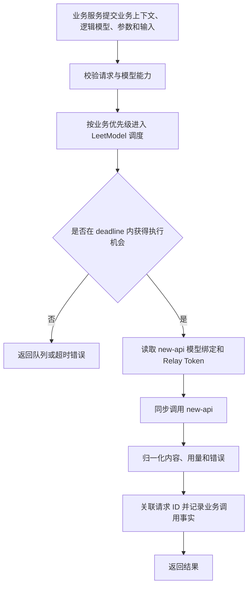
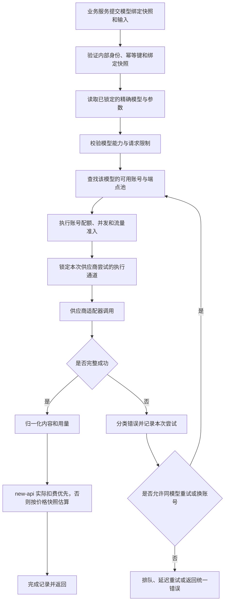

## 统一调用与路由

> 设计状态：D-02 已校准，S1 已将 Chat 主流程统一切换为 new-api。本文旧版关于供应商账号、端点、渠道限流、渠道切换和渠道重试的设计已由 new-api 取代；LeetModel 只保留逻辑模型绑定、业务调度、统一错误和业务调用审计。当前代码仍未实现旧文档声称的本地并发保护，该能力由 S5 收口。

### 0-1 调用流程



`ai-review-service` 等业务服务仍负责自己的业务大任务。AI 网关只调度一次原子模型调用，不复制完整业务流程；new-api 再负责该请求内部的渠道选择和渠道级重试。调用失败后由业务工作流决定是否创建新的、可追踪的业务执行。

### 保留的复杂版本流程

以下流程不进入 0-1 开发范围。它保留多账号、尝试记录、排队和重试等完整思路，只有恢复对应暂缓能力时才继续确认。



触发者是受信任的业务服务。前置条件是业务任务已经锁定工作流版本和模型执行配置，输入满足公共契约，并且网关模型目录中存在该精确模型。最终结果是一次统一调用响应，或一个可由业务工作流解释的统一错误。


### 模型选择与渠道选择

模型选择和执行通道选择是两个不同决策。

| 决策 | 负责方 | 决策内容 | 是否允许执行中变化 |
|------|--------|----------|--------------------|
| 工作流步骤使用哪个模型 | 业务任务或实验配置 | 精确模型、参数、Prompt 版本和步骤绑定 | 不允许 |
| 使用哪个供应商渠道、账号或端点 | new-api | new-api 模型名下的可用渠道 | 允许，但不得改变模型语义 |

正式业务任务创建时锁定默认模型执行配置。实验任务可以为同一工作流版本选择另一套模型执行配置，但每次实验运行创建后同样不可变。AI 网关不得因为成本、延迟、限流或故障将已锁定模型替换成另一模型。

AI 网关不读取或选择供应商账号。new-api 可以在模型名对应的多个渠道中选择；LeetModel 通过 new-api 请求 ID 关联最终 usage、扣费和错误事实，不复制内部渠道尝试链。


### 工作流与模型执行配置

业务工作流描述步骤和依赖关系，不把模型绑定写死在工作流实现代码中。每个需要调用 AI 的步骤使用稳定步骤编码，例如 `STRUCTURE_EXTRACT`、`DIMENSION_SCORE` 和 `FINAL_ARBITRATION`。

模型执行配置将步骤编码映射到精确模型和参数：

```text
工作流版本 REVIEW_V2
  STRUCTURE_EXTRACT  -> 模型 A + 参数快照
  DIMENSION_SCORE    -> 模型 B + 参数快照
  FINAL_ARBITRATION  -> 模型 C + 参数快照
```

同一工作流版本可以建立多套执行配置，用于比较不同模型组合。修改模型绑定只创建新的执行配置或实验运行，不创建新的工作流版本；只有步骤、依赖、处理逻辑或业务输出语义变化时才建立新工作流版本。


### 固定快照

一次业务任务或实验运行开始前至少锁定：

- 工作流版本。
- 每个 AI 步骤的模型绑定。
- 精确模型标识和可核对的模型版本信息。
- Prompt 版本。
- 温度、最大输出、思考模式和结构化输出等参数。
- 模型能力档案版本。
- new-api 模型绑定，以及适用时的价格与汇率快照。
- 是否为正式任务或实验任务。

配置调整只影响后续新任务。历史任务保留原快照，不能使用新配置覆盖后重新计算。


### 被 new-api 取代的渠道资源池设计

以下对象仍是理解渠道治理的有效概念，但它们全部由 new-api 拥有，LeetModel 不建立对应资源池、配置表或选择算法：

- 供应商表示 DeepSeek、Kimi 等外部平台。
- 账号表示独立鉴权、配额和账单边界。
- 端点表示实际请求地址和协议入口。
- 模型表示本次推理必须使用的精确模型。

同一模型可以由 new-api 配置多个渠道。new-api 聚合并治理这些渠道；AI 网关只观察整个请求的最终结果。

不能只维护一个“最大并发数”。不同供应商或账号可能按以下维度限制：

- 同时进行中的请求数。
- 每分钟请求数。
- 每分钟输入或输出 Token 数。
- 单日调用量或费用额度。
- 指定模型的独立限额。
- 流式连接数和最长连接时间。

账号级信号量、请求令牌桶、Token 预算和供应商响应头归 new-api。LeetModel 后续调度只控制不同业务优先级的派发量，并根据 new-api 最终限流反馈执行背压。

上述渠道容量信息对 LeetModel 不可见，由 new-api 根据实际渠道反馈治理。LeetModel 只记录最终限流类型，并将其作为整体派发背压信号。


### 逻辑调用与渠道尝试

一个 LeetModel 逻辑调用只向 new-api 派发一次请求。new-api 内部可以包含多个渠道尝试，但所有尝试必须保持模型名和参数语义。

允许的尝试包括：

- 同一账号对明确可恢复错误进行有界重试。
- 切换到同一模型资源池中的另一个账号或端点。

不允许的尝试包括：

- DeepSeek 模型失败后自动切换到 Kimi 模型。
- 同一供应商内自动换成另一个模型版本。
- 为了降低成本而临时改变思考模式、输出上限或其他会影响实验结果的参数。

渠道尝试由 new-api 独立记录。LeetModel 保存 new-api 请求级最终 usage、实际扣费或估算值，并显式表达不完整或未知。


### 幂等和重试

- 业务幂等键在模型绑定快照范围内唯一，已成功请求直接返回原结果引用。
- 处理中的相同请求不并发调用供应商。
- `ai-gateway-service` 不对已派发请求透明重试；new-api 独占渠道级有限重试。
- 连接超时与读取超时必须分开。读取超时时供应商可能已完成生成，自动重试有重复计费风险。
- 供应商不支持幂等键时，网关只能防止自身的并发重复，不宣称端到端恰好一次。
- new-api 模型对应渠道全部不可用时，返回明确错误；LeetModel 不绕过 new-api 或跨模型降级。


### 流式调用

流式内容已对业务可见后，不自动重试，不切换账号，不拼接两个供应商尝试的输出。运行时用量只信任供应商最终用量帧。中断且无最终用量帧时，记录用量和成本未知，不使用已接收字符数替代官方 Token。


### 错误分类

| 类别 | 执行行为 |
|------|----------|
| 请求不合法 | 立即失败，不重试 |
| 模型绑定不存在或能力不匹配 | 不调用供应商，返回可解释错误 |
| 内容安全拒绝 | 不更换模型规避拒绝 |
| 单个账号额度或鉴权失败 | 禁用或隔离当前账号，可尝试同模型账号池中的其他账号 |
| 限流或暂时故障 | 无论本地计数是否超限，都以供应商响应为准，执行退避、容量收缩、排队或尝试同模型的其他账号 |
| 超时或结果未知 | 标记重复计费风险，只按固定模型调用策略处理 |
| 同模型资源池全部不可用 | 等待、延迟重试或失败，不跨模型切换 |


### 当前设计边界

当前确认逻辑模型绑定、new-api 模型名映射和不可跨模型降级原则。原子调用队列与公平调度由 S5 继续设计；账号级渠道算法不属于 LeetModel。
